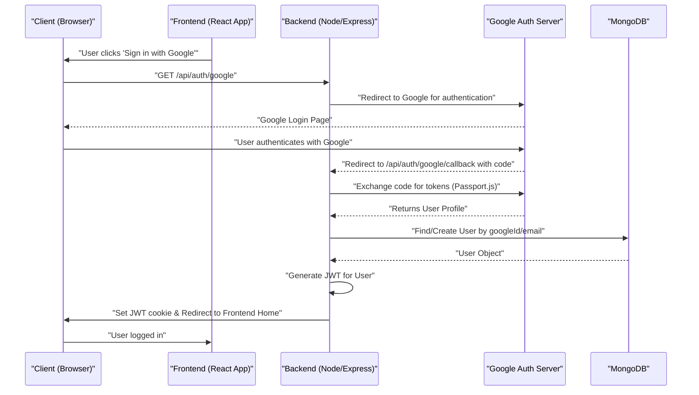
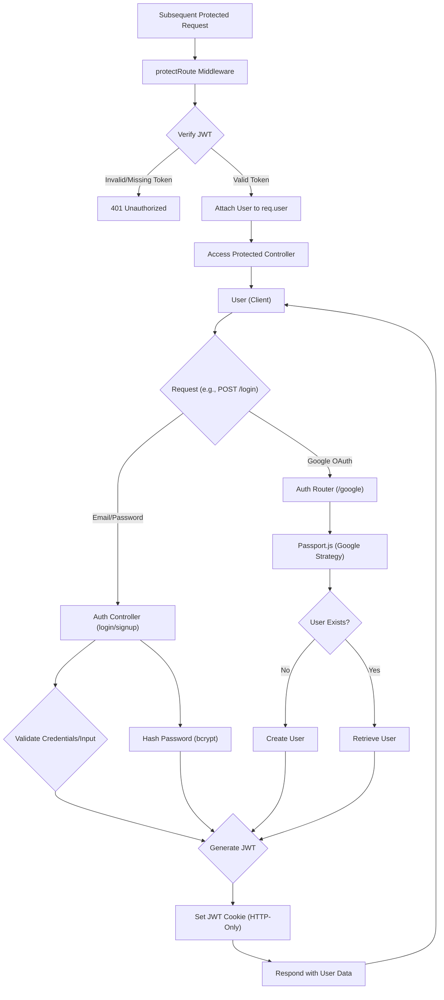

# Authentication and Authorization

<TOC />

This section details the backend implementation of user authentication, session management, and access control. It covers traditional email/password login, Google OAuth integration, secure session handling with JWTs, and middleware for protecting routes.

## Core Concepts

The authentication system is built around several key components:

*   **User Model:** Stores user details, including `username`, `email`, `password` (hashed), `googleId` (for OAuth), and `authProvider`.
*   **JWT (JSON Web Tokens):** Used for maintaining user sessions. A token is generated upon successful login/signup and stored as an HTTP-only cookie.
*   **Bcrypt:** For secure password hashing and comparison.
*   **Passport.js:** Integrated for handling Google OAuth strategies.
*   **Middleware:** To protect routes and ensure only authenticated users can access certain resources.

## User Management

### User Registration (Signup)

The `signup` controller handles new user registrations. It performs input validation, checks for existing usernames and emails, hashes passwords using `bcrypt`, and then creates a new user record. Upon successful creation, a JWT is generated and sent back to the client as an HTTP-only cookie.

*   **File:** `backend/src/controllers/auth.controller.js`
*   **Route:** `POST /api/auth/signup`

```javascript
// backend/src/controllers/auth.controller.js
export const signup = async (req, res) => {
    const {username, email, password} = req.body;
    try {
        // ... input validation and existing user checks ...
        
        const salt = await bcrypt.genSalt(10);
        const hashedPassword = await bcrypt.hash(password, salt);

        const newUser = new User({
            username,
            email,
            password: hashedPassword,
            authProvider: 'email'
        });
        if(newUser){
            generateToken(newUser._id, res); // Generate JWT and set as cookie
            await newUser.save();

            res.status(201).json({
                _id: newUser._id,
                username: newUser.username,
                email: newUser.email,   
                profilePic: newUser.profilePic,
                authProvider: newUser.authProvider
            });
        } else {
            res.status(400).json({message: "Invalid user data."});
        }
    } catch (error) {
        console.log("Error in signup controller", error.message)
        res.status(500).json({message: "Something went wrong."});
    }
};
```
[View on GitHub](https://github.com/shinymack/Chat-App-MERN/blob/main/backend/src/controllers/auth.controller.js#L7-L55)

### User Login

The `login` controller verifies user credentials. It retrieves the user by email, checks if they registered via email or Google, and compares the provided password with the stored hashed password. If credentials are valid, a new JWT is issued.

*   **File:** `backend/src/controllers/auth.controller.js`
*   **Route:** `POST /api/auth/login`

```javascript
// backend/src/controllers/auth.controller.js
export const login = async (req, res) => {
    const {email, password} = req.body;
    try {
        const user = await User.findOne({email});

        if(!user) {
            return res.status(400).json({message: "Invalid credentials."});
        }

        // Handle users who originally signed up with Google
        if(user.authProvider === 'google' && !user.password){
            return res.status(400).json({ message: "Please sign in with Google." });
        }

        const isPasswordCorrect = await bcrypt.compare(password, user.password);
        if(!isPasswordCorrect) {
            return res.status(400).json({message: "Invalid credentials."});
        }

        generateToken(user._id, res); // Generate JWT and set as cookie
        res.status(200).json({
            _id: user._id,
            username: user.username,
            email: user.email,
            profilePic: user.profilePic,
            authProvider: user.authProvider,
        });
    } catch (error) {
        console.log("Error in login controller", error.message);
        res.status(500).json({message: "Something went wrong."});
    }
};
```
[View on GitHub](https://github.com/shinymack/Chat-App-MERN/blob/main/backend/src/controllers/auth.controller.js#L57-L91)

### User Logout

The `logout` controller clears the JWT cookie, effectively ending the user's session.

*   **File:** `backend/src/controllers/auth.controller.js`
*   **Route:** `POST /api/auth/logout`

```javascript
// backend/src/controllers/auth.controller.js
export const logout = (req, res) => {
    try {
        res.cookie("jwt", "", {maxAge: 0}); // Clear the JWT cookie
        res.status(200).json({message: "Logged out successfully."})
    } catch(error) {
        console.log("Error in logout controller", error.message);
        res.status(500).json({message:"Internal Server Error"}); 
    }
};
```
[View on GitHub](https://github.com/shinymack/Chat-App-MERN/blob/main/backend/src/controllers/auth.controller.js#L94-L102)

### Profile Update

The `updateProfile` controller allows authenticated users to update their profile picture and username. It includes validation for the new username and handles image uploads via Cloudinary. If the username is changed, a new JWT is issued to reflect the updated information.

*   **File:** `backend/src/controllers/auth.controller.js`
*   **Route:** `PUT /api/auth/update-profile`

```javascript
// backend/src/controllers/auth.controller.js
export const updateProfile = async (req, res) => {
    try {
        const { profilePic, username } = req.body; 
        const userId = req.user._id;
        let userToUpdate = await User.findById(userId);

        // ... validation and logic for updating username and profile picture ...

        if (Object.keys(fieldsToUpdate).length === 0) {
            return res.status(400).json({ message: "No changes provided to update." });
        }

        const updatedUser = await User.findByIdAndUpdate(userId, { $set: fieldsToUpdate }, { new: true });
        
        generateToken(updatedUser._id, res); // Issue new token to reflect potential changes
        res.status(200).json(updatedUser);

    } catch (error) {
        console.error("Error in updateProfile controller", error.message);
        res.status(500).json({ message: "Internal Server Error while updating profile." });
    }
};
```
[View on GitHub](https://github.com/shinymack/Chat-App-MERN/blob/main/backend/src/controllers/auth.controller.js#L201-L265)

## Google OAuth Integration

The application uses `passport-google-oauth20` for Google sign-in.

### Passport Configuration

`passport.config.js` sets up the Google Strategy, defining how users are identified and created or retrieved from the database. It also handles serialization and deserialization of user information for session management.

*   **File:** `backend/src/lib/passport.config.js`

```javascript
// backend/src/lib/passport.config.js
import passport from 'passport';
import { Strategy as GoogleStrategy } from 'passport-google-oauth20';
import User from '../models/user.model.js'; 
import dotenv from 'dotenv';

dotenv.config(); 

export const configurePassport = () => {
    passport.use(new GoogleStrategy({
        clientID: process.env.GOOGLE_CLIENT_ID,
        clientSecret: process.env.GOOGLE_CLIENT_SECRET,
        callbackURL: process.env.GOOGLE_CALLBACK_URL,
        scope: ['profile', 'email'] 
    },
    async (accessToken, refreshToken, profile, done) => {
        try {
            let user = await User.findOne({ googleId: profile.id });
            if (user) {
                return done(null, user);
            } else {
                // Logic to create a new user or handle existing email conflicts
                const newUser = new User({
                    googleId: profile.id,
                    email: profile.emails && profile.emails[0] ? profile.emails[0].value : null,
                    username: username,
                    authProvider: 'google',
                });
                await newUser.save();
                return done(null, newUser);
            }
        } catch (error) {
            return done(error, null);
        }
    }));

    passport.serializeUser((user, done) => { done(null, user.id); });
    passport.deserializeUser(async (id, done) => {
        try {
            const user = await User.findById(id);
            done(null, user);
        } catch (error) {
            done(error, null);
        }
    });
};
```
[View on GitHub](https://github.com/shinymack/Chat-App-MERN/blob/main/backend/src/lib/passport.config.js#L5-L79)

### Google Auth Flow

The `/api/auth/google` route initiates the Google OAuth flow, redirecting the user to Google for authentication. The `/api/auth/google/callback` route handles the response from Google, authenticates the user with Passport, and then, using the `googleAuthCallback` controller, issues a JWT and redirects the user to the frontend.

*   **File:** `backend/src/routes/auth.route.js`
*   **File:** `backend/src/controllers/auth.controller.js`

```javascript
// backend/src/routes/auth.route.js
router.get(
    '/google',
    passport.authenticate('google', { scope: ['profile', 'email'] })
);
router.get(
    '/google/callback',
    passport.authenticate('google', {
        failureRedirect: 'http://localhost:5173/login', 
        failureMessage: true 
    }),
    googleAuthCallback // Custom controller to handle JWT generation and redirect
);
```
[View on GitHub](https://github.com/shinymack/Chat-App-MERN/blob/main/backend/src/routes/auth.route.js#L20-L30)

```javascript
// backend/src/controllers/auth.controller.js
export const googleAuthCallback = async (req, res) => {
    const frontendUrl = process.env.FRONTEND_URL || 'http://localhost:5173';
    try {
        if (!req.user) {
            return res.redirect(`${frontendUrl}/login?error=google_auth_failed`);
        }
        generateToken(req.user._id, res); // Generate JWT for Google-authenticated user
        res.redirect(frontendUrl);
    } catch (error) {
        console.error("Error in googleAuthCallback: ", error.message);
        res.redirect(`${frontendUrl}/login?error=google_auth_processing_error`);
    }
};
```
[View on GitHub](https://github.com/shinymack/Chat-App-MERN/blob/main/backend/src/controllers/auth.controller.js#L131-L146)

### Google OAuth Flow Diagram





## Route Protection and Authorization

### `protectRoute` Middleware

The `protectRoute` middleware ensures that only authenticated users can access specific API endpoints. It verifies the presence and validity of the JWT token in the request cookies. If valid, it attaches the user object to `req.user` for subsequent controller logic.

*   **File:** `backend/src/middleware/auth.middleware.js`

```javascript
// backend/src/middleware/auth.middleware.js
import jwt from "jsonwebtoken"
import User from "../models/user.model.js"

export const protectRoute = async (req, res, next) => {
    try {
        const token = req.cookies.jwt; // Get token from cookie
        if(!token){
            return res.status(401).json({message: "Unauthorized - No Token Provided"});
        }

        const decoded = jwt.verify(token, process.env.JWT_SECRET) // Verify token

        if(!decoded) {
            return res.status(401).json({message: "Unauthorized - Invalid Token"});
        }
        const user = await User.findById(decoded.userId).select("-password"); // Find user without password

        if(!user) {
            return res.status(404).json({message: "User not found"});
        }
        req.user = user; // Attach user to request object

        next(); // Proceed to next middleware/controller
    } catch (error) {
        console.log("Error in protectRoute middleware", error.message);
        res.status(500).json({message: "Internal Server Error"});
    }
};
```
[View on GitHub](https://github.com/shinymack/Chat-App-MERN/blob/main/backend/src/middleware/auth.middleware.js#L4-L29)

### Authentication Check

The `checkAuth` controller is a protected route that returns the currently authenticated user's details. This is useful for the frontend to verify the user's login status and retrieve their profile information.

*   **File:** `backend/src/controllers/auth.controller.js`
*   **Route:** `GET /api/auth/check` (protected by `protectRoute`)

```javascript
// backend/src/controllers/auth.controller.js
export const checkAuth = (req, res) => {
    try {
        // req.user is populated by protectRoute middleware
        res.status(200).json({
            _id: req.user._id,
            username: req.user.username,
            email: req.user.email,
            profilePic: req.user.profilePic,
            authProvider: req.user.authProvider,
            createdAt: req.user.createdAt
        });
    } catch (error) {
        console.log("Error in checkAuth controller", error.message);
        res.status(500).json({message: "Internal Server Error"});
    }
};
```
[View on GitHub](https://github.com/shinymack/Chat-App-MERN/blob/main/backend/src/controllers/auth.controller.js#L105-L121)

## Authentication Flow Diagram





## Key Integration Points

*   **`backend/src/lib/utils.js`**: Contains the `generateToken` function, responsible for signing JWTs and setting them as secure HTTP-only cookies. This separation promotes reusability and keeps controllers clean.
*   **Environment Variables**: Sensitive information like `JWT_SECRET`, `GOOGLE_CLIENT_ID`, and `GOOGLE_CLIENT_SECRET` are managed via `.env` files and accessed using `process.env`.
*   **Error Handling**: Each controller and middleware includes `try-catch` blocks to gracefully handle errors, log them, and send appropriate HTTP status codes and messages to the client.
*   **Session Management**: The use of HTTP-only cookies for JWTs enhances security by preventing client-side JavaScript access to the token, mitigating XSS attacks. The `maxAge` for cookies ensures proper session expiration.
*   **User Model**: The `User` Mongoose model (`backend/src/models/user.model.js`) is central to authentication, storing all necessary user data for both email/password and Google OAuth authentication methods. The `authProvider` field is crucial for distinguishing between these methods.

Next: [Chat and Friend Management](./2.2_chat-friend-management.mdx)