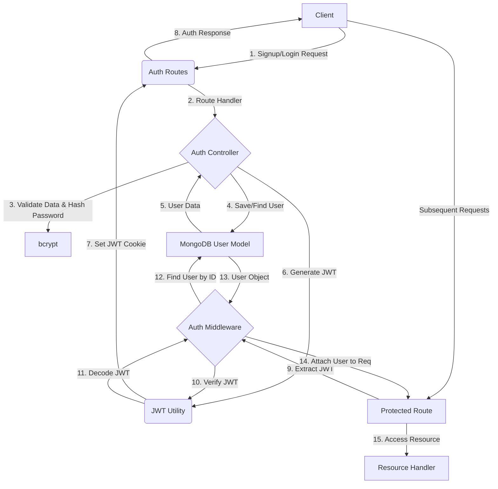

<TOC />

Authentication and authorization are fundamental to securing any web application. This section details the implementation of user registration, login, session management using JWTs, and access control within the system. It covers both traditional email/password authentication and third-party Google OAuth, alongside profile management functionalities.

## System Purpose

The authentication and authorization system is designed to:

*   **Secure User Accounts**: Protect user data and ensure only authenticated and authorized users can access specific resources.
*   **Facilitate User Onboarding**: Provide straightforward registration and login processes.
*   **Support Multiple Authentication Methods**: Offer flexibility with email/password and Google OAuth options.
*   **Manage User Sessions**: Maintain user login state efficiently and securely using JSON Web Tokens (JWT).
*   **Enable Profile Management**: Allow users to update their profile information.

## Architecture

The authentication architecture follows a client-server model, where the frontend interacts with dedicated backend API endpoints. JWTs are used for stateless authentication, improving scalability. Google OAuth integrates a third-party service for user identity verification.

The primary components involved are:

*   **Client (Frontend)**: Initiates authentication requests and stores JWTs (typically in HTTP-only cookies).
*   **Authentication Routes**: `/api/auth/*` endpoints [backend/src/routes/auth.route.js](https://github.com/shinymack/Chat-App-MERN/blob/main/backend/src/routes/auth.route.js) for registration, login, logout, and OAuth callbacks.
*   **Authentication Controller**: [backend/src/controllers/auth.controller.js](https://github.com/shinymack/Chat-App-MERN/blob/main/backend/src/controllers/auth.controller.js) Contains the core business logic for handling requests, interacting with the database, and managing sessions.
*   **Auth Middleware**: [backend/src/middleware/auth.middleware.js](https://github.com/shinymack/Chat-App-MERN/blob/main/backend/src/middleware/auth.middleware.js) Verifies JWTs and attaches user information to the request object.
*   **Passport Configuration**: [backend/src/lib/passport.config.js](https://github.com/shinymack/Chat-App-MERN/blob/main/backend/src/lib/passport.config.js) Configures Passport.js strategies for Google OAuth.
*   **User Model**: Defines the schema for user data storage, including fields for email, password, username, Google ID, and profile picture.





## Technology Stack

| Layer/Component       | Technology/Library    | Purpose                                                                                                 |
| :-------------------- | :-------------------- | :------------------------------------------------------------------------------------------------------ |
| **Backend Framework** | Express.js            | Routing and API endpoint handling.                                                                      |
| **Database**          | MongoDB (Mongoose)    | Persistent storage for user accounts.                                                                   |
| **Password Hashing**  | `bcryptjs`            | Securely hashes and compares user passwords.                                                            |
| **Token Generation**  | `jsonwebtoken`        | Creates and verifies JSON Web Tokens for session management.                                            |
| **OAuth Integration** | `passport`            | Extensible authentication middleware; used for Google OAuth strategy.                                   |
| **Google OAuth**      | `passport-google-oauth20` | Specific Passport strategy for authenticating with Google.                                              |
| **Cloud Storage**     | Cloudinary            | Stores user profile pictures, integrated with backend logic.                                            |

## Features

### User Registration (`/signup`)

The `signup` endpoint [backend/src/routes/auth.route.js#L7](https://github.com/shinymack/Chat-App-MERN/blob/main/backend/src/routes/auth.route.js#L7) allows new users to create an account using an email and password. Robust validation is performed on input fields (username, email, password) to ensure data integrity and security. Passwords are securely hashed using `bcryptjs` before storage. Upon successful registration, a JWT is generated and set as an HTTP-only cookie, and the new user's basic profile information is returned.

```javascript
// backend/src/controllers/auth.controller.js
export const signup = async (req, res) => {
    const {username, email, password} = req.body;
    try {
        if(!username || !email || !password) {
            return res.status(400).json({message: "Please fill in all fields."});
        }
        if (username.length < 3 || username.length > 20) {
            return res.status(400).json({ message: "Username must be between 3 and 20 characters." });
        }
        if (password.length < 6) {
            return res.status(400).json({message: "Password must be at least 6 characters."});
        }
        const user = await User.findOne({email});
        if (user) return res.status(400).json({message: "Email already exists."});
        
        const existingUserByUsername = await User.findOne({ username });
        if (existingUserByUsername) {
            return res.status(400).json({ message: "Username already exists. Please choose another." });
        }

        const salt = await bcrypt.genSalt(10);
        const hashedPassword = await bcrypt.hash(password, salt);

        const newUser = new User({
            username,
            email,
            password: hashedPassword,
            authProvider: 'email'
        });
        if(newUser){
            generateToken(newUser._id, res);
            await newUser.save();

            res.status(201).json({
                _id: newUser._id,
                username: newUser.username,
                email: newUser.email,   
                profilePic: newUser.profilePic,
                authProvider: newUser.authProvider
            });
        } else {
            res.status(400).json({message: "Invalid user data."});
        }
    } catch (error) {
        console.log("Error in signup controller", error.message)
        res.status(500).json({message: "Something went wrong."});
    }
};
```
<details>
<summary>View on GitHub</summary>
<p>
<a href="https://github.com/shinymack/Chat-App-MERN/blob/main/backend/src/controllers/auth.controller.js#L5-L53" target="_blank"><code>backend/src/controllers/auth.controller.js</code></a>
</p>
</details>

_Insight:_ The sequential checks for email and username uniqueness prevent duplicate accounts and provide specific feedback to the user. Using `bcryptjs` with a sufficient salt round (10) ensures strong password hashing, making brute-force attacks impractical. The `authProvider` field is crucial for distinguishing between email-based and Google-based accounts, particularly during login.

### User Login (`/login`)

The `login` endpoint [backend/src/routes/auth.route.js#L9](https://github.com/shinymack/Chat-App-MERN/blob/main/backend/src/routes/auth.route.js#L9) authenticates existing users. It checks for the existence of the email, verifies the provided password against the stored hash using `bcrypt.compare`, and handles cases where a user registered via Google OAuth attempts to log in with an email/password. A JWT is issued on successful login.

```javascript
// backend/src/controllers/auth.controller.js
export const login = async (req, res) => {
    const {email, password} = req.body;
    try {
        const user = await User.findOne({email});

        if(!user) {
            return res.status(400).json({message: "Invalid credentials."});
        }

        if(user.authProvider === 'google' && !user.password){
            return res.status(400).json({ message: "Please sign in with Google." });
        }

        const isPasswordCorrect = await bcrypt.compare(password, user.password);
        if(!isPasswordCorrect) {
            return res.status(400).json({message: "Invalid credentials."});
        }

        generateToken(user._id, res);
        res.status(200).json({
            _id: user._id,
            username: user.username,
            email: user.email,
            profilePic: user.profilePic,
            authProvider: user.authProvider,
        });
    } catch (error) {
        console.log("Error in login controller", error.message);
        res.status(500).json({message: "Something went wrong."});
    }
};
```
<details>
<summary>View on GitHub</summary>
<p>
<a href="https://github.com/shinymack/Chat-App-MERN/blob/main/backend/src/controllers/auth.controller.js#L55-L87" target="_blank"><code>backend/src/controllers/auth.controller.js</code></a>
</p>
</details>

_Insight:_ The check `if(user.authProvider === 'google' && !user.password)` is a robust way to prevent users who registered via Google from attempting a password-based login if they never set a password, guiding them to use the correct authentication method.

### Google OAuth Integration

The application integrates Google OAuth for seamless social logins. The flow involves:

1.  **Initiation**: Client requests `/api/auth/google` [backend/src/routes/auth.route.js#L30-L33](https://github.com/shinymack/Chat-App-MERN/blob/main/backend/src/routes/auth.route.js#L30-L33), redirected to Google.
2.  **Authentication**: User authenticates with Google.
3.  **Callback**: Google redirects to `/api/auth/google/callback` [backend/src/routes/auth.route.js#L34-L41](https://github.com/shinymack/Chat-App-MERN/blob/main/backend/src/routes/auth.route.js#L34-L41), handled by Passport.js.
4.  **User Provisioning**: `passport.config.js` [backend/src/lib/passport.config.js](https://github.com/shinymack/Chat-App-MERN/blob/main/backend/src/lib/passport.config.js) finds or creates a user based on `googleId` and email.
5.  **Session Management**: A JWT is generated, and the user is redirected to the frontend.

```javascript
// backend/src/lib/passport.config.js
export const configurePassport = () => {
    passport.use(new GoogleStrategy({
        clientID: process.env.GOOGLE_CLIENT_ID,
        clientSecret: process.env.GOOGLE_CLIENT_SECRET,
        callbackURL: process.env.GOOGLE_CALLBACK_URL,
        scope: ['profile', 'email'] 
    },
    async (accessToken, refreshToken, profile, done) => {
        try {
            let user = await User.findOne({ googleId: profile.id });

            if (user) {
                return done(null, user);
            } else {
                let username = profile.displayName.replace(/\s+/g, '').toLowerCase() || `user${Date.now()}`;

                const existingUserByUsername = await User.findOne({ username });
                if (existingUserByUsername) {
                    username = `${username}${Date.now().toString().slice(-4)}`;
                }
                if (username.length > 20) username = username.substring(0,20);


                const newUser = new User({
                    googleId: profile.id,
                    email: profile.emails && profile.emails[0] ? profile.emails[0].value : null,
                    username: username,
                    authProvider: 'google',
                });

                if (!newUser.email) {
                    return done(new Error("Email not provided by Google. Cannot create account."), null);
                }

                const existingUserByEmail = await User.findOne({ email: newUser.email });
                if (existingUserByEmail && existingUserByEmail.authProvider !== 'google') {
                    return done(null, false, { message: `An account with email ${newUser.email} already exists. Please sign in using your original method.` });
                }

                await newUser.save();
                return done(null, newUser);
            }
        } catch (error) {
            return done(error, null);
        }
    }));

    passport.serializeUser((user, done) => {
        done(null, user.id);
    });

    passport.deserializeUser(async (id, done) => {
        try {
            const user = await User.findById(id);
            done(null, user);
        } catch (error) {
            done(error, null);
        }
    });
};
```
<details>
<summary>View on GitHub</summary>
<p>
<a href="https://github.com/shinymack/Chat-App-MERN/blob/main/backend/src/lib/passport.config.js#L8-L76" target="_blank"><code>backend/src/lib/passport.config.js</code></a>
</p>
</details>

_Insight:_ The username generation logic (`username = \`${username}${Date.now().toString().slice(-4)}\``) is a practical approach to handle potential username collisions when creating accounts from Google profiles, ensuring uniqueness. The check for `existingUserByEmail` for non-Google providers prevents a user from linking a Google account to an email already registered with a different provider.

### Session Management (`generateToken` & `protectRoute`)

User sessions are managed using JWTs. Upon successful login or registration, a JWT containing the user's ID is generated by the `generateToken` utility and set as an HTTP-only cookie.

The `protectRoute` middleware [backend/src/middleware/auth.middleware.js](https://github.com/shinymack/Chat-App-MERN/blob/main/backend/src/middleware/auth.middleware.js) is used to secure API endpoints. It extracts the JWT from the request cookie, verifies its authenticity and expiration, and fetches the corresponding user from the database. If valid, the user object is attached to `req.user`, allowing subsequent route handlers to access authenticated user data.

```javascript
// backend/src/middleware/auth.middleware.js
export const protectRoute = async (req, res, next) => {
    try {
        const token = req.cookies.jwt;
        if(!token){
            return res.status(401).json({message: "Unauthorized - No Token Provided"});
        }

        const decoded = jwt.verify(token, process.env.JWT_SECRET)

        if(!decoded) {
            return res.status(401).json({message: "Unauthorized - Invalid Token"});
        }
        const user = await User.findById(decoded.userId).select("-password");

        if(!user) {
            return res.status(404).json({message: "User not found"});
        }
        req.user = user;

        next();
    } catch (error) {
        console.log("Error in protectRoute middleware", error.message);
        res.status(500).json({message: "Internal Server Error"});

    }

};
```
<details>
<summary>View on GitHub</summary>
<p>
<a href="https://github.com/shinymack/Chat-App-MERN/blob/main/backend/src/middleware/auth.middleware.js#L5-L29" target="_blank"><code>backend/src/middleware/auth.middleware.js</code></a>
</p>
</details>

_Insight:_ Storing JWTs in HTTP-only cookies is a best practice for preventing XSS attacks from accessing the token. The `protectRoute` middleware centralizes authorization logic, ensuring that protected routes are only accessible by authenticated users.

### User Logout (`/logout`)

The `logout` endpoint [backend/src/routes/auth.route.js#L11](https://github.com/shinymack/Chat-App-MERN/blob/main/backend/src/routes/auth.route.js#L11) invalidates the user's session by clearing the JWT cookie. This effectively logs the user out from the application.

```javascript
// backend/src/controllers/auth.controller.js
export const logout = (req, res) => {
    try {
        res.cookie("jwt", "", {maxAge: 0});
        res.status(200).json({message: "Logged out successfully."})
    } catch(error) {
        console.log("Error in logout controller", error.message);
        res.status(500).json({message:"Internal Server Error"}); 
    }
};
```
<details>
<summary>View on GitHub</summary>
<p>
<a href="https://github.com/shinymack/Chat-App-MERN/blob/main/backend/src/controllers/auth.controller.js#L89-L97" target="_blank"><code>backend/src/controllers/auth.controller.js</code></a>
</p>
</details>

_Insight:_ Setting `maxAge: 0` for the cookie is an effective way to immediately expire it, ensuring the client no longer sends the token with subsequent requests.

### Profile Update (`/update-profile`)

The `updateProfile` endpoint [backend/src/routes/auth.route.js#L13](https://github.com/shinymack/Chat-App-MERN/blob/main/backend/src/routes/auth.route.js#L13) allows authenticated users to update their profile picture and username. Profile pictures are uploaded to Cloudinary, and the URL is stored. Username updates include validation for uniqueness and length. A new JWT is issued upon successful updates to reflect changes in the user object.

```javascript
// backend/src/controllers/auth.controller.js
export const updateProfile = async (req, res) => {
    try {
        const { profilePic, username } = req.body;
        const userId = req.user._id;
        let userToUpdate = await User.findById(userId);

        if (!userToUpdate) {
            return res.status(404).json({ message: "User not found." });
        }

        const fieldsToUpdate = {};
        let newUsername = username ? username.trim() : null;

        if (newUsername && newUsername !== userToUpdate.username) {
            if (newUsername.length < 3 || newUsername.length > 20) {
                return res.status(400).json({ message: "Username must be between 3 and 20 characters." });
            }
            const existingUserWithNewUsername = await User.findOne({ username: newUsername, _id: { $ne: userId } });
            if (existingUserWithNewUsername) {
                return res.status(400).json({ message: "This username is already taken by someone else." });
            }
            fieldsToUpdate.username = newUsername;
        }

        if (profilePic) {
            const uploadResponse = await cloudinary.uploader.upload(profilePic);
            fieldsToUpdate.profilePic = uploadResponse.secure_url;
        }

        if (Object.keys(fieldsToUpdate).length === 0) {
            return res.status(400).json({ message: "No changes provided to update." });
        }

        const updatedUser = await User.findByIdAndUpdate(userId, { $set: fieldsToUpdate }, { new: true });

        if (!updatedUser) {
            return res.status(404).json({ message: "Failed to update user."});
        }
        
        generateToken(updatedUser._id, res);

        res.status(200).json(updatedUser);

    } catch (error) {
        console.error("Error in updateProfile controller", error.message);
        if (error.code === 11000 && error.keyValue && error.keyValue.username) {
            return res.status(400).json({ message: "This username is already taken." });
        }
        res.status(500).json({ message: "Internal Server Error while updating profile." });
    }
};
```
<details>
<summary>View on GitHub</summary>
<p>
<a href="https://github.com/shinymack/Chat-App-MERN/blob/main/backend/src/controllers/auth.controller.js#L182-L245" target="_blank"><code>backend/src/controllers/auth.controller.js</code></a>
</p>
</details>

_Insight:_ The `$ne: userId` in the username availability check is critical to allow users to save their profile without changing their username, preventing false positives. Re-generating the JWT after a profile update (especially if `username` or `profilePic` are embedded in the token payload or if the client needs refreshed user data) ensures the client's session reflects the most current user state.

### Username Availability Check (`/username/check/:username`)

This endpoint [backend/src/routes/auth.route.js#L15](https://github.com/shinymack/Chat-App-MERN/blob/main/backend/src/routes/auth.route.js#L15) allows a client to check if a desired username is available. It considers the current authenticated user's username as available even if it matches the requested one, preventing self-collision issues.

```javascript
// backend/src/controllers/auth.controller.js
export const checkUsernameAvailability = async (req, res) => {
    try {
        const { username } = req.params;
        const currentUserId = req.user._id; 

        if (!username || username.trim().length < 3) {
            return res.status(400).json({ available: false, message: "Username must be at least 3 characters." });
        }
        if (username.trim().length > 20) {
            return res.status(400).json({ available: false, message: "Username cannot be more than 20 characters." });
        }
    
        // Check if the username is the current user's existing username
        if (req.user.username === username) {
            return res.status(200).json({ available: true, message: "This is your current username." });
        }

        const existingUser = await User.findOne({ username: username });

        if (existingUser) {
            return res.status(200).json({ available: false, message: "Username is already taken." });
        }

        res.status(200).json({ available: true, message: "Username is available." });

    } catch (error) {
        console.error("Error in checkUsernameAvailability:", error.message);
        res.status(500).json({ available: false, message: "Error checking username availability." });
    }
};
```
<details>
<summary>View on GitHub</summary>
<p>
<a href="https://github.com/shinymack/Chat-App-MERN/blob/main/backend/src/controllers/auth.controller.js#L130-L177" target="_blank"><code>backend/src/controllers/auth.controller.js</code></a>
</p>
</details>

_Insight:_ This endpoint is crucial for providing real-time feedback during profile updates or initial registration, enhancing user experience. The explicit check for `req.user.username === username` avoids an unnecessary "taken" message if the user is merely re-submitting their existing username.

## Key Integration Points

*   **State Management**: The frontend must handle the JWT cookie (which is HTTP-only and handled automatically by browsers) and update its internal user state based on the responses from authentication endpoints. After login/signup, the user object returned by the backend ([backend/src/controllers/auth.controller.js#L42-L48](https://github.com/shinymack/Chat-App-MERN/blob/main/backend/src/controllers/auth.controller.js#L42-L48) and [backend/src/controllers/auth.controller.js#L80-L85](https://github.com/shinymack/Chat-App-MERN/blob/main/backend/src/controllers/auth.controller.js#L80-L85)) should be stored in the client-side state (e.g., Redux, React Context) to reflect the logged-in user.
*   **API Flows**: Every protected API route leverages the `protectRoute` middleware [backend/src/middleware/auth.middleware.js](https://github.com/shinymack/Chat-App-MERN/blob/main/backend/src/middleware/auth.middleware.js). The client implicitly sends the JWT cookie with requests to these routes, and the middleware ensures the user is authenticated before proceeding.
*   **Authorization (Implicit)**: While explicit role-based authorization is not detailed here, the `req.user` object (populated by `protectRoute`) can be used in subsequent middleware or controller logic to implement fine-grained access control based on user properties (e.g., `req.user.role`).
*   **Error Handling**: Consistent error responses (e.g., `400 Bad Request`, `401 Unauthorized`, `500 Internal Server Error`) across authentication endpoints are vital for the frontend to display appropriate messages to the user.
*   **Scalability**: Using stateless JWTs for session management inherently promotes backend scalability, as no server-side session store is required. Load balancers can distribute requests across multiple instances without sticky sessions.
*   **Security Best Practices**:
    *   **HTTP-Only Cookies**: JWTs are stored in HTTP-only cookies to mitigate XSS attacks.
    *   **CSRF Protection**: For state-changing operations (POST, PUT, DELETE), CSRF tokens could be implemented if the application is highly sensitive and relies heavily on cookie-based authentication, though for typical API-driven SPA, the risk is often managed by CORS.
    *   **Environment Variables**: Sensitive credentials (JWT secret, OAuth client IDs/secrets) are stored in environment variables, never hardcoded.

Next: [Messaging and Friend Management](./2.2_messaging-friend-management.mdx)