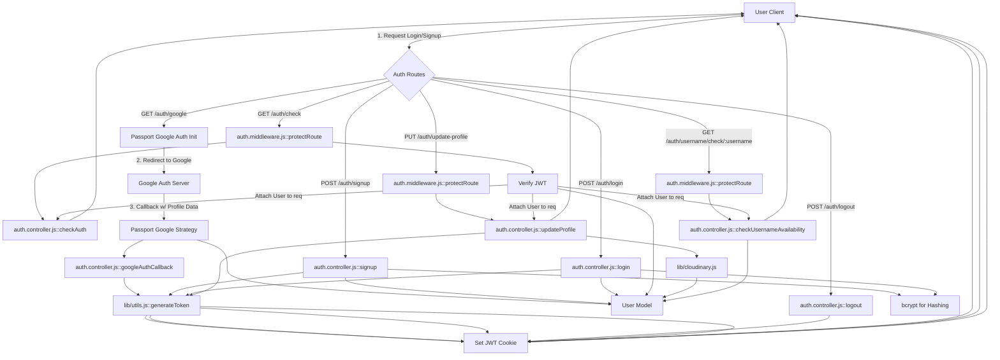

```mdx
---
title: "Authentication & Authorization"
description: "Details on user authentication using Passport.js, session management, and authorization middleware."
sidebar_position: 21
---

import { Tabs, Tab } from "@site/src/components/Tabs";
import CodeBlock from '@theme/CodeBlock';
import Admonition from '@theme/Admonition';

<TOC />

Authentication and authorization are fundamental pillars of any secure web application. This section provides a comprehensive guide to how user identities are verified (authentication) and how access to resources is managed (authorization) within the application. It details the implementation using **Passport.js** for both local and Google OAuth authentication, **JWT (JSON Web Tokens)** for session management, and custom **Express middleware** for protecting routes.

## 1. System Purpose & Overview

The authentication and authorization system is designed to ensure that only legitimate users can access protected resources and perform actions appropriate to their roles. It supports multiple authentication methods for user convenience and employs robust security practices like password hashing and token-based sessions.

### 1.1 Key Features

*   **Email/Password Authentication**: Standard user registration and login using email and password.
*   **Google OAuth2.0 Integration**: Seamless sign-in/sign-up using Google accounts.
*   **JWT-based Session Management**: Secure, stateless session handling using JSON Web Tokens stored in HTTP-only cookies.
*   **Route Protection**: Middleware to restrict access to authenticated users.
*   **Username Availability Check**: API endpoint to verify username uniqueness during registration or profile updates.
*   **Profile Management**: Functionality to update user profiles, including username and profile picture.

### 1.2 Core Components & Interactions

The authentication flow involves several components working in tandem:

*   **Auth Controllers**: Handle the business logic for signup, login, logout, and profile updates.
*   **Auth Routes**: Define the API endpoints for authentication actions.
*   **Auth Middleware**: Enforces authentication requirements for protected routes.
*   **Passport.js**: Manages the authentication strategies (e.g., Google OAuth).
*   **JWT Utilities**: Generate and verify access tokens.
*   **User Model**: Interacts with the database to store and retrieve user information.





## 2. Authentication Strategies

The application supports both traditional email/password authentication and a streamlined Google OAuth login.

### 2.1 Email/Password Authentication

Users can register and log in using their email and a chosen password. Security best practices are followed for password handling.

#### 2.1.1 User Signup

The `signup` controller handles new user registration. It performs input validation, checks for existing users by email and username, hashes the password using `bcrypt`, creates a new user record, and then generates a JWT for immediate login.

<Tabs>
<Tab value="controller" label="auth.controller.js (signup)">
<CodeBlock language="js" showLineNumbers>
{`export const signup = async (req, res) => {
    const {username, email, password} = req.body;
    try {
        if(!username || !email || !password) {
            return res.status(400).json({message: "Please fill in all fields."});
        }
        if (username.length < 3) {
            return res.status(400).json({ message: "Username must be at least 3 characters." });
        }
        if (username.length > 20) {
            return res.status(400).json({ message: "Username cannot be more than 20 characters." });
        }
        if (password.length < 6) {
            return res.status(400).json({message: "Password must be at least 6 characters."});
        }
        const user = await User.findOne({email});
        if (user) return res.status(400).json({message: "Email already exists."});
        
        const existingUserByUsername = await User.findOne({ username });
        if (existingUserByUsername) {
            return res.status(400).json({ message: "Username already exists. Please choose another." });
        }

        const salt = await bcrypt.genSalt(10);
        const hashedPassword = await bcrypt.hash(password, salt);

        const newUser = new User({
            username,
            email,
            password: hashedPassword,
            authProvider: 'email'
        });
        if(newUser){
            generateToken(newUser._id, res);
            await newUser.save();

            res.status(201).json({
                _id: newUser._id,
                username: newUser.username,
                email: newUser.email,   
                profilePic: newUser.profilePic,
                authProvider: newUser.authProvider
            });
        } else {
            res.status(400).json({message: "Invalid user data."});
        }
    } catch (error) {
        console.log("Error in signup controller", error.message)
        res.status(500).json({message: "Something went wrong."});
    }
};`}
</CodeBlock>
</Tab>
</Tabs>

*   **Input Validation**: Basic checks for field presence and length constraints for username and password.
*   **Duplicate Checks**: Ensures unique email and username before creating a new account.
*   **Password Hashing**: Utilizes `bcrypt.genSalt(10)` and `bcrypt.hash()` for secure storage of user passwords. This makes it impossible to reverse-engineer passwords even if the database is compromised.
*   **JWT Generation**: Calls `generateToken` to create a new JWT and set it as an HTTP-only cookie, effectively logging the user in immediately after signup.
*   **Success Response**: Returns a subset of the new user's data (excluding password) upon successful creation.

#### 2.1.2 User Login

The `login` controller verifies user credentials and issues a JWT upon successful authentication.

<Tabs>
<Tab value="controller" label="auth.controller.js (login)">
<CodeBlock language="js" showLineNumbers>
{`export const login = async (req, res) => {
    const {email, password} = req.body;
    try {
        const user = await User.findOne({email});

        if(!user) {
            return res.status(400).json({message: "Invalid credentials."});
        }

        if(user.authProvider === 'google' && !user.password){
            return res.status(400).json({ message: "Please sign in with Google." });
        }

        const isPasswordCorrect = await bcrypt.compare(password, user.password);
        if(!isPasswordCorrect) {
            return res.status(400).json({message: "Invalid credentials."});
        }

        generateToken(user._id, res);
        res.status(200).json({
            _id: user._id,
            username: user.username,
            email: user.email,
            profilePic: user.profilePic,
            authProvider: user.authProvider,
        });
    } catch (error) {
        console.log("Error in login controller", error.message);
        res.status(500).json({message: "Something went wrong."});
    }
};`}
</CodeBlock>
</Tab>
</Tabs>

*   **User Retrieval**: Attempts to find a user by the provided email.
*   **Google Auth Check**: Prevents email/password login for accounts primarily registered via Google OAuth if they don't have a local password set.
*   **Password Verification**: Compares the provided password with the stored hashed password using `bcrypt.compare()`.
*   **JWT Generation**: If credentials are valid, a new JWT is generated and sent back as a cookie.
*   **Success Response**: Returns user data upon successful login.

#### 2.1.3 User Logout

The `logout` controller simply clears the JWT cookie, effectively logging the user out.

<Tabs>
<Tab value="controller" label="auth.controller.js (logout)">
<CodeBlock language="js" showLineNumbers>
{`export const logout = (req, res) => {
    try {
        res.cookie("jwt", "", {maxAge: 0});
        res.status(200).json({message: "Logged out successfully."})
    } catch(error) {
        console.log("Error in logout controller", error.message);
        res.status(500).json({message:"Internal Server Error"}); 
    }
};`}
</CodeBlock>
</Tab>
</Tabs>

*   **Cookie Expiration**: Sets the `jwt` cookie's `maxAge` to 0, which immediately expires and deletes the cookie from the client's browser.

### 2.2 Google OAuth2.0 Integration

The application uses **Passport.js** with the `passport-google-oauth20` strategy to enable users to sign in or sign up using their Google accounts. This simplifies the registration process and leverages Google's robust authentication infrastructure.

#### 2.2.1 Passport Configuration

The `passport.config.js` file sets up the Google Strategy and defines how users are serialized and deserialized for session management.

<Tabs>
<Tab value="config" label="lib/passport.config.js">
<CodeBlock language="js" showLineNumbers>
{`import passport from 'passport';
import { Strategy as GoogleStrategy } from 'passport-google-oauth20';
import User from '../models/user.model.js'; 
import dotenv from 'dotenv';

dotenv.config(); 

export const configurePassport = () => {
    passport.use(new GoogleStrategy({
        clientID: process.env.GOOGLE_CLIENT_ID,
        clientSecret: process.env.GOOGLE_CLIENT_SECRET,
        callbackURL: process.env.GOOGLE_CALLBACK_URL,
        scope: ['profile', 'email'] 
    },
    async (accessToken, refreshToken, profile, done) => {
        try {
            let user = await User.findOne({ googleId: profile.id });

            if (user) {
                return done(null, user);
            } else {
                let username = profile.displayName.replace(/\s+/g, '').toLowerCase() || `user${Date.now()}`;

                const existingUserByUsername = await User.findOne({ username });
                if (existingUserByUsername) {
                    username = `${username}${Date.now().toString().slice(-4)}`;
                }
                if (username.length > 20) username = username.substring(0,20);


                const newUser = new User({
                    googleId: profile.id,
                    email: profile.emails && profile.emails[0] ? profile.emails[0].value : null,
                    username: username,
                    authProvider: 'google',
                });

                if (!newUser.email) {
                    return done(new Error("Email not provided by Google. Cannot create account."), null);
                }

                const existingUserByEmail = await User.findOne({ email: newUser.email });
                if (existingUserByEmail && existingUserByEmail.authProvider !== 'google') {
                    return done(null, false, { message: `An account with email ${newUser.email} already exists. Please sign in using your original method.` });
                }


                await newUser.save();
                return done(null, newUser);
            }
        } catch (error) {
            return done(error, null);
        }
    }));

    // Serialize user to store in session (just the user ID)
    passport.serializeUser((user, done) => {
        done(null, user.id); // user.id is the _id from MongoDB
    });

    // Deserialize user from session (fetch user from DB using the ID)
    passport.deserializeUser(async (id, done) => {
        try {
            const user = await User.findById(id);
            done(null, user); // This user object is attached to req.user
        } catch (error) {
            done(error, null);
        }
    });
};`}
</CodeBlock>
</Tab>
</Tabs>

*   **GoogleStrategy**: Configured with `clientID`, `clientSecret`, and `callbackURL` from environment variables, ensuring secure and flexible deployment.
*   **Scope**: Requests `profile` and `email` information from Google to populate user data.
*   **Verification Callback**: This asynchronous function is executed after Google authenticates the user.
    *   It checks if a user with the `googleId` already exists. If so, that user is returned.
    *   If not, a new `User` document is created using data from the Google profile (e.g., `displayName`, `email`).
    *   It handles potential username conflicts by appending a timestamp.
    *   It prevents creating a Google-linked account if an existing non-Google account uses the same email.
*   **Serialization/Deserialization**: `serializeUser` stores only the user's MongoDB `_id` in the session, minimizing session data. `deserializeUser` fetches the full user object from the database based on this ID, making it available as `req.user` in subsequent requests. This is crucial for Passport's session management.

#### 2.2.2 Google Auth Routes & Callback

The `auth.route.js` defines the endpoints for initiating Google OAuth and handling the callback.

<Tabs>
<Tab value="routes" label="auth.route.js (Google)">
<CodeBlock language="js" showLineNumbers>
{`router.get(
    '/google',
    passport.authenticate('google', { scope: ['profile', 'email'] })
);
router.get(
    '/google/callback',
    passport.authenticate('google', {
        failureRedirect: 'http://localhost:5173/login', 
        failureMessage: true 
    }),
    googleAuthCallback 
);`}
</CodeBlock>
</Tab>
</Tabs>

*   **`/google`**: Initiates the Google OAuth flow. `passport.authenticate('google')` redirects the user to Google's authentication page.
*   **`/google/callback`**: This is the endpoint Google redirects to after the user authenticates.
    *   `passport.authenticate('google', { failureRedirect: ... })` handles the Google-specific callback logic. If authentication fails (e.g., user denies access), it redirects to the frontend login page.
    *   If successful, `passport` attaches the `user` object to `req` and then passes control to `googleAuthCallback`.

The `googleAuthCallback` controller is responsible for generating a JWT for the newly authenticated Google user and redirecting them to the frontend.

<Tabs>
<Tab value="controller" label="auth.controller.js (googleAuthCallback)">
<CodeBlock language="js" showLineNumbers>
{`export const googleAuthCallback = async (req, res) => {
 const frontendUrl = process.env.FRONTEND_URL || 'http://localhost:5173';

    try {
        if (!req.user) {
            return res.redirect(`${frontendUrl}/login?error=google_auth_failed`);
        }

        generateToken(req.user._id, res);

        res.redirect(frontendUrl);

    } catch (error) {
        console.error("Error in googleAuthCallback: ", error.message);
        res.redirect(`${frontendUrl}/login?error=google_auth_processing_error`);
    }
};`}
</CodeBlock>
</Tab>
</Tabs>

*   **JWT Issuance**: After successful Google authentication (and potential user creation via `passport.config.js`), a JWT is generated for `req.user._id` and set as a cookie.
*   **Frontend Redirect**: The user is then redirected to the main frontend application URL, now authenticated.

## 3. Authorization Middleware

The `protectRoute` middleware ensures that only authenticated users can access specific routes. It validates the JWT and attaches the user object to the request.

<Tabs>
<Tab value="middleware" label="middleware/auth.middleware.js">
<CodeBlock language="js" showLineNumbers>
{`import jwt from "jsonwebtoken"
import User from "../models/user.model.js"

export const protectRoute = async (req, res, next) => {
    try {
        const token = req.cookies.jwt;
        if(!token){
            return res.status(401).json({message: "Unauthorized - No Token Provided"});
        }

        const decoded = jwt.verify(token, process.env.JWT_SECRET)

        if(!decoded) {
            return res.status(401).json({message: "Unauthorized - Invalid Token"});
        }
        const user = await User.findById(decoded.userId).select("-password");

        if(!user) {
            return res.status(404).json({message: "User not found"});
        }
        req.user = user;

        next();
    } catch (error) {
        console.log("Error in protectRoute middleware", error.message);
        res.status(500).json({message: "Internal Server Error"});

    }

};`}
</CodeBlock>
</Tab>
</Tabs>

*   **Token Retrieval**: Extracts the JWT from the `jwt` HTTP-only cookie.
*   **Token Verification**: Uses `jwt.verify()` to decode the token using the `JWT_SECRET`. This step ensures the token's integrity and authenticity.
*   **User Retrieval**: Fetches the user from the database using the `userId` embedded in the decoded token. The password field is explicitly excluded for security.
*   **Request Augmentation**: If the token is valid and the user exists, the `user` object is attached to `req.user`, making it accessible to subsequent middleware and route handlers.
*   **Error Handling**: Returns `401 Unauthorized` for missing or invalid tokens, and `404 Not Found` if the user linked to the token no longer exists.

### 3.1 Protected Routes

The `auth.route.js` file demonstrates how `protectRoute` is applied to various endpoints.

<Tabs>
<Tab value="routes" label="auth.route.js (Protected)">
<CodeBlock language="js" showLineNumbers>
{`router.put("/update-profile", protectRoute ,updateProfile)

router.get("/username/check/:username", protectRoute, checkUsernameAvailability);

router.get("/check", protectRoute, checkAuth)`}
</CodeBlock>
</Tab>
</Tabs>

*   `protectRoute` is inserted as an intermediary middleware before the final controller function. This ensures that `updateProfile`, `checkUsernameAvailability`, and `checkAuth` will only execute if a valid JWT is present and the user is authenticated.

## 4. User Profile Management

Beyond basic authentication, the system provides functionalities for users to manage their profiles.

### 4.1 Check Authentication Status (`/check`)

This endpoint allows the frontend to verify if a user is currently authenticated and retrieve their basic profile information. It is guarded by `protectRoute`.

<Tabs>
<Tab value="controller" label="auth.controller.js (checkAuth)">
<CodeBlock language="js" showLineNumbers>
{`export const checkAuth = (req, res) => {
    try {
        res.status(200).json({
            _id: req.user._id,
            username: req.user.username,
            email: req.user.email,
            profilePic: req.user.profilePic,
            authProvider: req.user.authProvider,
            createdAt: req.user.createdAt
        });
    } catch (error) {
        console.log("Error in checkAuth controller", error.message);
        res.status(500).json({message: "Internal Server Error"});
    }
};`}
</CodeBlock>
</Tab>
</Tabs>

*   Leverages `req.user` populated by `protectRoute` to return the authenticated user's details.

### 4.2 Check Username Availability (`/username/check/:username`)

This endpoint allows users to check if a desired username is available before updating their profile or during initial registration.

<Tabs>
<Tab value="controller" label="auth.controller.js (checkUsernameAvailability)">
<CodeBlock language="js" showLineNumbers>
{`export const checkUsernameAvailability = async (req, res) => {
    try {
        const { username } = req.params;
        const currentUserId = req.user._id; 

        if (!username || username.trim().length < 3) {
            return res.status(400).json({ available: false, message: "Username must be at least 3 characters." });
        }
        if (username.trim().length > 20) {
            return res.status(400).json({ available: false, message: "Username cannot be more than 20 characters." });
        }
    
        // Check if the username is the current user's existing username
        if (req.user.username === username) {
            return res.status(200).json({ available: true, message: "This is your current username." });
        }

        const existingUser = await User.findOne({ username: username });

        if (existingUser) {
            return res.status(200).json({ available: false, message: "Username is already taken." });
        }

        res.status(200).json({ available: true, message: "Username is available." });

    } catch (error) {
        console.error("Error in checkUsernameAvailability:", error.message);
        res.status(500).json({ available: false, message: "Error checking username availability." });
    }
};`}
</CodeBlock>
</Tab>
</Tabs>

*   **Input Validation**: Ensures the username meets length requirements.
*   **Self-Check**: Allows a user to submit their current username without it being flagged as taken.
*   **Database Query**: Queries the `User` model to see if any other user already has the requested username.

### 4.3 Update Profile (`/update-profile`)

This endpoint allows authenticated users to update their username and profile picture.

<Tabs>
<Tab value="controller" label="auth.controller.js (updateProfile)">
<CodeBlock language="js" showLineNumbers>
{`export const updateProfile = async (req, res) => {
    try {
        const { profilePic, username } = req.body;
        const userId = req.user._id;
        let userToUpdate = await User.findById(userId);

        if (!userToUpdate) {
            return res.status(404).json({ message: "User not found." });
        }

        const fieldsToUpdate = {};
        let newUsername = username ? username.trim() : null;
        let usernameChanged = false;

        // Handle username update
        if (newUsername && newUsername !== userToUpdate.username) {
            if (newUsername.length < 3 || newUsername.length > 20) {
                return res.status(400).json({ message: "Username must be between 3 and 20 characters." });
            }

            const existingUserWithNewUsername = await User.findOne({ username: newUsername, _id: { $ne: userId } });
            if (existingUserWithNewUsername) {
                return res.status(400).json({ message: "This username is already taken by someone else." });
            }
            fieldsToUpdate.username = newUsername;
            usernameChanged = true;
        }

        // Handle profile picture update
        if (profilePic) {
            const uploadResponse = await cloudinary.uploader.upload(profilePic);
            fieldsToUpdate.profilePic = uploadResponse.secure_url;
        }

        if (Object.keys(fieldsToUpdate).length === 0) {
            return res.status(400).json({ message: "No changes provided to update." });
        }

        const updatedUser = await User.findByIdAndUpdate(userId, { $set: fieldsToUpdate }, { new: true });

        if (!updatedUser) {
            return res.status(404).json({ message: "Failed to update user."});
        }

        generateToken(updatedUser._id, res); // Refresh JWT token
        res.status(200).json(updatedUser);

    } catch (error) {
        console.error("Error in updateProfile controller", error.message);
        if (error.code === 11000 && error.keyValue && error.keyValue.username) {
            return res.status(400).json({ message: "This username is already taken." });
        }
        res.status(500).json({ message: "Internal Server Error while updating profile." });
    }
};`}
</CodeBlock>
</Tab>
</Tabs>

*   **User Identification**: Uses `req.user._id` (from `protectRoute`) to identify the user to update.
*   **Username Validation**: Similar to signup, checks for length and uniqueness of the new username. Crucially, it excludes the current user's own ID from the uniqueness check (`_id: { $ne: userId }`).
*   **Cloudinary Integration**: If a `profilePic` is provided, it's uploaded to Cloudinary, and the secure URL is stored.
*   **Database Update**: `User.findByIdAndUpdate` is used to atomatically update the user document.
*   **JWT Refresh**: A new JWT is generated and set, ensuring that if the username (or any other user data embedded in the token) was updated, the client's token reflects the latest information.

## 5. Key Insights & Best Practices

*   **HTTP-only Cookies for JWTs**: Storing JWTs in HTTP-only cookies mitigates XSS (Cross-Site Scripting) attacks, as JavaScript cannot access them.
*   **Password Hashing**: Always hash passwords using strong, adaptive hashing functions like `bcrypt` to protect against brute-force attacks and rainbow table lookups.
*   **Input Validation**: Implement comprehensive input validation on both the client and server sides to prevent common vulnerabilities like injection attacks and to ensure data integrity.
*   **Environment Variables**: Sensitive information like `JWT_SECRET`, `GOOGLE_CLIENT_ID`, and `GOOGLE_CLIENT_SECRET` are stored in environment variables, preventing them from being exposed in source code and allowing for easy configuration across different environments.
*   **Error Handling**: Consistent error handling with informative (but not overly revealing) messages is crucial for both debugging and user experience.
*   **Separation of Concerns**: Controllers handle business logic, routes define endpoints, and middleware manages cross-cutting concerns like authentication, promoting a clean and maintainable codebase.
*   **Passport.js for OAuth**: Passport.js simplifies the integration of various authentication strategies, providing a consistent API for handling different providers. Its serialization/deserialization mechanism is effective for session management.
*   **Stateless JWT vs. State-ful Sessions**: While Passport's `serializeUser`/`deserializeUser` implies sessions, the application uses JWTs for API authentication. For routes protected by `protectRoute`, the JWT in the cookie is directly verified. The Passport serialization is primarily used for the duration of the Google OAuth flow within Passport itself, before the custom JWT is issued.

Next: [Messaging & Friends Management](./2.2_messaging_friends_management.mdx)
```