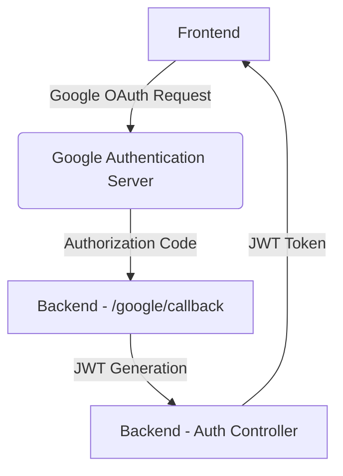
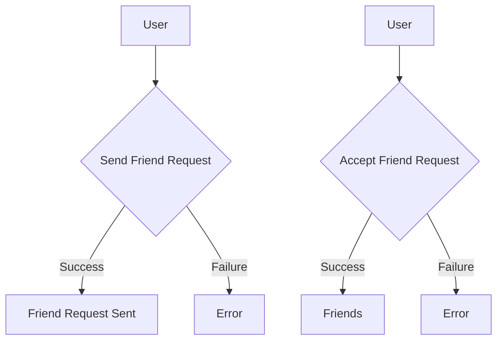

# Backend API Endpoints

<TOC />

## System Purpose

This document details the backend API endpoints for a MERN stack chat application.  The API handles user authentication, friend management, and messaging functionalities.  The design prioritizes security (using bcrypt for password hashing, JWT for authentication) and scalability (through well-defined routes and controllers).


## Authentication Endpoints (/auth)

This section covers the routes related to user registration and login.  Authentication is handled via JWT (JSON Web Tokens) for secure session management and Google OAuth for simplified user onboarding.

### `/signup` POST

This endpoint registers a new user.  It validates the input data (username, email, password) before creating a new user account. Passwords are securely hashed using bcrypt before storage.

```javascript
// backend/src/controllers/auth.controller.js#L4-L48
export const signup = async (req, res) => {
    const {username, email, password} = req.body;
    try {
        if(!username || !email || !password) {
            return res.status(400).json({message: "Please fill in all fields."});
        }
        // ... validation ...
        const salt = await bcrypt.genSalt(10);
        const hashedPassword = await bcrypt.hash(password, salt);
        const newUser = new User({ username, email, password: hashedPassword, authProvider: 'email' });
        // ... save user and generate token ...
    } catch (error) {
        console.log("Error in signup controller", error.message)
        res.status(500).json({message: "Something went wrong."});
    }
};
```

[backend/src/controllers/auth.controller.js#L4-L48](https://github.com/shinymack/Chat-App-MERN/blob/main/backend/src/controllers/auth.controller.js#L4-L48)

### `/login` POST

This endpoint handles user login. It verifies the provided credentials against the database and issues a JWT upon successful authentication.

```javascript
// backend/src/controllers/auth.controller.js#L50-L74
export const login = async (req, res) => {
    const {email, password} = req.body;
    try {
        const user = await User.findOne({email});
        if(!user) {
            return res.status(400).json({message: "Invalid credentials."});
        }
        // ... password verification ...
        generateToken(user._id, res);
        // ... return user data ...
    } catch (error) {
        console.log("Error in login controller", error.message);
        res.status(500).json({message: "Something went wrong."});
    }
};
```

[backend/src/controllers/auth.controller.js#L50-L74](https://github.com/shinymack/Chat-App-MERN/blob/main/backend/src/controllers/auth.controller.js#L50-L74)

### `/logout` POST

This endpoint invalidates the user's session by clearing the JWT cookie.

```javascript
// backend/src/controllers/auth.controller.js#L76-L85
export const logout = (req, res) => {
    try {
        res.cookie("jwt", "", {maxAge: 0});
        res.status(200).json({message: "Logged out successfully."})
    } catch(error) {
        console.log("Error in logout controller", error.message);
        res.status(500).json({message:"Internal Server Error"}); 
    }
};
```

[backend/src/controllers/auth.controller.js#L76-L85](https://github.com/shinymack/Chat-App-MERN/blob/main/backend/src/controllers/auth.controller.js#L76-L85)

### `/google` GET & `/google/callback` GET

These endpoints handle Google OAuth authentication. The `/google` endpoint initiates the Google OAuth flow, and `/google/callback` handles the redirect after successful authentication by Google.

```javascript
// backend/src/routes/auth.route.js#L23-L35
router.get(
    '/google',
    passport.authenticate('google', { scope: ['profile', 'email'] })
);
router.get(
    '/google/callback',
    passport.authenticate('google', {
        failureRedirect: 'http://localhost:5173/login', 
        failureMessage: true 
    }),
    googleAuthCallback 
);
```

[backend/src/routes/auth.route.js#L23-L35](https://github.com/shinymack/Chat-App-MERN/blob/main/backend/src/routes/auth.route.js#L23-L35)





### `/check` GET

This route allows checking authentication status after login.  It's protected, only accessible by authenticated users.


### `/update-profile` PUT

This endpoint allows authenticated users to update their profile information, including profile picture and username.


### `/username/check/:username` GET

This endpoint allows checking if a given username is already taken.  It's used for real-time username validation during registration or profile updates.


## Friend Management Endpoints (/friend)

All friend management endpoints are protected by `protectRoute` middleware which ensures only authenticated users can access them.

### `/request/send` POST

Sends a friend request.

### `/request/accept/:senderId` POST

Accepts a friend request.

### `/request/reject/:senderId` POST

Rejects a friend request.

### `/remove/:friendId` DELETE

Removes a friend from the friend list.

### `/list` GET

Retrieves the current user's friends list.

### `/requests/pending` GET

Retrieves pending friend requests for the current user.

### `/requests/sent` GET

Retrieves friend requests sent by the current user.





## Messaging Endpoints (/message)

All messaging endpoints are protected by `protectRoute` middleware.

### `/users` GET

Retrieves a list of users for the chat sidebar.

### `/:id` GET

Retrieves messages for a specific chat. `id` represents the chat ID or the recipient's user ID.

### `/send/:id` POST

Sends a message to a specific user or chat. `id`  represents the recipient's user ID or chat ID.


## Key Integration Points & Insights

* **Authentication:** The system uses a combination of JWT for session management and Google OAuth for streamlined login.  The `generateToken` utility function is central to this process.
* **Security:** Bcrypt is used to securely hash passwords, protecting them from unauthorized access. Input validation is performed in controller functions to prevent malicious input.
* **Middleware:** The `protectRoute` middleware enforces authentication for all friend management and messaging endpoints, ensuring data integrity and security.
* **Separation of Concerns:** The application follows a clear separation of concerns: controllers handle business logic, routes define API endpoints, and models interact with the database.


Next: [Backend Database](./2.2_backend_database.mdx)