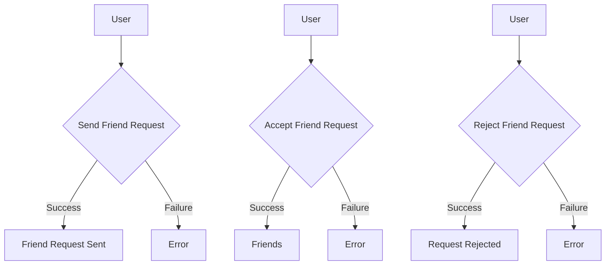
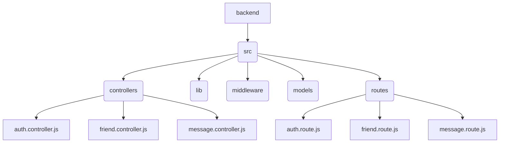

# Backend API Endpoints

<TOC />

## Authentication Endpoints

This section details the API endpoints responsible for user authentication and profile management.  These endpoints utilize JWT (JSON Web Tokens) for secure session management. The authentication process leverages the `passport` library for Google OAuth 2.0 and bcrypt for password hashing.


### `/signup` POST

This endpoint handles user registration.

**What:** Registers a new user account.

**Why:** Provides a secure method for creating new user accounts, validating input data, and generating a JWT for authenticated sessions.

**How:**

1.  Receives username, email, and password from the request body.
2.  Validates input data (length restrictions, email uniqueness).
3.  Hashes the password using bcrypt.
4.  Creates a new user document in the database.
5.  Generates a JWT and sets a cookie with that token.
6.  Returns the user information (excluding password).


```javascript
export const signup = async (req, res) => {
    const {username, email, password} = req.body;
    try {
        if(!username || !email || !password) {
            return res.status(400).json({message: "Please fill in all fields."});
        }
        // ... (rest of signup logic)
        generateToken(newUser._id, res); // Generates and sets JWT cookie
        await newUser.save();
        res.status(201).json({ /* user data */ });
    } catch (error) {
        res.status(500).json({message: "Something went wrong."});
    }
};
```

[Source](https://github.com/shinymack/Chat-App-MERN/blob/main/backend/src/controllers/auth.controller.js)


### `/login` POST

This endpoint handles user login.

**What:** Authenticates an existing user.

**Why:**  Provides secure user login based on email and password credentials, issuing JWTs for authorized access.

**How:**

1. Receives email and password.
2. Finds the user by email.
3. Verifies the password using bcrypt's compare function.
4. Generates a JWT and sets the token in a cookie.
5. Returns user information (excluding password).

```javascript
export const login = async (req, res) => {
    const {email, password} = req.body;
    try {
        const user = await User.findOne({email});
        if(!user) return res.status(400).json({message: "Invalid credentials."});
        const isPasswordCorrect = await bcrypt.compare(password, user.password);
        if(!isPasswordCorrect) return res.status(400).json({message: "Invalid credentials."});
        generateToken(user._id, res);
        res.status(200).json({ /* user data */ });
    } catch (error) {
        res.status(500).json({message: "Something went wrong."});
    }
};
```

[Source](https://github.com/shinymack/Chat-App-MERN/blob/main/backend/src/controllers/auth.controller.js)


### `/logout` POST

This endpoint handles user logout.

**What:** Logs out the current user by clearing the JWT cookie.

**Why:** Enables secure session termination.

**How:**  Clears the JWT cookie, effectively invalidating the user's session.

```javascript
export const logout = (req, res) => {
    try {
        res.cookie("jwt", "", {maxAge: 0});
        res.status(200).json({message: "Logged out successfully."})
    } catch(error) {
        res.status(500).json({message:"Internal Server Error"}); 
    }
};
```

[Source](https://github.com/shinymack/Chat-App-MERN/blob/main/backend/src/controllers/auth.controller.js)


### `/update-profile` PUT

This endpoint handles user profile updates.


**What:** Allows users to update their profile information (username and profile picture).

**Why:**  Provides functionality for users to manage their profile data.

**How:**

1.  Receives profilePic and username from the request body.
2.  Validates username for length and uniqueness.
3.  Uploads the profile picture to Cloudinary.
4.  Updates the user document in the database.
5.  Generates a new JWT (good practice after potentially changing sensitive user data).
6.  Returns the updated user information.


```javascript
export const updateProfile = async (req, res) => {
    try {
        const { profilePic, username } = req.body;
        const userId = req.user._id;
        // ... (rest of updateProfile logic)

        const updatedUser = await User.findByIdAndUpdate(userId, { $set: fieldsToUpdate }, { new: true });
        generateToken(updatedUser._id, res);
        res.status(200).json(updatedUser);

    } catch (error) {
        // ... (error handling)
    }
};
```

[Source](https://github.com/shinymack/Chat-App-MERN/blob/main/backend/src/controllers/auth.controller.js)


### Google OAuth 2.0 Integration

The application integrates with Google OAuth 2.0 for streamlined user authentication.

**What:** Allows users to sign up or log in using their Google accounts.

**Why:** Provides a convenient and secure alternative to traditional email/password authentication.

**How:**  The `/google` and `/google/callback` routes handle the OAuth flow using passport.js.  `/google` initiates the Google authentication process, while `/google/callback` handles the response and redirects the user upon successful authentication.

```javascript
router.get(
    '/google',
    passport.authenticate('google', { scope: ['profile', 'email'] })
);
router.get(
    '/google/callback',
    passport.authenticate('google', {
        failureRedirect: 'http://localhost:5173/login', 
        failureMessage: true 
    }),
    googleAuthCallback 
);
```

[Source](https://github.com/shinymack/Chat-App-MERN/blob/main/backend/src/routes/auth.route.js)

`

```mermaid
graph TD
    A[Client] --> B|Google OAuth Request|/google;
    B --> C[Google];
    C --> D|Callback|/google/callback;
    D --> E[Backend];
    E --> F|JWT & User Data|;
    F --> A;
```


## Friend Management Endpoints

These endpoints facilitate managing friend requests and friendships. All endpoints require authentication using `protectRoute`.

### `/request/send` POST

Sends a friend request.

### `/request/accept/:senderId` POST

Accepts a friend request.

### `/request/reject/:senderId` POST

Rejects a friend request.

### `/remove/:friendId` DELETE

Removes a friend.

### `/list` GET

Retrieves the current user's friends list.

### `/requests/pending` GET

Retrieves pending friend requests.

### `/requests/sent` GET

Retrieves sent friend requests.


`




## Messaging Endpoints

These endpoints manage messages between users. All endpoints require authentication.


### `/users` GET

Retrieves users for the sidebar.

### `/:id` GET

Retrieves messages for a specific conversation.

### `/send/:id` POST

Sends a message to a specific user.


`

```mermaid
graph TD
    A[Client] --> B|Get Users|/users;
    B --> C[Backend];
    C --> D|User List|;
    D --> A;
    E[Client] --> F|Get Messages|/:id;
    F --> G[Backend];
    G --> H|Messages|;
    H --> E;
    I[Client] --> J|Send Message|/send/:id;
    J --> K[Backend];
    K --> L|Message Sent|;
    L --> I;

```


## File Structure Diagram

`




Next: [Backend Database and Models](./2.2_backend_database.mdx)