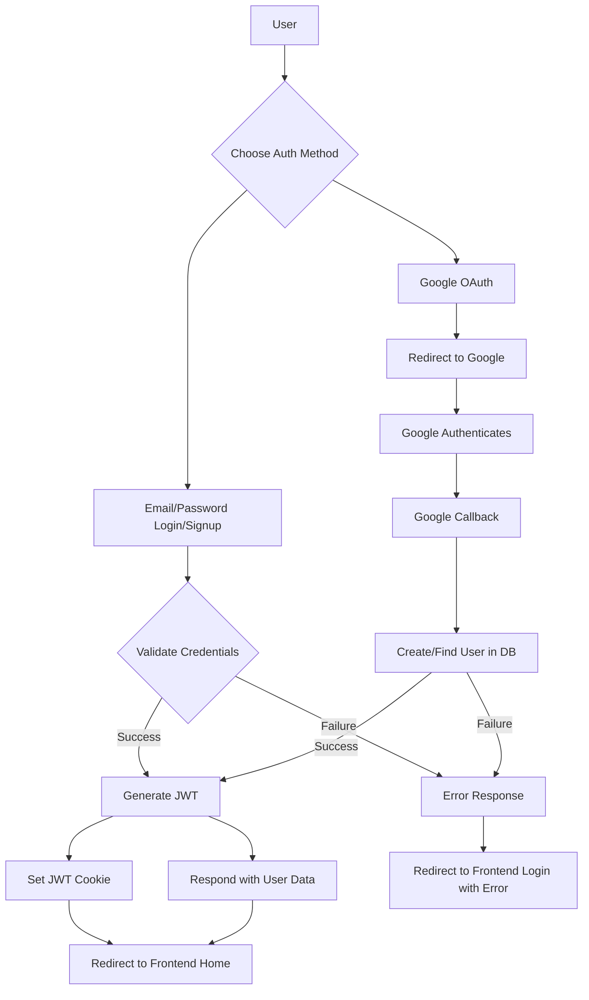

# Backend API Endpoints
<TOC />

This section provides a comprehensive overview of the backend API endpoints, detailing the functionalities related to user authentication, friend management, and real-time messaging. These endpoints form the core interaction layer for the client application.

## Authentication Endpoints

The authentication module handles user registration, login, logout, session verification, and profile management. It uses `bcryptjs` for password hashing and JSON Web Tokens (JWT) for session management, ensuring secure user authentication. Google OAuth is also integrated for streamlined sign-in.

- **User Registration (`/api/auth/signup`)**: Allows new users to create an account by providing a username, email, and password. It performs validations for input length and uniqueness of email and username.
- **User Login (`/api/auth/login`)**: Authenticates existing users based on their email and password. It supports both email/password and Google authenticated users, preventing email-password logins for Google-only accounts.
- **User Logout (`/api/auth/logout`)**: Clears the authentication token (JWT) from the client's cookies, effectively logging the user out.
- **Profile Update (`/api/auth/update-profile`)**: Enables authenticated users to update their profile picture and username. This endpoint integrates with Cloudinary for image uploads and performs checks for username availability and uniqueness.
- **Username Availability Check (`/api/auth/username/check/:username`)**: Allows clients to check if a desired username is available before registration or update.
- **Session Check (`/api/auth/check`)**: Verifies the current user's session by checking the JWT and returns the user's details if authenticated.
- **Google OAuth Integration (`/api/auth/google`, `/api/auth/google/callback`)**: Initiates Google authentication flow and handles the callback, setting a JWT upon successful authentication.

### Signup Controller Logic
The `signup` controller demonstrates input validation, password hashing, and token generation for new user accounts.

```javascript
export const signup = async (req, res) => {
    const {username, email, password} = req.body;
    try {
        if(!username || !email || !password) {
            return res.status(400).json({message: "Please fill in all fields."});
        }
        // ... (validation for username and password length)
        const user = await User.findOne({email});
        if (user) return res.status(400).json({message: "Email already exists."});
        
        const existingUserByUsername = await User.findOne({ username });
        if (existingUserByUsername) {
            return res.status(400).json({ message: "Username already exists. Please choose another." });
        }

        const salt = await bcrypt.genSalt(10);
        const hashedPassword = await bcrypt.hash(password, salt);

        const newUser = new User({
            username,
            email,
            password: hashedPassword,
            authProvider: 'email'
        });
        if(newUser){
            generateToken(newUser._id, res);
            await newUser.save();
            res.status(201).json({
                _id: newUser._id,
                username: newUser.username,
                email: newUser.email,   
                profilePic: newUser.profilePic,
                authProvider: newUser.authProvider
            });
        } else {
            res.status(400).json({message: "Invalid user data."});
        }
    } catch (error) {
        console.log("Error in signup controller", error.message)
        res.status(500).json({message: "Something went wrong."});
    }
};
```
[View on GitHub](https://github.com/shinymack/Chat-App-MERN/blob/main/backend/src/controllers/auth.controller.js#L7-L58)

### Authentication Flow Diagram
The following diagram illustrates the typical authentication flow, encompassing both email/password and Google OAuth processes.





These routes are defined in [`backend/src/routes/auth.route.js`](https://github.com/shinymack/Chat-App-MERN/blob/main/backend/src/routes/auth.route.js).

## Friend Management Endpoints

The friend management module facilitates social interactions between users, allowing them to send, accept, reject, and remove friend requests. All friend management endpoints are protected to ensure only authenticated users can access them.

- **Send Friend Request (`/api/friend/request/send/`)**: Initiates a friend request from the current user to another specified user.
- **Accept Friend Request (`/api/friend/request/accept/:senderId`)**: Allows the current user to accept a pending friend request from a specified sender.
- **Reject Friend Request (`/api/friend/request/reject/:senderId`)**: Allows the current user to reject a pending friend request from a specified sender.
- **Remove Friend (`/api/friend/remove/:friendId`)**: Enables the current user to remove an existing friend from their friend list.
- **Get Friends List (`/api/friend/list`)**: Retrieves a list of all friends for the current authenticated user.
- **Get Pending Friend Requests (`/api/friend/requests/pending`)**: Fetches all incoming friend requests that are awaiting the current user's decision.
- **Get Sent Friend Requests (`/api/friend/requests/sent`)**: Fetches all outgoing friend requests that the current user has sent.

### Friend Request Route Protection
All friend routes are protected by the `protectRoute` middleware, ensuring that only authenticated users can access these functionalities.

```javascript
import express from "express";
import {
    sendFriendRequest,
    acceptFriendRequest,
    rejectFriendRequest,
    removeFriend,
    getFriends,
    getPendingRequests,
    getSentRequests
} from "../controllers/friend.controller.js";
import { protectRoute } from "../middleware/auth.middleware.js";

const router = express.Router();

// All routes here should be protected
router.use(protectRoute);

router.post("/request/send/", sendFriendRequest);
router.post("/request/accept/:senderId", acceptFriendRequest);
router.post("/request/reject/:senderId", rejectFriendRequest);
router.delete("/remove/:friendId", removeFriend);
router.get("/list", getFriends);
router.get("/requests/pending", getPendingRequests);
router.get("/requests/sent", getSentRequests);

export default router;
```
[View on GitHub](https://github.com/shinymack/Chat-App-MERN/blob/main/backend/src/routes/friend.route.js#L1-L30)

## Messaging Endpoints

The messaging module facilitates private conversations between users. It provides functionalities to retrieve users for the chat sidebar, fetch messages for a specific conversation, and send new messages. These endpoints also integrate with real-time capabilities via Socket.IO (though not directly shown in these routes, the `sendMessage` controller would typically emit a Socket.IO event).

- **Get Users for Sidebar (`/api/message/users`)**: Retrieves a list of users or friends suitable for display in a chat sidebar, often including recent contacts or friends.
- **Get Messages (`/api/message/:id`)**: Fetches all messages exchanged in a conversation with a specific user (identified by `id`).
- **Send Message (`/api/message/send/:id`)**: Allows the current user to send a new message to another user (identified by `id`). This typically involves saving the message to the database and then emitting a real-time event.

### Message Sending Route
The `sendMessage` endpoint demonstrates how new messages are handled, ensuring the sender is authenticated.

```javascript
import express from "express"
import { protectRoute } from "../middleware/auth.middleware.js";
import { getUsersForSidebar, getMessages, sendMessage } from "../controllers/message.controller.js";
const router = express.Router();

router.get("/users", protectRoute, getUsersForSidebar);

router.get("/:id", protectRoute, getMessages);

router.post("/send/:id", protectRoute, sendMessage);

export default router;
```
[View on GitHub](https://github.com/shinymack/Chat-App-MERN/blob/main/backend/src/routes/message.route.js#L1-L12)

## Key Integration Points

The various API endpoints demonstrate clear separation of concerns, with distinct routes and controllers for authentication, friend management, and messaging. The `protectRoute` middleware is consistently applied across sensitive endpoints, enforcing authentication and authorization.

- **Authentication Flow**: The `auth.controller.js` file [View on GitHub](https://github.com/shinymack/Chat-App-MERN/blob/main/backend/src/controllers/auth.controller.js) centralizes all authentication logic, from user creation and password hashing with `bcryptjs` to JWT generation and cookie management via `generateToken`. The integration with `passport` for Google OAuth further enhances the authentication options. Best practices like input validation and secure password handling are implemented.
- **Middleware for Security**: The `protectRoute` middleware ([View on GitHub](https://github.com/shinymack/Chat-App-MERN/blob/main/backend/src/middleware/auth.middleware.js)) is crucial for securing API endpoints. It ensures that only authenticated users can access protected resources, preventing unauthorized access and maintaining data integrity.
- **Scalability Considerations**: By separating concerns into distinct routes and controllers, the application maintains a modular structure that is easier to manage, test, and scale. Real-time features (implied by messaging) typically leverage WebSockets (e.g., Socket.IO) to handle concurrent connections efficiently, reducing server load compared to constant polling.
- **Error Handling**: Each controller includes robust `try-catch` blocks to gracefully handle errors, providing meaningful error messages to the client and logging internal server errors for debugging.

Next: [Backend Data Models](./2.2_backend_data_models.mdx)