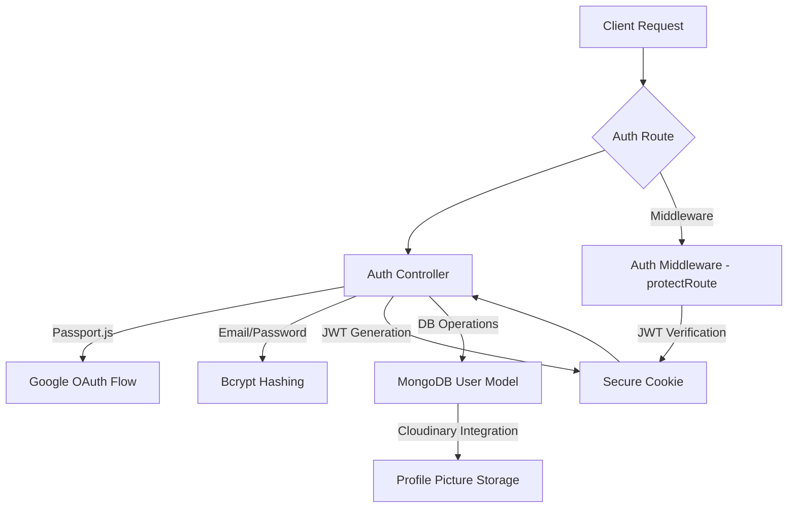

```mdx
---
title: "Authentication & Authorization"
description: "Explains how user authentication, authorization, and session management are handled on the backend."
sidebar_position: 21
---

# Authentication & Authorization

<TOC />

This document details the robust authentication and authorization mechanisms implemented in the backend, covering traditional email/password sign-up/login, Google OAuth, and session management. It explores how user data is secured, verified, and maintained across the application, adhering to best practices for security and user experience.

## System Purpose

The primary purpose of the authentication and authorization system is to securely manage user access to the application's resources. This involves:
- **User Registration:** Allowing new users to create accounts using email/password or third-party providers (Google).
- **User Login:** Authenticating existing users and establishing secure sessions.
- **Session Management:** Maintaining user identity across multiple requests using JWTs stored in HTTP-only cookies.
- **Access Control:** Protecting routes and resources, ensuring only authenticated and authorized users can perform specific actions.
- **Profile Management:** Enabling users to update their profile information securely.

## Core Components and Technologies

The authentication system leverages several key technologies and components to ensure secure and efficient user management.

### Key Dependencies

| Dependency | Purpose |
|---|---|
| `express` | Web framework for handling HTTP requests and routing. |
| `bcryptjs` | Library for hashing and comparing passwords securely. |
| `jsonwebtoken` | Used for generating and verifying JSON Web Tokens (JWTs). |
| `passport` | Authentication middleware for Node.js, specifically for Google OAuth. |
| `passport-google-oauth20` | Passport strategy for authenticating with Google using the OAuth 2.0 API. |
| `cloudinary` | Cloud-based image and video management, used for profile picture storage. |
| `dotenv` | Loads environment variables from a `.env` file. |
| `User` model | Mongoose schema and model for interacting with user data in MongoDB. |

### Architectural Overview

The authentication flow integrates several backend modules to handle user requests, database interactions, and secure token management.





## Authentication & Authorization Flow

### 1. User Registration (`signup`)

The `signup` process allows new users to create an account with a unique username and email, secured by a hashed password.

#### Key Features:
- **Input Validation:** Enforces minimum/maximum lengths for username and password.
- **Uniqueness Checks:** Verifies that both the email and username are not already registered.
- **Password Hashing:** Uses `bcryptjs` to hash passwords with a salt, preventing plaintext storage.
- **JWT Generation:** Upon successful registration, a JSON Web Token (JWT) is generated and set as an HTTP-only cookie.
- **User Creation:** A new `User` document is created in MongoDB.

#### Code Excerpt: `signup` Controller
This snippet demonstrates input validation, uniqueness checks, and password hashing.
[backend/src/controllers/auth.controller.js#L7-L50](https://github.com/shinymack/Chat-App-MERN/blob/main/backend/src/controllers/auth.controller.js#L7-L50)
```javascript
export const signup = async (req, res) => {
    const {username, email, password} = req.body;
    try {
        if(!username || !email || !password) {
            return res.status(400).json({message: "Please fill in all fields."});
        }
        // ... (length validations) ...
        const user = await User.findOne({email});
        if (user) return res.status(400).json({message: "Email already exists."});
        
        const existingUserByUsername = await User.findOne({ username });
        if (existingUserByUsername) {
            return res.status(400).json({ message: "Username already exists. Please choose another." });
        }

        const salt = await bcrypt.genSalt(10);
        const hashedPassword = await bcrypt.hash(password, salt);

        const newUser = new User({
            username,
            email,
            password: hashedPassword,
            authProvider: 'email'
        });
        if(newUser){
            generateToken(newUser._id, res); // Generates and sets JWT
            await newUser.save();

            res.status(201).json({
                _id: newUser._id,
                username: newUser.username,
                email: newUser.email,   
                profilePic: newUser.profilePic,
                authProvider: newUser.authProvider
            });
        } else {
            res.status(400).json({message: "Invalid user data."});
        }
    } catch (error) {
        console.log("Error in signup controller", error.message)
        res.status(500).json({message: "Something went wrong."});
    }
};
```

### 2. User Login (`login`)

The `login` function authenticates users by verifying their credentials against stored data.

#### Key Features:
- **Credential Verification:** Checks if a user exists by email and if the provided password matches the stored hash using `bcrypt.compare`.
- **Google Auth Handling:** Prevents login with email/password if the account was created via Google OAuth.
- **Session Establishment:** Generates a JWT and sets it as an HTTP-only cookie upon successful login.

#### Code Excerpt: `login` Controller
[backend/src/controllers/auth.controller.js#L54-L86](https://github.com/shinymack/Chat-App-MERN/blob/main/backend/src/controllers/auth.controller.js#L54-L86)
```javascript
export const login = async (req, res) => {
    const {email, password} = req.body;
    try {
        const user = await User.findOne({email});

        if(!user) {
            return res.status(400).json({message: "Invalid credentials."});
        }

        if(user.authProvider === 'google' && !user.password){
            return res.status(400).json({ message: "Please sign in with Google." });
        }

        const isPasswordCorrect = await bcrypt.compare(password, user.password);
        if(!isPasswordCorrect) {
            return res.status(400).json({message: "Invalid credentials."});
        }

        generateToken(user._id, res); // Generates and sets JWT
        res.status(200).json({
            _id: user._id,
            username: user.username,
            email: user.email,
            profilePic: user.profilePic,
            authProvider: user.authProvider,
        });
    } catch (error) {
        console.log("Error in login controller", error.message);
        res.status(500).json({message: "Something went wrong."});
    }
};
```

### 3. Google OAuth Integration

The application supports Google Sign-In using `passport-google-oauth20`.

#### Flow Details:
1. **Client Request:** User clicks "Sign in with Google".
2. **Passport Authentication:** The request is redirected to Google's authentication server via `passport.authenticate('google')`.
3. **User Consent:** User grants permission on Google's side.
4. **Callback:** Google redirects back to the `GOOGLE_CALLBACK_URL` with user profile information.
5. **Strategy Execution:** The `GoogleStrategy` callback function in `passport.config.js` is executed.
   - It checks if a user with `googleId` exists. If so, `done(null, user)` logs them in.
   - If not, it attempts to find an existing user by email. If an email-based account exists and is not a Google account, it prompts the user to use their original method.
   - If no existing user, a new user account is created with `googleId`, email, and a generated username.
6. **Session Management:** Upon successful authentication, `passport.serializeUser` stores the user ID in the session, and `passport.deserializeUser` fetches the full user object on subsequent requests, making it available as `req.user`.
7. **JWT Generation:** After successful Google authentication, the `googleAuthCallback` controller generates a JWT and redirects the user to the frontend.

#### Code Excerpt: `passport.config.js`
This snippet shows the GoogleStrategy setup and user handling.
[backend/src/lib/passport.config.js#L13-L67](https://github.com/shinymack/Chat-App-MERN/blob/main/backend/src/lib/passport.config.js#L13-L67)
```javascript
export const configurePassport = () => {
    passport.use(new GoogleStrategy({
        clientID: process.env.GOOGLE_CLIENT_ID,
        clientSecret: process.env.GOOGLE_CLIENT_SECRET,
        callbackURL: process.env.GOOGLE_CALLBACK_URL,
        scope: ['profile', 'email'] 
    },
    async (accessToken, refreshToken, profile, done) => {
        try {
            let user = await User.findOne({ googleId: profile.id });
            if (user) {
                return done(null, user);
            } else {
                let username = profile.displayName.replace(/\s+/g, '').toLowerCase() || `user${Date.now()}`;
                // ... (username uniqueness and length handling) ...
                const newUser = new User({
                    googleId: profile.id,
                    email: profile.emails && profile.emails[0] ? profile.emails[0].value : null,
                    username: username,
                    authProvider: 'google',
                });
                // ... (email existence check for non-Google providers) ...
                await newUser.save();
                return done(null, newUser);
            }
        } catch (error) {
            return done(error, null);
        }
    }));
    // ... (serializeUser and deserializeUser) ...
};
```

#### Code Excerpt: Google Auth Callback
[backend/src/controllers/auth.controller.js#L112-L127](https://github.com/shinymack/Chat-App-MERN/blob/main/backend/src/controllers/auth.controller.js#L112-L127)
```javascript
export const googleAuthCallback = async (req, res) => {
 const frontendUrl = process.env.FRONTEND_URL || 'http://localhost:5173';
    try {
        if (!req.user) {
            return res.redirect(`${frontendUrl}/login?error=google_auth_failed`);
        }
        generateToken(req.user._id, res); // Sets JWT for Google authenticated user
        res.redirect(frontendUrl);
    } catch (error) {
        console.error("Error in googleAuthCallback: ", error.message);
        res.redirect(`${frontendUrl}/login?error=google_auth_processing_error`);
    }
};
```

### 4. Session Management with JWTs

JSON Web Tokens (JWTs) are used for stateless session management.

#### Process:
- **Token Generation:** After successful login/signup/Google Auth, `generateToken` creates a JWT containing the user's `_id` and signs it with `JWT_SECRET`.
- **Cookie Storage:** The JWT is set as an `httpOnly` cookie with a specified expiration (e.g., 15 days), preventing client-side JavaScript access and reducing XSS risks.
- **Token Verification:** The `protectRoute` middleware intercepts incoming requests, extracts the JWT from the cookie, verifies its authenticity, and decodes the user ID.
- **User Attachment:** The authenticated user's object (excluding the password) is fetched from the database and attached to `req.user`, making it available to subsequent route handlers.

#### Code Excerpt: `auth.middleware.js` (`protectRoute`)
[backend/src/middleware/auth.middleware.js#L4-L29](https://github.com/shinymack/Chat-App-MERN/blob/main/backend/src/middleware/auth.middleware.js#L4-L29)
```javascript
export const protectRoute = async (req, res, next) => {
    try {
        const token = req.cookies.jwt;
        if(!token){
            return res.status(401).json({message: "Unauthorized - No Token Provided"});
        }

        const decoded = jwt.verify(token, process.env.JWT_SECRET)

        if(!decoded) {
            return res.status(401).json({message: "Unauthorized - Invalid Token"});
        }
        const user = await User.findById(decoded.userId).select("-password");

        if(!user) {
            return res.status(404).json({message: "User not found"});
        }
        req.user = user; // Attach user object to request

        next();
    } catch (error) {
        console.log("Error in protectRoute middleware", error.message);
        res.status(500).json({message: "Internal Server Error"});
    }
};
```

### 5. Logout (`logout`)

The `logout` function effectively terminates the user's session.

#### Mechanism:
- The JWT cookie is cleared by setting its `maxAge` to 0, effectively deleting it from the client's browser.

#### Code Excerpt: `logout` Controller
[backend/src/controllers/auth.controller.js#L89-L96](https://github.com/shinymack/Chat-App-MERN/blob/main/backend/src/controllers/auth.controller.js#L89-L96)
```javascript
export const logout = (req, res) => {
    try {
        res.cookie("jwt", "", {maxAge: 0});
        res.status(200).json({message: "Logged out successfully."})
    } catch(error) {
        console.log("Error in logout controller", error.message);
        res.status(500).json({message:"Internal Server Error"}); 
    }
};
```

### 6. Profile Management (`updateProfile`, `checkUsernameAvailability`)

Users can update their profile information, including their username and profile picture.

#### `updateProfile` Controller:
- **Authenticated Access:** This route is protected by `protectRoute`, ensuring only logged-in users can update their own profile.
- **Username Update Logic:**
    - Validates new username length.
    - Checks if the new username is already taken by another user (excluding the current user).
    - Updates the username in the database.
- **Profile Picture Update:**
    - If a `profilePic` (expected to be a base64 string or similar) is provided, it's uploaded to Cloudinary.
    - The secure URL from Cloudinary is then stored in the user's document.
- **Token Refresh:** After a successful update (especially if the username, which might be in the token payload or used for display, changes), a new JWT is generated and set to refresh the client's session.

#### Code Excerpt: `updateProfile` Controller
[backend/src/controllers/auth.controller.js#L170-L230](https://github.com/shinymack/Chat-App-MERN/blob/main/backend/src/controllers/auth.controller.js#L170-L230)
```javascript
export const updateProfile = async (req, res) => {
    try {
        const { profilePic, username } = req.body;
        const userId = req.user._id;
        let userToUpdate = await User.findById(userId);

        // ... (username validation and uniqueness check) ...
        if (username && username.trim() !== userToUpdate.username) {
            // ... (username length validation, check for existing user) ...
            fieldsToUpdate.username = username.trim();
        }

        // Handle profile picture update
        if (profilePic) {
            const uploadResponse = await cloudinary.uploader.upload(profilePic);
            fieldsToUpdate.profilePic = uploadResponse.secure_url;
        }

        if (Object.keys(fieldsToUpdate).length === 0) {
            return res.status(400).json({ message: "No changes provided to update." });
        }

        const updatedUser = await User.findByIdAndUpdate(userId, { $set: fieldsToUpdate }, { new: true });
        generateToken(updatedUser._id, res); // Refresh token
        res.status(200).json(updatedUser);
    } catch (error) {
        console.error("Error in updateProfile controller", error.message);
        res.status(500).json({ message: "Internal Server Error while updating profile." });
    }
};
```

#### `checkUsernameAvailability` Controller:
- Allows users to check if a desired username is available before attempting to update their profile.
- Validates username length and ensures it's not taken by another user.

#### Code Excerpt: `checkUsernameAvailability` Controller
[backend/src/controllers/auth.controller.js#L130-L167](https://github.com/shinymack/Chat-App-MERN/blob/main/backend/src/controllers/auth.controller.js#L130-L167)
```javascript
export const checkUsernameAvailability = async (req, res) => {
    try {
        const { username } = req.params;
        const currentUserId = req.user._id; 

        if (!username || username.trim().length < 3 || username.trim().length > 20) {
            return res.status(400).json({ available: false, message: "Username must be between 3 and 20 characters." });
        }
    
        if (req.user.username === username) { // Current username is always available
            return res.status(200).json({ available: true, message: "This is your current username." });
        }

        const existingUser = await User.findOne({ username: username });

        if (existingUser) {
            return res.status(200).json({ available: false, message: "Username is already taken." });
        }

        res.status(200).json({ available: true, message: "Username is available." });

    } catch (error) {
        console.error("Error in checkUsernameAvailability:", error.message);
        res.status(500).json({ available: false, message: "Error checking username availability." });
    }
};
```

### 7. Check Authentication (`checkAuth`)

This endpoint allows the client to verify if the current session is authenticated and retrieve the user's basic information without needing to log in again.

#### Functionality:
- Protected by `protectRoute`, ensuring only authenticated requests reach it.
- Returns the currently authenticated user's details (excluding password) from `req.user`.

#### Code Excerpt: `checkAuth` Controller
[backend/src/controllers/auth.controller.js#L99-L110](https://github.com/shinymack/Chat-App-MERN/blob/main/backend/src/controllers/auth.controller.js#L99-L110)
```javascript
export const checkAuth = (req, res) => {
    try {
        res.status(200).json({
            _id: req.user._id,
            username: req.user.username,
            email: req.user.email,
            profilePic: req.user.profilePic,
            authProvider: req.user.authProvider,
            createdAt: req.user.createdAt
        });
    } catch (error) {
        console.log("Error in checkAuth controller", error.message);
        res.status(500).json({message: "Internal Server Error"});
    }
};
```

## Routing and Endpoints

All authentication-related routes are defined in [backend/src/routes/auth.route.js](https://github.com/shinymack/Chat-App-MERN/blob/main/backend/src/routes/auth.route.js).


```mermaid
graph TD
    subgraph Auth Endpoints
        signup_ep[/api/auth/signup] --> C1[signup]
        login_ep[/api/auth/login] --> C2[login]
        logout_ep[/api/auth/logout] --> C3[logout]
        update_profile_ep[/api/auth/update-profile] --> M1[protectRoute]
        M1 --> C4[updateProfile]
        check_username_ep[/api/auth/username/check/:username] --> M2[protectRoute]
        M2 --> C5[checkUsernameAvailability]
        check_auth_ep[/api/auth/check] --> M3[protectRoute]
        M3 --> C6[checkAuth]
        google_auth_ep[/api/auth/google] --> P1[passport.authenticate('google')]
        google_callback_ep[/api/auth/google/callback] --> P2[passport.authenticate('google')]
        P2 --> C7[googleAuthCallback]
    end

    C1, C2, C3, C4, C5, C6, C7 --> DB[User Model (MongoDB)]
    P1, P2 --> G[Google OAuth Service]
    C4 --> CL[Cloudinary]
```


### Route Table

| Method | Endpoint | Controller/Middleware | Description | Protection |
|---|---|---|---|---|
| `POST` | `/signup` | `signup` | Registers a new user with email and password. | Public |
| `POST` | `/login` | `login` | Authenticates user with email and password. | Public |
| `POST` | `/logout` | `logout` | Clears the JWT cookie to log out the user. | Public |
| `PUT` | `/update-profile` | `protectRoute`, `updateProfile` | Updates user's profile information (username, profile picture). | Protected |
| `GET` | `/username/check/:username` | `protectRoute`, `checkUsernameAvailability` | Checks if a username is available. | Protected |
| `GET` | `/check` | `protectRoute`, `checkAuth` | Verifies current session and returns user data. | Protected |
| `GET` | `/google` | `passport.authenticate('google')` | Initiates Google OAuth flow. | Public |
| `GET` | `/google/callback` | `passport.authenticate('google')`, `googleAuthCallback` | Handles Google OAuth callback and finalizes login. | Public |

## Best Practices and Security Insights

- **HTTP-Only Cookies:** JWTs are stored in `httpOnly` cookies, mitigating XSS attacks as client-side JavaScript cannot access the token.
- **Password Hashing:** `bcryptjs` is used with a salt to securely hash passwords, making them resistant to rainbow table attacks.
- **Input Validation:** Comprehensive validation is applied to user inputs (username, email, password) to prevent common vulnerabilities like injection attacks and ensure data integrity.
- **Environment Variables:** Sensitive information like `JWT_SECRET`, `GOOGLE_CLIENT_ID`, and `GOOGLE_CLIENT_SECRET` are stored as environment variables, not hardcoded in the codebase.
- **Error Handling:** Robust `try-catch` blocks are used in all controllers and middleware to gracefully handle errors and prevent sensitive information from being leaked in responses.
- **Separation of Concerns:** Controllers handle business logic, middleware handles cross-cutting concerns (like authentication), and routes define API endpoints, promoting modularity and maintainability.
- **User Experience:** Clear error messages are provided to the client for failed operations (e.g., "Email already exists", "Invalid credentials").

## Key Integration Points

- **`User` Model:** All authentication operations directly interact with the `User` Mongoose model to create, find, and update user records in MongoDB.
- **`generateToken` Utility:** This utility function (presumably located in `backend/src/lib/utils.js`) is central to creating and setting the JWT cookie, ensuring consistency across login, signup, and Google OAuth flows.
- **Cloudinary:** Integrated for storing and retrieving user profile pictures, abstracting image management from the core application logic.
- **Frontend Application:** The frontend interacts with these backend endpoints for user authentication, registration, and profile updates, relying on the JWT cookie for session management.

Next: [Messaging & Friend Management](./2.2_backend_messaging_friends.mdx)
```