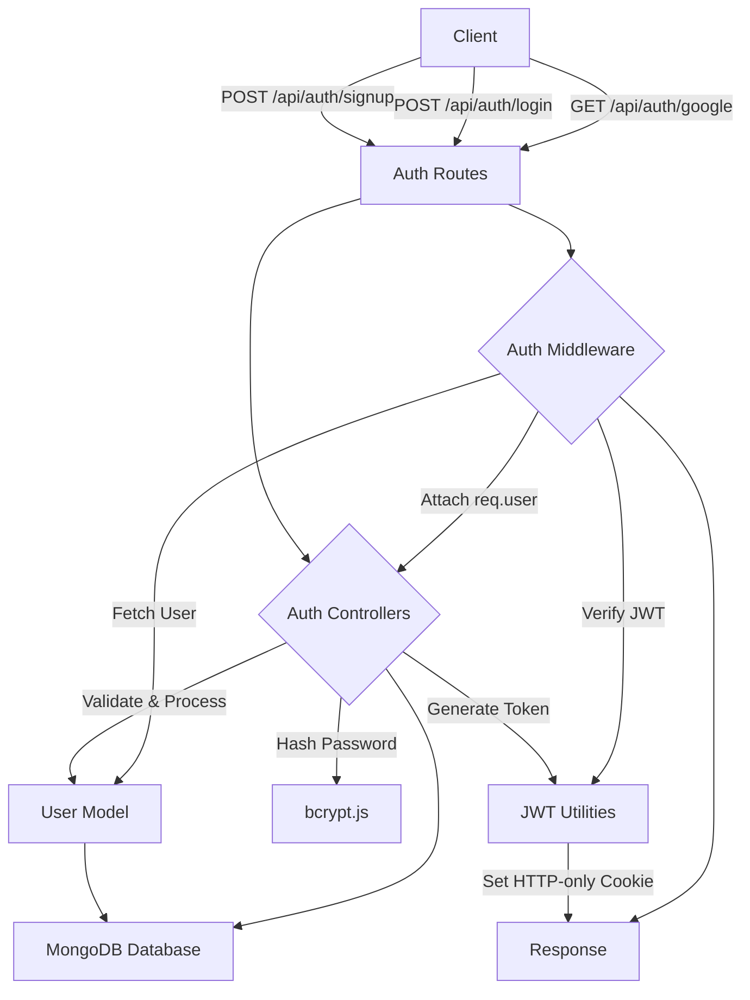
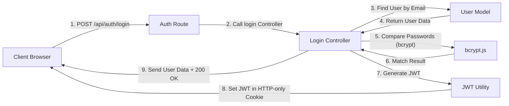

# Authentication & Authorization
<TOC />

## Introduction to Authentication & Authorization

This section details the backend implementation of user authentication and authorization within the application. It covers user registration, login, logout, profile management, and Google OAuth integration, ensuring secure access and management of user identities. The system leverages `bcrypt.js` for secure password hashing, JSON Web Tokens (JWT) for session management, and `Passport.js` for robust Google-based authentication.

The core functionalities include:
*   **User Registration**: Allowing new users to create accounts with unique usernames and emails.
*   **User Login**: Authenticating existing users using their credentials.
*   **Google OAuth**: Providing an alternative, seamless sign-in/sign-up experience via Google accounts.
*   **Session Management**: Using JWTs transmitted via HTTP-only cookies to maintain user sessions.
*   **Authorization**: Protecting routes and resources by verifying the authenticity of the user's token.
*   **Profile Management**: Enabling authenticated users to update their profile picture and username.
*   **Username Availability Check**: An endpoint to check if a desired username is available during registration or profile updates.

All these operations are managed through dedicated controllers, routes, and middleware, ensuring a clean separation of concerns and maintainable code.

## Core Authentication Architecture

The authentication system is a critical component of the backend, designed to be robust and scalable. It integrates several modules to handle different aspects of user identity and access control. Requests typically flow from the client, through the application's routing layer, into specific controllers, and often pass through middleware for validation or authorization before interacting with the database.

Passport.js is central to handling third-party authentication (Google OAuth), abstracting much of the complexity. JWTs, stored in secure HTTP-only cookies, provide a stateless mechanism for maintaining user sessions, which is beneficial for horizontal scaling of the backend.





## Technology Stack & Core Dependencies

The authentication and authorization module relies on a set of robust Node.js libraries and frameworks. This table outlines the key technologies used:

| Layer                 | Technology             | Purpose                                                                                |
| :-------------------- | :--------------------- | :------------------------------------------------------------------------------------- |
| **Framework**         | Express.js             | Web application framework for handling HTTP requests and routing.                      |
| **Authentication**    | Passport.js            | Middleware for flexible and modular authentication, especially for Google OAuth.       |
| **Hashing**           | `bcryptjs`             | Securely hashes and compares user passwords to prevent plaintext storage.              |
| **Tokenization**      | `jsonwebtoken`         | Generates and verifies JSON Web Tokens (JWTs) for stateless session management.        |
| **Database ORM**      | Mongoose               | Object Data Modeling (ODM) library for MongoDB, simplifying database interactions.     |
| **Cloud Storage**     | Cloudinary             | Handles secure storage and management of user-uploaded profile pictures.               |
| **Environment Config**| `dotenv`               | Loads environment variables from a `.env` file for secure configuration.               |
| **Utilities**         | `cookie-parser`        | Parses incoming request cookies for easy access and manipulation.                      |

## Detailed Implementation of Authentication Flows

The backend implements several distinct authentication and authorization flows, each with specific logic and security considerations.

### User Registration

The `signup` controller handles new user registrations. It performs crucial input validation, checks for existing users, hashes passwords, and then creates a new user record in the database. Upon successful registration, a JWT is generated and set as an HTTP-only cookie, and the new user's basic information is returned. This process ensures data integrity and security from the outset.

```javascript showLineNumbers
// backend/src/controllers/auth.controller.js
import cloudinary from "../lib/cloudinary.js";
import { generateToken } from "../lib/utils.js";
import User from "../models/user.model.js";
import bcrypt from "bcryptjs";

export const signup = async (req, res) => {
    const {username, email, password} = req.body;
    try {
        if(!username || !email || !password) {
            return res.status(400).json({message: "Please fill in all fields."});
        }
        if (username.length < 3) {
            return res.status(400).json({ message: "Username must be at least 3 characters." });
        }
        if (username.length > 20) {
            return res.status(400).json({ message: "Username cannot be more than 20 characters." });
        }
        if (password.length < 6) {
            return res.status(400).json({message: "Password must be at least 6 characters."});
        }
        const user = await User.findOne({email});
        if (user) return res.status(400).json({message: "Email already exists."});
        
        const existingUserByUsername = await User.findOne({ username });
        if (existingUserByUsername) {
            return res.status(400).json({ message: "Username already exists. Please choose another." });
        }

        const salt = await bcrypt.genSalt(10);
        const hashedPassword = await bcrypt.hash(password, salt);

        const newUser = new User({
            username,
            email,
            password: hashedPassword,
            authProvider: 'email'
        });
        if(newUser){
            generateToken(newUser._id, res); // Generate JWT and set as cookie
            await newUser.save();

            res.status(201).json({
                _id: newUser._id,
                username: newUser.username,
                email: newUser.email,   
                profilePic: newUser.profilePic,
                authProvider: newUser.authProvider
            });
        } else {
            res.status(400).json({message: "Invalid user data."});
        }
    } catch (error) {
        console.log("Error in signup controller", error.message)
        res.status(500).json({message: "Something went wrong."});
    }
};
```
[View on GitHub](https://github.com/shinymack/Chat-App-MERN/blob/main/backend/src/controllers/auth.controller.js#L1-L64)

### User Login

The `login` controller verifies user credentials against stored hashed passwords. It first attempts to find a user by email. If the user is found and their `authProvider` is not 'google' or they have a password, it proceeds to compare the provided password with the stored hash using `bcrypt.compare`. On successful authentication, a new JWT is issued, and the user's details are returned. Special handling is included for users who originally signed up via Google to prevent password-based login for them.

```javascript showLineNumbers
// backend/src/controllers/auth.controller.js
// ... (imports and previous exports) ...
export const login = async (req, res) => {
    const {email, password} = req.body;
    try {
        const user = await User.findOne({email});

        if(!user) {
            return res.status(400).json({message: "Invalid credentials."});
        }

        if(user.authProvider === 'google' && !user.password){
            return res.status(400).json({ message: "Please sign in with Google." });
        }

        const isPasswordCorrect = await bcrypt.compare(password, user.password);
        if(!isPasswordCorrect) {
            return res.status(400).json({message: "Invalid credentials."});
        }

        generateToken(user._id, res); // Generate JWT and set as cookie
        res.status(200).json({
            _id: user._id,
            username: user.username,
            email: user.email,
            profilePic: user.profilePic,
            authProvider: user.authProvider,
        });
    } catch (error) {
        console.log("Error in login controller", error.message);
        res.status(500).json({message: "Something went wrong."});
    }
};
```
[View on GitHub](https://github.com/shinymack/Chat-App-MERN/blob/main/backend/src/controllers/auth.controller.js#L67-L95)

### Google OAuth Integration

Google OAuth is implemented using `Passport.js` with the `passport-google-oauth20` strategy. The `configurePassport` function sets up the strategy, defining how user information from Google is handled. It checks if a user with the Google ID already exists. If so, it logs them in; otherwise, it creates a new user account, inferring an email and a unique username from the Google profile. This seamless integration provides an easy alternative for users to sign up or log in.

```javascript showLineNumbers
// backend/src/lib/passport.config.js
import passport from 'passport';
import { Strategy as GoogleStrategy } from 'passport-google-oauth20';
import User from '../models/user.model.js'; 
import dotenv from 'dotenv';

dotenv.config(); 

export const configurePassport = () => {
    passport.use(new GoogleStrategy({
        clientID: process.env.GOOGLE_CLIENT_ID,
        clientSecret: process.env.GOOGLE_CLIENT_SECRET,
        callbackURL: process.env.GOOGLE_CALLBACK_URL,
        scope: ['profile', 'email'] 
    },
    async (accessToken, refreshToken, profile, done) => {
        try {
            let user = await User.findOne({ googleId: profile.id });

            if (user) {
                return done(null, user);
            } else {
                let username = profile.displayName.replace(/\s+/g, '').toLowerCase() || `user${Date.now()}`;

                const existingUserByUsername = await User.findOne({ username });
                if (existingUserByUsername) {
                    username = `${username}${Date.now().toString().slice(-4)}`;
                }
                if (username.length > 20) username = username.substring(0,20);

                const newUser = new User({
                    googleId: profile.id,
                    email: profile.emails && profile.emails[0] ? profile.emails[0].value : null,
                    username: username,
                    authProvider: 'google',
                });

                if (!newUser.email) {
                    return done(new Error("Email not provided by Google. Cannot create account."), null);
                }

                const existingUserByEmail = await User.findOne({ email: newUser.email });
                if (existingUserByEmail && existingUserByEmail.authProvider !== 'google') {
                    return done(null, false, { message: `An account with email ${newUser.email} already exists. Please sign in using your original method.` });
                }

                await newUser.save();
                return done(null, newUser);
            }
        } catch (error) {
            return done(error, null);
        }
    }));
    // ... (serializeUser and deserializeUser) ...
};
```
[View on GitHub](https://github.com/shinymack/Chat-App-MERN/blob/main/backend/src/lib/passport.config.js#L1-L68)

### Token Management & Logout

Upon successful authentication (either via email/password or Google OAuth), a JSON Web Token (JWT) is generated using a utility function (`generateToken`, which is assumed to exist in `lib/utils.js`). This JWT is then set as an `HTTP-only` cookie in the response, ensuring it's not accessible via client-side JavaScript, mitigating XSS risks. The `logout` function simply clears this cookie by setting its `maxAge` to 0, effectively ending the user's session on the client side.

```javascript showLineNumbers
// backend/src/controllers/auth.controller.js
// ... (imports and previous exports) ...
export const logout = (req, res) => {
    try {
        res.cookie("jwt", "", {maxAge: 0});
        res.status(200).json({message: "Logged out successfully."})
    } catch(error) {
        console.log("Error in logout controller", error.message);
        res.status(500).json({message:"Internal Server Error"}); 
    }
};
```
[View on GitHub](https://github.com/shinymack/Chat-App-MERN/blob/main/backend/src/controllers/auth.controller.js#L98-L107)

### Authorization Middleware

The `protectRoute` middleware is essential for securing authenticated routes. It intercepts incoming requests, extracts the JWT from the `http-only` cookie, and verifies its authenticity and expiry using `jsonwebtoken`. If the token is valid, the decoded user ID is used to fetch the corresponding user from the database. This `user` object is then attached to `req.user`, making it accessible to subsequent middleware and controller functions, allowing for fine-grained access control based on the authenticated user's identity.

```javascript showLineNumbers
// backend/src/middleware/auth.middleware.js
import jwt from "jsonwebtoken"
import User from "../models/user.model.js"

export const protectRoute = async (req, res, next) => {
    try {
        const token = req.cookies.jwt;
        if(!token){
            return res.status(401).json({message: "Unauthorized - No Token Provided"});
        }

        const decoded = jwt.verify(token, process.env.JWT_SECRET)

        if(!decoded) {
            return res.status(401).json({message: "Unauthorized - Invalid Token"});
        }
        const user = await User.findById(decoded.userId).select("-password");

        if(!user) {
            return res.status(404).json({message: "User not found"});
        }
        req.user = user;

        next();
    } catch (error) {
        console.log("Error in protectRoute middleware", error.message);
        res.status(500).json({message: "Internal Server Error"});

    }

};
```
[View on GitHub](https://github.com/shinymack/Chat-App-MERN/blob/main/backend/src/middleware/auth.middleware.js#L1-L28)

### Profile Management & Username Availability

The `updateProfile` controller allows authenticated users to modify their username and/or profile picture. It includes robust validation for the new username (length, uniqueness against other users), and uses Cloudinary for uploading and managing profile images. If the username is changed, a new JWT is typically issued to reflect the updated information in the client's session. A separate endpoint, `checkUsernameAvailability`, provides real-time feedback to users on whether a desired username is taken, enhancing the user experience during registration and profile updates.

```javascript showLineNumbers
// backend/src/controllers/auth.controller.js
// ... (imports and previous exports) ...
export const updateProfile = async (req, res) => {
    try {
        const { profilePic, username } = req.body;
        const userId = req.user._id;
        let userToUpdate = await User.findById(userId);

        if (!userToUpdate) {
            return res.status(404).json({ message: "User not found." });
        }

        const fieldsToUpdate = {};
        let newUsername = username ? username.trim() : null;

        if (newUsername && newUsername !== userToUpdate.username) {
            if (newUsername.length < 3 || newUsername.length > 20) {
                return res.status(400).json({ message: "Username must be between 3 and 20 characters." });
            }
            const existingUserWithNewUsername = await User.findOne({ username: newUsername, _id: { $ne: userId } });
            if (existingUserWithNewUsername) {
                return res.status(400).json({ message: "This username is already taken by someone else." });
            }
            fieldsToUpdate.username = newUsername;
        }

        if (profilePic) {
            const uploadResponse = await cloudinary.uploader.upload(profilePic);
            fieldsToUpdate.profilePic = uploadResponse.secure_url;
        }

        if (Object.keys(fieldsToUpdate).length === 0) {
            return res.status(400).json({ message: "No changes provided to update." });
        }

        const updatedUser = await User.findByIdAndUpdate(userId, { $set: fieldsToUpdate }, { new: true });

        if (!updatedUser) {
            return res.status(404).json({ message: "Failed to update user."});
        }

        generateToken(updatedUser._id, res); // Refresh token with potentially new info
        res.status(200).json(updatedUser);

    } catch (error) {
        console.error("Error in updateProfile controller", error.message);
        if (error.code === 11000 && error.keyValue && error.keyValue.username) {
            return res.status(400).json({ message: "This username is already taken." });
        }
        res.status(500).json({ message: "Internal Server Error while updating profile." });
    }
};
```
[View on GitHub](https://github.com/shinymack/Chat-App-MERN/blob/main/backend/src/controllers/auth.controller.js#L170-L227)

## Key Integration Points & Best Practices

The authentication and authorization system is tightly integrated into the backend, forming the gateway for all user interactions.

*   **API Endpoints**:
    *   `POST /api/auth/signup`: User registration.
    *   `POST /api/auth/login`: User login.
    *   `POST /api/auth/logout`: User logout.
    *   `PUT /api/auth/update-profile`: Update authenticated user's profile.
    *   `GET /api/auth/username/check/:username`: Check username availability.
    *   `GET /api/auth/check`: Verify current authentication status.
    *   `GET /api/auth/google`: Initiate Google OAuth flow.
    *   `GET /api/auth/google/callback`: Google OAuth callback endpoint.
    These routes are defined in [backend/src/routes/auth.route.js](https://github.com/shinymack/Chat-App-MERN/blob/main/backend/src/routes/auth.route.js).

*   **Security Best Practices**:
    *   **Password Hashing**: `bcrypt.js` is used to hash passwords with a strong salt, making it computationally infeasible to reverse engineer passwords even if the database is compromised.
    *   **Secure Cookies**: JWTs are stored in `HTTP-only` cookies, preventing client-side JavaScript access and thereby mitigating Cross-Site Scripting (XSS) attacks. They are also configured with `Secure` and `SameSite` attributes (though not explicitly shown in provided code, standard practice dictates these).
    *   **Input Validation**: Extensive server-side validation is performed on all user inputs (username, email, password) to prevent common vulnerabilities like injection attacks and ensure data integrity.
    *   **Error Handling**: Consistent error handling ensures that sensitive information is not exposed to the client in case of unexpected errors.

*   **Scalability**:
    The use of JWTs enables **stateless authentication**. This means the server does not need to store session information in memory, allowing for easy horizontal scaling of the backend application. Any server instance can verify a JWT, distributing the load efficiently.

*   **Separation of Concerns**:
    The system follows a clear separation of concerns:
    *   **Routes** ([backend/src/routes/auth.route.js](https://github.com/shinymack/Chat-App-MERN/blob/main/backend/src/routes/auth.route.js)) handle endpoint definitions.
    *   **Controllers** ([backend/src/controllers/auth.controller.js](https://github.com/shinymack/Chat-App-MERN/blob/main/backend/src/controllers/auth.controller.js)) contain the business logic for each route.
    *   **Middleware** ([backend/src/middleware/auth.middleware.js](https://github.com/shinymack/Chat-App-MERN/blob/main/backend/src/middleware/auth.middleware.js)) intercepts requests for authorization and preprocessing.
    *   **Passport Configuration** ([backend/src/lib/passport.config.js](https://github.com/shinymack/Chat-App-MERN/blob/main/backend/src/lib/passport.config.js)) centralizes third-party authentication logic.
    This modular design enhances maintainability and testability.

A typical authentication flow for a regular login involves the client sending credentials, the backend validating them, and then issuing a JWT.





Next: [Messaging & Friends Management](./2.2_backend_messaging_friends.mdx)