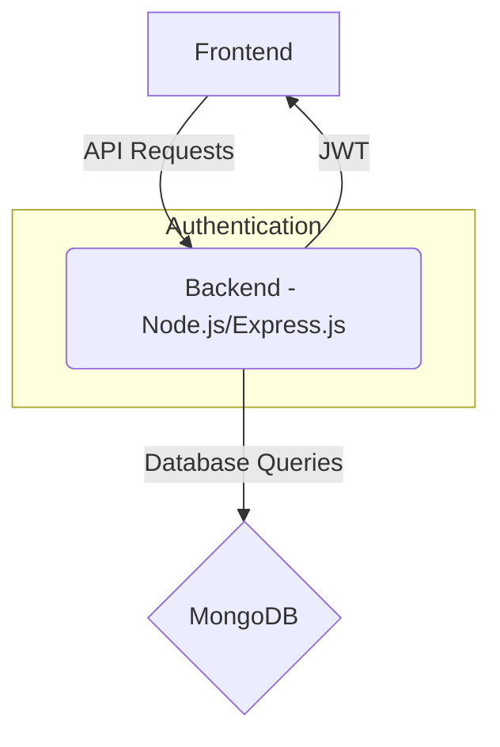
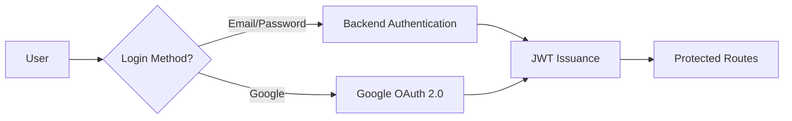

# Backend Authentication

<TOC />

## System Purpose

The backend authentication system manages user registration, login, logout, and authorization for accessing protected resources.  It supports both email/password-based authentication and Google OAuth 2.0.

* **User Registration:** Allows users to create new accounts using a chosen username and password. [backend/src/controllers/auth.controller.js](https://github.com/your-repo/blob/main/backend/src/controllers/auth.controller.js)
* **User Login:** Verifies user credentials (email and password or Google OAuth token) and issues a JWT (JSON Web Token) upon successful authentication.  [backend/src/controllers/auth.controller.js](https://github.com/your-repo/blob/main/backend/src/controllers/auth.controller.js)
* **User Logout:** Invalidates the user's session by clearing the JWT cookie. [backend/src/controllers/auth.controller.js](https://github.com/your-repo/blob/main/backend/src/controllers/auth.controller.js)
* **Authorization (Protected Routes):** Middleware verifies JWTs to protect sensitive routes, ensuring only authenticated users can access specific functionalities. [backend/src/middleware/auth.middleware.js](https://github.com/your-repo/blob/main/backend/src/middleware/auth.middleware.js)
* **Google OAuth 2.0:** Provides a convenient login option using existing Google accounts. [backend/src/lib/passport.config.js](https://github.com/your-repo/blob/main/backend/src/lib/passport.config.js), [backend/src/routes/auth.route.js](https://github.com/your-repo/blob/main/backend/src/routes/auth.route.js)
* **Username Availability Check:** Allows users to check if a desired username is available before registration. [backend/src/controllers/auth.controller.js](https://github.com/your-repo/blob/main/backend/src/controllers/auth.controller.js)
* **Profile Update:** Allows authenticated users to update their profile picture and username. [backend/src/controllers/auth.controller.js](https://github.com/your-repo/blob/main/backend/src/controllers/auth.controller.js)


## System Architecture Overview

The authentication system follows a three-tier architecture:

* **Presentation Tier:** The frontend (not included in these files) handles user interactions and communicates with the backend API.
* **Business Tier:** The backend (Node.js with Express.js) handles authentication logic, interacts with the database, and manages JWTs.
* **Data Tier:** MongoDB stores user data, including usernames, emails, passwords (hashed), profile pictures, and authentication provider information.





## Technology Stack

| Layer       | Technology             | Version (Example) | Purpose                                      |
|--------------|-------------------------|--------------------|----------------------------------------------|
| Backend     | Node.js                 | 16.x                | Server-side JavaScript runtime                |
|             | Express.js              | 4.x                | Web application framework                     |
|             | Passport.js             | 0.6.0              | Authentication middleware                      |
|             | Passport-Google-OAuth20 | ^2.0.0              | Google OAuth 2.0 strategy                    |
|             | Bcrypt                  | ^5.1.0              | Password hashing library                      |
| Database    | MongoDB                 | 6.x                | NoSQL document database                        |
| Other       | Cloudinary             | 1.34.0              | Image upload and management service           |
|             | JSON Web Tokens (JWT)   | N/A                 | Secure token for authentication and authorization |


```javascript
// Example from package.json (partial)
{
  "dependencies": {
    "bcrypt": "^5.1.0",
    "express": "^4.18.2",
    "passport": "^0.6.0",
    "passport-google-oauth20": "^2.0.0"
  }
}
```

## Core Application Features

* **Email/Password Authentication:**  Users can register with a unique email and password. The password is securely hashed using bcrypt before storage.

```javascript
// signup function (excerpt) from auth.controller.js
// [backend/src/controllers/auth.controller.js#L10-L35](https://github.com/your-repo/blob/main/backend/src/controllers/auth.controller.js#L10-L35)
const salt = await bcrypt.genSalt(10);
const hashedPassword = await bcrypt.hash(password, salt);

const newUser = new User({
    username,
    email,
    password: hashedPassword,
    authProvider: 'email'
});
```

* **JWT-based Authentication:** Upon successful login, a JWT is generated and sent to the client, stored in a cookie. Subsequent requests include this token for authorization.

```javascript
// generateToken function (excerpt, assuming this is a separate utils file)
// [backend/src/lib/utils.js](https://github.com/your-repo/blob/main/backend/src/lib/utils.js) // Replace with actual path if different
const token = jwt.sign({ userId: userId }, process.env.JWT_SECRET, { expiresIn: '1h' });
res.cookie("jwt", token, { httpOnly: true, sameSite: 'strict', secure: process.env.NODE_ENV === 'production' });
```

* **Google OAuth 2.0 Integration:** Users can sign in using their Google accounts. Passport.js handles the OAuth 2.0 flow.

```javascript
// googleAuthCallback function (excerpt) from auth.controller.js
// [backend/src/controllers/auth.controller.js#L137-L152](https://github.com/your-repo/blob/main/backend/src/controllers/auth.controller.js#L137-L152)

try {
    if (!req.user) {
        return res.redirect(`${frontendUrl}/login?error=google_auth_failed`);
    }

    generateToken(req.user._id, res);

    res.redirect(frontendUrl);

} catch (error) {
    console.error("Error in googleAuthCallback: ", error.message);
    res.redirect(`${frontendUrl}/login?error=google_auth_processing_error`);
}
```





## Project Structure

```
backend/
├── src/
│   ├── controllers/
│   │   └── auth.controller.js
│   ├── lib/
│   │   ├── cloudinary.js
│   │   └── passport.config.js
│   │   └── utils.js
│   ├── middleware/
│   │   └── auth.middleware.js
│   ├── models/
│   │   └── user.model.js
│   └── routes/
│       └── auth.route.js
└── ...
```


## Key Integration Points

* **State Management:** JWTs are used for managing the user's authenticated state. The frontend stores the JWT in a cookie (HTTP only).  The backend verifies the JWT in its middleware to protect routes.
* **API Flows:** The frontend makes API requests to the backend's `/signup`, `/login`, `/logout`, and other protected routes. The backend responds with appropriate JSON data, including JWTs for successful authentication.
* **Authentication:**  The system uses a combination of bcrypt for password hashing and JWTs for secure authentication and authorization.  Google OAuth 2.0 provides an alternative login method.
* **Database:** MongoDB stores user data.  The database schema includes fields for username, email, hashed password, profile picture, and other relevant user information.  Password hashing adds security, reducing risk from data breaches.


Next: [Backend Data Models](./2.2_backend_data_models.mdx)