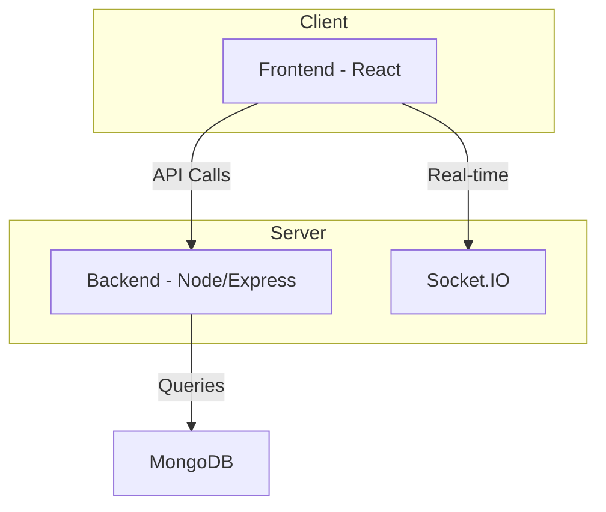
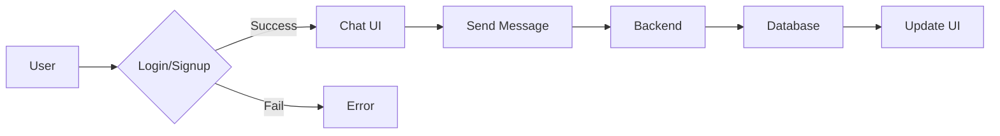

# Backend Data Models

<TOC />

## System Purpose

This backend system manages user accounts, handles real-time messaging, and facilitates friend requests.  The core functionalities include:

*   **User Registration and Authentication:** Allows users to create accounts, log in, and manage their profiles. [View on GitHub](https://github.com/GitDex-AI/backend/blob/main/backend/src/models/user.model.js)
*   **Real-time Messaging:** Enables users to send and receive text and image messages in real-time. [View on GitHub](https://github.com/GitDex-AI/backend/blob/main/backend/src/models/message.model.js)
*   **Friend Management:**  Supports adding friends, sending and receiving friend requests. [View on GitHub](https://github.com/GitDex-AI/backend/blob/main/backend/src/models/user.model.js)


## System Architecture Overview

The system follows a three-tier architecture:

*   **Presentation Tier:**  (Frontend) Handles user interface and interactions.
*   **Business Tier:** (Backend) Processes requests, manages business logic, and interacts with the database.
*   **Data Tier:** (Database) Stores persistent data.

Components interact as follows: the frontend sends requests to the backend, which processes the requests and interacts with the MongoDB database.  Real-time communication is handled through Socket.IO.





## Technology Stack

| Layer       | Technology         | Version     | Purpose                                      |
| :---------- | :----------------- | :---------- | :------------------------------------------- |
| Backend     | Node.js            | (See `package.json`) | Server-side JavaScript runtime environment      |
| Framework   | Express.js         | (See `package.json`) | Web application framework                      |
| Database    | MongoDB            | (See `package.json`) | NoSQL document database                         |
| ORM         | Mongoose           | (See `package.json`) | MongoDB object modeling tool                    |
| Real-time   | Socket.IO          | (See `package.json`) | Real-time bidirectional communication          |


```javascript
// package.json (excerpt)
{
  "dependencies": {
    "express": "^4.18.2",
    "mongoose": "^7.0.1",
    "socket.io": "^4.7.1"
  }
}
```

## Core Application Features

*   **Authentication:**  Uses email/password or Google OAuth for user authentication.  Password hashing is implemented for security.
*   **Media Sharing:** Allows users to send images within messages.
*   **Friend Requests:** Users can send and manage friend requests.

```javascript
// user.model.js (excerpt) - Authentication fields
{
    email: { 
        type: String,
        required: true,
        unique: true
    },
    password: {
        type: String,
        minlength: 6,
    },
    authProvider: {
        type: String,
        enum: ['email', 'google'],
        default: 'email'
    },
    googleId: {
        type: String,
        unique: true,
        sparse: true
    },
}
[View on GitHub](https://github.com/GitDex-AI/backend/blob/main/backend/src/models/user.model.js#L11-L27)
```

```javascript
// message.model.js (excerpt) - Media Sharing
{
    image: {
        type: String,
     },
}
[View on GitHub](https://github.com/GitDex-AI/backend/blob/main/backend/src/models/message.model.js#L16-L18)

```





## Project Structure

```
backend/
├── src/
│   ├── models/
│   │   └── user.model.js
│   │   └── message.model.js
│   └── ...
└── ...
```

The `src/models` directory contains Mongoose schemas for database interaction.  Other subdirectories house controllers, routes, and other backend logic.


## Key Integration Points

*   **State Management:**  The backend manages application state through database persistence.
*   **API Flows:**  The frontend communicates with the backend via RESTful APIs (e.g., POST /messages to send a message).
*   **Authentication:**  JWT (JSON Web Tokens) could be implemented for secure authentication and authorization (not shown in provided code).
*   **Database Interactions:** Mongoose handles interactions with the MongoDB database, ensuring data integrity and efficient querying.  The use of `timestamps: true` in both models automatically tracks creation and update times.  The `pre('save')` middleware in `user.model.js` handles cases where password is not required for Google OAuth logins and ensures that a password is required for email signup.


Next: [Frontend Development](./3_frontend.mdx)