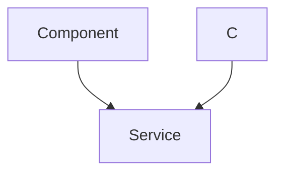

```mdx
---
title: "Backend Data Models"
description: "Explains the Mongoose schemas used for users and messages within the application."
sidebar_position: 22
---

# Backend Data Models
<TOC />

## Data Model Overview
This section details the Mongoose schemas for the core entities of the chat application: `User` and `Message`. These schemas define the structure and validation rules for data stored in the MongoDB database, underpinning user management, authentication, and real-time messaging capabilities. The design emphasizes clear relationships between users and messages, supporting features like friend management and secure authentication methods.

- **User Registration and Management**: The `User` model defines the necessary fields for user accounts, including email, username, password, and profile picture, along with advanced features like friend lists and authentication provider details.
- **Messaging Functionality**: The `Message` model captures essential message data, including sender, receiver, text content, and optional image attachments, ensuring that all communications are properly structured and linked to participating users.

## User Data Model
The `User` schema ([`user.model.js`](https://github.com/shinymack/Chat-App-MERN/blob/main/backend/src/models/user.model.js)) is central to managing user identities and relationships within the application. It includes fields for authentication, social features, and profile customization. This model supports both email/password-based authentication and third-party authentication like Google, providing flexibility for user onboarding.

### Key Fields of the User Schema
| Field | Type | Description | Constraints |
| :---- | :--- | :---------- | :---------- |
| `email` | `String` | User's email address | Required, Unique |
| `username` | `String` | Unique username | Required, Unique, Trimmed, Min 3, Max 20 chars |
| `password` | `String` | Hashed password | Min 6 chars (for email auth) |
| `profilePic` | `String` | URL to user's profile picture | Default empty string |
| `friends` | `Array<ObjectId>` | List of user IDs who are friends | Reference `User` model, Default empty array |
| `friendRequests` | `Array<ObjectId>` | List of user IDs who sent friend requests | Reference `User` model, Default empty array |
| `sentRequests` | `Array<ObjectId>` | List of user IDs to whom requests were sent | Reference `User` model, Default empty array |
| `authProvider` | `String` | Authentication method used | Enum: `email`, `google`, Default `email` |
| `googleId` | `String` | Google ID if authenticated via Google | Unique, Sparse |
| `timestamps` | `Boolean` | Adds `createdAt` and `updatedAt` | `true` |

```javascript
// backend/src/models/user.model.js
import mongoose from "mongoose"

const  userSchema = new mongoose.Schema(
    {
        email: { 
            type: String,
            required: true,
            unique: true
        },
        username: {
            type: String,
            required: [true, "Username is required"],
            unique: true,
            trim: true,
            minlength: [3, "Username must be at least 3 characters long"],
            maxlength: [20, "Username cannot be more than 20 characters long"]
        }
        // ... other fields
    },
    { 
        timestamps: true
    } 
);

// Pre-save hook for password handling based on authProvider
userSchema.pre('save', async function(next) {
    if (this.authProvider === 'google' && !this.isModified('password')) {
        this.password = undefined; // No password for Google authenticated users
    }
    if (this.authProvider === 'email' && !this.password && this.isNew) {
        return next(new Error('Password is required for email signup.'));
    }
    next();
});

const User = mongoose.model("User", userSchema);

export default User;
```
[View on GitHub](https://github.com/shinymack/Chat-App-MERN/blob/main/backend/src/models/user.model.js#L1-L60)

The `pre('save')` hook demonstrates a crucial security and validation practice. It ensures that users signing up via Google do not require a password (and clears it if set), while enforcing password requirements for email-based registrations. This separation of concerns is vital for robust authentication mechanisms.

## Message Data Model
The `Message` schema ([`message.model.js`](https://github.com/shinymack/Chat-App-MERN/blob/main/backend/src/models/message.model.js)) defines the structure for individual chat messages. It establishes a clear relationship between messages and the `User` model through `senderId` and `receiverId`, facilitating direct and group messaging capabilities.

### Key Fields of the Message Schema
| Field | Type | Description | Constraints |
| :---- | :--- | :---------- | :---------- |
| `senderId` | `ObjectId` | ID of the user who sent the message | Reference `User` model, Required |
| `receiverId` | `ObjectId` | ID of the user who received the message | Reference `User` model, Required |
| `text` | `String` | The textual content of the message | Optional |
| `image` | `String` | URL of an attached image | Optional |
| `timestamps` | `Boolean` | Adds `createdAt` and `updatedAt` | `true` |

```javascript
// backend/src/models/message.model.js
import mongoose from "mongoose";

const messageSchema = new mongoose.Schema(
    {
     senderId: {
        type: mongoose.Schema.Types.ObjectId,
        ref: "User",
        required: true,
     },
     receiverId: {
        type: mongoose.Schema.Types.ObjectId,
        ref: "User",
        required: true,
     },
     text: {
        type: String,
     },
     image: {
        type: String,
     },
    },
    {timestamps: true}
);

export default mongoose.model("Message", messageSchema);
```
[View on GitHub](https://github.com/shinymack/Chat-App-MERN/blob/main/backend/src/models/message.model.js#L1-L26)

The use of `mongoose.Schema.Types.ObjectId` with `ref: "User"` in both `senderId` and `receiverId` fields is crucial for establishing strong relationships between messages and users. This allows Mongoose to automatically populate user details when querying messages, simplifying data retrieval and maintaining data integrity.

## Data Model Relationships
The relationships between the `User` and `Message` models are fundamental to the chat application's functionality. This relational design ensures that user profiles are linked to their messages and that social interactions like friend requests are properly tracked.





This class diagram illustrates:
- A `User` can send multiple `Message`s (`senderId`).
- A `User` can receive multiple `Message`s (`receiverId`).
- `User`s can have `friends`, `friendRequests`, and `sentRequests`, all of which are references to other `User`s.

## Key Integration Points
The defined data models are the backbone for several critical application functionalities:

-   **Authentication & Authorization**: The `User` model dictates how users are stored and retrieved during login, registration, and session management. The `authProvider` and `googleId` fields allow for flexible authentication strategies.
-   **Real-time Messaging**: The `Message` model directly supports the core chat functionality. When a message is sent via Socket.IO, it is persisted to the database according to this schema, ensuring message history is maintained. The `senderId` and `receiverId` are essential for routing messages and displaying conversations.
-   **User Relationships and Social Features**: The `friends`, `friendRequests`, and `sentRequests` arrays within the `User` model enable the complex logic required for adding friends, accepting requests, and displaying friend lists. This design promotes a scalable approach to social interactions within the application.
-   **Scalability and Performance**: By using `ObjectId` references, Mongoose can efficiently query related data without embedding large documents, which can be beneficial for performance as the database grows. The `timestamps` option in both schemas is crucial for auditing and sorting data.

**Best Practices**:
-   **Normalization**: The separation of `User` and `Message` into distinct collections with references (`ObjectId`) is a good example of normalization, reducing data redundancy and improving data integrity.
-   **Schema Validation**: The use of `required`, `unique`, `minlength`, `maxlength`, and `enum` in schema definitions enforces data consistency at the database level, preventing invalid data from being stored.
-   **Pre-save Hooks**: Utilizing Mongoose pre-save hooks (as seen in `user.model.js`) for business logic like conditional password handling or data transformation is an effective way to encapsulate logic close to the data model.

Next: [Authentication & Authorization](./2.3_authentication_authorization.mdx)
```