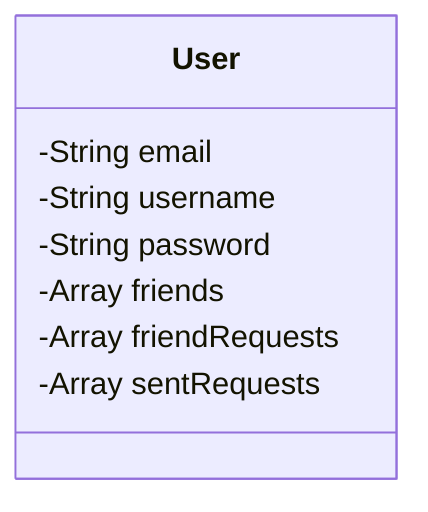
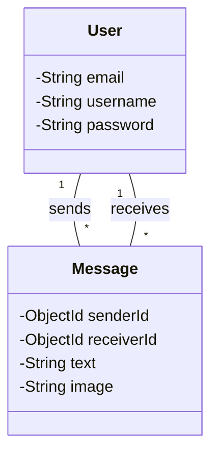

# Backend Database and Models

<TOC />

This document details the backend database schema and models for the chat application.  We utilize Mongoose, an Object Data Modeling (ODM) library for MongoDB, to interact with the database.  The schema defines the structure of our data, while the models provide an interface for creating, reading, updating, and deleting data.

## Database Connection

The application connects to a MongoDB database using the `connectDB` function in `backend/src/lib/db.js`.  This function utilizes environment variables to maintain security and flexibility.

```javascript
import mongoose from "mongoose"

export const connectDB = async () => {
  try {
    const conn = await mongoose.connect(process.env.MONGODB_URI);
    console.log(`MongoDB connected:  ${conn.connection.host}`);
  }
  catch(error){
    console.log("MongoDB connection error: ", error);
  }
}
```
[Source](https://github.com/shinymack/Chat-App-MERN/blob/main/backend/src/lib/db.js)

This code asynchronously connects to the MongoDB instance specified by the `MONGODB_URI` environment variable.  Error handling is included to gracefully manage connection failures.  The connection string is kept out of the code and stored as an environment variable to prevent accidental exposure.  Upon successful connection, a confirmation message is logged to the console.


`

```mermaid
graph TD
    A[Application] --> B{connectDB()};
    B -- Success --> C[MongoDB];
    B -- Failure --> D[Error Handling];
```


## User Model

The `User` model, defined in `backend/src/models/user.model.js`, represents users within the application. It includes fields for email, username, password, profile picture, friends, friend requests, sent requests, and authentication provider information.

```javascript
import mongoose from "mongoose"

const  userSchema = new mongoose.Schema(
    {
        email: { 
            type: String,
            required: true,
            unique: true
        },
        username: {
            type: String,
            required: [true, "Username is required"],
            unique: true,
            trim: true,
            minlength: [3, "Username must be at least 3 characters long"],
            maxlength: [20, "Username cannot be more than 20 characters long"]
        },
        password: {
            type: String,
            minlength: 6,
        },
        // ... other fields
    },
    { 
        timestamps: true
    } 
);

// ... pre save hook ...

const User = mongoose.model("User", userSchema);

export default User;
```
[Source](https://github.com/shinymack/Chat-App-MERN/blob/main/backend/src/models/user.model.js)

The schema utilizes various validators to ensure data integrity, including `required`, `unique`, `trim`, `minlength`, and `maxlength` for the username field.  The `timestamps` option automatically adds `createdAt` and `updatedAt` fields.  The `pre('save', ...)` hook handles password management for different authentication providers.  If the user signs up with Google, the password field will be undefined; otherwise, it is required for email signup.


### User Model Relationships

The `User` model includes arrays to manage relationships between users:

*   `friends`: An array of `ObjectId`s referencing other `User` documents, representing the user's friends.
*   `friendRequests`: An array of `ObjectId`s referencing `User` documents, representing incoming friend requests.
*   `sentRequests`: An array of `ObjectId`s referencing `User` documents, representing outgoing friend requests.

This embedded array approach is efficient for managing relationships, particularly when the number of friends and friend requests remains relatively small.

`




## Message Model

The `Message` model, defined in `backend/src/models/message.model.js`, represents individual chat messages.

```javascript
import mongoose from "mongoose";

const messageSchema = new mongoose.Schema(
    {
     senderId: {
        type: mongoose.Schema.Types.ObjectId,
        ref: "User",
        required: true,
     },
     receiverId: {
        type: mongoose.Schema.Types.ObjectId,
        ref: "User",
        required: true,
     },
     text: {
        type: String,
     },
     image: {
        type: String,
     },
    },
    {timestamps: true}
);

export default mongoose.model("Message", messageSchema);
```
[Source](https://github.com/shinymack/Chat-App-MERN/blob/main/backend/src/models/message.model.js)

The `senderId` and `receiverId` fields are `ObjectId`s referencing the `User` model, establishing a relationship between messages and users.  The `text` and `image` fields store the message content and optional image URLs respectively. The `timestamps` option adds `createdAt` and `updatedAt` fields, useful for tracking message history.


### Message Model Relationships

The `Message` model utilizes `ObjectId`s to reference the `User` model, creating a one-to-many relationship.  Multiple messages can belong to a single user (both as a sender and receiver).


`




##  Overall System Architecture

The following diagram illustrates the interaction between the application, the database connection, and the models.


`

```mermaid
graph TD
    A[Application] --> B{connectDB()};
    B -- Success --> C[MongoDB];
    C --> D[User Model];
    C --> E[Message Model];
    A --> D;
    A --> E;
    D -.-> E; //Relationship between User and Message models
    B -- Failure --> F[Error Handling];
```


Next: [Frontend Development](./3_frontend.mdx)