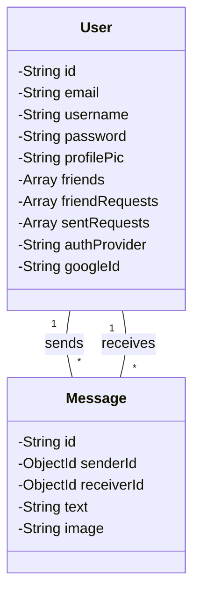

# Backend Database

<TOC />

## System Purpose

This document details the backend database schema and data models for a MERN stack application.  The database stores user information, messages, and manages friend relationships.  The primary technology used is MongoDB with Mongoose as the ODM (Object Data Modeling) layer. This choice is driven by MongoDB's scalability and flexibility for handling both structured and unstructured data, making it suitable for the dynamic nature of a chat application.


### Key Features

* **Scalability:** MongoDB's architecture allows for easy scaling to accommodate a growing number of users and messages.
* **Flexibility:** The schema design allows for easy addition of new fields and features as the application evolves.
* **Data Integrity:**  Mongoose schema validation ensures data consistency and prevents invalid data from entering the database.
* **Data Relationships:**  The use of `ObjectId` references enables efficient management of relationships between users and messages.


## Database Connection

The application connects to the MongoDB database using the `mongoose` library. The connection is established asynchronously to avoid blocking the main thread.  Error handling is implemented to gracefully manage connection failures.

```javascript
// backend/src/lib/db.js#L1-L11
import mongoose from "mongoose"

export const connectDB = async () => {
  try {
    const conn = await mongoose.connect(process.env.MONGODB_URI);
    console.log(`MongoDB connected:  ${conn.connection.host}`);
  }
  catch(error){
    console.log("MongoDB connection error: ", error);
  }
}
```

This code snippet shows the core logic for connecting to the MongoDB database. The `MONGODB_URI` environment variable holds the connection string.  The `try...catch` block handles potential errors during connection.


## User Model ([backend/src/models/user.model.js](https://github.com/shinymack/Chat-App-MERN/blob/main/backend/src/models/user.model.js))

The `User` model defines the structure for user data.  It includes fields for email, username, password, profile picture, friends list, friend requests (incoming and outgoing), and authentication provider information (email or Google).

```javascript
// backend/src/models/user.model.js#L1-L51
import mongoose from "mongoose"

const  userSchema = new mongoose.Schema(
    {
        email: { 
            type: String,
            required: true,
            unique: true
        },
        username: {
            type: String,
            required: [true, "Username is required"],
            unique: true,
            trim: true,
            minlength: [3, "Username must be at least 3 characters long"],
            maxlength: [20, "Username cannot be more than 20 characters long"]
        }
        ,
        password: {
            type: String,
            minlength: 6,
        },
        profilePic: {
            type: String,
            default: "",
        },
        friends: [{
            type: mongoose.Schema.Types.ObjectId,
            ref: "User",
            default: [] 
        }],
        friendRequests: [{ 
            type: mongoose.Schema.Types.ObjectId,
            ref: "User",
            default: []
        }],
        sentRequests: [{ 
            type: mongoose.Schema.Types.ObjectId,
            ref: "User",
            default: []
        }],
        authProvider: {
            type: String,
            enum: ['email', 'google'],
            default: 'email'
        },
        googleId: {
            type: String,
            unique: true,
            sparse: true
        },
    },
    { 
        timestamps: true
    } 
);


```

The `pre('save')` middleware ensures that passwords are handled correctly depending on the authentication provider. For Google authentication, the password field is left undefined. For email signup, a password is required.  This demonstrates a separation of concerns, keeping authentication logic within the model.


## Message Model ([backend/src/models/message.model.js](https://github.com/shinymack/Chat-App-MERN/blob/main/backend/src/models/message.model.js))

The `Message` model represents individual messages exchanged between users.  It contains the `senderId`, `receiverId`, `text`, and an optional `image` field.


```javascript
// backend/src/models/message.model.js#L1-L27
import express from "express";
import mongoose from "mongoose";

const messageSchema = new mongoose.Schema(
    {
     senderId: {
        type: mongoose.Schema.Types.ObjectId,
        ref: "User",
        required: true,
     },
     receiverId: {
        type: mongoose.Schema.Types.ObjectId,
        ref: "User",
        required: true,
     },
     text: {
        type: String,
     },
     image: {
        type: String,
     },
    },
    {timestamps: true}
);

export default mongoose.model("Message", messageSchema);
```

The use of `mongoose.Schema.Types.ObjectId` and `ref: "User"` establishes a relationship with the `User` model, allowing efficient querying and retrieval of sender and receiver information. The `timestamps` option automatically adds `createdAt` and `updatedAt` fields.


## Data Model Relationships

The `User` and `Message` models are interconnected through `ObjectId` references.  A `Message` document references two `User` documents (sender and receiver).  The `User` model includes arrays for friends, incoming friend requests, and outgoing friend requests, further illustrating relationships within the database.





## Key Integration Points and Insights

* **Authentication:** The `authProvider` field in the `User` model facilitates different authentication methods (email, Google).
* **Real-time updates:** The database structure supports efficient querying for new messages.  Real-time features likely involve a separate mechanism (e.g., WebSockets) to push updates to clients.
* **Data Validation:** Mongoose's schema validation helps maintain data integrity and consistency.


Next: [Frontend Development](./3_frontend.mdx)