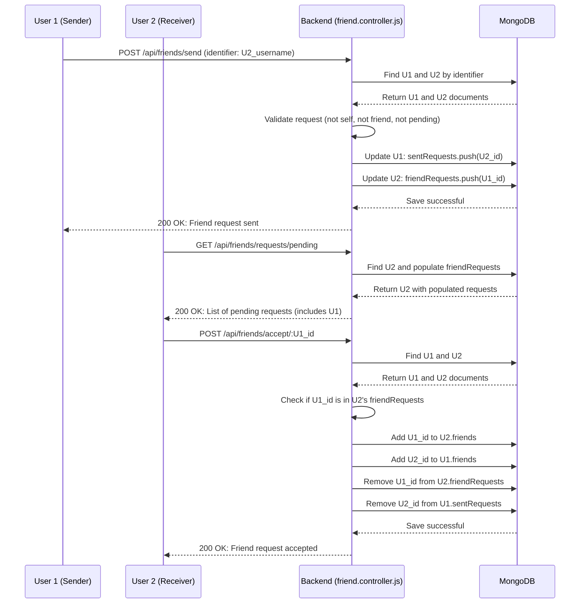

# Messaging & Friend Management

<TOC />

This section details the backend mechanisms for managing user interactions, encompassing real-time messaging, conversation retrieval, and the complete lifecycle of friend relationships—from sending requests to accepting, rejecting, and removing friends. These features are critical for building a social application, ensuring users can connect and communicate effectively.

## System Purpose

The core purpose of this module is to facilitate seamless communication and social networking within the application. It provides robust API endpoints and business logic for:
- **Real-time Messaging:** Enabling users to send and receive messages instantly.
- **Conversation Management:** Storing and retrieving message history between users.
- **Friendship Management:** Allowing users to establish and manage friend connections, including request handling.

This design emphasizes scalability and maintainability by separating concerns, with dedicated controllers for messaging and friend-related operations, interacting with respective Mongoose models.

### Key Features

*   **Real-time Messaging:** Leverages WebSockets for instant message delivery and display.
*   **Persistent Message Storage:** Stores all messages in a MongoDB database for historical access.
*   **Image Sharing:** Supports sending messages with attached images via Cloudinary integration.
*   **Friend Request System:** Implements a full lifecycle for friend requests (send, accept, reject).
*   **Friend List Management:** Allows users to view their friends and remove existing friendships.
*   **Pending Request Tracking:** Provides endpoints to view both sent and received friend requests.
*   **User Discovery for Chat:** Enables users to find other users for initiating conversations, excluding themselves.

## Architectural Overview

The messaging and friend management functionalities are integrated into the backend API using Express.js. Data persistence is handled by MongoDB, accessed through Mongoose models. Real-time features are powered by Socket.IO.


```mermaid
graph TD
    A[Client Application] --> B(API Gateway / Load Balancer)
    B --> C{Express.js Backend}
    C --> D[Authentication Middleware]
    D --> E[Message Controller]
    D --> F[Friend Controller]
    E --> G[Message Model]
    F --> H[User Model]
    G --> I(MongoDB Database)
    H --> I
    E --> J[Cloudinary (Image Upload)]
    E --> K[Socket.IO Server]
    A --> K
    K --> A
```


## Messaging Subsystem

The messaging subsystem handles all operations related to sending, receiving, and displaying messages between users. It uses Mongoose models for data storage and Socket.IO for real-time updates.

### Message Model

The `Message` Mongoose schema ([backend/src/models/message.model.js](https://github.com/shinymack/Chat-App-MERN/blob/main/backend/src/models/message.model.js)) defines the structure for individual messages.

```javascript
// backend/src/models/message.model.js
const messageSchema = new mongoose.Schema(
    {
     senderId: {
        type: mongoose.Schema.Types.ObjectId,
        ref: "User",
        required: true,
     },
     receiverId: {
        type: mongoose.Schema.Types.ObjectId,
        ref: "User",
        required: true,
     },
     text: {
        type: String,
     },
     image: {
        type: String,
     },
    },
    {timestamps: true}
);

export default mongoose.model("Message", messageSchema);
```

#### Schema Breakdown:
*   `senderId` (ObjectId, ref: "User", required): The ID of the user who sent the message.
*   `receiverId` (ObjectId, ref: "User", required): The ID of the user who is intended to receive the message.
*   `text` (String): The textual content of the message. This field is optional, allowing for image-only messages.
*   `image` (String): The URL of an uploaded image, if the message contains one. Optional.
*   `timestamps` (Boolean): Mongoose automatically adds `createdAt` and `updatedAt` fields.

This design ensures that each message is linked to both a sender and a receiver, facilitating conversation retrieval and maintaining data integrity.

### Message Controller

The `message.controller.js` ([backend/src/controllers/message.controller.js](https://github.com/shinymack/Chat-App-MERN/blob/main/backend/src/controllers/message.controller.js)) contains the logic for handling message-related API requests.

#### `getUsersForSidebar`

This function retrieves a list of all users in the system, excluding the currently logged-in user. This is typically used to populate a sidebar or a list where the user can select someone to chat with.

```javascript
// backend/src/controllers/message.controller.js#L5-L13
export const getUsersForSidebar = async (req, res) => {
    try {
        const loggedInUserId = req.user._id;
        const filteredUsers = await User.find({
            _id: { $ne: loggedInUserId }}).select("-password");  
        res.status(200).json(filteredUsers);
    }
    catch (error) {
        console.log("Error in getUsersForSidebar: ", error);
        res.status(500).json({ error: "Internal Server Error" });
    }
};
```

**Insights:** This endpoint efficiently fetches potential chat partners by excluding the active user and sensitive password information, prioritizing privacy and performance.

#### `getMessages`

Fetches all messages exchanged between the logged-in user and a specific `userToChatId`. It queries messages where either user is the sender and the other is the receiver.

```javascript
// backend/src/controllers/message.controller.js#L15-L29
export const getMessages = async (req, res) => {
    try {
        const {id : userToChatId } = req.params;
        const myId = req.user._id;

        const messages = await Message.find({
            $or: [
                {senderId: myId, receiverId:userToChatId},
                {senderId: userToChatId, receiverId: myId}
            ]
        });
        res.status(200).json(messages);
    } catch (error) {
        console.log("Error in getMessages controller:  ", error);
        res.status(500).json({ error: "Internal Server Error" });
    }
};
```

**Design Rationale:** Using `$or` ensures that messages are retrieved regardless of who initiated the conversation, providing a complete chat history.

#### `sendMessage`

Handles sending a new message. It supports both text and image messages. If an image is provided, it's uploaded to Cloudinary, and its secure URL is stored. After saving the message, it uses Socket.IO to emit the new message to the receiver in real-time if they are connected.

```javascript
// backend/src/controllers/message.controller.js#L31-L61
export const sendMessage = async (req, res) => {
    try {
        const { text, image } = req.body;
        const { id: receiverId } = req.params;
        const senderId = req.user._id;

        let imageUrl;
        if (image) {
            const uploadResponse = await cloudinary.uploader.upload(image);

            imageUrl = uploadResponse.secure_url;
        }
        const newMessage = new Message({
            senderId,
            receiverId,
            text,
            image: imageUrl,
        });

        await newMessage.save();

        const receiverSocketId = getReceiverSocketId(receiverId);

        if(receiverSocketId) {
            io.to(receiverSocketId).emit("newMessage", newMessage);
        }

        res.status(201).json(newMessage);   
        
    } catch (error) {
        console.log("Error in sendMessage controller:  ", error);
        res.status(500).json({ error: "Internal Server Error" });
    }
};
```

**Key Interactions:** This function demonstrates a crucial interaction between the database (Mongoose `Message` model), a third-party service (Cloudinary), and the real-time communication layer (Socket.IO).

### Message Routes

The `message.route.js` ([backend/src/routes/message.route.js](https://github.com/shinymack/Chat-App-MERN/blob/main/backend/src/routes/message.route.js)) defines the API endpoints for messaging, each protected by `auth.middleware.js`.

```javascript
// backend/src/routes/message.route.js
import express from "express"
import { protectRoute } from "../middleware/auth.middleware.js";
import { getUsersForSidebar, getMessages, sendMessage } from "../controllers/message.controller.js";
const router = express.Router();

router.get("/users", protectRoute, getUsersForSidebar);
router.get("/:id", protectRoute, getMessages);
router.post("/send/:id", protectRoute, sendMessage);

export default router;
```

#### Endpoints:
*   `GET /api/messages/users`: Retrieves users for the chat sidebar.
*   `GET /api/messages/:id`: Retrieves messages for a specific conversation.
*   `POST /api/messages/send/:id`: Sends a new message to a specified user.

## Friend Management Subsystem

The friend management subsystem handles all operations related to establishing, maintaining, and dissolving friendships between users. This involves managing friend requests and friend lists on the `User` model.

### Friend Controller

The `friend.controller.js` ([backend/src/controllers/friend.controller.js](https://github.com/shinymack/Chat-App-MERN/blob/main/backend/src/controllers/friend.controller.js)) contains the comprehensive logic for handling friend-related actions. It interacts with the `User` model to update friendship statuses.

#### `sendFriendRequest`

Allows a user to send a friend request to another user identified by username or email. It includes checks to prevent sending requests to oneself, existing friends, or if a request is already pending.

```javascript
// backend/src/controllers/friend.controller.js#L9-L55
export const sendFriendRequest = async (req, res) => {
    try {
        const { identifier } = req.body; // Expecting { identifier: "some_username_or_email" }
        const senderId = req.user._id;

        if (!identifier) {
            return res.status(400).json({ message: "Username or email is required." });
        }

        const receiver = await User.findOne({
            $or: [{ username: identifier }, { email: identifier }]
        });

        if (!receiver) {
            return res.status(404).json({ message: "User not found." });
        }
        
        const receiverId = receiver._id;

        if (senderId.toString() === receiverId.toString()) {
            return res.status(400).json({ message: "You cannot send a friend request to yourself." });
        }

        const sender = await User.findById(senderId);

        if (sender.friends.includes(receiverId)) {
            return res.status(400).json({ message: "You are already friends with this user." });
        }
        if (sender.sentRequests.includes(receiverId)) {
            return res.status(400).json({ message: "Friend request already sent." });
        }
        if (sender.friendRequests.includes(receiverId)) {
            return res.status(400).json({ message: "This user has already sent you a friend request." });
        }

        sender.sentRequests.push(receiverId);
        receiver.friendRequests.push(senderId);

        await sender.save();
        await receiver.save();

        res.status(200).json({ message: "Friend request sent successfully." });

    } catch (error) {
        console.error("Error in sendFriendRequest: ", error.message);
        res.status(500).json({ message: "Internal server error", error: error.message });
    }
};
```

**Best Practices:** Robust pre-checks (self-request, existing friendship, pending requests) are essential for a smooth user experience and data consistency.

#### `acceptFriendRequest`

Processes the acceptance of a friend request. It moves the `senderId` from `friendRequests` to `friends` for both users and updates `sentRequests` accordingly.

```javascript
// backend/src/controllers/friend.controller.js#L58-L96
export const acceptFriendRequest = async (req, res) => {
    try {
        const { senderId } = req.params; // ID of the user who sent the request
        const receiverId = req.user._id; // Current user accepting the request

        const sender = await User.findById(senderId);
        const receiver = await User.findById(receiverId);

        if (!sender || !receiver) {
            return res.status(404).json({ message: "User not found." });
        }

        if (!receiver.friendRequests.includes(senderId)) {
            return res.status(400).json({ message: "Friend request not found or already handled." });
        }

        receiver.friends.push(senderId);
        sender.friends.push(receiverId);

        receiver.friendRequests = receiver.friendRequests.filter(id => id.toString() !== senderId.toString());
        sender.sentRequests = sender.sentRequests.filter(id => id.toString() !== receiverId.toString());

        await receiver.save();
        await sender.save();

        res.status(200).json({ message: "Friend request accepted." });

    } catch (error) {
        console.error("Error in acceptFriendRequest: ", error.message);
        res.status(500).json({ message: "Internal server error", error: error.message });
    }
};
```

#### `rejectFriendRequest`

Handles the rejection of a friend request by removing the `senderId` from the receiver's `friendRequests` and the receiver's ID from the sender's `sentRequests`.

```javascript
// backend/src/controllers/friend.controller.js#L99-L135
export const rejectFriendRequest = async (req, res) => {
    try {
        const { senderId } = req.params; // ID of the user whose request is being rejected
        const receiverId = req.user._id; // Current user rejecting the request

        const sender = await User.findById(senderId);
        const receiver = await User.findById(receiverId);

        if (!sender || !receiver) {
            return res.status(404).json({ message: "User not found." });
        }

        const initialReceiverRequestsCount = receiver.friendRequests.length;
        receiver.friendRequests = receiver.friendRequests.filter(id => id.toString() !== senderId.toString());

        const initialSenderSentCount = sender.sentRequests.length;
        sender.sentRequests = sender.sentRequests.filter(id => id.toString() !== receiverId.toString());

        if (receiver.friendRequests.length === initialReceiverRequestsCount && sender.sentRequests.length === initialSenderSentCount) {
             return res.status(400).json({ message: "Friend request not found or already handled." });
        }

        await receiver.save();
        await sender.save();

        res.status(200).json({ message: "Friend request rejected." });

    } catch (error) {
        console.error("Error in rejectFriendRequest: ", error.message);
        res.status(500).json({ message: "Internal server error", error: error.message });
    }
};
```

#### `removeFriend`

Allows a user to remove an existing friend. It updates the `friends` list for both users involved.

```javascript
// backend/src/controllers/friend.controller.js#L138-L170
export const removeFriend = async (req, res) => {
    try {
        const { friendId } = req.params;
        const userId = req.user._id;

        const user = await User.findById(userId);
        const friendToRemove = await User.findById(friendId);

        if (!user || !friendToRemove) {
            return res.status(404).json({ message: "User not found." });
        }

        if (!user.friends.includes(friendId)) {
            return res.status(400).json({ message: "This user is not in your friends list." });
        }

        user.friends = user.friends.filter(id => id.toString() !== friendId.toString());
        friendToRemove.friends = friendToRemove.friends.filter(id => id.toString() !== userId.toString());

        await user.save();
        await friendToRemove.save();

        res.status(200).json({ message: "Friend removed successfully." });

    } catch (error) {
        console.error("Error in removeFriend: ", error.message);
        res.status(500).json({ message: "Internal server error", error: error.message });
    }
};
```

#### `getFriends`, `getPendingRequests`, `getSentRequests`

These functions retrieve lists of friends, received friend requests, and sent friend requests, respectively. They use Mongoose's `populate` feature to fetch details of the associated users, such as `username`, `email`, and `profilePic`.

```javascript
// backend/src/controllers/friend.controller.js#L173-L239
// Example: getFriends
export const getFriends = async (req, res) => {
    try {
        const userId = req.user._id;
        const user = await User.findById(userId).populate({
            path: "friends",
            select: "username email profilePic _id" 
        });

        if (!user) {
            return res.status(404).json({ message: "User not found." });
        }

        res.status(200).json(user.friends);

    } catch (error) {
        console.error("Error in getFriends: ", error.message);
        res.status(500).json({ message: "Internal server error", error: error.message });
    }
};
```

**Key Insight:** The use of `populate` is crucial here, as it automatically replaces the `ObjectId` references in the `friends`, `friendRequests`, and `sentRequests` arrays with actual `User` documents, allowing the frontend to display rich user information without additional lookups. The `select` option further optimizes data transfer by fetching only necessary fields.

### Friend Management Flow

The following diagram illustrates the typical flow for sending and accepting a friend request.





## Integration Points & Best Practices

*   **Authentication:** All API routes related to messaging and friend management are protected by `protectRoute` middleware, ensuring that only authenticated users can perform these actions. This is a fundamental security practice.
*   **Error Handling:** Each controller function includes `try-catch` blocks to gracefully handle errors, logging them and returning informative 500 Internal Server Error responses.
*   **Data Validation:** Basic validation is performed, such as checking for the presence of identifiers in friend requests. More extensive schema-level validation or middleware-based validation could be added for stricter data integrity.
*   **Scalability for Social Features:** Storing friend relationships directly in user documents (arrays of ObjectIds) is efficient for small to medium-scale applications. For very large social graphs, a dedicated relationship collection might offer better performance for complex queries, but for this application, the current approach is sufficient and simpler.
*   **Real-time Feedback:** The integration of Socket.IO for `sendMessage` provides immediate feedback to the receiver, enhancing the user experience. This real-time aspect is crucial for a modern chat application.

Next: [Frontend Development](./3_frontend_development.mdx)