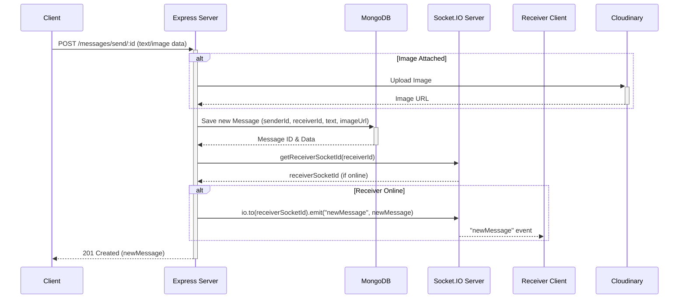

# Messaging & Friends Management
<TOC />

## System Purpose

This section details the core backend functionalities dedicated to facilitating user interactions through messaging and comprehensive friend management. It outlines the robust mechanisms for handling real-time communication, establishing and managing social connections within the application.

*   **Friend Request Lifecycle**: Enables users to send, accept, reject, and withdraw friend requests, managing the full spectrum of social connections. The logic for these operations resides in [friend.controller.js](https://github.com/shinymack/Chat-App-MERN/blob/main/backend/src/controllers/friend.controller.js).
*   **Friend Management**: Provides functionalities to view existing friends, list pending incoming requests, list outgoing sent requests, and remove friends. These endpoints leverage advanced Mongoose population capabilities to fetch associated user data. Handled by [friend.controller.js](https://github.com/shinymack/Chat-App-MERN/blob/main/backend/src/controllers/friend.controller.js).
*   **Real-time Messaging**: Facilitates instant, bi-directional text and image communication between users. This includes fetching past messages for a conversation and broadcasting new messages in real-time. The core logic is defined in [message.controller.js](https://github.com/shinymack/Chat-App-MERN/blob/main/backend/src/controllers/message.controller.js).
*   **Message Persistence**: Ensures all messages, including text and image references, are durably stored for chat history retrieval. The data model for messages is established in [message.model.js](https://github.com/shinymack/Chat-App-MERN/blob/main/backend/src/models/message.model.js).
*   **User Discovery**: Provides an endpoint to list other users available for chat, excluding the currently logged-in user, essential for initiating new conversations. This is part of [message.controller.js](https://github.com/shinymack/Chat-App-MERN/blob/main/backend/src/controllers/message.controller.js).

## System Architecture Overview

The Messaging & Friends Management system is built upon a robust architecture that integrates various backend components to provide real-time and persistent interaction features. The client-side application communicates with the backend server via a RESTful API for standard operations like friend request management and message history retrieval. For real-time messaging, a dedicated Socket.IO server runs alongside the Express.js server, enabling instant message delivery. All user data, friend relationships, and message content are stored in a MongoDB database, managed through Mongoose. Image attachments in messages are offloaded to Cloudinary for efficient storage and delivery.


```mermaid
graph TD
  C[Client Application] -->|HTTP/REST API| B[Backend Server - Express.js]
  B -->|Data Persistence (Mongoose)| M[MongoDB]
  B -->|Real-time Communication| S[Socket.IO Server]
  S -->|Real-time Updates| C
  B -->|Image Uploads & Storage| CL[Cloudinary]
```


*Architecture Diagram: Visualizing the interaction between client, backend, database, real-time server, and external media storage.*

## Technology Stack

The backend components for messaging and friends management leverage a set of modern technologies to ensure performance, scalability, and maintainability.

| Layer               | Technology       | Purpose                                                    |
| :------------------ | :--------------- | :--------------------------------------------------------- |
| **Backend Runtime** | Node.js          | JavaScript runtime environment for server-side logic.      |
| **Web Framework**   | Express.js       | Provides robust API endpoints for handling HTTP requests. |
| **Database**        | MongoDB          | NoSQL database for flexible and scalable data storage.     |
| **ODM**             | Mongoose         | Object Data Modeling library for MongoDB, simplifying data interactions. |
| **Real-time**       | Socket.IO        | Enables low-latency, bi-directional communication for instant messaging. |
| **Cloud Storage**   | Cloudinary       | Manages efficient storage, optimization, and delivery of image assets. |
| **Authentication**  | JSON Web Tokens  | Secures API endpoints, verifying user identity for protected routes. |

*Note: As `package.json` was not provided, specific versions for these technologies are not listed.*

## Core Application Features

### Friend Management Functionality

The `friend.controller.js` file orchestrates all friend-related operations, ensuring proper validation and atomic updates to user profiles. Each action is carefully designed to maintain data consistency across user relationships.

*   **Sending Friend Requests**:
    Users can send friend requests to others using their username or email. The system validates against self-requests, existing friendships, and duplicate requests (both sent and received).
    ```javascript
    // File: backend/src/controllers/friend.controller.js
    export const sendFriendRequest = async (req, res) => {
        try {
            const { identifier } = req.body;
            const senderId = req.user._id;

            if (!identifier) {
                return res.status(400).json({ message: "Username or email is required." });
            }

            const receiver = await User.findOne({
                $or: [{ username: identifier }, { email: identifier }]
            });

            if (!receiver) {
                return res.status(404).json({ message: "User not found." });
            }
            
            const receiverId = receiver._id;

            if (senderId.toString() === receiverId.toString()) {
                return res.status(400).json({ message: "You cannot send a friend request to yourself." });
            }

            const sender = await User.findById(senderId);

            if (sender.friends.includes(receiverId)) {
                return res.status(400).json({ message: "You are already friends with this user." });
            }
            if (sender.sentRequests.includes(receiverId)) {
                return res.status(400).json({ message: "Friend request already sent." });
            }
            if (sender.friendRequests.includes(receiverId)) {
                return res.status(400).json({ message: "This user has already sent you a friend request." });
            }

            sender.sentRequests.push(receiverId);
            receiver.friendRequests.push(senderId);

            await sender.save();
            await receiver.save();

            res.status(200).json({ message: "Friend request sent successfully." });

        } catch (error) {
            console.error("Error in sendFriendRequest: ", error.message);
            res.status(500).json({ message: "Internal server error", error: error.message });
        }
    };
    ```
    [View on GitHub](https://github.com/shinymack/Chat-App-MERN/blob/main/backend/src/controllers/friend.controller.js#L14-L59)
    This snippet shows the comprehensive validation logic to prevent invalid or duplicate friend requests, ensuring a clean and consistent state for user relationships.

*   **Accepting Friend Requests**:
    When a user accepts a request, both their `friends` lists are updated, and the request is removed from both the sender's `sentRequests` and receiver's `friendRequests` arrays.
    ```javascript
    // File: backend/src/controllers/friend.controller.js
    export const acceptFriendRequest = async (req, res) => {
        try {
            const { senderId } = req.params;
            const receiverId = req.user._id;

            const sender = await User.findById(senderId);
            const receiver = await User.findById(receiverId);

            if (!sender || !receiver) {
                return res.status(404).json({ message: "User not found." });
            }

            if (!receiver.friendRequests.includes(senderId)) {
                return res.status(400).json({ message: "Friend request not found or already handled." });
            }

            receiver.friends.push(senderId);
            sender.friends.push(receiverId);

            receiver.friendRequests = receiver.friendRequests.filter(id => id.toString() !== senderId.toString());
            sender.sentRequests = sender.sentRequests.filter(id => id.toString() !== receiverId.toString());

            await receiver.save();
            await sender.save();

            res.status(200).json({ message: "Friend request accepted." });

        } catch (error) {
            console.error("Error in acceptFriendRequest: ", error.message);
            res.status(500).json({ message: "Internal server error", error: error.message });
        }
    };
    ```
    [View on GitHub](https://github.com/shinymack/Chat-App-MERN/blob/main/backend/src/controllers/friend.controller.js#L62-L96)
    This illustrates the critical database updates involved in establishing a friendship, removing the request, and saving changes for both users.

*   **Rejecting Friend Requests**: Allows a user to decline an incoming request, removing it from both user profiles without establishing a friendship.
*   **Removing Friends**: Enables users to terminate an existing friendship, removing each other from their respective `friends` lists.
*   **Fetching Friend-related Lists**: Endpoints exist to retrieve the current user's friends, pending incoming requests, and pending outgoing requests. These endpoints efficiently populate user details (username, email, profile picture) using Mongoose's `populate` method.

### Messaging Functionality

The `message.controller.js` and `message.model.js` define the core logic and data structure for the application's real-time messaging capabilities, complemented by Cloudinary for media handling and Socket.IO for instant delivery.

*   **Message Schema**: The `Message` model defines the structure for all chat messages, including sender, receiver, text content, and an optional image URL.
    ```javascript
    // File: backend/src/models/message.model.js
    import express from "express";
    import mongoose from "mongoose";

    const messageSchema = new mongoose.Schema(
        {
         senderId: {
            type: mongoose.Schema.Types.ObjectId,
            ref: "User",
            required: true,
         },
         receiverId: {
            type: mongoose.Schema.Types.ObjectId,
            ref: "User",
            required: true,
         },
         text: {
            type: String,
         },
         image: {
            type: String,
         },
        },
        {timestamps: true}
    );

    export default mongoose.model("Message", messageSchema);
    ```
    [View on GitHub](https://github.com/shinymack/Chat-App-MERN/blob/main/backend/src/models/message.model.js#L1-L24)
    This schema ensures that messages are properly linked to users and timestamped, allowing for clear conversation history and flexible content types.

*   **Sending Messages**: Handles the creation of new messages. If an image is included, it's first uploaded to Cloudinary, and the secure URL is stored. The message is then saved to the database. Critically, if the receiver is online, the message is immediately broadcasted to them via Socket.IO for real-time delivery.
    ```javascript
    // File: backend/src/controllers/message.controller.js
    export const sendMessage = async (req, res) => {
        try {
            const { text, image } = req.body;
            const { id: receiverId } = req.params;
            const senderId = req.user._id;

            let imageUrl;
            if (image) {
                const uploadResponse = await cloudinary.uploader.upload(image);
                imageUrl = uploadResponse.secure_url;
            }
            const newMessage = new Message({
                senderId,
                receiverId,
                text,
                image: imageUrl,
            });

            await newMessage.save();

            const receiverSocketId = getReceiverSocketId(receiverId);

            if(receiverSocketId) {
                io.to(receiverSocketId).emit("newMessage", newMessage);
            }

            res.status(201).json(newMessage);   
            
        } catch (error) {
            console.log("Error in sendMessage controller:  ", error);
            res.status(500).json({ error: "Internal Server Error" });
        }
    };
    ```
    [View on GitHub](https://github.com/shinymack/Chat-App-MERN/blob/main/backend/src/controllers/message.controller.js#L54-L76)
    This snippet highlights the integration of Cloudinary for image handling and Socket.IO for real-time message broadcasting, key elements for a modern chat application.

*   **Retrieving Messages**: Fetches all messages exchanged between two specific users, ordered by `timestamps` (implicitly, as `timestamps: true` is set in schema).
*   **Getting Users for Sidebar**: Provides a list of all other registered users, excluding the logged-in user, for displaying potential chat contacts. This simplifies the UI by pre-filtering irrelevant users.





*Send Message Flow Diagram: Illustrating the step-by-step process of sending a message, including image upload and real-time delivery.*

## Project Structure

The backend components are organized into a clear, modular structure to promote separation of concerns and maintainability.

```
backend/
└── src/
    ├── controllers/
    │   ├── friend.controller.js
    │   └── message.controller.js
    ├── models/
    │   └── message.model.js
    └── routes/
        └── message.route.js
```

*   **`controllers/`**: Contains the business logic for handling HTTP requests related to friend management and messaging. Each controller (`friend.controller.js`, `message.controller.js`) groups related functions, processing input, interacting with the database, and preparing responses.
*   **`models/`**: Defines the Mongoose schemas and models (`message.model.js`) that map to the MongoDB collections. These schemas enforce data structure and relationships, ensuring data integrity.
*   **`routes/`**: Manages the API endpoints (`message.route.js`) by mapping specific URLs and HTTP methods to the corresponding controller functions. This layer also applies middleware, such as authentication, to protect routes.

## Key Integration Points

This section highlights how different parts of the backend interact and the best practices applied to ensure a robust and scalable system.

*   **API Endpoints & Routing**:
    All messaging and friend management functionalities are exposed via RESTful API endpoints defined in `message.route.js` and implicitly `friend.route.js` (not provided, but inferred). These routes are secured using the `protectRoute` middleware, ensuring that only authenticated users can access sensitive operations.
    *   **Insight**: Clear route definitions make the API predictable and easy for clients to consume. The use of `protectRoute` is crucial for security.
*   **Database Interaction with Mongoose**:
    Mongoose models (`message.model.js`) are extensively used for all database operations. This includes creating, reading, updating, and deleting (`CRUD`) records for messages and user-related friend data (friends list, sent/received requests). The `populate` method is leveraged to efficiently fetch related user information when retrieving lists of friends or requests.
    *   **Best Practice**: Using an ODM like Mongoose simplifies database interactions, provides schema validation, and enhances code readability compared to raw MongoDB driver calls. The `populate` method optimizes data retrieval for related documents.
*   **Real-time Communication with Socket.IO**:
    The `sendMessage` function in `message.controller.js` demonstrates the integration of Socket.IO. After a message is saved to the database, the server checks if the receiver is online using `getReceiverSocketId` and, if so, emits a `newMessage` event to their specific socket. This ensures instantaneous delivery of messages without polling.
    *   **Insight**: Socket.IO is paramount for a real-time chat application, providing a persistent, low-latency connection between clients and the server, drastically improving user experience for messaging.
*   **Media Handling with Cloudinary**:
    For messages containing images, `message.controller.js` offloads the storage to Cloudinary. This service handles image uploads, storage, and optimization, reducing the load on the backend server and improving content delivery.
    *   **Best Practice**: Externalizing media storage to dedicated services like Cloudinary is a common pattern for scalability, as it frees the application server from handling large binary data, ensuring efficient asset management.
*   **Separation of Concerns**:
    The architecture clearly separates concerns: `routes` handle endpoint mapping, `controllers` encapsulate business logic, and `models` define data structures. This modular design makes the codebase easier to understand, maintain, and extend.
    *   **Best Practice**: A well-defined separation of concerns promotes code reusability, testability, and reduces complexity, especially in larger applications.
*   **Robust Error Handling**:
    Each controller function includes `try-catch` blocks to gracefully handle potential errors during database operations, API calls, or other processes. This ensures that the server responds with appropriate error messages and status codes, enhancing API reliability.
    *   **Best Practice**: Comprehensive error handling is vital for production-ready applications, allowing for graceful degradation and better debugging.

Next: [Backend Utilities & Services](./2.3_backend_utils_services.mdx)