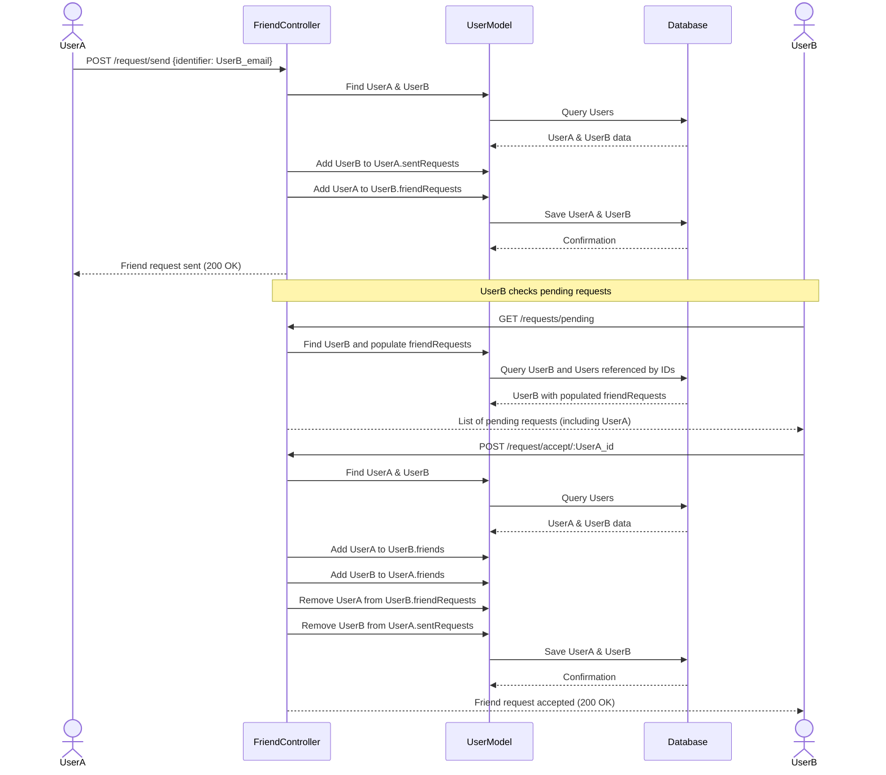

# Chat and Friend Management

<TOC />

This section delves into the backend services that enable core user interactions within the application: managing social connections through friend requests and facilitating real-time communication. It outlines the robust API endpoints and controller logic responsible for sending messages, handling media attachments, establishing friendships, and maintaining user relationship statuses. The architecture emphasizes a secure, efficient, and responsive system design, integrating real-time capabilities with persistent data storage.

## System Purpose

The Chat and Friend Management modules provide the foundational social and communication features of the application. They are designed to manage user relationships and message exchanges reliably and in real-time.

Key functionalities include:

*   **Friend Request Management**: Users can send, accept, and reject friend requests, establishing mutual connections.
*   **Friend List Operations**: Users can view their current friends and remove existing friendships.
*   **Pending Request Visibility**: Users can view friend requests they have received and those they have sent.
*   **Direct Messaging**: Users can send text-based and image-based messages to other users.
*   **Real-time Communication**: Messages are delivered instantly to the receiver using WebSocket technology.
*   **User Discovery**: The ability to retrieve a list of other users for interaction (e.g., in a sidebar).

## Architecture

The architecture for chat and friend management follows a typical MERN stack backend pattern, integrating Express.js for routing, Mongoose for MongoDB interactions, and Socket.IO for real-time communication. All interactions are secured using an authentication middleware (`protectRoute`), ensuring that only authenticated users can access these functionalities.

Client requests for friend actions or messages are routed through Express, pass through authentication, and are then handled by dedicated controllers. These controllers interact with Mongoose models (`User` and `Message`) to perform database operations in MongoDB. For messaging, `socket.io` plays a crucial role in pushing new messages to the relevant connected clients in real-time, bypassing the need for continuous polling.


```mermaid
graph TD
    A[Client Application] --> B(Express Router);
    B -- Friend Routes --> C{Authentication Middleware};
    B -- Message Routes --> C;
    C --> D[Friend Controller];
    C --> E[Message Controller];
    D -- Mongoose Operations --> F(User Model);
    E -- Mongoose Operations --> F;
    E -- Mongoose Operations --> G(Message Model);
    F -- Data Persistence --> H[MongoDB Database];
    G -- Data Persistence --> H;
    E -- Real-time Event --> I[Socket.IO Server];
    I -- Emit "newMessage" --> A;
```


## Technology Stack

The backend components leverage a focused set of technologies to achieve their functionality.

| Layer/Component   | Technology           | Purpose                                                                          |
| :---------------- | :------------------- | :------------------------------------------------------------------------------- |
| **Framework**     | Node.js, Express.js  | Provides the runtime environment and web application framework for API creation. |
| **Database**      | MongoDB, Mongoose    | NoSQL database for data storage; Mongoose serves as an ODM for Node.js.          |
| **Real-time**     | Socket.IO            | Enables bidirectional, low-latency communication for real-time messaging.        |
| **File Storage**  | Cloudinary           | Cloud-based service for storing and managing user-uploaded images.               |
| **Authentication**| JWT, Middleware      | Secures API endpoints, ensuring only authenticated users can perform actions.    |

## Features

This section breaks down the core functionalities into Friend Management and Message Management, detailing their implementation and API interactions.

### Friend Management

The friend management system allows users to build and manage their social network within the application. It handles the lifecycle of friend requests from initiation to acceptance or rejection, and also supports removing existing friends.

#### **Send Friend Request**

Users can send a friend request to another user by providing their username or email. The system performs several checks to prevent duplicate requests or requests to oneself.

**Endpoint**: `POST /api/friends/request/send/`
**Controller**: [`backend/src/controllers/friend.controller.js`](https://github.com/shinymack/Chat-App-MERN/blob/main/backend/src/controllers/friend.controller.js)

```javascript
// Send a friend request
export const sendFriendRequest = async (req, res) => {
    try {
        const { identifier } = req.body; // Expecting { identifier: "some_username_or_email" }
        const senderId = req.user._id;

        if (!identifier) {
            return res.status(400).json({ message: "Username or email is required." });
        }

        // Find receiver by username OR email
        const receiver = await User.findOne({
            $or: [{ username: identifier }, { email: identifier }]
        });

        if (!receiver) {
            return res.status(404).json({ message: "User not found." });
        }
        
        const receiverId = receiver._id;

        if (senderId.toString() === receiverId.toString()) {
            return res.status(400).json({ message: "You cannot send a friend request to yourself." });
        }

        const sender = await User.findById(senderId);

        // --- Rest of the logic is the same ---
        if (sender.friends.includes(receiverId)) {
            return res.status(400).json({ message: "You are already friends with this user." });
        }
        if (sender.sentRequests.includes(receiverId)) {
            return res.status(400).json({ message: "Friend request already sent." });
        }
        if (sender.friendRequests.includes(receiverId)) {
            return res.status(400).json({ message: "This user has already sent you a friend request." });
        }

        sender.sentRequests.push(receiverId);
        receiver.friendRequests.push(senderId);

        await sender.save();
        await receiver.save();

        res.status(200).json({ message: "Friend request sent successfully." });

    } catch (error) {
        console.error("Error in sendFriendRequest: ", error.message);
        res.status(500).json({ message: "Internal server error", error: error.message });
    }
};
```
[[View on GitHub#L11-L47](https://github.com/shinymack/Chat-App-MERN/blob/main/backend/src/controllers/friend.controller.js#L11-L47)]

**Insights**: This function demonstrates robust validation, including checks for self-requesting and existing relationships (friends, sent, or received requests). The use of `$or` in `User.findOne` allows for flexible user identification. It's critical to update both the sender's `sentRequests` and the receiver's `friendRequests` arrays in an atomic manner (though `await sender.save()` and `await receiver.save()` are separate calls, they often succeed together or fail together due to transaction mechanisms in MongoDB for array updates).

#### **Accept Friend Request**

When a user accepts a friend request, both users are added to each other's friend lists, and the request is removed from their respective pending request arrays.

**Endpoint**: `POST /api/friends/request/accept/:senderId`
**Controller**: [`backend/src/controllers/friend.controller.js`](https://github.com/shinymack/Chat-App-MERN/blob/main/backend/src/controllers/friend.controller.js)

```javascript
// Accept a friend request
export const acceptFriendRequest = async (req, res) => {
    try {
        const { senderId } = req.params; // ID of the user who sent the request
        const receiverId = req.user._id; // Current user accepting the request

        const sender = await User.findById(senderId);
        const receiver = await User.findById(receiverId);

        if (!sender || !receiver) {
            return res.status(404).json({ message: "User not found." });
        }

        // Check if the request exists in receiver's friendRequests
        if (!receiver.friendRequests.includes(senderId)) {
            return res.status(400).json({ message: "Friend request not found or already handled." });
        }

        // Add to friends list for both users
        receiver.friends.push(senderId);
        sender.friends.push(receiverId);

        // Remove from requests lists
        receiver.friendRequests = receiver.friendRequests.filter(id => id.toString() !== senderId.toString());
        sender.sentRequests = sender.sentRequests.filter(id => id.toString() !== receiverId.toString());

        await receiver.save();
        await sender.save();

        res.status(200).json({ message: "Friend request accepted." });

    } catch (error) {
        console.error("Error in acceptFriendRequest: ", error.message);
        res.status(500).json({ message: "Internal server error", error: error.message });
    }
};
```
[[View on GitHub#L54-L83](https://github.com/shinymack/Chat-App-MERN/blob/main/backend/src/controllers/friend.controller.js#L54-L83)]

**Insights**: This function ensures the request exists before processing, preventing erroneous state changes. It highlights the importance of bidirectional updates—both users' `friends` arrays are updated, and respective request arrays are cleared. Using `filter` with `toString()` is a standard and robust way to remove `ObjectId` references from arrays.

#### **Get Friends, Pending, and Sent Requests**

Endpoints are provided to retrieve lists of friends, received (pending) requests, and sent requests. These functions utilize Mongoose's `populate` method to fetch detailed user information associated with the stored `ObjectId` references.

**Endpoints**:
*   `GET /api/friends/list`
*   `GET /api/friends/requests/pending`
*   `GET /api/friends/requests/sent`
**Controller**: [`backend/src/controllers/friend.controller.js`](https://github.com/shinymack/Chat-App-MERN/blob/main/backend/src/controllers/friend.controller.js)

```javascript
// Get user's friends
export const getFriends = async (req, res) => {
    try {
        const userId = req.user._id;
        const user = await User.findById(userId).populate({
            path: "friends",
            // CHANGED from fullName
            select: "username email profilePic _id" 
        });

        if (!user) {
            return res.status(404).json({ message: "User not found." });
        }

        res.status(200).json(user.friends);

    } catch (error) {
        console.error("Error in getFriends: ", error.message);
        res.status(500).json({ message: "Internal server error", error: error.message });
    }
};
```
[[View on GitHub#L154-L170](https://github.com/shinymack/Chat-App-MERN/blob/main/backend/src/controllers/friend.controller.js#L154-L170)]

**Insights**: The `populate` method is crucial for efficiently retrieving associated user data without making multiple database queries for each `ObjectId`. Specifying `select: "username email profilePic _id"` ensures that sensitive data like passwords are not exposed and only necessary fields are returned, optimizing payload size. Similar logic applies to `getPendingRequests` and `getSentRequests`.

#### **Friend Request Workflow**





### Message Management

The message management system enables users to engage in direct chat conversations, including sending plain text messages and image attachments, with real-time delivery.

#### **Send Message**

This endpoint handles the sending of messages between two users. It supports both text and image content. If an image is present, it's uploaded to Cloudinary before the message is saved to the database. Crucially, it leverages `socket.io` to deliver the message in real-time to the recipient if they are online.

**Endpoint**: `POST /api/messages/send/:id`
**Controller**: [`backend/src/controllers/message.controller.js`](https://github.com/shinymack/Chat-App-MERN/blob/main/backend/src/controllers/message.controller.js)

```javascript
export const sendMessage = async (req, res) => {
    try {
        const { text, image } = req.body;
        const { id: receiverId } = req.params;
        const senderId = req.user._id;

        let imageUrl;
        if (image) {
            const uploadResponse = await cloudinary.uploader.upload(image);

            imageUrl = uploadResponse.secure_url;
        }
        const newMessage = new Message({
            senderId,
            receiverId,
            text,
            image: imageUrl,
        });

        await newMessage.save();

        const receiverSocketId = getReceiverSocketId(receiverId);

        if(receiverSocketId) {
            io.to(receiverSocketId).emit("newMessage", newMessage);
        }

        res.status(201).json(newMessage);   
        
    } catch (error) {
        console.log("Error in sendMessage controller:  ", error);
        res.status(500).json({ error: "Internal Server Error" });
    }
};
```
[[View on GitHub#L36-L58](https://github.com/shinymack/Chat-App-MERN/blob/main/backend/src/controllers/message.controller.js#L36-L58)]

**Insights**: The integration with `cloudinary` allows for efficient handling of media files, offloading storage and serving from the main application server. The `getReceiverSocketId` helper and `io.to().emit()` pattern are fundamental for real-time messaging, ensuring that the receiver immediately gets the new message without needing to refresh or poll. This improves user experience significantly.

#### **Get Messages**

This endpoint retrieves all messages exchanged between the logged-in user and a specified chat partner.

**Endpoint**: `GET /api/messages/:id`
**Controller**: [`backend/src/controllers/message.controller.js`](https://github.com/shinymack/Chat-App-MERN/blob/main/backend/src/controllers/message.controller.js)

```javascript
export const getMessages = async (req, res) => {
    try {
        const {id : userToChatId } = req.params;
        const myId = req.user._id;

        const messages = await Message.find({
            $or: [
                {senderId: myId, receiverId:userToChatId},
                {senderId: userToChatId, receiverId: myId}
            ]
        });
        res.status(200).json(messages);
    } catch (error) {
        console.log("Error in getMessages controller:  ", error);
        res.status(500).json({ error: "Internal Server Error" });
    }
};
```
[[View on GitHub#L23-L32](https://github.com/shinymack/Chat-App-MERN/blob/main/backend/src/controllers/message.controller.js#L23-L32)]

**Insights**: The `$or` operator in the Mongoose query is crucial here, allowing the retrieval of messages regardless of who was the sender or receiver in a particular message, effectively fetching the entire conversation history between two users.

#### **Get Users For Sidebar**

This endpoint retrieves a list of all users in the system, excluding the currently logged-in user. This is typically used to populate a chat sidebar or a list for initiating new conversations.

**Endpoint**: `GET /api/messages/users`
**Controller**: [`backend/src/controllers/message.controller.js`](https://github.com/shinymack/Chat-App-MERN/blob/main/backend/src/controllers/message.controller.js)

```javascript
export const getUsersForSidebar = async (req, res) => {
    try {
        const loggedInUserId = req.user._id;
        const filteredUsers = await User.find({
            _id: { $ne: loggedInUserId }}).select("-password");  
        res.status(200).json(filteredUsers);
    }
    catch (error) {
        console.log("Error in getUsersForSidebar: ", error);
        res.status(500).json({ error: "Internal Server Error" });
    }
};
```
[[View on GitHub#L7-L15](https://github.com/shinymack/Chat-App-MERN/blob/main/backend/src/controllers/message.controller.js#L7-L15)]

**Insights**: The `$ne` (not equal) operator efficiently filters out the logged-in user. The `select("-password")` projection is a critical security measure, ensuring that user passwords are never exposed to the client, even if accidentally fetched.

## Key Integration Points

The Chat and Friend Management modules are deeply integrated within the backend architecture, relying on several key components and best practices:

*   **Authentication Middleware**: All routes (`backend/src/routes/friend.route.js`, `backend/src/routes/message.route.js`) are protected using the `protectRoute` middleware. This ensures that only authenticated users can access and modify friend relationships or send messages, providing a secure foundation for user interactions.
*   **Database Interactions (Mongoose/MongoDB)**: Both `friend.controller.js` and `message.controller.js` extensively interact with `User` and `Message` Mongoose models. Operations like `findById`, `findOne`, `save`, and array manipulations (`push`, `filter`) are central to persisting and retrieving data. The use of `populate` for efficient fetching of related user details in friend lists and requests is a crucial optimization.
*   **Real-time Communication (Socket.IO)**: For message handling, `socket.io` provides the real-time layer. When a `sendMessage` request is processed, the `io.to(receiverSocketId).emit("newMessage", newMessage)` call instantly notifies the recipient's client, offering an immediate user experience. This contrasts with traditional REST APIs that would require polling.
*   **External Cloud Storage (Cloudinary)**: Image attachments in messages are handled by `Cloudinary`. The `sendMessage` controller uploads the image to Cloudinary, receiving a secure URL, which is then stored in the `Message` document. This offloads static file serving and storage from the application server, improving performance and scalability.
*   **Error Handling**: Each controller function is wrapped in a `try-catch` block, providing consistent error logging (`console.error`) and standardized HTTP 500 responses for internal server errors. This is vital for debugging and maintaining API reliability.
*   **Scalability Insights**:
    *   **Database Queries**: The use of indexed fields (like `_id`, `username`, `email` on `User` model, and `senderId`, `receiverId` on `Message` model) is essential for efficient queries as the user base grows.
    *   **Real-time Scaling**: While `socket.io` provides real-time capabilities, for very large-scale applications, scaling `socket.io` horizontally across multiple instances would require a `socket.io` adapter (e.g., Redis adapter) to ensure messages are correctly routed to clients connected to any server instance.
    *   **Cloud Services**: Leveraging `Cloudinary` for media storage inherently provides scalability for handling large volumes of user-uploaded content.

Next: [Data Models and Storage](./2.3_data-models-and-storage.mdx)