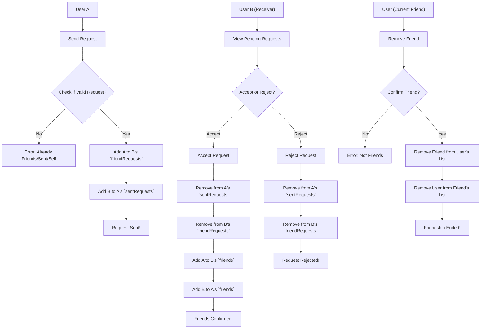
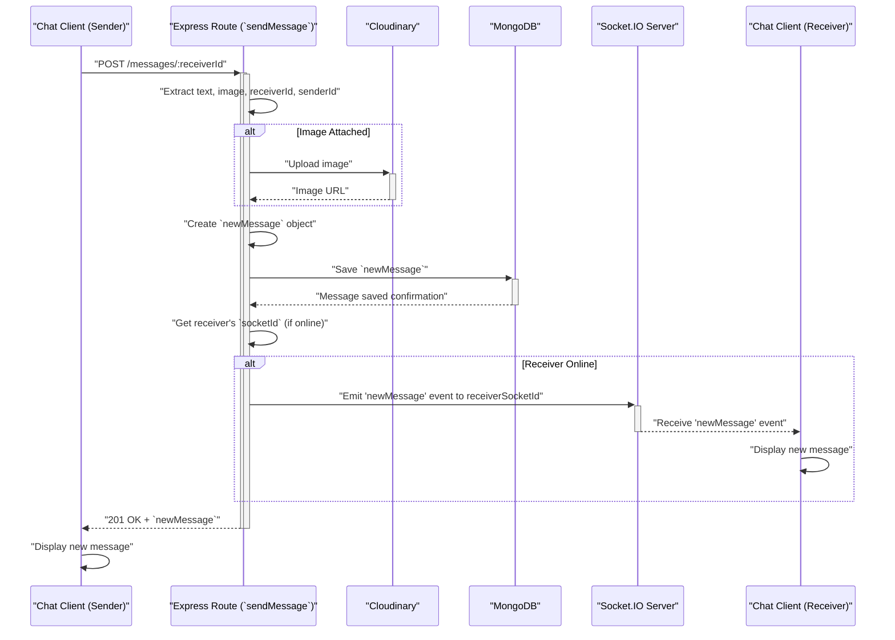

# Chat and Friend Management

<TOC />

This section covers the core backend logic responsible for establishing and managing user friendships, as well as handling real-time chat messages. It delves into the controllers and models that facilitate friend requests, acceptance, rejection, removal, and the exchange of messages, including media, using WebSockets for real-time updates.

## Core Components

The primary functionalities of chat and friend management are encapsulated within the following files:

*   **`backend/src/controllers/friend.controller.js`**: Manages all friend-related operations (sending, accepting, rejecting requests, removing friends, fetching lists).
*   **`backend/src/controllers/message.controller.js`**: Handles sending and retrieving chat messages, including image uploads, and integrates with WebSockets for real-time delivery.
*   **`backend/src/models/message.model.js`**: Defines the Mongoose schema for chat messages, detailing sender, receiver, text content, and image URLs.
*   **`backend/src/lib/socket.js`**: Initializes and manages the WebSocket server, handling user connections, disconnections, and real-time event broadcasting.

## Friend Management

The `friend.controller.js` file is the central hub for all friend-related interactions. It ensures proper validation, updates user relationship statuses, and manages friend request lifecycles.

### Sending Friend Requests

The `sendFriendRequest` function allows a user to send a friend request to another user identified by their username or email. It includes robust checks to prevent duplicate requests, self-requests, and requests to existing friends.

**Key Logic:**

*   **Identifier-based Search**: Users can be found by either `username` or `email`.
*   **Validation**: Checks if the target user exists, prevents self-requests, and ensures no existing friendship or pending requests.
*   **Status Update**: Adds the receiver's ID to the sender's `sentRequests` array and the sender's ID to the receiver's `friendRequests` array.

```javascript
// backend/src/controllers/friend.controller.js
// Relevant lines: 14-55
export const sendFriendRequest = async (req, res) => {
    try {
        const { identifier } = req.body; // Expecting { identifier: "some_username_or_email" }
        const senderId = req.user._id;

        if (!identifier) {
            return res.status(400).json({ message: "Username or email is required." });
        }

        // Find receiver by username OR email
        const receiver = await User.findOne({
            $or: [{ username: identifier }, { email: identifier }]
        });

        if (!receiver) {
            return res.status(404).json({ message: "User not found." });
        }
        
        const receiverId = receiver._id;

        if (senderId.toString() === receiverId.toString()) {
            return res.status(400).json({ message: "You cannot send a friend request to yourself." });
        }

        const sender = await User.findById(senderId);

        // --- Rest of the logic is the same ---
        if (sender.friends.includes(receiverId)) {
            return res.status(400).json({ message: "You are already friends with this user." });
        }
        if (sender.sentRequests.includes(receiverId)) {
            return res.status(400).json({ message: "Friend request already sent." });
        }
        if (sender.friendRequests.includes(receiverId)) {
            return res.status(400).json({ message: "This user has already sent you a friend request." });
        }

        sender.sentRequests.push(receiverId);
        receiver.friendRequests.push(senderId);

        await sender.save();
        await receiver.save();

        res.status(200).json({ message: "Friend request sent successfully." });

    } catch (error) {
        console.error("Error in sendFriendRequest: ", error.message);
        res.status(500).json({ message: "Internal server error", error: error.message });
    }
};
```
[View on GitHub](https://github.com/shinymack/Chat-App-MERN/blob/main/backend/src/controllers/friend.controller.js#L14-L55)

### Accepting and Rejecting Requests

*   **`acceptFriendRequest`**: Moves user IDs from `friendRequests` and `sentRequests` arrays into the `friends` array for both users involved.
*   **`rejectFriendRequest`**: Simply removes the request from both users' respective request arrays without adding them as friends.

Both functions ensure that the request actually exists before processing.

### Removing Friends

The `removeFriend` function allows users to dissolve an existing friendship. It removes the specified `friendId` from both users' `friends` arrays.

```javascript
// backend/src/controllers/friend.controller.js
// Relevant lines: 140-169
export const removeFriend = async (req, res) => {
    try {
        const { friendId } = req.params;
        const userId = req.user._id;

        const user = await User.findById(userId);
        const friendToRemove = await User.findById(friendId);

        if (!user || !friendToRemove) {
            return res.status(404).json({ message: "User not found." });
        }

        // Check if they are actually friends
        if (!user.friends.includes(friendId)) {
            return res.status(400).json({ message: "This user is not in your friends list." });
        }

        // Remove friend from both users' friends lists
        user.friends = user.friends.filter(id => id.toString() !== friendId.toString());
        friendToRemove.friends = friendToRemove.friends.filter(id => id.toString() !== userId.toString());

        await user.save();
        await friendToRemove.save();

        res.status(200).json({ message: "Friend removed successfully." });

    } catch (error) {
        console.error("Error in removeFriend: ", error.message);
        res.status(500).json({ message: "Internal server error", error: error.message });
    }
};
```
[View on GitHub](https://github.com/shinymack/Chat-App-MERN/blob/main/backend/src/controllers/friend.controller.js#L140-L169)

### Retrieving Friend Lists and Requests

Several endpoints facilitate fetching user relationships:

*   **`getFriends`**: Retrieves a list of friends for the current user, populating specific fields like `username`, `email`, and `profilePic`.
*   **`getPendingRequests`**: Fetches friend requests received by the current user.
*   **`getSentRequests`**: Fetches friend requests sent by the current user.

```javascript
// backend/src/controllers/friend.controller.js
// Relevant lines: 172-186
export const getFriends = async (req, res) => {
    try {
        const userId = req.user._id;
        const user = await User.findById(userId).populate({
            path: "friends",
            select: "username email profilePic _id" 
        });

        if (!user) {
            return res.status(404).json({ message: "User not found." });
        }

        res.status(200).json(user.friends);

    } catch (error) {
        console.error("Error in getFriends: ", error.message);
        res.status(500).json({ message: "Internal server error", error: error.message });
    }
};
```
[View on GitHub](https://github.com/shinymack/Chat-App-MERN/blob/main/backend/src/controllers/friend.controller.js#L172-L186)

### Friend Request Lifecycle Diagram





## Message Management and Real-time Communication

The messaging system, managed by `message.controller.js` and `socket.js`, facilitates direct communication between users, supports text and image messages, and provides real-time updates via WebSockets.

### Message Model

The `Message` Mongoose model defines the structure for individual chat messages.

```javascript
// backend/src/models/message.model.js
// Relevant lines: 4-27
import express from "express";
import mongoose from "mongoose";

const messageSchema = new mongoose.Schema(
    {
     senderId: {
        type: mongoose.Schema.Types.ObjectId,
        ref: "User",
        required: true,
     },
     receiverId: {
        type: mongoose.Schema.Types.ObjectId,
        ref: "User",
        required: true,
     },
     text: {
        type: String,
     },
     image: {
        type: String,
     },
    },
    {timestamps: true}
);

export default mongoose.model("Message", messageSchema);
```
[View on GitHub](https://github.com/shinymack/Chat-App-MERN/blob/main/backend/src/models/message.model.js#L4-L27)

### Retrieving Users for Chat Sidebar

The `getUsersForSidebar` function fetches a list of all users excluding the currently logged-in user, which is typically used to populate a chat sidebar.

```javascript
// backend/src/controllers/message.controller.js
// Relevant lines: 6-15
export const getUsersForSidebar = async (req, res) => {
    try {
        const loggedInUserId = req.user._id;
        const filteredUsers = await User.find({
            _id: { $ne: loggedInUserId }}).select("-password");  
        res.status(200).json(filteredUsers);
    }
    catch (error) {
        console.log("Error in getUsersForSidebar: ", error);
        res.status(500).json({ error: "Internal Server Error" });
    }
};
```
[View on GitHub](https://github.com/shinymack/Chat-App-MERN/blob/main/backend/src/controllers/message.controller.js#L6-L15)

### Retrieving Messages

The `getMessages` function fetches all messages exchanged between the current user and a specified `userToChatId`. It uses an `$or` query to retrieve messages where the current user is either the sender or the receiver.

```javascript
// backend/src/controllers/message.controller.js
// Relevant lines: 17-30
export const getMessages = async (req, res) => {
    try {
        const {id : userToChatId } = req.params;
        const myId = req.user._id;

        const messages = await Message.find({
            $or: [
                {senderId: myId, receiverId:userToChatId},
                {senderId: userToChatId, receiverId: myId}
            ]
        });
        res.status(200).json(messages);
    } catch (error) {
        console.log("Error in getMessages controller:  ", error);
        res.status(500).json({ error: "Internal Server Error" });
    }
};
```
[View on GitHub](https://github.com/shinymack/Chat-App-MERN/blob/main/backend/src/controllers/message.controller.js#L17-L30)

### Sending Messages and Real-time Delivery

The `sendMessage` function handles the creation and storage of new messages. If an `image` is provided, it's uploaded to Cloudinary before saving the message. Crucially, after saving, it utilizes WebSockets to immediately notify the receiver if they are online.

```javascript
// backend/src/controllers/message.controller.js
// Relevant lines: 32-59
export const sendMessage = async (req, res) => {
    try {
        const { text, image } = req.body;
        const { id: receiverId } = req.params;
        const senderId = req.user._id;

        let imageUrl;
        if (image) {
            const uploadResponse = await cloudinary.uploader.upload(image);
            imageUrl = uploadResponse.secure_url;
        }
        const newMessage = new Message({
            senderId,
            receiverId,
            text,
            image: imageUrl,
        });

        await newMessage.save();

        const receiverSocketId = getReceiverSocketId(receiverId);

        if(receiverSocketId) {
            io.to(receiverSocketId).emit("newMessage", newMessage);
        }

        res.status(201).json(newMessage);   
        
    } catch (error) {
        console.log("Error in sendMessage controller:  ", error);
        res.status(500).json({ error: "Internal Server Error" });
    }
};
```
[View on GitHub](https://github.com/shinymack/Chat-App-MERN/blob/main/backend/src/controllers/message.controller.js#L32-L59)

### WebSocket Setup and Usage

The `socket.js` file configures the Socket.IO server, integrates it with the Express application, and manages online user statuses.

*   **`userSocketMap`**: A simple object that maps `userId` to `socketId` for all currently online users.
*   **`io.on("connection", ...)`**: Handles a new WebSocket connection. It stores the user's `socketId` in `userSocketMap` and broadcasts the updated list of online users.
*   **`socket.on("disconnect", ...)`**: Cleans up `userSocketMap` when a user disconnects and broadcasts the updated online user list.
*   **`getReceiverSocketId(userId)`**: A utility function to retrieve the `socketId` of a given `userId`, essential for targeting specific users with messages.

```javascript
// backend/src/lib/socket.js
// Relevant lines: 18-36
export function getReceiverSocketId(userId) {
    return userSocketMap[userId];
}

// used to store online users
const userSocketMap = {}; //{userId : socketId}

io.on("connection", (socket) => {
    console.log("A user connected", socket.id);

    const userId = socket.handshake.query.userId;
    if(userId) userSocketMap[userId] = socket.id;

    io.emit("getOnlineUsers", Object.keys(userSocketMap));

    socket.on("disconnect", ()=>{
        console.log("A user disconnected", socket.id);
        delete userSocketMap[userId]; 
        io.emit("getOnlineUsers", Object.keys(userSocketMap));
    })
})
```
[View on GitHub](https://github.com/shinymack/Chat-App-MERN/blob/main/backend/src/lib/socket.js#L18-L36)

### Real-time Message Flow Diagram





## Key Integration Points

*   **User Model (`backend/src/models/user.model.js`)**: The `User` model is central to both friend and message management. It stores arrays for `friends`, `friendRequests`, and `sentRequests`, which are crucial for tracking user relationships. All controllers in this section extensively use `User.findById` and `User.findOne` and update user documents.
*   **Authentication Middleware**: All controller functions implicitly rely on authentication middleware (not shown in provided snippets but part of the larger application) to populate `req.user._id`, ensuring that actions are performed by an authenticated user.
*   **Cloudinary (`backend/src/lib/cloudinary.js`)**: Integrated within `sendMessage` for handling image uploads, ensuring media content is stored efficiently and accessible via URLs.
*   **Socket.IO**: The `socket.js` file is the backbone for real-time features, allowing instant message delivery and online user status updates, significantly enhancing the user experience.

This robust backend architecture ensures secure, efficient, and real-time management of user friendships and communication, forming the core of the chat application.

Next: [Utility Services and Integrations](./2.3_utility-services-integrations.mdx)