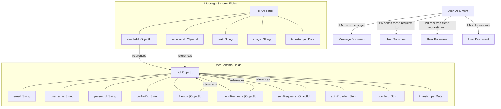

# Data Management and Persistence

<TOC />

This section details how the application manages and persists data, focusing on the MongoDB database, Mongoose schemas, and the core database connection logic. It outlines the structure of the `User` and `Message` data models and how the Express application initializes the database connection.

## Database Connection

The application connects to MongoDB using Mongoose, a MongoDB object data modeling (ODM) library for Node.js. The `connectDB` function in `backend/src/lib/db.js` handles the connection process, ensuring that the application can interact with the database. This function is called once when the server starts.

```javascript showLineNumbers
// backend/src/lib/db.js
import mongoose from "mongoose"

export const connectDB = async () => {
  try {
    const conn = await mongoose.connect(process.env.MONGODB_URI);
    console.log(`MongoDB connected:  ${conn.connection.host}`);
  }
  catch(error){
    console.log("MongoDB connection error: ", error);
  }
}
```

The `connectDB` function attempts to establish a connection to the MongoDB instance specified by the `MONGODB_URI` environment variable. Upon successful connection, it logs the host; otherwise, it logs an error.

[View on GitHub](https://github.com/shinymack/Chat-App-MERN/blob/main/backend/src/lib/db.js)

The database connection is initiated from the main `backend/src/index.js` file:

```javascript showLineNumbers {40-43}
// backend/src/index.js
// ... (imports)
import { connectDB } from "./lib/db.js";
import { app, server } from "./lib/socket.js";
// ... (middleware and routes setup)

server.listen(PORT, () => {
    console.log("server is running on PORT: " + String(PORT));
    connectDB(); // Database connection initiated here
});
```

[View on GitHub](https://github.com/shinymack/Chat-App-MERN/blob/main/backend/src/index.js#L62-L65)

This setup ensures that the database is connected before the server begins listening for requests, making the database ready for operations from the moment the application starts.

## Data Models

The application defines two primary Mongoose models: `User` and `Message`, which represent the core entities in the chat application. These models provide structured schemas for documents stored in MongoDB, including validation rules, default values, and relationships between documents.

### User Model

The `User` model (`backend/src/models/user.model.js`) defines the structure for user accounts. It includes fields for authentication, profile information, and a sophisticated friend management system.

```javascript showLineNumbers {6-48}
// backend/src/models/user.model.js
import mongoose from "mongoose"

const  userSchema = new mongoose.Schema(
    {
        email: {
            type: String,
            required: true,
            unique: true
        },
        username: {
            type: String,
            required: [true, "Username is required"],
            unique: true,
            trim: true,
            minlength: [3, "Username must be at least 3 characters long"],
            maxlength: [20, "Username cannot be more than 20 characters long"]
        }
        ,
        password: {
            type: String,
            minlength: 6,
        },
        profilePic: {
            type: String,
            default: "",
        },
        friends: [{
            type: mongoose.Schema.Types.ObjectId,
            ref: "User",
            default: []
        }],
        friendRequests: [{ // Incoming friend requests
            type: mongoose.Schema.Types.ObjectId,
            ref: "User",
            default: []
        }],
        sentRequests: [{ // Outgoing friend requests
            type: mongoose.Schema.Types.ObjectId,
            ref: "User",
            default: []
        }],
        authProvider: {
            type: String,
            enum: ['email', 'google'],
            default: 'email'
        },
        googleId: {
            type: String,
            unique: true,
            sparse: true
        },
    },
    {
        timestamps: true
    }
);
// ... (pre-save hook)
export default User;
```

[View on GitHub](https://github.com/shinymack/Chat-App-MERN/blob/main/backend/src/models/user.model.js#L3-L52)

Key fields and their significance:

*   `email`, `username`: Core identification and authentication fields. Both are unique.
*   `password`: Stores the hashed password.
*   `profilePic`: URL to the user's profile image.
*   `friends`, `friendRequests`, `sentRequests`: Arrays of `ObjectId` references to other `User` documents, implementing the social graph functionality.
*   `authProvider`, `googleId`: Fields to support different authentication methods, including Google OAuth.
*   `timestamps`: Automatically adds `createdAt` and `updatedAt` fields for tracking document changes.

A `pre('save')` hook is implemented to handle password requirements based on the `authProvider`:

```javascript showLineNumbers {50-59}
// backend/src/models/user.model.js
// ... (schema definition)

userSchema.pre('save', async function(next) {
    if (this.authProvider === 'google' && !this.isModified('password')) {
        this.password = undefined; // Google authenticated users don't need a local password
    }
    if (this.authProvider === 'email' && !this.password && this.isNew) {
        return next(new Error('Password is required for email signup.'));
    }
    next();
});

const User = mongoose.model("User", userSchema);

export default User;
```

[View on GitHub](https://github.com/shinymack/Chat-App-MERN/blob/main/backend/src/models/user.model.js#L54-L63)

This hook ensures that users authenticated via Google do not require a local password, simplifying their data structure, while enforcing password presence for email-based sign-ups.

### Message Model

The `Message` model (`backend/src/models/message.model.js`) defines the structure for individual chat messages exchanged between users.

```javascript showLineNumbers {4-24}
// backend/src/models/message.model.js
import express from "express"; // Note: This import is not strictly needed for the schema
import mongoose from "mongoose";

const messageSchema = new mongoose.Schema(
    {
     senderId: {
        type: mongoose.Schema.Types.ObjectId,
        ref: "User", // References the User model
        required: true,
     },
     receiverId: {
        type: mongoose.Schema.Types.ObjectId,
        ref: "User", // References the User model
        required: true,
     },
     text: {
        type: String,
     },
     image: {
        type: String,
     },
    },
    {timestamps: true} // Adds createdAt and updatedAt
);

export default mongoose.model("Message", messageSchema);
```

[View on GitHub](https://github.com/shinymack/Chat-App-MERN/blob/main/backend/src/models/message.model.js#L3-L27)

Key fields:

*   `senderId`, `receiverId`: `ObjectId` references to the `User` model, establishing a direct relationship between messages and the users involved. This is crucial for retrieving chat histories.
*   `text`: The actual content of the message.
*   `image`: An optional field for the URL of an image attached to the message.
*   `timestamps`: Automatically adds `createdAt` and `updatedAt` fields, essential for ordering messages in a chat.

## Data Model Relationship Diagram

This diagram illustrates the relationships between the core data models (`User` and `Message`) within the MongoDB database, as defined by Mongoose.





## Key Integration Points

The data management layer is fundamental to the backend's operation.

1.  **Centralized Database Connection:** The `connectDB` function in `backend/src/lib/db.js` serves as the single point of entry for database connectivity. Its integration into `backend/src/index.js` ensures that the database is initialized and ready before any API routes become active. This pattern guarantees that all subsequent data operations will have an active connection.
2.  **Mongoose Models for Data Integrity:** The `User` and `Message` models in `backend/src/models/` enforce a structured schema, providing data validation, type checking, and relationship definitions (`ref: "User"`). This is critical for maintaining data integrity and consistency across the application. For instance, the `User` model's `pre('save')` hook demonstrates advanced data handling, adapting to different authentication providers.
3.  **Relationship Management:** The use of `mongoose.Schema.Types.ObjectId` with the `ref` option is crucial for building relationships between `User` and `Message` documents, as well as `User` to `User` for friend management. This allows for efficient population of related documents in queries, enabling the application to fetch a user's messages or friend list with ease.
4.  **Scalability and Flexibility:** MongoDB's document-oriented nature, combined with Mongoose's schema flexibility, allows for evolution of the data models. The current design supports essential chat functionalities while providing a foundation for future features, such as group chats or message reactions, by potentially extending existing schemas or introducing new ones.

Next: [Core Backend Services](./2.3_core-backend-services.mdx)