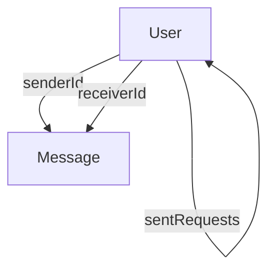

# Data Models and Schema
<TOC />

This section details the foundational data models and their corresponding Mongoose schemas, which define the structure and relationships of data within the application. Understanding these models is crucial for comprehending how user data, messaging, and social interactions are stored and managed. The application leverages MongoDB as its NoSQL database, with Mongoose providing an object data modeling (ODM) layer for interacting with it.

## Database Connection
The application connects to a MongoDB instance using Mongoose. The connection logic is encapsulated within the `connectDB` function, ensuring a robust and fault-tolerant connection mechanism. Environment variables are utilized to securely manage the MongoDB connection URI, promoting flexibility and security across different deployment environments.

The `connectDB` function attempts to establish a connection to MongoDB and logs the host if successful, providing immediate feedback on connection status. In case of a failure, it catches and logs a detailed error message, aiding in debugging and operational monitoring. This modular approach to database initialization enhances maintainability and reusability for backend services.

```javascript
// backend/src/lib/db.js
import mongoose from "mongoose"

export const connectDB = async () => {
  try {
    const conn = await mongoose.connect(process.env.MONGODB_URI);
    console.log(`MongoDB connected:  ${conn.connection.host}`);
  }
  catch(error){
    console.log("MongoDB connection error: ", error);
  }
}
```
[View on GitHub](https://github.com/shinymack/Chat-App-MERN/blob/main/backend/src/lib/db.js#L1-L11)

### Database Connection Flow
The following diagram illustrates the lifecycle of the database connection upon application startup:


```mermaid
graph TD
    A[Application Start] --> B(Call connectDB)
    B --> C{Mongoose.connect(MONGODB_URI)}
    C -- Success --> D[MongoDB Connected: Host]
    C -- Failure --> E[MongoDB Connection Error]
```


This flow ensures that the application waits for a successful database connection before proceeding with operations that require data persistence, or it gracefully handles connection failures by logging errors, preventing critical application processes from halting unexpectedly.

## User Data Model
The `User` model represents individual users within the system, storing their authentication credentials, profile information, and social connections. This model is central to the application's functionality, encompassing user identity and the social graph.

### User Schema Definition
The `userSchema` defines various fields, each with specific validation rules and types, ensuring data integrity and consistency. Key fields include:

*   **`email`**: A `String` type that serves as a unique identifier for the user and is `required` for authentication. Its `unique` constraint ensures no two users can share the same email.
*   **`username`**: A `String` type, also `required` and `unique`, serving as the display name. It includes `trim` to remove whitespace, and `minlength`/`maxlength` constraints to enforce appropriate length.
*   **`password`**: A `String` type, primarily used for 'email' based authentication, with a `minlength` constraint. This field is handled specially for social logins (e.g., Google).
*   **`profilePic`**: A `String` type storing the URL to the user's profile image, with a `default` empty string.
*   **`friends`**: An array of `ObjectId` references to other `User` documents, representing established friendships. It defaults to an empty array.
*   **`friendRequests`**: An array of `ObjectId` references for incoming friend requests, allowing users to accept or reject requests. Defaults to an empty array.
*   **`sentRequests`**: An array of `ObjectId` references for outgoing friend requests, tracking requests initiated by the user. Defaults to an empty array.
*   **`authProvider`**: A `String` type with an `enum` of `['email', 'google']`, indicating the authentication method used. Defaults to `'email'`.
*   **`googleId`**: A `String` type, `unique` and `sparse`, storing the unique ID provided by Google for users authenticated via Google. `sparse` allows multiple documents to not have this field.
*   **`timestamps`**: Mongoose automatically adds `createdAt` and `updatedAt` fields (of `Date` type) to track document creation and last update times for auditing and sorting purposes.

```javascript
// backend/src/models/user.model.js
import mongoose from "mongoose"

const  userSchema = new mongoose.Schema(
    {
        email: {
            type: String,
            required: true,
            unique: true
        },
        username: {
            type: String,
            required: [true, "Username is required"],
            unique: true,
            trim: true,
            minlength: [3, "Username must be at least 3 characters long"],
            maxlength: [20, "Username cannot be more than 20 characters long"]
        }
        ,
        password: {
            type: String,
            minlength: 6,
        },
        profilePic: {
            type: String,
            default: "",
        },
        friends: [{
            type: mongoose.Schema.Types.ObjectId,
            ref: "User",
            default: []
        }],
        friendRequests: [{ // Incoming friend requests
            type: mongoose.Schema.Types.ObjectId,
            ref: "User",
            default: []
        }],
        sentRequests: [{ // Outgoing friend requests
            type: mongoose.Schema.Types.ObjectId,
            ref: "User",
            default: []
        }],
        authProvider: {
            type: String,
            enum: ['email', 'google'],
            default: 'email'
        },
        googleId: {
            type: String,
            unique: true,
            sparse: true
        },
    },
    {
        timestamps: true
    }
);

userSchema.pre('save', async function(next) {
    if (this.authProvider === 'google' && !this.isModified('password')) {
        this.password = undefined;
    }
    if (this.authProvider === 'email' && !this.password && this.isNew) {
        return next(new Error('Password is required for email signup.'));
    }
    next();
});

const User = mongoose.model("User", userSchema);

export default User;
```
[View on GitHub](https://github.com/shinymack/Chat-App-MERN/blob/main/backend/src/models/user.model.js#L1-L69)

### Pre-save Hook for User Schema
A `pre('save')` Mongoose middleware is implemented to handle specific logic before a `User` document is saved to the database. This hook ensures data consistency and security, especially concerning password management for different authentication providers.

```javascript
// backend/src/models/user.model.js (pre-save hook)
userSchema.pre('save', async function(next) {
    if (this.authProvider === 'google' && !this.isModified('password')) {
        this.password = undefined;
    }
    if (this.authProvider === 'email' && !this.password && this.isNew) {
        return next(new Error('Password is required for email signup.'));
    }
    next();
});
```
[View on GitHub](https://github.com/shinymack/Chat-App-MERN/blob/main/backend/src/models/user.model.js#L60-L67)

This hook performs two primary checks:
1.  **Google Authentication Handling**: If a user is authenticated via `google` and their `password` field has not been explicitly modified (e.g., they didn't manually set a password), the `password` field is set to `undefined`. This prevents storing an unnecessary and potentially misleading password hash for social logins, as authentication is delegated to the external provider.
2.  **Email Authentication Requirement**: For new users signing up via `email`, it enforces that a `password` must be provided. If `password` is missing for a new email-based user, it returns an error, ensuring valid credentials are set for traditional accounts.

## Message Data Model
The `Message` model is designed to store individual chat messages exchanged between users. It captures essential details about each message, facilitating real-time communication within the application.

### Message Schema Definition
The `messageSchema` outlines the structure for message documents:

*   **`senderId`**: An `ObjectId` type, `required`, with `ref: "User"`. This establishes a clear relationship to the `User` who initiated the message.
*   **`receiverId`**: An `ObjectId` type, `required`, with `ref: "User"`. This links the message to the intended recipient `User`.
*   **`text`**: A `String` type for the textual content of the message. This field is optional, allowing for messages that might only contain an image.
*   **`image`**: A `String` type for a URL to an image file associated with the message, enabling rich media communication. This field is also optional.
*   **`timestamps`**: Automatically includes `createdAt` and `updatedAt` for tracking when messages were sent and last modified, which is crucial for chronological display in chat interfaces.

```javascript
// backend/src/models/message.model.js
import express from "express"; // Note: The 'express' import here is not utilized by the schema definition itself.
import mongoose from "mongoose";

const messageSchema = new mongoose.Schema(
    {
     senderId: {
        type: mongoose.Schema.Types.ObjectId,
        ref: "User",
        required: true,
     },
     receiverId: {
        type: mongoose.Schema.Types.ObjectId,
        ref: "User",
        required: true,
     },
     text: {
        type: String,
     },
     image: {
        type: String,
     },
    },
    {timestamps: true}
);

export default mongoose.model("Message", messageSchema);
```
[View on GitHub](https://github.com/shinymack/Chat-App-MERN/blob/main/backend/src/models/message.model.js#L1-L26)

The inclusion of both `text` and `image` fields as optional allows for flexible message types, supporting text-only, image-only, or mixed-content messages within a single schema. The `senderId` and `receiverId` fields are critical for identifying participants in a conversation and are typically indexed for efficient querying of chat histories.

## Data Relationships and Integrity
The application heavily relies on Mongoose's `ObjectId` type and the `ref` option to establish relationships between documents, forming a robust social graph and message history without enforcing rigid SQL-like joins.

### Relationships Diagram





This diagram illustrates the key relationships defined within the schemas:
*   **Self-Referencing `User`**: The `User` model references itself in the `friends`, `friendRequests`, and `sentRequests` arrays. This design enables a powerful social graph, allowing for features like adding friends, managing pending requests, and tracking requests initiated by the user.
*   **`User` to `Message`**: The `Message` model references the `User` model for both `senderId` and `receiverId`. This explicit linking ensures that every message is associated with its originator and intended recipient, facilitating accurate conversation tracking.

These `ObjectId` relationships are fundamental for operations such as fetching a user's entire friend list, retrieving all messages exchanged between two specific users, or displaying a user's pending friend requests. Mongoose's `populate()` method can be efficiently used to retrieve linked document data by replacing the `ObjectId` references with the actual user documents.

### Scalability Considerations
For a real-time chat application, the scalability of message storage and retrieval is paramount. The `Message` model's structure, with direct `senderId` and `receiverId`, allows for efficient querying of conversation history between any two users. For extremely high-volume chat applications, advanced considerations for MongoDB could include:
*   **Indexing**: Strategic indexing on `senderId`, `receiverId`, and `createdAt` in the `Message` collection can significantly speed up queries for chat histories.
*   **Sharding**: Distributing the `Message` collection across multiple servers (sharding) based on a shard key like `receiverId` or a composite key involving `senderId` and `receiverId` can manage larger datasets and higher write/read throughput.
*   **TTL Indexes**: Implementing Time-To-Live (TTL) indexes on `createdAt` for messages could automatically expire older messages, managing data retention and storage costs if historical messages are not permanently required.

## Key Integration Points
The data models discussed here form the backbone of the application's backend. They integrate seamlessly with various components to deliver the core functionality:

*   **API Endpoints**: Backend controllers interact directly with these Mongoose models to perform CRUD (Create, Read, Update, Delete) operations in response to API requests from the frontend. For instance, user registration creates a new `User` document, and sending a message creates a new `Message` document.
*   **Authentication and Authorization**: The `User` model's `email`, `password`, `authProvider`, and `googleId` fields are fundamental to the authentication process, verifying user credentials and managing user sessions. The `pre-save` hook ensures that password handling is consistent with the chosen authentication method, whether traditional email/password or social login.
*   **Real-time Communication**: Messages, once validated and saved to the `Message` collection, are typically processed further by real-time layers (e.g., WebSocket servers) to be broadcast to relevant clients, enabling instant updates and real-time chat functionality.
*   **Social Features**: The `friends`, `friendRequests`, and `sentRequests` arrays within the `User` model are directly leveraged by social feature logic to manage user connections, process friend requests, and maintain the social graph of the application.

These models are designed to provide a flexible yet structured approach to managing diverse data types required for a modern chat application, supporting both core messaging and advanced social features with a strong emphasis on data integrity and performance.

---
Next: [Authentication and Authorization](./2.3_authentication-and-authorization.mdx)