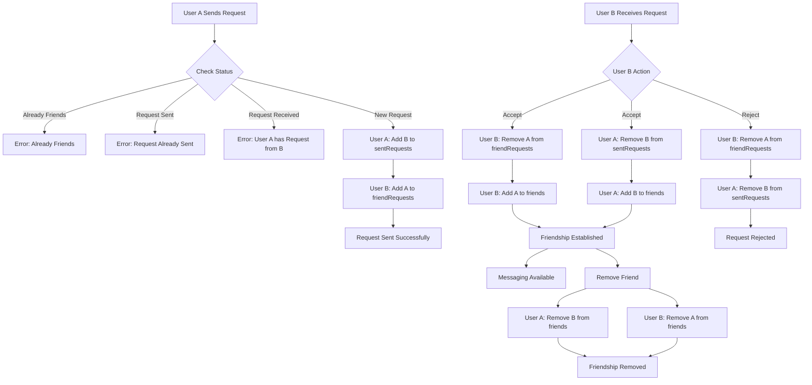
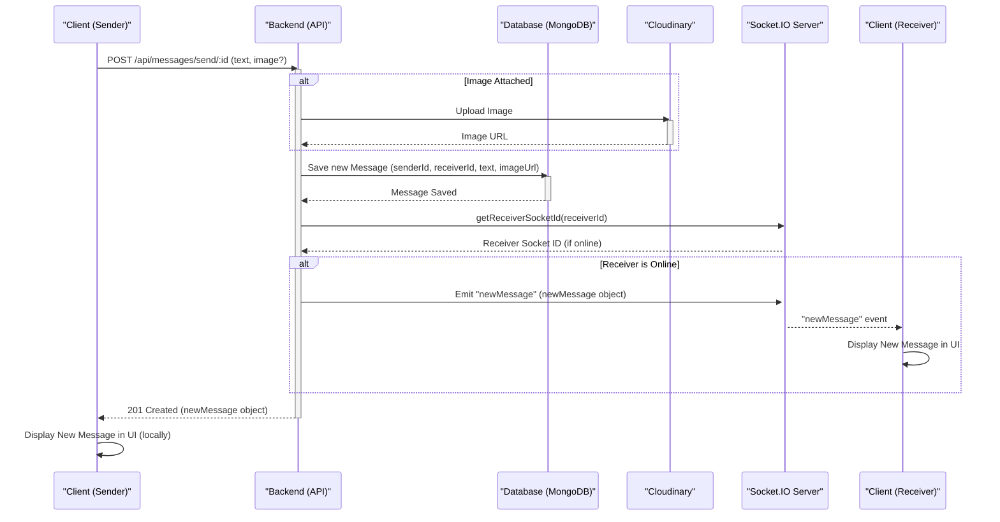

# Messaging and Friend Management
<TOC />

This section delves into the backend services responsible for handling real-time messaging, managing friend relationships, and facilitating user interactions within the application. It covers the core logic for sending friend requests, accepting/rejecting them, adding/removing friends, and the infrastructure for sending and receiving messages, including media attachments, in real-time.

The primary components involved are:
*   `backend/src/controllers/friend.controller.js`: Handles all friend-related actions (send request, accept, reject, remove, retrieve lists).
*   `backend/src/controllers/message.controller.js`: Manages message-related operations (send, retrieve, get sidebar users).
*   `backend/src/models/message.model.js`: Defines the schema for messages.
*   `backend/src/routes/message.route.js`: Sets up API endpoints for messaging.
*   The `User` model (not provided in this content, but implicitly used) is extended with fields like `friends`, `friendRequests`, and `sentRequests` to manage relationships.

## Friend Management Backend Logic

The `friend.controller.js` file orchestrates all friend-related functionalities. These operations modify the `User` model's `friends`, `friendRequests` (incoming), and `sentRequests` (outgoing) arrays.

### Sending a Friend Request
The `sendFriendRequest` function allows a user to send a friend request to another user, identified by username or email. It performs checks to prevent duplicate requests, self-requests, or requests to existing friends.

```javascript showLineNumbers
// backend/src/controllers/friend.controller.js
export const sendFriendRequest = async (req, res) => {
    try {
        const { identifier } = req.body;
        const senderId = req.user._id;

        // ... validation and user lookup ...

        // Prevent self-requests
        if (senderId.toString() === receiverId.toString()) {
            return res.status(400).json({ message: "You cannot send a friend request to yourself." });
        }

        const sender = await User.findById(senderId);

        // ... checks for existing friendships or pending requests ...

        // Add to respective request lists
        sender.sentRequests.push(receiverId);
        receiver.friendRequests.push(senderId);

        await sender.save();
        await receiver.save();

        res.status(200).json({ message: "Friend request sent successfully." });

    } catch (error) {
        console.error("Error in sendFriendRequest: ", error.message);
        res.status(500).json({ message: "Internal server error", error: error.message });
    }
};
```
[View on GitHub](https://github.com/shinymack/Chat-App-MERN/blob/main/backend/src/controllers/friend.controller.js#L11-L67)

### Accepting a Friend Request
The `acceptFriendRequest` function processes an incoming friend request. If a valid request from `senderId` exists in the `receiverId`'s `friendRequests` list, both users are added to each other's `friends` list, and the request is removed from both the sender's `sentRequests` and the receiver's `friendRequests`.

```javascript showLineNumbers
// backend/src/controllers/friend.controller.js
export const acceptFriendRequest = async (req, res) => {
    try {
        const { senderId } = req.params;
        const receiverId = req.user._id;

        const sender = await User.findById(senderId);
        const receiver = await User.findById(receiverId);

        // ... validation ...

        // Check if the request exists in receiver's friendRequests
        if (!receiver.friendRequests.includes(senderId)) {
            return res.status(400).json({ message: "Friend request not found or already handled." });
        }

        // Add to friends list for both users
        receiver.friends.push(senderId);
        sender.friends.push(receiverId);

        // Remove from requests lists
        receiver.friendRequests = receiver.friendRequests.filter(id => id.toString() !== senderId.toString());
        sender.sentRequests = sender.sentRequests.filter(id => id.toString() !== receiverId.toString());

        await receiver.save();
        await sender.save();

        res.status(200).json({ message: "Friend request accepted." });

    } catch (error) {
        console.error("Error in acceptFriendRequest: ", error.message);
        res.status(500).json({ message: "Internal server error", error: error.message });
    }
};
```
[View on GitHub](https://github.com/shinymack/Chat-App-MERN/blob/main/backend/src/controllers/friend.controller.js#L70-L113)

### Rejecting a Friend Request
The `rejectFriendRequest` function removes a pending friend request without establishing a friendship. It simply filters the `friendRequests` array of the receiver and `sentRequests` array of the sender.

```javascript showLineNumbers
// backend/src/controllers/friend.controller.js
export const rejectFriendRequest = async (req, res) => {
    try {
        const { senderId } = req.params;
        const receiverId = req.user._id;

        const sender = await User.findById(senderId);
        const receiver = await User.findById(receiverId);

        // ... validation ...

        // Remove from receiver's friendRequests
        receiver.friendRequests = receiver.friendRequests.filter(id => id.toString() !== senderId.toString());

        // Remove from sender's sentRequests
        sender.sentRequests = sender.sentRequests.filter(id => id.toString() !== receiverId.toString());

        // ... check if request was actually removed ...

        await receiver.save();
        await sender.save();

        res.status(200).json({ message: "Friend request rejected." });

    } catch (error) {
        console.error("Error in rejectFriendRequest: ", error.message);
        res.status(500).json({ message: "Internal server error", error: error.message });
    }
};
```
[View on GitHub](https://github.com/shinymack/Chat-App-MERN/blob/main/backend/src/controllers/friend.controller.js#L116-L157)

### Removing a Friend
The `removeFriend` function allows users to unfriend each other. It removes the `friendId` from the `userId`'s `friends` list and vice versa, ensuring a symmetric removal.

```javascript showLineNumbers
// backend/src/controllers/friend.controller.js
export const removeFriend = async (req, res) => {
    try {
        const { friendId } = req.params;
        const userId = req.user._id;

        const user = await User.findById(userId);
        const friendToRemove = await User.findById(friendId);

        // ... validation ...

        // Check if they are actually friends
        if (!user.friends.includes(friendId)) {
            return res.status(400).json({ message: "This user is not in your friends list." });
        }

        // Remove friend from both users' friends lists
        user.friends = user.friends.filter(id => id.toString() !== friendId.toString());
        friendToRemove.friends = friendToRemove.friends.filter(id => id.toString() !== userId.toString());

        await user.save();
        await friendToRemove.save();

        res.status(200).json({ message: "Friend removed successfully." });

    } catch (error) {
        console.error("Error in removeFriend: ", error.message);
        res.status(500).json({ message: "Internal server error", error: error.message });
    }
};
```
[View on GitHub](https://github.com/shinymack/Chat-App-MERN/blob/main/backend/src/controllers/friend.controller.js#L160-L199)

### Retrieving Friend Lists
Functions like `getFriends`, `getPendingRequests`, and `getSentRequests` allow users to fetch their respective lists of friends, incoming friend requests, and outgoing friend requests. These methods utilize Mongoose's `populate` feature to retrieve detailed user information for each ID in the arrays.

```javascript showLineNumbers
// backend/src/controllers/friend.controller.js
export const getFriends = async (req, res) => {
    try {
        const userId = req.user._id;
        const user = await User.findById(userId).populate({
            path: "friends",
            select: "username email profilePic _id"
        });

        if (!user) {
            return res.status(404).json({ message: "User not found." });
        }

        res.status(200).json(user.friends);

    } catch (error) {
        console.error("Error in getFriends: ", error.message);
        res.status(500).json({ message: "Internal server error", error: error.message });
    }
};
```
[View on GitHub](https://github.com/shinymack/Chat-App-MERN/blob/main/backend/src/controllers/friend.controller.js#L202-L224)

### Friend Request Lifecycle Diagram

The following diagram illustrates the typical flow of a friend request:





## Messaging Backend Logic

The `message.controller.js` and `message.model.js` define the core of the application's messaging capabilities, including real-time communication via WebSockets.

### Message Model
The `Message` Mongoose model defines the structure for messages, including `senderId`, `receiverId`, `text` content, and an optional `image` URL, along with timestamps.

```javascript showLineNumbers
// backend/src/models/message.model.js
const messageSchema = new mongoose.Schema(
    {
     senderId: {
        type: mongoose.Schema.Types.ObjectId,
        ref: "User",
        required: true,
     },
     receiverId: {
        type: mongoose.Schema.Types.ObjectId,
        ref: "User",
        required: true,
     },
     text: {
        type: String,
     },
     image: {
        type: String,
     },
    },
    {timestamps: true}
);

export default mongoose.model("Message", messageSchema);
```
[View on GitHub](https://github.com/shinymack/Chat-App-MERN/blob/main/backend/src/models/message.model.js)

### Retrieving Users for Sidebar
The `getUsersForSidebar` function fetches a list of all users in the system, excluding the currently logged-in user. This is typically used to populate a chat sidebar or "find friends" list.

```javascript showLineNumbers
// backend/src/controllers/message.controller.js
export const getUsersForSidebar = async (req, res) => {
    try {
        const loggedInUserId = req.user._id;
        const filteredUsers = await User.find({
            _id: { $ne: loggedInUserId }}).select("-password");  
        res.status(200).json(filteredUsers);
    }
    catch (error) {
        console.log("Error in getUsersForSidebar: ", error);
        res.status(500).json({ error: "Internal Server Error" });
    }
};
```
[View on GitHub](https://github.com/shinymack/Chat-App-MERN/blob/main/backend/src/controllers/message.controller.js#L7-L18)

### Retrieving Chat Messages
The `getMessages` function retrieves all messages exchanged between two specific users (`myId` and `userToChatId`). It queries the `Message` collection for messages where either user is the sender and the other is the receiver.

```javascript showLineNumbers
// backend/src/controllers/message.controller.js
export const getMessages = async (req, res) => {
    try {
        const {id : userToChatId } = req.params;
        const myId = req.user._id;

        const messages = await Message.find({
            $or: [
                {senderId: myId, receiverId:userToChatId},
                {senderId: userToChatId, receiverId: myId}
            ]
        });
        res.status(200).json(messages);
    } catch (error) {
        console.log("Error in getMessages controller:  ", error);
        res.status(500).json({ error: "Internal Server Error" });
    }
};
```
[View on GitHub](https://github.com/shinymack/Chat-App-MERN/blob/main/backend/src/controllers/message.controller.js#L21-L37)

### Sending a Message
The `sendMessage` function handles the creation and storage of a new message. It supports both text and image messages, with image uploads handled by Cloudinary. Crucially, after saving the message, it uses `socket.io` to emit the new message in real-time to the receiver if they are currently online and connected.

```javascript showLineNumbers
// backend/src/controllers/message.controller.js
export const sendMessage = async (req, res) => {
    try {
        const { text, image } = req.body;
        const { id: receiverId } = req.params;
        const senderId = req.user._id;

        let imageUrl;
        if (image) {
            const uploadResponse = await cloudinary.uploader.upload(image);
            imageUrl = uploadResponse.secure_url;
        }

        const newMessage = new Message({
            senderId,
            receiverId,
            text,
            image: imageUrl,
        });

        await newMessage.save();

        const receiverSocketId = getReceiverSocketId(receiverId);

        if(receiverSocketId) {
            io.to(receiverSocketId).emit("newMessage", newMessage);
        }

        res.status(201).json(newMessage);   
        
    } catch (error) {
        console.log("Error in sendMessage controller:  ", error.message);
        res.status(500).json({ error: "Internal Server Error" });
    }
};
```
[View on GitHub](https://github.com/shinymack/Chat-App-MERN/blob/main/backend/src/controllers/message.controller.js#L40-L75)

### Message Sending Flow Diagram

This diagram illustrates the process of sending a message, including the real-time notification mechanism:





## API Routes for Messaging

The `message.route.js` file defines the API endpoints for messaging functionalities, all protected by the `auth.middleware.js`.

| Method | Route                       | Controller Function       | Description                                  |
| :----- | :-------------------------- | :------------------------ | :------------------------------------------- |
| `GET`  | `/api/messages/users`       | `getUsersForSidebar`      | Retrieves users for the chat sidebar.        |
| `GET`  | `/api/messages/:id`         | `getMessages`             | Fetches all messages with a specific user.   |
| `POST` | `/api/messages/send/:id`    | `sendMessage`             | Sends a new message to a specific user.      |

```javascript showLineNumbers
// backend/src/routes/message.route.js
import express from "express"
import { protectRoute } from "../middleware/auth.middleware.js";
import { getUsersForSidebar, getMessages, sendMessage } from "../controllers/message.controller.js";
const router = express.Router();

router.get("/users", protectRoute, getUsersForSidebar);

router.get("/:id", protectRoute, getMessages);

router.post("/send/:id", protectRoute, sendMessage);

export default router;
```
[View on GitHub](https://github.com/shinymack/Chat-App-MERN/blob/main/backend/src/routes/message.route.js)

## Key Integration Points

*   **Authentication Middleware**: All messaging and friend management routes are protected by `protectRoute`, ensuring that only authenticated users can perform these actions. The `req.user._id` is consistently used to identify the current user.
*   **User Model**: The `User` model is central to both friend management and messaging. It stores friend lists, friend requests, and user profile information that is populated in various queries (e.g., `getFriends`, `getPendingRequests`).
*   **Socket.IO**: Real-time messaging relies heavily on `socket.io`. The `sendMessage` controller directly interacts with the `socket.io` instance to emit new messages to online receivers, providing an instant user experience.
*   **Cloudinary**: For image messages, Cloudinary is integrated to handle secure storage and delivery of media files. The image URL is then stored in the `Message` document.
*   **MongoDB/Mongoose**: Both friend relationships and messages are persisted in MongoDB using Mongoose schemas. The `$or` operator is effectively used in `getMessages` to query conversations, and array filtering (`.filter()`) is critical for managing friend lists and requests.

This comprehensive backend infrastructure ensures robust and real-time communication and social interaction features within the application.

Next: [Backend Utilities and Services](./2.3_backend-utilities-and-services.mdx)