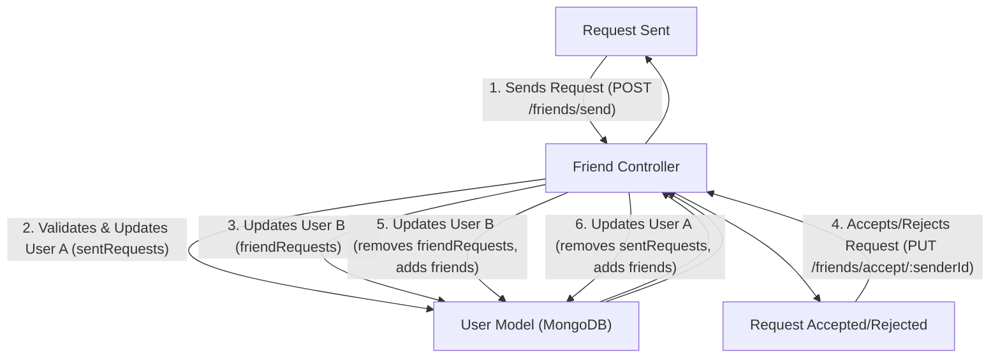

# Messaging and Friend Management
<TOC />

This section details the backend implementation for real-time messaging and robust friend management within the application. It covers how users can send and receive messages, manage their friend lists, send and respond to friend requests, and display user lists for chat interactions. The core logic resides in `friend.controller.js` and `message.controller.js`, utilizing MongoDB models for persistence and Socket.io for real-time updates.

## Friend Management

The `backend/src/controllers/friend.controller.js` file handles all operations related to managing user friendships and requests. This includes sending, accepting, rejecting, and removing friend relationships, as well as retrieving lists of friends and pending requests. The `User` model, which includes arrays for `friends`, `sentRequests`, and `friendRequests`, is central to these operations.

### Sending a Friend Request

The `sendFriendRequest` function allows a user to send a friend request to another user. It identifies the receiver by either username or email and performs several checks to prevent duplicate requests or requests to oneself. Upon successful validation, it updates the `sentRequests` array for the sender and `friendRequests` array for the receiver.

```javascript
// backend/src/controllers/friend.controller.js
export const sendFriendRequest = async (req, res) => {
    try {
        const { identifier } = req.body;
        const senderId = req.user._id;

        // Find receiver by username OR email
        const receiver = await User.findOne({
            $or: [{ username: identifier }, { email: identifier }]
        });
        // ... (validation and self-request check) ...

        const sender = await User.findById(senderId);

        // --- Rest of the logic is the same ---
        if (sender.friends.includes(receiverId)) { /* ... */ }
        if (sender.sentRequests.includes(receiverId)) { /* ... */ }
        if (sender.friendRequests.includes(receiverId)) { /* ... */ }

        sender.sentRequests.push(receiverId);
        receiver.friendRequests.push(senderId);

        await sender.save();
        await receiver.save();

        res.status(200).json({ message: "Friend request sent successfully." });

    } catch (error) {
        console.error("Error in sendFriendRequest: ", error.message);
        res.status(500).json({ message: "Internal server error", error: error.message });
    }
};
```
[View on GitHub](https://github.com/shinymack/Chat-App-MERN/blob/main/backend/src/controllers/friend.controller.js#L14-L62)

### Accepting a Friend Request

When a user accepts a friend request, the `acceptFriendRequest` function ensures the request exists and then moves both users' IDs into each other's `friends` list. Concurrently, it removes the respective entries from `friendRequests` (for the receiver) and `sentRequests` (for the sender), maintaining data integrity.

```javascript
// backend/src/controllers/friend.controller.js
export const acceptFriendRequest = async (req, res) => {
    try {
        const { senderId } = req.params;
        const receiverId = req.user._id;

        const sender = await User.findById(senderId);
        const receiver = await User.findById(receiverId);

        if (!sender || !receiver) { /* ... */ }
        if (!receiver.friendRequests.includes(senderId)) { /* ... */ }

        // Add to friends list for both users
        receiver.friends.push(senderId);
        sender.friends.push(receiverId);

        // Remove from requests lists
        receiver.friendRequests = receiver.friendRequests.filter(id => id.toString() !== senderId.toString());
        sender.sentRequests = sender.sentRequests.filter(id => id.toString() !== receiverId.toString());

        await receiver.save();
        await sender.save();

        res.status(200).json({ message: "Friend request accepted." });

    } catch (error) {
        console.error("Error in acceptFriendRequest: ", error.message);
        res.status(500).json({ message: "Internal server error", error: error.message });
    }
};
```
[View on GitHub](https://github.com/shinymack/Chat-App-MERN/blob/main/backend/src/controllers/friend.controller.js#L65-L100)

### Rejecting and Removing Friends

Similar to accepting, the `rejectFriendRequest` function simply filters out the request from both users' respective arrays (`friendRequests` for receiver, `sentRequests` for sender). The `removeFriend` function removes an existing friend by filtering their ID out of both users' `friends` lists.

```javascript
// backend/src/controllers/friend.controller.js
export const rejectFriendRequest = async (req, res) => {
    try {
        const { senderId } = req.params;
        const receiverId = req.user._id;

        const sender = await User.findById(senderId);
        const receiver = await User.findById(receiverId);
        // ... (user existence checks) ...

        receiver.friendRequests = receiver.friendRequests.filter(id => id.toString() !== senderId.toString());
        sender.sentRequests = sender.sentRequests.filter(id => id.toString() !== receiverId.toString());

        await receiver.save();
        await sender.save();

        res.status(200).json({ message: "Friend request rejected." });

    } catch (error) { /* ... */ }
};

export const removeFriend = async (req, res) => {
    try {
        const { friendId } = req.params;
        const userId = req.user._id;

        const user = await User.findById(userId);
        const friendToRemove = await User.findById(friendId);
        // ... (user existence and friendship checks) ...

        user.friends = user.friends.filter(id => id.toString() !== friendId.toString());
        friendToRemove.friends = friendToRemove.friends.filter(id => id.toString() !== userId.toString());

        await user.save();
        await friendToRemove.save();

        res.status(200).json({ message: "Friend removed successfully." });

    } catch (error) { /* ... */ }
};
```
[View `rejectFriendRequest` on GitHub](https://github.com/shinymack/Chat-App-MERN/blob/main/backend/src/controllers/friend.controller.js#L103-L135)
[View `removeFriend` on GitHub](https://github.com/shinymack/Chat-App-MERN/blob/main/backend/src/controllers/friend.controller.js#L138-L170)

### Retrieving Friend Lists and Requests

Functions like `getFriends`, `getPendingRequests`, and `getSentRequests` leverage MongoDB's `populate` method to retrieve detailed user information (username, email, profile picture) for the IDs stored in the respective arrays, rather than just the IDs themselves. This simplifies data retrieval for the frontend.

```javascript
// backend/src/controllers/friend.controller.js
export const getFriends = async (req, res) => {
    try {
        const userId = req.user._id;
        const user = await User.findById(userId).populate({
            path: "friends",
            select: "username email profilePic _id"
        });

        if (!user) { /* ... */ }
        res.status(200).json(user.friends);

    } catch (error) { /* ... */ }
};

export const getPendingRequests = async (req, res) => {
    try {
        const userId = req.user._id;
        const user = await User.findById(userId).populate({
            path: "friendRequests",
            select: "username email profilePic _id"
        });

        if (!user) { /* ... */ }
        res.status(200).json(user.friendRequests);

    } catch (error) { /* ... */ }
};
```
[View `getFriends` on GitHub](https://github.com/shinymack/Chat-App-MERN/blob/main/backend/src/controllers/friend.controller.js#L173-L197)
[View `getPendingRequests` on GitHub](https://github.com/shinymack/Chat-App-MERN/blob/main/backend/src/controllers/friend.controller.js#L200-L224)

### Friend Request Lifecycle





## Messaging System

The real-time messaging capabilities are managed by `backend/src/controllers/message.controller.js`, with message data stored according to `backend/src/models/message.model.js`. Communication occurs over dedicated routes defined in `backend/src/routes/message.route.js`.

### Message Model

The `Message` Mongoose model defines the structure for chat messages. Each message links to a sender and receiver `User` ID, contains optional `text` and `image` fields, and automatically includes `timestamps`.

```javascript
// backend/src/models/message.model.js
import mongoose from "mongoose";

const messageSchema = new mongoose.Schema(
    {
     senderId: {
        type: mongoose.Schema.Types.ObjectId,
        ref: "User",
        required: true,
     },
     receiverId: {
        type: mongoose.Schema.Types.ObjectId,
        ref: "User",
        required: true,
     },
     text: {
        type: String,
     },
     image: {
        type: String,
     },
    },
    {timestamps: true}
);

export default mongoose.model("Message", messageSchema);
```
[View on GitHub](https://github.com/shinymack/Chat-App-MERN/blob/main/backend/src/models/message.model.js#L3-L25)

### Retrieving Users for Chat Sidebar

The `getUsersForSidebar` function fetches all users *except* the currently logged-in user, omitting their password hashes. This list populates the chat sidebar, allowing users to initiate new conversations.

```javascript
// backend/src/controllers/message.controller.js
export const getUsersForSidebar = async (req, res) => {
    try {
        const loggedInUserId = req.user._id;
        const filteredUsers = await User.find({
            _id: { $ne: loggedInUserId }}).select("-password");
        res.status(200).json(filteredUsers);
    }
    catch (error) {
        console.log("Error in getUsersForSidebar: ", error);
        res.status(500).json({ error: "Internal Server Error" });
    }
};
```
[View on GitHub](https://github.com/shinymack/Chat-App-MERN/blob/main/backend/src/controllers/message.controller.js#L6-L15)

### Fetching Chat Messages

The `getMessages` function retrieves all messages exchanged between two specific users. It uses a `$or` query to find messages where the current user is either the sender or the receiver, effectively collecting the entire conversation history.

```javascript
// backend/src/controllers/message.controller.js
export const getMessages = async (req, res) => {
    try {
        const {id : userToChatId } = req.params;
        const myId = req.user._id;

        const messages = await Message.find({
            $or: [
                {senderId: myId, receiverId:userToChatId},
                {senderId: userToChatId, receiverId: myId}
            ]
        });
        res.status(200).json(messages);
    } catch (error) {
        console.log("Error in getMessages controller:  ", error);
        res.status(500).json({ error: "Internal Server Error" });
    }
};
```
[View on GitHub](https://github.com/shinymack/Chat-App-MERN/blob/main/backend/src/controllers/message.controller.js#L18-L30)

### Sending Messages with Real-time Updates

The `sendMessage` function handles creating new messages. If an image is included in the message, it's uploaded to Cloudinary, and the secure URL is stored. After saving the message to the database, the function leverages Socket.io to emit a `newMessage` event to the receiver if they are online, enabling real-time chat functionality.

```javascript
// backend/src/controllers/message.controller.js
import cloudinary from "../lib/cloudinary.js";
import { getReceiverSocketId, io } from "../lib/socket.js";

export const sendMessage = async (req, res) => {
    try {
        const { text, image } = req.body;
        const { id: receiverId } = req.params;
        const senderId = req.user._id;

        let imageUrl;
        if (image) {
            const uploadResponse = await cloudinary.uploader.upload(image);
            imageUrl = uploadResponse.secure_url;
        }
        const newMessage = new Message({
            senderId,
            receiverId,
            text,
            image: imageUrl,
        });

        await newMessage.save();

        const receiverSocketId = getReceiverSocketId(receiverId);

        if(receiverSocketId) {
            io.to(receiverSocketId).emit("newMessage", newMessage);
        }

        res.status(201).json(newMessage);

    } catch (error) {
        console.log("Error in sendMessage controller:  ", error);
        res.status(500).json({ error: "Internal Server Error" });
    }
};
```
[View on GitHub](https://github.com/shinymack/Chat-App-MERN/blob/main/backend/src/controllers/message.controller.js#L33-L58)

### Real-time Message Flow


```mermaid
sequenceDiagram
    participant S as "Sender (Frontend)"
    participant MC as "Message Controller"
    participant C as "Cloudinary"
    participant MM as "Message Model (MongoDB)"
    participant SS as "Socket.io Server"
    participant RS as "Receiver Socket"
    participant R as "Receiver (Frontend)"

    S->>+MC: "POST /api/messages/send/:id {text, image}"
    alt If image exists
        MC->>+C: "Upload Image"
        C-->>-MC: "Image URL"
    end
    MC->>+MM: "Create New Message Document"
    MM-->>-MC: "New Message"
    MC->>SS: "Get Receiver Socket ID"
    alt Receiver is online
        SS->>RS: "Emit 'newMessage' event"
        RS-->>-R: "New Message Received"
    end
    MC-->>-S: "201 OK (New Message)"
```


## Key Integration Points

*   **User Model as Central Hub**: The `User` model (`backend/src/models/user.model.js` - not detailed here but implied by controller usage) serves as the central data store for friendships. It includes arrays to track friends, sent requests, and received requests, simplifying friend management logic.
*   **MongoDB `populate`**: Extensive use of `populate` in `getFriends`, `getPendingRequests`, and `getSentRequests` ensures that related user data is efficiently retrieved with minimal additional queries, providing a richer data experience to the frontend.
*   **Cloudinary for Media**: Integration with Cloudinary allows for robust image storage and delivery in chat messages, offloading media management from the main application server.
*   **Socket.io for Real-time**: The application leverages Socket.io for instant message delivery, providing a seamless real-time chat experience. The `getReceiverSocketId` and `io.to(socketId).emit()` pattern is crucial for targeting specific online users.
*   **Modular Routing**: The separation of messaging routes (`backend/src/routes/message.route.js`) and friend routes (`backend/src/routes/friend.route.js` - not provided but logically present) ensures a clean and maintainable API structure.
*   **Error Handling**: Consistent `try-catch` blocks in all controller functions provide robust error handling, returning informative status codes and messages to the client.

Next: [Cloud Services and Utilities](./2.3_cloud-services-and-utilities.mdx)