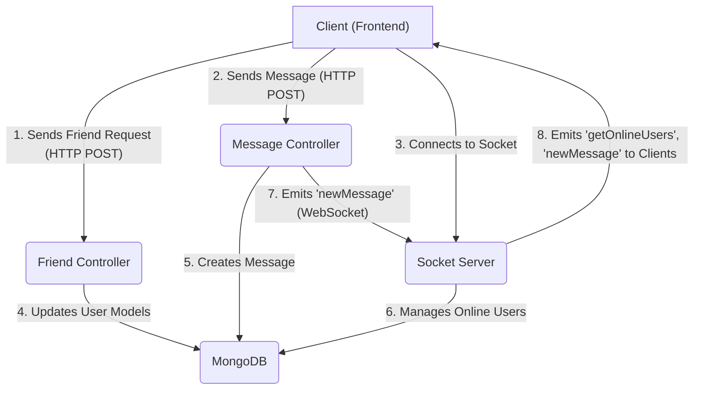
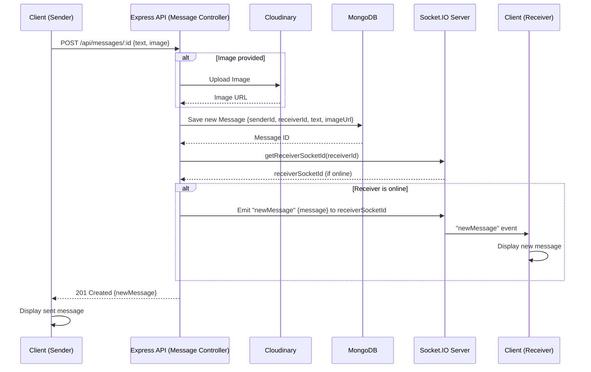

---
title: "Messaging and Friend Management"
description: "Explains the implementation of real-time messaging, friend requests, and user interactions."
sidebar_position: 22
---

# Messaging and Friend Management

<TOC />

## System Purpose

This section details the core functionalities for real-time communication and social interactions within the application, encompassing friend request management and direct messaging capabilities. These features are fundamental to fostering user engagement and enabling a connected experience.

### Functionalities

*   **Friend Request Management:** Users can send, accept, and reject friend requests, establishing connections with other users.
*   **Friend List Management:** Connected users can view their list of friends and have the option to remove friends.
*   **Real-time Messaging:** Users can exchange text messages and share images in real-time with their friends.
*   **Online Presence:** The system tracks and displays which users are currently online, enhancing the real-time communication experience.
*   **User Discovery:** Users can find other potential friends via username or email for sending friend requests.

## Architecture

The messaging and friend management system is structured as a part of a MERN (MongoDB, Express, React, Node.js) stack application. The backend handles all business logic, data persistence, and real-time communication via WebSockets.

### Component Interaction Diagram





*   **Client (Frontend):** Initiates all user interactions, sending HTTP requests for friend management and messages, and establishing a WebSocket connection for real-time updates.
*   **Friend Controller:** Manages friend-related operations such as sending, accepting, rejecting requests, and listing/removing friends. It interacts with the `User` model in MongoDB.
*   **Message Controller:** Handles message sending and retrieval. It uses `Message` and `User` models and integrates with Cloudinary for image uploads. It also triggers real-time message delivery via the Socket Server.
*   **Socket Server:** Built with `socket.io`, it manages WebSocket connections, tracks online users, and facilitates real-time event broadcasting (e.g., `newMessage`, `getOnlineUsers`).
*   **MongoDB:** The NoSQL database used for persistent storage of user profiles, friend relationships, and message data.

## Technology Stack

The following technologies are leveraged to implement the messaging and friend management features:

| Layer / Aspect      | Technology       | Purpose                                                    |
| :------------------ | :--------------- | :--------------------------------------------------------- |
| **Backend Framework** | Node.js / Express | Server-side logic for API endpoints.                      |
| **Database**        | MongoDB          | Stores user data, friend relationships, and message history. |
| **ODM**             | Mongoose         | Object Data Modeling for MongoDB, simplifying data interaction. |
| **Real-time Comm.** | Socket.IO        | Enables bidirectional, low-latency communication for messaging and online presence. |
| **File Storage**    | Cloudinary       | External service for secure storage and delivery of media (e.g., message images). |
| **Authentication**  | JWT              | Secures API endpoints, ensuring only authenticated users can access resources. |

### Socket.IO Initialization

The real-time communication layer is built on `socket.io`. The server is initialized to listen for connections and manage user presence.

```javascript
// backend/src/lib/socket.js
import { Server } from "socket.io";
import http from "http";
import express from "express";

const app = express();
const server = http.createServer(app);

const io = new Server(server, {
    cors: {
        origin: ["http://localhost:5173"] // Configures CORS for the client
    }
})

// Stores userId to socketId mapping for direct messaging
const userSocketMap = {}; //{userId : socketId}

io.on("connection", (socket) => {
    console.log("A user connected", socket.id);

    const userId = socket.handshake.query.userId;
    if(userId) userSocketMap[userId] = socket.id;

    // Broadcast online users to all connected clients
    io.emit("getOnlineUsers", Object.keys(userSocketMap));

    socket.on("disconnect", ()=>{
        console.log("A user disconnected", socket.id);
        delete userSocketMap[userId];
        io.emit("getOnlineUsers", Object.keys(userSocketMap));
    })
})

export { io, app, server };
```
[[View on GitHub](https://github.com/shinymack/Chat-App-MERN/blob/main/backend/src/lib/socket.js#L1-L32)]

This snippet from `backend/src/lib/socket.js` demonstrates the setup of the Socket.IO server, including CORS configuration, user connection/disconnection handling, and maintaining a map of online users. The `getOnlineUsers` event is emitted globally to update all connected clients about user presence changes. The `userSocketMap` is crucial for directly addressing specific users for private message delivery.

## Features

### Friend Management

The `friend.controller.js` ([View on GitHub](https://github.com/shinymack/Chat-App-MERN/blob/main/backend/src/controllers/friend.controller.js)) orchestrates all friend-related operations. It utilizes the `User` model, which stores references to friends, sent requests, and received requests.

#### Sending a Friend Request

Users can send a friend request by providing a username or email. The system validates the request to prevent duplicate requests or self-requests.

```javascript
// backend/src/controllers/friend.controller.js
export const sendFriendRequest = async (req, res) => {
    try {
        const { identifier } = req.body; // Expecting { identifier: "some_username_or_email" }
        const senderId = req.user._id;

        if (!identifier) {
            return res.status(400).json({ message: "Username or email is required." });
        }

        // Find receiver by username OR email
        const receiver = await User.findOne({
            $or: [{ username: identifier }, { email: identifier }]
        });

        if (!receiver) {
            return res.status(404).json({ message: "User not found." });
        }

        const receiverId = receiver._id;

        if (senderId.toString() === receiverId.toString()) {
            return res.status(400).json({ message: "You cannot send a friend request to yourself." });
        }

        const sender = await User.findById(senderId);

        // Prevent duplicate states
        if (sender.friends.includes(receiverId)) {
            return res.status(400).json({ message: "You are already friends with this user." });
        }
        if (sender.sentRequests.includes(receiverId)) {
            return res.status(400).json({ message: "Friend request already sent." });
        }
        if (sender.friendRequests.includes(receiverId)) {
            return res.status(400).json({ message: "This user has already sent you a friend request." });
        }

        sender.sentRequests.push(receiverId);
        receiver.friendRequests.push(senderId);

        await sender.save();
        await receiver.save();

        res.status(200).json({ message: "Friend request sent successfully." });

    } catch (error) {
        console.error("Error in sendFriendRequest: ", error.message);
        res.status(500).json({ message: "Internal server error", error: error.message });
    }
};
```
[[View on GitHub](https://github.com/shinymack/Chat-App-MERN/blob/main/backend/src/controllers/friend.controller.js#L8-L64)]

This function handles the logic for `sendFriendRequest`. It first identifies the receiver using either a username or email. Crucially, it performs several checks to ensure the request is valid (e.g., not sending to self, not already friends, not a duplicate request). Upon successful validation, it updates the `sentRequests` array for the sender and `friendRequests` array for the receiver, then persists these changes.

#### Accepting a Friend Request

When a user accepts a request, both users' `friends` lists are updated, and the corresponding entries are removed from `sentRequests` and `friendRequests`.

```javascript
// backend/src/controllers/friend.controller.js
export const acceptFriendRequest = async (req, res) => {
    try {
        const { senderId } = req.params; // ID of the user who sent the request
        const receiverId = req.user._id; // Current user accepting the request

        const sender = await User.findById(senderId);
        const receiver = await User.findById(receiverId);

        if (!sender || !receiver) {
            return res.status(404).json({ message: "User not found." });
        }

        // Check if the request exists in receiver's friendRequests
        if (!receiver.friendRequests.includes(senderId)) {
            return res.status(400).json({ message: "Friend request not found or already handled." });
        }

        // Add to friends list for both users
        receiver.friends.push(senderId);
        sender.friends.push(receiverId);

        // Remove from requests lists
        receiver.friendRequests = receiver.friendRequests.filter(id => id.toString() !== senderId.toString());
        sender.sentRequests = sender.sentRequests.filter(id => id.toString() !== receiverId.toString());

        await receiver.save();
        await sender.save();

        res.status(200).json({ message: "Friend request accepted." });

    } catch (error) {
        console.error("Error in acceptFriendRequest: ", error.message);
        res.status(500).json({ message: "Internal server error", error: error.message });
    }
};
```
[[View on GitHub](https://github.com/shinymack/Chat-App-MERN/blob/main/backend/src/controllers/friend.controller.js#L67-L107)]

This `acceptFriendRequest` function ensures that the request actually exists before processing. It then performs atomic updates by adding each user to the other's `friends` list and simultaneously removing the request from their respective `friendRequests` and `sentRequests` arrays. This maintains data consistency across user profiles.

#### Retrieving Friend Lists and Requests

Users can fetch their current friends, pending incoming requests, and pending outgoing requests. These endpoints use Mongoose's `populate` feature to include relevant user details, such as `username`, `email`, and `profilePic`, for display.

```javascript
// backend/src/controllers/friend.controller.js
export const getFriends = async (req, res) => {
    try {
        const userId = req.user._id;
        const user = await User.findById(userId).populate({
            path: "friends",
            select: "username email profilePic _id"
        });

        if (!user) {
            return res.status(404).json({ message: "User not found." });
        }

        res.status(200).json(user.friends);

    } catch (error) {
        console.error("Error in getFriends: ", error.message);
        res.status(500).json({ message: "Internal server error", error: error.message });
    }
};
```
[[View on GitHub](https://github.com/shinymack/Chat-App-MERN/blob/main/backend/src/controllers/friend.controller.js#L175-L192)]

This `getFriends` function retrieves the current user's friends list. The `.populate()` method is crucial here, as it replaces the `ObjectId` references in the `friends` array with actual `User` documents, but only selects specific fields (`username`, `email`, `profilePic`, `_id`) to optimize data transfer and privacy. Similar logic applies to `getPendingRequests` and `getSentRequests`.

### Messaging

The `message.controller.js` ([View on GitHub](https://github.com/shinymack/Chat-App-MERN/blob/main/backend/src/controllers/message.controller.js)) is responsible for message exchange, storage, and real-time delivery. It interacts with the `Message` model and leverages `socket.io` for instant communication.

#### Message Model

The `Message` schema defines the structure for storing individual messages.

```javascript
// backend/src/models/message.model.js
import express from "express"; // This import is unused, typical copy-paste error
import mongoose from "mongoose";

const messageSchema = new mongoose.Schema(
    {
     senderId: {
        type: mongoose.Schema.Types.ObjectId,
        ref: "User",
        required: true,
     },
     receiverId: {
        type: mongoose.Schema.Types.ObjectId,
        ref: "User",
        required: true,
     },
     text: {
        type: String,
     },
     image: {
        type: String,
     },
    },
    {timestamps: true} // Automatically adds createdAt and updatedAt fields
);

export default mongoose.model("Message", messageSchema);
```
[[View on GitHub](https://github.com/shinymack/Chat-App-MERN/blob/main/backend/src/models/message.model.js#L1-L26)]

The `Message` model defines `senderId` and `receiverId` as references to the `User` model, ensuring message ownership and recipient identification. It supports both text and image content, with timestamps for chronological ordering. The `express` import on line 1 of the original file is extraneous and can be removed.

#### Sending a Message

Messages can contain text and/or an image. Image uploads are handled by Cloudinary before the message is saved to the database. Real-time delivery is achieved using `socket.io`.

```javascript
// backend/src/controllers/message.controller.js
export const sendMessage = async (req, res) => {
    try {
        const { text, image } = req.body;
        const { id: receiverId } = req.params;
        const senderId = req.user._id;

        let imageUrl;
        if (image) {
            // Upload image to Cloudinary if provided
            const uploadResponse = await cloudinary.uploader.upload(image);
            imageUrl = uploadResponse.secure_url;
        }

        const newMessage = new Message({
            senderId,
            receiverId,
            text,
            image: imageUrl, // Stores Cloudinary URL
        });

        await newMessage.save();

        // Real-time delivery via Socket.IO
        const receiverSocketId = getReceiverSocketId(receiverId);
        if(receiverSocketId) {
            io.to(receiverSocketId).emit("newMessage", newMessage);
        }

        res.status(201).json(newMessage);

    } catch (error) {
        console.log("Error in sendMessage controller:  ", error);
        res.status(500).json({ error: "Internal Server Error" });
    }
};
```
[[View on GitHub](https://github.com/shinymack/Chat-App-MERN/blob/main/backend/src/controllers/message.controller.js#L37-L70)]

The `sendMessage` function handles message creation and delivery. It checks for an `image` in the request body; if present, it uploads it to Cloudinary and stores the secure URL. A new `Message` document is then created and saved. Crucially, it uses `getReceiverSocketId` (from `backend/src/lib/socket.js`) to find the receiver's active socket and emits a `newMessage` event directly to that socket, ensuring real-time delivery without polling.

### Messaging Flow

The following diagram illustrates the lifecycle of a message, from creation to real-time delivery:





## Key Integration Points

### User Model and Friend Relationships

The `User` model is central to friend management. It contains three critical array fields: `friends`, `sentRequests`, and `friendRequests`. These arrays store `ObjectId` references to other `User` documents.

*   `friends`: An array of `ObjectId`s representing users who are mutually friends.
*   `sentRequests`: An array of `ObjectId`s of users to whom the current user has sent a friend request.
*   `friendRequests`: An array of `ObjectId`s of users who have sent a friend request to the current user.

This design allows for efficient lookup and management of relationship states directly within the user's document. When fetching friend lists or requests, the `.populate()` method is extensively used to retrieve essential user details without exposing sensitive information like passwords.

### Real-time Messaging and Online Presence

The integration of `socket.io` with the Express backend is crucial for the real-time aspects of the application.

*   **Online Status:** The `socket.js` module maintains `userSocketMap` to track which users are currently connected and their corresponding `socket.id`. This map is used to emit `getOnlineUsers` events, informing all clients about who is online, and to directly target specific users for private messages.
*   **Direct Message Delivery:** When a message is sent via the `sendMessage` endpoint, after persistence to MongoDB, the `message.controller.js` queries `socket.js` for the receiver's `socket.id`. If found, `socket.io` directly emits the `newMessage` event to the receiver's client, ensuring instantaneous delivery. This approach bypasses traditional HTTP request-response cycles for real-time updates, significantly improving user experience.
*   **Scalability Insight:** While `userSocketMap` works well for smaller applications, for very large-scale systems with multiple Node.js instances, this map would need to be replaced with a shared state store (e.g., Redis) to ensure consistent online presence tracking across all servers. Similarly, `socket.io` can be configured with adapters (like `socket.io-redis`) to enable horizontal scaling.

### Cloudinary Integration

For multimedia messaging, Cloudinary serves as an external cloud storage and image manipulation service. This offloads the burden of file storage and processing from the application's own servers, contributing to better scalability and performance. Images are uploaded directly via a `multipart/form-data` request from the client (or Base64 encoded in the current implementation), processed by Cloudinary, and only the secure URL is stored in the `Message` model, keeping the database light.

### API Flow and Authentication

All friend management and messaging endpoints are typically protected by authentication middleware (e.g., JWT verification). The `req.user._id` (derived from the authenticated token) is consistently used to identify the current user, ensuring that actions are performed on behalf of the correct user and preventing unauthorized access. This also simplifies the API, as the sender's ID doesn't need to be explicitly passed in the request body.

Next: [Backend Utilities and Services](./2.3_backend-utilities-and-services.mdx)
```