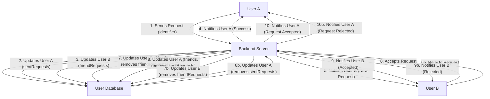
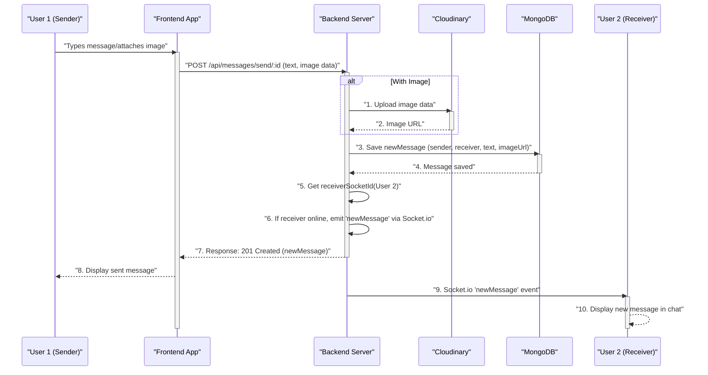

# Messaging and Friend System

<TOC />

This section details the robust friend management and real-time messaging capabilities within the application. It covers sending, accepting, and rejecting friend requests, managing friend lists, and the core functionalities for one-on-one instant messaging, including image support and real-time delivery via WebSockets.

## Friend Management System

The friend management system allows users to connect with each other, maintaining a social graph within the application. It supports sending requests, managing pending requests, and viewing current friends.

### Sending Friend Requests

Users can initiate a friend request by providing the username or email of another user. The system checks for existing friendships, pending requests, and self-requests to prevent redundant or invalid actions.

```javascript
// backend/src/controllers/friend.controller.js
// sendFriendRequest
export const sendFriendRequest = async (req, res) => {
    try {
        const { identifier } = req.body;
        const senderId = req.user._id;

        // Find receiver by username OR email
        const receiver = await User.findOne({
            $or: [{ username: identifier }, { email: identifier }]
        });

        if (!receiver) {
            return res.status(404).json({ message: "User not found." });
        }
        
        const receiverId = receiver._id;

        // ... (snip) ... checks for self-request, existing friends, sent/received requests

        sender.sentRequests.push(receiverId);
        receiver.friendRequests.push(senderId);

        await sender.save();
        await receiver.save();

        res.status(200).json({ message: "Friend request sent successfully." });

    } catch (error) {
        console.error("Error in sendFriendRequest: ", error.message);
        res.status(500).json({ message: "Internal server error", error: error.message });
    }
};
```
[View on GitHub](https://github.com/shinymack/Chat-App-MERN/blob/main/backend/src/controllers/friend.controller.js#L14-L63)

### Accepting and Rejecting Requests

Upon receiving a friend request, users can choose to accept or reject it. Accepting a request adds both users to each other's friend lists and removes the request from their respective pending/sent lists. Rejecting a request simply removes it.

```javascript
// backend/src/controllers/friend.controller.js
// acceptFriendRequest
export const acceptFriendRequest = async (req, res) => {
    try {
        const { senderId } = req.params;
        const receiverId = req.user._id;

        const sender = await User.findById(senderId);
        const receiver = await User.findById(receiverId);

        // ... (snip) ... checks for user existence and request validity

        receiver.friends.push(senderId);
        sender.friends.push(receiverId);

        receiver.friendRequests = receiver.friendRequests.filter(id => id.toString() !== senderId.toString());
        sender.sentRequests = sender.sentRequests.filter(id => id.toString() !== receiverId.toString());

        await receiver.save();
        await sender.save();

        res.status(200).json({ message: "Friend request accepted." });

    } catch (error) {
        console.error("Error in acceptFriendRequest: ", error.message);
        res.status(500).json({ message: "Internal server error", error: error.message });
    }
};
```
[View on GitHub](https://github.com/shinymack/Chat-App-MERN/blob/main/backend/src/controllers/friend.controller.js#L66-L109)

### Removing Friends

Users can remove existing friends from their friend list. This action simultaneously removes the friendship from both users' records.

```javascript
// backend/src/controllers/friend.controller.js
// removeFriend
export const removeFriend = async (req, res) => {
    try {
        const { friendId } = req.params;
        const userId = req.user._id;

        const user = await User.findById(userId);
        const friendToRemove = await User.findById(friendId);

        // ... (snip) ... checks for user existence and existing friendship

        user.friends = user.friends.filter(id => id.toString() !== friendId.toString());
        friendToRemove.friends = friendToRemove.friends.filter(id => id.toString() !== userId.toString());

        await user.save();
        await friendToRemove.save();

        res.status(200).json({ message: "Friend removed successfully." });

    } catch (error) {
        console.error("Error in removeFriend: ", error.message);
        res.status(500).json({ message: "Internal server error", error: error.message });
    }
};
```
[View on GitHub](https://github.com/shinymack/Chat-App-MERN/blob/main/backend/src/controllers/friend.controller.js#L156-L191)

### Retrieving Friend Lists and Requests

The system provides dedicated endpoints to fetch a user's current friends, pending incoming friend requests, and outgoing sent requests. These endpoints populate relevant user details like `username`, `email`, and `profilePic`.

```javascript
// backend/src/controllers/friend.controller.js
// getFriends
export const getFriends = async (req, res) => {
    try {
        const userId = req.user._id;
        const user = await User.findById(userId).populate({
            path: "friends",
            select: "username email profilePic _id" 
        });

        if (!user) {
            return res.status(404).json({ message: "User not found." });
        }

        res.status(200).json(user.friends);

    } catch (error) {
        console.error("Error in getFriends: ", error.message);
        res.status(500).json({ message: "Internal server error", error: error.message });
    }
};
```
[View on GitHub](https://github.com/shinymack/Chat-App-MERN/blob/main/backend/src/controllers/friend.controller.js#L194-L215)

### Friend Request Workflow
The following diagram illustrates the typical flow for managing friend requests.





## Real-time Messaging System

The messaging system enables users to have private, real-time conversations, supporting both text and image messages. It leverages WebSockets for instant delivery and Cloudinary for image hosting.

### Message Data Model

The `Message` schema in MongoDB is straightforward, linking messages to a sender and receiver, and storing the message content (text or an image URL).

```javascript
// backend/src/models/message.model.js
import express from "express";
import mongoose from "mongoose";

const messageSchema = new mongoose.Schema(
    {
     senderId: {
        type: mongoose.Schema.Types.ObjectId,
        ref: "User",
        required: true,
     },
     receiverId: {
        type: mongoose.Schema.Types.ObjectId,
        ref: "User",
        required: true,
     },
     text: {
        type: String,
     },
     image: {
        type: String, // URL to the image hosted on Cloudinary
     },
    },
    {timestamps: true} // Adds createdAt and updatedAt fields
);

export default mongoose.model("Message", messageSchema);
```
[View on GitHub](https://github.com/shinymack/Chat-App-MERN/blob/main/backend/src/models/message.model.js#L1-L26)

### Fetching Conversations

Users can retrieve the history of messages exchanged with a specific chat partner. The query identifies messages where the current user is either the sender or the receiver with the target user.

```javascript
// backend/src/controllers/message.controller.js
// getMessages
export const getMessages = async (req, res) => {
    try {
        const {id : userToChatId } = req.params;
        const myId = req.user._id;

        const messages = await Message.find({
            $or: [
                {senderId: myId, receiverId:userToChatId},
                {senderId: userToChatId, receiverId: myId}
            ]
        });
        res.status(200).json(messages);
    } catch (error) {
        console.log("Error in getMessages controller:  ", error);
        res.status(500).json({ error: "Internal Server Error" });
    }
};
```
[View on GitHub](https://github.com/shinymack/Chat-App-MERN/blob/main/backend/src/controllers/message.controller.js#L26-L40)

### Sending Messages (Text and Image)

The `sendMessage` controller handles both text and image messages. If an image is provided, it's first uploaded to Cloudinary, and the secure URL is stored. After saving the message to the database, it attempts to emit the new message in real-time to the receiver via Socket.io.

```javascript
// backend/src/controllers/message.controller.js
// sendMessage
import cloudinary from "../lib/cloudinary.js"; // Cloudinary integration
import { getReceiverSocketId, io } from "../lib/socket.js"; // Socket.io utilities

export const sendMessage = async (req, res) => {
    try {
        const { text, image } = req.body;
        const { id: receiverId } = req.params;
        const senderId = req.user._id;

        let imageUrl;
        if (image) {
            const uploadResponse = await cloudinary.uploader.upload(image);
            imageUrl = uploadResponse.secure_url;
        }
        const newMessage = new Message({
            senderId,
            receiverId,
            text,
            image: imageUrl,
        });

        await newMessage.save(); // Save message to MongoDB

        const receiverSocketId = getReceiverSocketId(receiverId);
        if(receiverSocketId) {
            io.to(receiverSocketId).emit("newMessage", newMessage); // Real-time delivery
        }

        res.status(201).json(newMessage);   
        
    } catch (error) {
        console.log("Error in sendMessage controller:  ", error);
        res.status(500).json({ error: "Internal Server Error" });
    }
};
```
[View on GitHub](https://github.com/shinymack/Chat-App-MERN/blob/main/backend/src/controllers/message.controller.js#L42-L73)

### Real-time Messaging Flow
This sequence diagram illustrates how messages are sent and delivered in real-time.





## API Routes

The following table summarizes the primary API endpoints related to messaging and friend management. All routes are protected by the `protectRoute` middleware, ensuring only authenticated users can access them.

| Method | Endpoint                    | Controller Function         | Description                                        |
| :----- | :-------------------------- | :-------------------------- | :------------------------------------------------- |
| `GET`  | `/api/friends`              | `getFriends`                | Get current user's friends                         |
| `POST` | `/api/friends/send`         | `sendFriendRequest`         | Send a friend request by username or email         |
| `PUT`  | `/api/friends/accept/:senderId` | `acceptFriendRequest`       | Accept a pending friend request                    |
| `PUT`  | `/api/friends/reject/:senderId` | `rejectFriendRequest`       | Reject a pending friend request                    |
| `DELETE` | `/api/friends/remove/:friendId` | `removeFriend`              | Remove an existing friend                          |
| `GET`  | `/api/friends/pending`      | `getPendingRequests`        | Get incoming friend requests for the current user  |
| `GET`  | `/api/friends/sent`         | `getSentRequests`           | Get outgoing friend requests sent by the current user |
| `GET`  | `/api/messages/users`       | `getUsersForSidebar`        | Get list of users for chat sidebar (excluding self) |
| `GET`  | `/api/messages/:id`         | `getMessages`               | Get conversation history with a specific user      |
| `POST` | `/api/messages/send/:id`    | `sendMessage`               | Send a new message (text or image) to a user       |

[View message.route.js on GitHub](https://github.com/shinymack/Chat-App-MERN/blob/main/backend/src/routes/message.route.js)

## Key Integration Points

*   **User Model:** The `User` model is extended with `friends`, `sentRequests`, and `friendRequests` arrays, storing `ObjectId` references to other users. This allows for efficient population and management of social connections directly within the user document.
*   **Socket.io:** Crucial for real-time messaging, `Socket.io` facilitates instant delivery of new messages without requiring the client to constantly poll the server. The `getReceiverSocketId` utility ensures messages are directed only to the intended recipient's active socket.
*   **Cloudinary:** Integrated with the `sendMessage` controller, Cloudinary handles the secure upload and hosting of image attachments, decoupling media storage from the application server.
*   **Authentication Middleware:** All messaging and friend system routes are protected, ensuring that only authenticated users can perform these actions, relying on JWT verification.

Next: [Cloudinary Integration and Utilities](./2.3_cloudinary-integration-and-utilities.mdx)