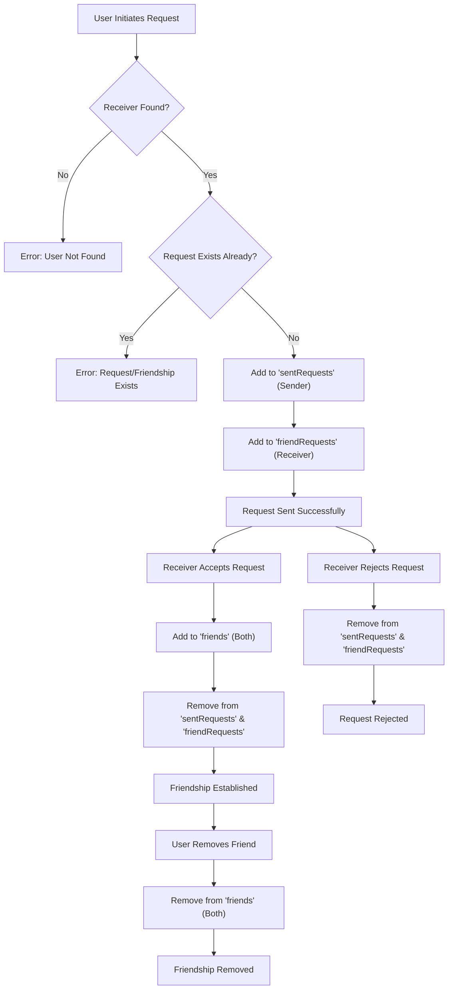
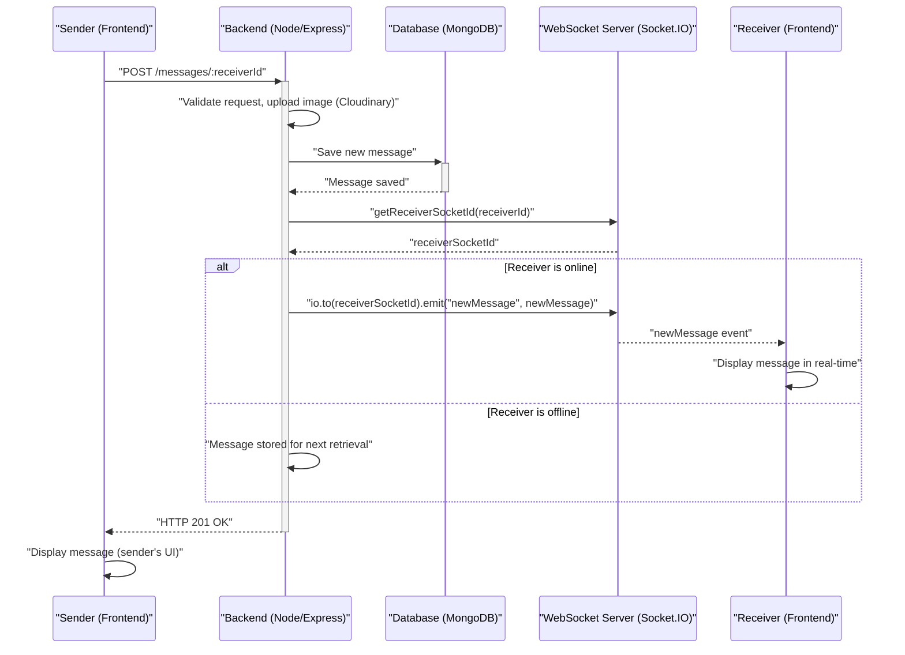

# Messaging and Real-time Communication

<TOC />

This section details the backend architecture responsible for managing friend relationships and facilitating real-time messaging. It covers the core logic for sending, receiving, and managing messages, including the setup for real-time communication using WebSockets.

## Friend Management

The `backend/src/controllers/friend.controller.js` file handles all operations related to friend management, including sending, accepting, rejecting, and removing friend requests, as well as retrieving lists of friends and pending requests. These functionalities are crucial for establishing connections between users before real-time messaging can commence.

### Friend Request Flow

The system supports a robust friend request mechanism, ensuring users can connect securely and efficiently.

#### Sending a Friend Request

When a user initiates a friend request, the `sendFriendRequest` controller processes the request. It validates the receiver's existence and checks for pre-existing relationships (already friends, request already sent, or request already received from the target user) before updating the `sentRequests` array of the sender and `friendRequests` array of the receiver.

```javascript
// backend/src/controllers/friend.controller.js
export const sendFriendRequest = async (req, res) => {
    try {
        const { identifier } = req.body;
        const senderId = req.user._id;

        // Find receiver by username OR email
        const receiver = await User.findOne({
            $or: [{ username: identifier }, { email: identifier }]
        });

        if (!receiver) {
            return res.status(404).json({ message: "User not found." });
        }
        
        const receiverId = receiver._id;

        // ... (omitted checks for self-request, existing friends, etc.)

        sender.sentRequests.push(receiverId);
        receiver.friendRequests.push(senderId);

        await sender.save();
        await receiver.save();

        res.status(200).json({ message: "Friend request sent successfully." });

    } catch (error) {
        console.error("Error in sendFriendRequest: ", error.message);
        res.status(500).json({ message: "Internal server error", error: error.message });
    }
};
```
[View on GitHub](https://github.com/shinymack/Chat-App-MERN/blob/main/backend/src/controllers/friend.controller.js#L14-L67)

#### Accepting or Rejecting a Friend Request

Upon receiving a request, the user can either `acceptFriendRequest` or `rejectFriendRequest`. Accepting a request moves both users' IDs into each other's `friends` array and removes the request from the respective `friendRequests` and `sentRequests` arrays. Rejecting a request simply removes it from both arrays without establishing a friendship.

```javascript
// backend/src/controllers/friend.controller.js
export const acceptFriendRequest = async (req, res) => {
    try {
        const { senderId } = req.params;
        const receiverId = req.user._id;

        const sender = await User.findById(senderId);
        const receiver = await User.findById(receiverId);

        // ... (omitted checks for user existence and request presence)

        receiver.friends.push(senderId);
        sender.friends.push(receiverId);

        receiver.friendRequests = receiver.friendRequests.filter(id => id.toString() !== senderId.toString());
        sender.sentRequests = sender.sentRequests.filter(id => id.toString() !== receiverId.toString());

        await receiver.save();
        await sender.save();

        res.status(200).json({ message: "Friend request accepted." });

    } catch (error) {
        console.error("Error in acceptFriendRequest: ", error.message);
        res.status(500).json({ message: "Internal server error", error: error.message });
    }
};
```
[View on GitHub](https://github.com/shinymack/Chat-App-MERN/blob/main/backend/src/controllers/friend.controller.js#L70-L107)

### Friend Management Flow Diagram

Here's a diagram illustrating the friend request lifecycle:





## Messaging System

The core messaging functionalities are managed by `backend/src/controllers/message.controller.js` and persist message data via `backend/src/models/message.model.js`. Real-time capabilities are provided through `backend/src/lib/socket.js`.

### Message Model

The `Message` Mongoose model defines the structure for storing individual messages. Each message includes references to the `senderId` and `receiverId` (both `User` ObjectId references), the message `text`, and an optional `image` URL. Timestamps are automatically managed.

```javascript
// backend/src/models/message.model.js
import mongoose from "mongoose";

const messageSchema = new mongoose.Schema(
    {
     senderId: {
        type: mongoose.Schema.Types.ObjectId,
        ref: "User",
        required: true,
     },
     receiverId: {
        type: mongoose.Schema.Types.ObjectId,
        ref: "User",
        required: true,
     },
     text: {
        type: String,
     },
     image: {
        type: String,
     },
    },
    {timestamps: true}
);

export default mongoose.model("Message", messageSchema);
```
[View on GitHub](https://github.com/shinymack/Chat-App-MERN/blob/main/backend/src/models/message.model.js#L5-L26)

### Sending Messages

The `sendMessage` controller handles incoming message requests. It creates a new `Message` document, optionally uploads an image to Cloudinary, and saves the message to the database. Critically, it then uses Socket.IO to emit the new message in real-time to the receiver if they are online.

```javascript
// backend/src/controllers/message.controller.js
export const sendMessage = async (req, res) => {
    try {
        const { text, image } = req.body;
        const { id: receiverId } = req.params;
        const senderId = req.user._id;

        let imageUrl;
        if (image) {
            const uploadResponse = await cloudinary.uploader.upload(image);
            imageUrl = uploadResponse.secure_url;
        }

        const newMessage = new Message({
            senderId,
            receiverId,
            text,
            image: imageUrl,
        });

        await newMessage.save();

        const receiverSocketId = getReceiverSocketId(receiverId);

        if(receiverSocketId) {
            io.to(receiverSocketId).emit("newMessage", newMessage);
        }

        res.status(201).json(newMessage);   
        
    } catch (error) {
        console.log("Error in sendMessage controller:  ", error);
        res.status(500).json({ error: "Internal Server Error" });
    }
};
```
[View on GitHub](https://github.com/shinymack/Chat-App-MERN/blob/main/backend/src/controllers/message.controller.js#L50-L84)

### Retrieving Messages

The `getMessages` controller fetches all messages between two specific users. It queries the `Message` collection for messages where either the current user is the sender and the specified `userToChatId` is the receiver, or vice versa.

```javascript
// backend/src/controllers/message.controller.js
export const getMessages = async (req, res) => {
    try {
        const {id : userToChatId } = req.params;
        const myId = req.user._id;

        const messages = await Message.find({
            $or: [
                {senderId: myId, receiverId:userToChatId},
                {senderId: userToChatId, receiverId: myId}
            ]
        });
        res.status(200).json(messages);
    } catch (error) {
        console.log("Error in getMessages controller:  ", error);
        res.status(500).json({ error: "Internal Server Error" });
    }
};
```
[View on GitHub](https://github.com/shinymack/Chat-App-MERN/blob/main/backend/src/controllers/message.controller.js#L32-L47)

### Real-time Communication with Socket.IO

`backend/src/lib/socket.js` initializes and manages the Socket.IO server, enabling real-time functionalities such as instant message delivery and online user presence.

#### Online User Tracking

The `userSocketMap` object stores the `socketId` for each `userId` that is currently connected. This map is crucial for targeting specific users with real-time events. Upon connection, a user's `userId` is added to the map, and upon disconnection, it is removed. The list of `getOnlineUsers` is broadcast to all connected clients whenever the online status changes.

```javascript
// backend/src/lib/socket.js
import { Server } from "socket.io";
import http from "http";
import express from "express";

const app = express();
const server = http.createServer(app);
const io = new Server(server, {
    cors: {
        origin: ["http://localhost:5173"]
    }
})

export function getReceiverSocketId(userId) {
    return userSocketMap[userId];
}

const userSocketMap = {}; //{userId : socketId}

io.on("connection", (socket) => {
    console.log("A user connected", socket.id);

    const userId = socket.handshake.query.userId;
    if(userId) userSocketMap[userId] = socket.id;

    io.emit("getOnlineUsers", Object.keys(userSocketMap));

    socket.on("disconnect", ()=>{
        console.log("A user disconnected", socket.id);
        delete userSocketMap[userId]; 
        io.emit("getOnlineUsers", Object.keys(userSocketMap));
    })
})

export { io, app, server };
```
[View on GitHub](https://github.com/shinymack/Chat-App-MERN/blob/main/backend/src/lib/socket.js)

### Real-time Messaging Flow Diagram

This diagram illustrates the flow of a real-time message from sender to receiver:





## Key Integration Points

*   **User Model Linkage**: The `User` model (`backend/src/models/user.model.js`, not explicitly provided but implied by `friend.controller.js` and `message.model.js`) is central. It stores `friends`, `sentRequests`, and `friendRequests` arrays, facilitating relationships. The `Message` model directly references `User` `_id`s for `senderId` and `receiverId`.
*   **Authentication Middleware**: All friend and message controllers implicitly rely on authentication middleware (`req.user._id`) to identify the current user, ensuring secure operations.
*   **Cloudinary Integration**: For messages with images, `backend/src/lib/cloudinary.js` is used by the `sendMessage` controller to handle image uploads and secure URL generation.
*   **Frontend-Backend Communication**: HTTP requests are used for initial friend actions and message history retrieval. WebSocket connections (Socket.IO) provide the real-time layer for instant message delivery and online status updates, enhancing the interactive user experience.

Next: [Backend Utilities and Services](./2.3_backend-utilities-and-services.mdx)