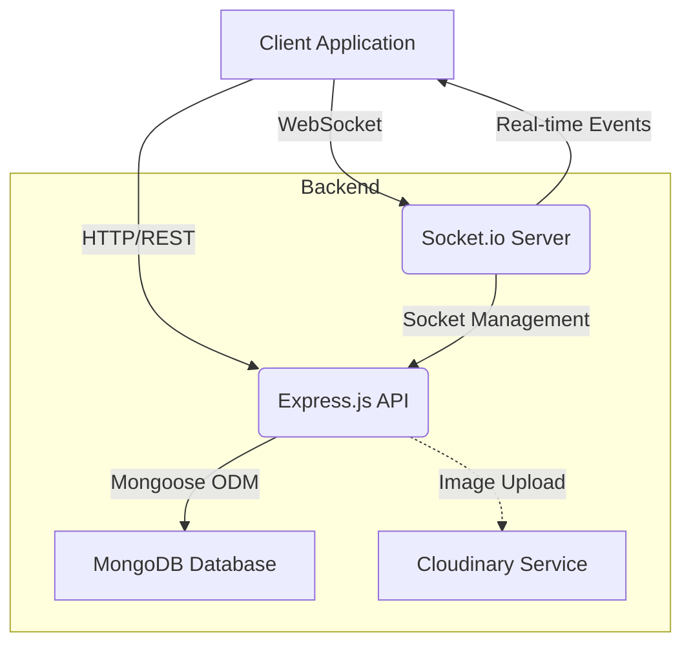
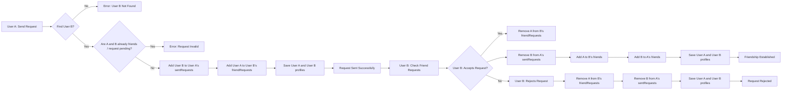

# Messaging and Friend Management

<TOC />

## System Purpose

This section details the core functionalities for user-to-user communication and social interactions. It covers the API endpoints and underlying logic for sending and receiving direct messages, managing friend requests, accepting/rejecting requests, and displaying user connections.

### Core Functionalities

*   **Direct Messaging:**
    *   Enables users to send and receive text and image-based messages in real-time.
    *   Retrieves message history between two specific users.
    *   Provides a list of potential chat partners (all users except the logged-in one).
*   **Friend Management:**
    *   **Send Friend Request:** Allows users to initiate a friend request to another user identified by username or email. Includes robust checks to prevent duplicate requests or self-requests.
    *   **Accept Friend Request:** Processes the acceptance of a friend request, adding both users to each other's friend lists and removing the request from pending queues.
    *   **Reject Friend Request:** Handles the rejection of a friend request, removing the request from both sender and receiver queues without establishing a friendship.
    *   **Remove Friend:** Facilitates the removal of an existing friend connection from both users' friend lists.
    *   **Retrieve Friends:** Fetches a list of the current user's established friends, displaying relevant user profile information.
    *   **Retrieve Pending Requests:** Lists incoming friend requests that the current user needs to action (accept/reject).
    *   **Retrieve Sent Requests:** Lists outgoing friend requests that the current user has sent and are awaiting a response.
*   **Real-time Communication:**
    *   Utilizes WebSockets for instant message delivery and tracking of online users.
    *   Emits events for new messages and updates to online user status.

## Architecture

The messaging and friend management system operates within a MERN (MongoDB, Express.js, React.js, Node.js) stack. The backend, built with Node.js and Express.js, exposes RESTful APIs for friend management and message retrieval. Real-time message exchange and online user status updates are handled by a dedicated WebSocket server integrated with the Express application. MongoDB serves as the database for storing user data, message records, and friend relationship states.

### Component Interaction Diagram





**Explanation:**
*   **Client Application:** Interacts with the backend via HTTP for friend management and fetching message history, and via WebSockets for real-time messaging and online status updates.
*   **Express.js API:** Handles all HTTP requests for friend operations (`friend.controller.js`) and message history retrieval (`message.controller.js`). It uses Mongoose to interact with MongoDB.
*   **MongoDB Database:** Stores `User` and `Message` documents, including friend lists, request statuses, and message content.
*   **Socket.io Server:** Manages WebSocket connections for real-time features. It receives new message events from the `sendMessage` controller and broadcasts them to relevant clients, as well as managing and emitting online user status.
*   **Cloudinary Service:** An external service used for storing and serving image attachments within messages, integrated via `message.controller.js`.

## Technology Stack

| Layer/Category       | Technology      | Purpose                                                                                                                                                                                                                                       | Key Files                                                                                                                                                                                                                                       |
| :------------------- | :-------------- | :-------------------------------------------------------------------------------------------------------------------------------------------------------------------------------------------------------------------------------------------- | :-------------------------------------------------------------------------------------------------------------------------------------------------------------------------------------------------------------------------------------------- |
| **Backend Framework**| Node.js / Express.js | Provides the server-side environment and API endpoints for handling all friend management and messaging requests.                                                                                                                             | `backend/src/controllers/friend.controller.js`<br/>`backend/src/controllers/message.controller.js`                                                                                                                                             |
| **Database**         | MongoDB         | NoSQL database storing `User` documents (including `friends`, `friendRequests`, `sentRequests` arrays) and `Message` documents (sender, receiver, text, image, timestamps).                                                                     | `backend/src/models/message.model.js`<br/>`backend/src/models/user.model.js` (implicit for friend data)                                                                                                                                       |
| **ODM**              | Mongoose        | Object Data Modeling library for MongoDB, providing schema definition and robust interaction methods.                                                                                                                                         | `backend/src/models/message.model.js`<br/>`backend/src/models/user.model.js`                                                                                                                                                               |
| **Real-time Engine** | Socket.io       | Enables bidirectional, low-latency communication between the client and server for real-time messaging and online user presence.                                                                                                            | `backend/src/lib/socket.js`<br/>`backend/src/controllers/message.controller.js` (for emitting new messages)                                                                                                                                |
| **Cloud Storage**    | Cloudinary      | Handles secure storage and delivery of image attachments sent through the messaging system.                                                                                                                                                   | `backend/src/controllers/message.controller.js` (for image upload logic)<br/>`backend/src/lib/cloudinary.js` (configuration)                                                                                                                  |

## Features

### Friend Request Flow

The friend request system ensures that users can connect with each other, managing pending requests, and establishing friendships.

**1. Sending a Friend Request:**
Users can send a request to another user using their username or email. The system checks for existing friendships, pending requests, and self-requests to maintain data integrity.

```javascript
// backend/src/controllers/friend.controller.js
// Send a friend request
export const sendFriendRequest = async (req, res) => {
    try {
        const { identifier } = req.body; // Expecting { identifier: "some_username_or_email" }
        const senderId = req.user._id;

        if (!identifier) {
            return res.status(400).json({ message: "Username or email is required." });
        }

        // Find receiver by username OR email
        const receiver = await User.findOne({
            $or: [{ username: identifier }, { email: identifier }]
        });

        if (!receiver) {
            return res.status(404).json({ message: "User not found." });
        }
        
        const receiverId = receiver._id;

        if (senderId.toString() === receiverId.toString()) {
            return res.status(400).json({ message: "You cannot send a friend request to yourself." });
        }

        const sender = await User.findById(senderId);

        // --- Rest of the logic is the same ---
        if (sender.friends.includes(receiverId)) {
            return res.status(400).json({ message: "You are already friends with this user." });
        }
        if (sender.sentRequests.includes(receiverId)) {
            return res.status(400).json({ message: "Friend request already sent." });
        }
        if (sender.friendRequests.includes(receiverId)) {
            return res.status(400).json({ message: "This user has already sent you a friend request." });
        }

        sender.sentRequests.push(receiverId);
        receiver.friendRequests.push(senderId);

        await sender.save();
        await receiver.save();

        res.status(200).json({ message: "Friend request sent successfully." });

    } catch (error) {
        console.error("Error in sendFriendRequest: ", error.message);
        res.status(500).json({ message: "Internal server error", error: error.message });
    }
};
```
[View on GitHub](https://github.com/shinymack/Chat-App-MERN/blob/main/backend/src/controllers/friend.controller.js#L11-L67)

**Insight:** The use of `$or` in `User.findOne` for `username` or `email` provides a flexible way for users to search for others, improving user experience. The various `if` conditions prior to saving ensure that the friendship state machine is correctly managed, preventing redundant or invalid requests.

**2. Accepting a Friend Request:**
When a user accepts a friend request, both users' `friends` arrays are updated, and the corresponding entries are removed from `friendRequests` and `sentRequests`.

```javascript
// backend/src/controllers/friend.controller.js
// Accept a friend request
export const acceptFriendRequest = async (req, res) => {
    try {
        const { senderId } = req.params; // ID of the user who sent the request
        const receiverId = req.user._id; // Current user accepting the request


        const sender = await User.findById(senderId);
        const receiver = await User.findById(receiverId);

        if (!sender || !receiver) {
            return res.status(404).json({ message: "User not found." });
        }

        // Check if the request exists in receiver's friendRequests
        if (!receiver.friendRequests.includes(senderId)) {
            return res.status(400).json({ message: "Friend request not found or already handled." });
        }

        // Add to friends list for both users
        receiver.friends.push(senderId);
        sender.friends.push(receiverId);

        // Remove from requests lists
        receiver.friendRequests = receiver.friendRequests.filter(id => id.toString() !== senderId.toString());
        sender.sentRequests = sender.sentRequests.filter(id => id.toString() !== receiverId.toString());

        await receiver.save();
        await sender.save();

        res.status(200).json({ message: "Friend request accepted." });

    } catch (error) {
        console.error("Error in acceptFriendRequest: ", error.message);
        res.status(500).json({ message: "Internal server error", error: error.message });
    }
};
```
[View on GitHub](https://github.com/shinymack/Chat-App-MERN/blob/main/backend/src/controllers/friend.controller.js#L70-L113)

**Best Practice:** The atomic updates of `sender` and `receiver` documents ensure data consistency. Using `filter` to remove IDs is a clean way to update array fields in Mongoose documents.

**3. Rejecting a Friend Request:**
Similar to accepting, but only removes the request without establishing a friendship.

```javascript
// backend/src/controllers/friend.controller.js
// Reject a friend request
export const rejectFriendRequest = async (req, res) => {
    try {
        const { senderId } = req.params; // ID of the user whose request is being rejected
        const receiverId = req.user._id; // Current user rejecting the request


        const sender = await User.findById(senderId);
        const receiver = await User.findById(receiverId);

        if (!sender || !receiver) {
            return res.status(404).json({ message: "User not found." });
        }

        // Remove from receiver's friendRequests
        const initialReceiverRequestsCount = receiver.friendRequests.length;
        receiver.friendRequests = receiver.friendRequests.filter(id => id.toString() !== senderId.toString());

        // Remove from sender's sentRequests
        const initialSenderSentCount = sender.sentRequests.length;
        sender.sentRequests = sender.sentRequests.filter(id => id.toString() !== receiverId.toString());

        if (receiver.friendRequests.length === initialReceiverRequestsCount && sender.sentRequests.length === initialSenderSentCount) {
             return res.status(400).json({ message: "Friend request not found or already handled." });
        }

        await receiver.save();
        await sender.save();

        res.status(200).json({ message: "Friend request rejected." });

    } catch (error) {
        console.error("Error in rejectFriendRequest: ", error.message);
        res.status(500).json({ message: "Internal server error", error: error.message });
    }
};
```
[View on GitHub](https://github.com/shinymack/Chat-App-MERN/blob/main/backend/src/controllers/friend.controller.js#L116-L161)

**Insight:** The logic to check if `friendRequests` or `sentRequests` actually changed before responding with success is a good practice to prevent unnecessary database writes and provide clearer feedback if a request was already processed.

### Messaging Functionality

The messaging system enables direct communication between users, supporting text and image messages with real-time delivery.

**1. Sending Messages:**
Messages can contain text and an optional image. Images are uploaded to Cloudinary, and the message is saved to MongoDB. Real-time delivery is facilitated via Socket.io.

```javascript
// backend/src/controllers/message.controller.js
export const sendMessage = async (req, res) => {
    try {
        const { text, image } = req.body;
        const { id: receiverId } = req.params;
        const senderId = req.user._id;

        let imageUrl;
        if (image) {
            const uploadResponse = await cloudinary.uploader.upload(image);

            imageUrl = uploadResponse.secure_url;
        }
        const newMessage = new Message({
            senderId,
            receiverId,
            text,
            image: imageUrl,
        });

        await newMessage.save();

        const receiverSocketId = getReceiverSocketId(receiverId);

        if(receiverSocketId) {
            io.to(receiverSocketId).emit("newMessage", newMessage);
        }

        res.status(201).json(newMessage);   
        
    } catch (error) {
        console.log("Error in sendMessage controller:  ", error);
        res.status(500).json({ error: "Internal Server Error" });
    }
};
```
[View on GitHub](https://github.com/shinymack/Chat-App-MERN/blob/main/backend/src/controllers/message.controller.js#L44-L79)

**Scalability Consideration:** Offloading image storage to a dedicated service like Cloudinary is crucial for scalability, as it reduces the load on the primary application server and database, and leverages specialized infrastructure for media handling.

**2. Real-time Socket Handling:**
The `socket.js` library initializes the Socket.io server, manages user connections, and maps user IDs to their respective socket IDs for targeted message delivery. It also broadcasts online user status.

```javascript
// backend/src/lib/socket.js
import { Server } from "socket.io";
import http from "http";
import express from "express";

const app = express();

const server = http.createServer(app);

const io = new Server(server, {
    cors: {
        origin: ["http://localhost:5173"]
    }
})

export function getReceiverSocketId(userId) {
    return userSocketMap[userId];
}


// used to store online users
const userSocketMap = {}; //{userId : socketId}


io.on("connection", (socket) => {
    console.log("A user connected", socket.id);

    const userId = socket.handshake.query.userId;
    if(userId) userSocketMap[userId] = socket.id;

    io.emit("getOnlineUsers", Object.keys(userSocketMap));

    socket.on("disconnect", ()=>{
        console.log("A user disconnected", socket.id);
        delete userSocketMap[userId]; 
        io.emit("getOnlineUsers", Object.keys(userSocketMap));
    })
})

export { io, app, server };
```
[View on GitHub](https://github.com/shinymack/Chat-App-MERN/blob/main/backend/src/lib/socket.js#L1-L36)

**Insight:** The `userSocketMap` is critical for routing messages to the correct online user. The `io.emit("getOnlineUsers", ...)` call on connect and disconnect ensures that all connected clients receive real-time updates about who is currently online, which is essential for a dynamic chat application.

### Friend Management Flowchart

This flowchart illustrates the typical process for a user to send, and another user to accept, a friend request.





## Key Integration Points

*   **Authentication and Authorization:** All friend management and messaging routes are protected, requiring a logged-in user (`req.user._id` is used extensively). This ensures that actions are performed by authenticated users and prevents unauthorized access to user data or impersonation. The authentication middleware (not provided in files but implied by `req.user._id`) is a critical upstream dependency.
*   **User Model:** The `User` model is central to both messaging and friend management. It stores not only basic user information but also arrays for `friends`, `friendRequests` (incoming), and `sentRequests` (outgoing). Efficient population (`.populate()`) of these fields is crucial for retrieving comprehensive user relationship data. The decision to store relationships directly within the User model, while convenient for quick lookups, can become a bottleneck for users with a very large number of friends, potentially impacting document size and query performance. For extremely large-scale social graphs, a dedicated relationship service or graph database might be considered for future scalability.
*   **Database Operations:** Mongoose is used consistently for all database interactions. The controllers demonstrate careful retrieval (`findById`, `findOne`) and atomic updates (`save()`) to ensure data consistency, especially when modifying relationship arrays on two different user documents (e.g., accepting a friend request).
*   **Real-time Communication (Socket.io):** The `sendMessage` controller tightly integrates with `socket.js`. After a message is saved to the database, `getReceiverSocketId` is called to retrieve the target user's socket ID, and `io.to(receiverSocketId).emit("newMessage", newMessage)` broadcasts the message directly to the recipient, bypassing traditional polling mechanisms for instant delivery. This is a critical insight into how the real-time aspect is achieved.
*   **Error Handling:** Each controller includes a `try-catch` block, logging errors to the console and returning a generic 500 status code with an internal server error message. While effective for basic error capture, a more robust production system might categorize errors, provide more specific error codes, and integrate with a centralized logging solution.

Next: [Utility and External Integrations](./2.3_utility-external-integrations.mdx)