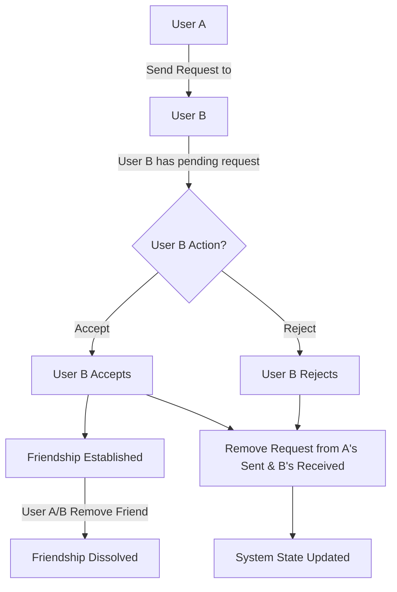
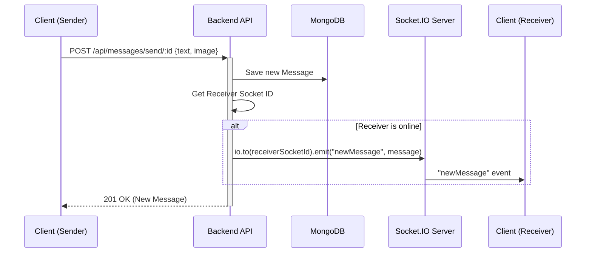

```mdx
---
title: "Messaging & Friends Management"
description: "Exploration of real-time messaging, friend request handling, and user interaction logic."
sidebar_position: 22
---

# Messaging & Friends Management

<TOC />

This section delves into the core functionalities enabling user interaction within the application: real-time messaging and comprehensive friend management. It examines the backend logic responsible for sending, accepting, rejecting, and removing friend requests, as well as managing message exchanges. The integration of Socket.IO is highlighted for its role in facilitating real-time communication, ensuring a dynamic and responsive user experience.

## I. Friend Management System

The friend management system provides robust features for users to connect and manage their social network. This includes sending, accepting, and rejecting friend requests, as well as removing existing friends. The logic is primarily encapsulated within the `friend.controller.js` file, interacting directly with the `User` model to update user relationships.

### A. Core Friend Request Lifecycle

The system supports a complete lifecycle for friend requests, ensuring atomicity and consistency of user relationships within the database.

#### 1. Sending a Friend Request

Users can initiate a friend request to another user identified by their username or email. The system performs several checks to prevent invalid requests, such as sending a request to oneself, to an already existing friend, or a duplicate request.

```javascript showLineNumbers
// backend/src/controllers/friend.controller.js#L11-L45
export const sendFriendRequest = async (req, res) => {
    try {
        const { identifier } = req.body; // Expecting { identifier: "some_username_or_email" }
        const senderId = req.user._id;

        if (!identifier) {
            return res.status(400).json({ message: "Username or email is required." });
        }

        // Find receiver by username OR email
        const receiver = await User.findOne({
            $or: [{ username: identifier }, { email: identifier }]
        });

        if (!receiver) {
            return res.status(404).json({ message: "User not found." });
        }
        
        const receiverId = receiver._id;

        if (senderId.toString() === receiverId.toString()) {
            return res.status(400).json({ message: "You cannot send a friend request to yourself." });
        }

        const sender = await User.findById(senderId);

        // --- Rest of the logic is the same ---
        if (sender.friends.includes(receiverId)) {
            return res.status(400).json({ message: "You are already friends with this user." });
        }
        if (sender.sentRequests.includes(receiverId)) {
            return res.status(400).json({ message: "Friend request already sent." });
        }
        if (sender.friendRequests.includes(receiverId)) {
            return res.status(400).json({ message: "This user has already sent you a friend request." });
        }

        sender.sentRequests.push(receiverId);
        receiver.friendRequests.push(senderId);

        await sender.save();
        await receiver.save();

        res.status(200).json({ message: "Friend request sent successfully." });

    } catch (error) {
        console.error("Error in sendFriendRequest: ", error.message);
        res.status(500).json({ message: "Internal server error", error: error.message });
    }
};
```
This snippet from [`backend/src/controllers/friend.controller.js`](https://github.com/shinymack/Chat-App-MERN/blob/main/backend/src/controllers/friend.controller.js#L11-L45) demonstrates the `sendFriendRequest` controller function. It highlights:
*   **User Lookup:** The receiver is identified using either their username or email, ensuring flexibility.
*   **Self-Request Prevention:** A check prevents users from sending requests to themselves.
*   **Duplicate & Existing Friend Checks:** The system verifies that the request isn't redundant (already friends, already sent, or already received).
*   **State Update:** On a valid request, the `sender`'s `sentRequests` array is updated, and the `receiver`'s `friendRequests` array is updated. Both user documents are saved atomically.

#### 2. Accepting a Friend Request

Upon receiving a request, users can choose to accept it. This action updates both users' `friends` lists and removes the request from their respective `friendRequests` and `sentRequests` arrays.

```javascript showLineNumbers
// backend/src/controllers/friend.controller.js#L55-L87
export const acceptFriendRequest = async (req, res) => {
    try {
        const { senderId } = req.params; // ID of the user who sent the request
        const receiverId = req.user._id; // Current user accepting the request


        const sender = await User.findById(senderId);
        const receiver = await User.findById(receiverId);

        if (!sender || !receiver) {
            return res.status(404).json({ message: "User not found." });
        }

        // Check if the request exists in receiver's friendRequests
        if (!receiver.friendRequests.includes(senderId)) {
            return res.status(400).json({ message: "Friend request not found or already handled." });
        }

        // Add to friends list for both users
        receiver.friends.push(senderId);
        sender.friends.push(receiverId);

        // Remove from requests lists
        receiver.friendRequests = receiver.friendRequests.filter(id => id.toString() !== senderId.toString());
        sender.sentRequests = sender.sentRequests.filter(id => id.toString() !== receiverId.toString());

        await receiver.save();
        await sender.save();

        res.status(200).json({ message: "Friend request accepted." });

    } catch (error) {
        console.error("Error in acceptFriendRequest: ", error.message);
        res.status(500).json({ message: "Internal server error", error: error.message });
    }
};
```
The `acceptFriendRequest` function in [`backend/src/controllers/friend.controller.js`](https://github.com/shinymack/Chat-App-MERN/blob/main/backend/src/controllers/friend.controller.js#L55-L87) is critical for forming friendships. It ensures:
*   **Mutual Friendship:** Both the sender and receiver have each other's IDs added to their `friends` arrays.
*   **Request Cleanup:** The pending request is removed from both user's `friendRequests` and `sentRequests` arrays to maintain clean state.

#### 3. Rejecting a Friend Request

Users can reject unwanted friend requests, removing them from their pending requests and from the sender's sent requests.

```javascript showLineNumbers
// backend/src/controllers/friend.controller.js#L90-L121
export const rejectFriendRequest = async (req, res) => {
    try {
        const { senderId } = req.params; // ID of the user whose request is being rejected
        const receiverId = req.user._id; // Current user rejecting the request


        const sender = await User.findById(senderId);
        const receiver = await User.findById(receiverId);

        if (!sender || !receiver) {
            return res.status(404).json({ message: "User not found." });
        }

        // Remove from receiver's friendRequests
        const initialReceiverRequestsCount = receiver.friendRequests.length;
        receiver.friendRequests = receiver.friendRequests.filter(id => id.toString() !== senderId.toString());

        // Remove from sender's sentRequests
        const initialSenderSentCount = sender.sentRequests.length;
        sender.sentRequests = sender.sentRequests.filter(id => id.toString() !== receiverId.toString());

        if (receiver.friendRequests.length === initialReceiverRequestsCount && sender.sentRequests.length === initialSenderSentCount) {
             return res.status(400).json({ message: "Friend request not found or already handled." });
        }

        await receiver.save();
        await sender.save();

        res.status(200).json({ message: "Friend request rejected." });

    } catch (error) {
        console.error("Error in rejectFriendRequest: ", error.message);
        res.status(500).json({ message: "Internal server error", error: error.message });
    }
};
```
The `rejectFriendRequest` function in [`backend/src/controllers/friend.controller.js`](https://github.com/shinymack/Chat-App-MERN/blob/main/backend/src/controllers/friend.controller.js#L90-L121) mirrors the acceptance logic by ensuring that once a request is rejected, it is removed from both the receiver's `friendRequests` and the sender's `sentRequests`. This cleans up the request state without forming a friendship.

#### 4. Removing a Friend

Users can also remove an existing friend, which removes the friendship link from both users' profiles.

```javascript showLineNumbers
// backend/src/controllers/friend.controller.js#L124-L154
export const removeFriend = async (req, res) => {
    try {
        const { friendId } = req.params;
        const userId = req.user._id;


        const user = await User.findById(userId);
        const friendToRemove = await User.findById(friendId);

        if (!user || !friendToRemove) {
            return res.status(404).json({ message: "User not found." });
        }

        // Check if they are actually friends
        if (!user.friends.includes(friendId)) {
            return res.status(400).json({ message: "This user is not in your friends list." });
        }

        // Remove friend from both users' friends lists
        user.friends = user.friends.filter(id => id.toString() !== friendId.toString());
        friendToRemove.friends = friendToRemove.friends.filter(id => id.toString() !== userId.toString());

        await user.save();
        await friendToRemove.save();

        res.status(200).json({ message: "Friend removed successfully." });

    } catch (error) {
        console.error("Error in removeFriend: ", error.message);
        res.status(500).json({ message: "Internal server error", error: error.message });
    }
};
```
The `removeFriend` function in [`backend/src/controllers/friend.controller.js`](https://github.com/shinymack/Chat-App-MERN/blob/main/backend/src/controllers/friend.controller.js#L124-L154) handles the dissolution of a friendship by filtering the `friends` array for both parties involved. This ensures that the relationship is removed symmetrically.

### B. Friend Data Retrieval

The system provides endpoints to retrieve a user's current friends, as well as pending and sent friend requests. These endpoints use Mongoose's `populate` feature to fetch details of the associated users efficiently.

*   **`getFriends`**: Retrieves a list of users that the current user is friends with.
*   **`getPendingRequests`**: Fetches all friend requests received by the current user.
*   **`getSentRequests`**: Fetches all friend requests sent by the current user.

```javascript showLineNumbers
// backend/src/controllers/friend.controller.js#L187-L200
export const getPendingRequests = async (req, res) => {
    try {
        const userId = req.user._id;
        const user = await User.findById(userId).populate({
            path: "friendRequests",
            select: "username email profilePic _id" // Select fields for users who sent requests
        });

        if (!user) {
            return res.status(404).json({ message: "User not found." });
        }

        res.status(200).json(user.friendRequests);

    } catch (error) {
        console.error("Error in getPendingRequests: ", error.message);
        res.status(500).json({ message: "Internal server error", error: error.message });
    }
};
```
This excerpt from [`backend/src/controllers/friend.controller.js`](https://github.com/shinymack/Chat-App-MERN/blob/main/backend/src/controllers/friend.controller.js#L187-L200) illustrates how `getPendingRequests` uses `populate` on the `friendRequests` path of the `User` model. This efficiently retrieves not just the IDs but also selected details (`username`, `email`, `profilePic`, `_id`) of the users who sent the requests, reducing the number of database queries and simplifying frontend rendering.

### C. Friend Management Workflow





## II. Real-time Messaging System

The messaging system facilitates direct message exchanges between users, enhanced with real-time capabilities via Socket.IO. It supports sending text messages and images, ensuring secure communication and instant delivery.

### A. Message Retrieval

Users can retrieve historical messages for a specific conversation. The system fetches messages where either the current user is the sender and the other user is the receiver, or vice-versa.

*   **`getUsersForSidebar`**: Fetches a list of all users, excluding the currently logged-in user. This is typically used to populate a chat sidebar, allowing users to initiate conversations.
*   **`getMessages`**: Retrieves all messages exchanged between the logged-in user and a specified chat partner.

```javascript showLineNumbers
// backend/src/controllers/message.controller.js#L24-L36
export const getMessages = async (req, res) => {
    try {
        const {id : userToChatId } = req.params;
        const myId = req.user._id;

        const messages = await Message.find({
            $or: [
                {senderId: myId, receiverId:userToChatId},
                {senderId: userToChatId, receiverId: myId}
            ]
        });
        res.status(200).json(messages);
    } catch (error) {
        console.log("Error in getMessages controller:  ", error);
        res.status(500).json({ error: "Internal Server Error" });
    }
};
```
This `getMessages` function in [`backend/src/controllers/message.controller.js`](https://github.com/shinymack/Chat-App-MERN/blob/main/backend/src/controllers/message.controller.js#L24-L36) demonstrates efficient message retrieval using a `$or` query in MongoDB. This ensures that all messages, regardless of who initiated the conversation, are fetched for a given pair of users.

### B. Sending Messages with Real-time Updates

The `sendMessage` function handles the submission of new messages, including support for image uploads via Cloudinary, and triggers a real-time update to the recipient using Socket.IO.

```javascript showLineNumbers
// backend/src/controllers/message.controller.js#L38-L67
export const sendMessage = async (req, res) => {
    try {
        const { text, image } = req.body;
        const { id: receiverId } = req.params;
        const senderId = req.user._id;

        let imageUrl;
        if (image) {
            const uploadResponse = await cloudinary.uploader.upload(image);

            imageUrl = uploadResponse.secure_url;
        }
        const newMessage = new Message({
            senderId,
            receiverId,
            text,
            image: imageUrl,
        });

        await newMessage.save();

        const receiverSocketId = getReceiverSocketId(receiverId);

        if(receiverSocketId) {
            io.to(receiverSocketId).emit("newMessage", newMessage);
        }


        res.status(201).json(newMessage);   
        
    } catch (error) {
        console.log("Error in sendMessage controller:  ", error);
        res.status(500).json({ error: "Internal Server Error" });
    }
};
```
The `sendMessage` function in [`backend/src/controllers/message.controller.js`](https://github.com/shinymack/Chat-App-MERN/blob/main/backend/src/controllers/message.controller.js#L38-L67) integrates several key components:
*   **Image Upload**: If an image is provided, it's uploaded to Cloudinary, and the `secure_url` is stored.
*   **Message Persistence**: The new message is saved to the database.
*   **Real-time Delivery**: `getReceiverSocketId` and `io.to().emit()` are used to instantly send the `newMessage` event to the recipient if they are online, providing a seamless chat experience.

### C. Socket.IO for Real-time Communication

The [`backend/src/lib/socket.js`](https://github.com/shinymack/Chat-App-MERN/blob/main/backend/src/lib/socket.js) file sets up and manages the Socket.IO server, enabling real-time functionalities such as instant message delivery and online user tracking.

```javascript showLineNumbers
// backend/src/lib/socket.js#L17-L34
io.on("connection", (socket) => {
    console.log("A user connected", socket.id);

    const userId = socket.handshake.query.userId;
    if(userId) userSocketMap[userId] = socket.id;

    io.emit("getOnlineUsers", Object.keys(userSocketMap));

    socket.on("disconnect", ()=>{
        console.log("A user disconnected", socket.id);
        delete userSocketMap[userId]; 
        io.emit("getOnlineUsers", Object.keys(userSocketMap));
    })
})
```
This snippet from [`backend/src/lib/socket.js`](https://github.com/shinymack/Chat-App-MERN/blob/main/backend/src/lib/socket.js#L17-L34) shows the core Socket.IO event handling.
*   **`userSocketMap`**: A simple object (`{userId: socketId}`) maps user IDs to their active socket IDs, allowing direct messaging to specific users.
*   **Connection Event**: On a new connection, the `userId` is extracted from the handshake query, and the `userSocketMap` is updated.
*   **`getOnlineUsers` Emission**: The list of online users is broadcast to all connected clients, enabling the frontend to display online status.
*   **Disconnection Event**: When a user disconnects, their entry is removed from `userSocketMap`, and the updated online user list is broadcast again.

This architecture ensures that the system can efficiently identify and communicate with online users, crucial for real-time messaging.

### D. Message Flow and Socket.IO Interaction





## III. API Routes

The following routes are defined to expose the messaging and friend management functionalities, protected by `auth.middleware.js` to ensure only authenticated users can access them.

### A. Message Routes ([`backend/src/routes/message.route.js`](https://github.com/shinymack/Chat-App-MERN/blob/main/backend/src/routes/message.route.js))

| Method | Path               | Controller Function   | Description                                       |
| :----- | :----------------- | :-------------------- | :------------------------------------------------ |
| `GET`  | `/api/messages/users` | `getUsersForSidebar`  | Retrieves all users for chat sidebar display.     |
| `GET`  | `/api/messages/:id` | `getMessages`         | Retrieves messages between current user and `:id`.|
| `POST` | `/api/messages/send/:id` | `sendMessage`         | Sends a new message to user `:id`.                |

### B. Friend Routes (defined in `backend/src/controllers/friend.controller.js` but handled by a dedicated router, not shown in provided `message.route.js`)

While the provided `message.route.js` only covers messaging, the `friend.controller.js` implies a similar routing structure for friend management:

| Method | Path                         | Controller Function      | Description                                     |
| :----- | :--------------------------- | :----------------------- | :---------------------------------------------- |
| `POST` | `/api/friends/request`       | `sendFriendRequest`      | Sends a friend request.                         |
| `POST` | `/api/friends/accept/:senderId` | `acceptFriendRequest`    | Accepts a friend request from `:senderId`.      |
| `POST` | `/api/friends/reject/:senderId` | `rejectFriendRequest`    | Rejects a friend request from `:senderId`.      |
| `DELETE`| `/api/friends/remove/:friendId` | `removeFriend`           | Removes `:friendId` from friends list.          |
| `GET`  | `/api/friends`               | `getFriends`             | Retrieves current user's friends.               |
| `GET`  | `/api/friends/pending`       | `getPendingRequests`     | Retrieves current user's received requests.     |
| `GET`  | `/api/friends/sent`          | `getSentRequests`        | Retrieves current user's sent requests.         |

## IV. Key Insights & Best Practices

*   **Robust Friend Request Logic:** The `friend.controller.js` effectively handles various edge cases for friend requests (self-requests, existing friends, duplicate requests), ensuring data integrity and a smooth user experience.
*   **Efficient Data Retrieval:** The use of Mongoose's `populate` method in `getFriends`, `getPendingRequests`, and `getSentRequests` optimizes database queries by retrieving related user data in a single operation, improving performance and simplifying API responses.
*   **Real-time Interaction:** Socket.IO is strategically used to provide instant feedback for messaging and online user status. The `userSocketMap` is a simple yet effective mechanism for targeting specific users with real-time events.
*   **Separation of Concerns:** The code maintains a clear separation between controllers (business logic), models (data structure), and routes (API endpoints), adhering to good architectural principles.
*   **Error Handling:** Each controller function includes `try-catch` blocks to gracefully handle errors and return appropriate HTTP status codes and messages, enhancing the API's reliability.
*   **Scalability for Real-time:** While the current `userSocketMap` is in-memory, for larger-scale applications, it would typically be replaced with a distributed store like Redis to manage `socketId`s across multiple Socket.IO server instances.
*   **Image Handling:** Integration with Cloudinary demonstrates a practical approach to external media storage, offloading file management from the main application server.

Next: [Data Models & Utilities](./2.3_data_models_utilities.mdx)
```