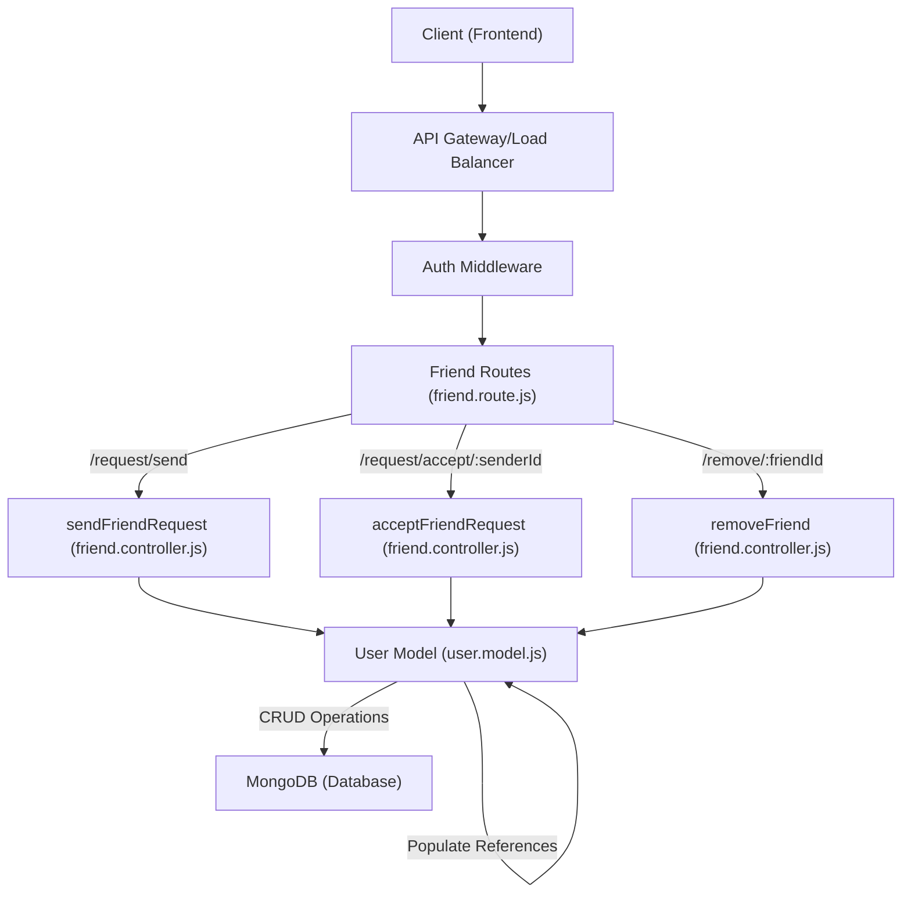
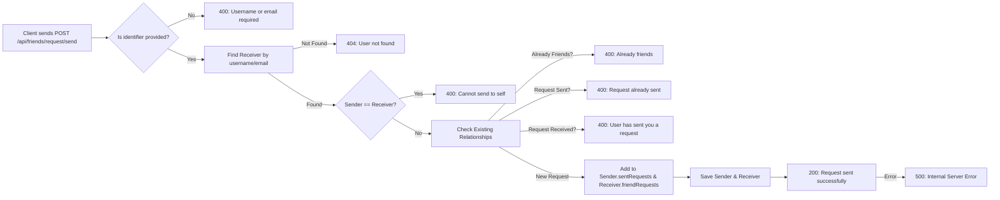

---
title: "User and Friend Management"
description: "Describes the backend logic for managing user profiles and friend relationships."
sidebar_position: 22
---

# User and Friend Management

<TOC />

This document details the backend implementation for managing user profiles and establishing/maintaining friend relationships within the application. It covers user data models, controller logic for friend requests and management, and the associated API routes. This system forms the social core, allowing users to connect and interact.

## System Purpose

The user and friend management system enables a robust social networking experience within the application, providing functionalities for:

*   **Profile Management:** Defining user attributes such as `username`, `email`, `password`, and `profilePic`.
*   **Friend Request Lifecycle:** Facilitating the sending, acceptance, and rejection of friend requests between users.
*   **Friendship Management:** Allowing users to view their friends list and remove existing friends.
*   **Request Tracking:** Providing mechanisms to view both pending incoming friend requests and outgoing sent requests.
*   **Authentication Integration:** Seamlessly integrating with existing authentication mechanisms to ensure secure operations.

## Architecture

The user and friend management system is implemented within the backend, following a typical Model-View-Controller (MVC) pattern adapted for a RESTful API. The `User` model ([`backend/src/models/user.model.js`](https://github.com/shinymack/Chat-App-MERN/blob/main/backend/src/models/user.model.js)) defines the data structure and relationships. The `friend.controller.js` ([`backend/src/controllers/friend.controller.js`](https://github.com/shinymack/Chat-App-MERN/blob/main/backend/src/controllers/friend.controller.js)) contains the core business logic for handling friend-related operations. These operations are exposed via `friend.route.js` ([`backend/src/routes/friend.route.js`](https://github.com/shinymack/Chat-App-MERN/blob/main/backend/src/routes/friend.route.js)) as protected API endpoints.





<p className="diagram-caption">Architectural Overview of Friend Management Interactions</p>

## Technology Stack

The backend services leverage a MongoDB, Express.js, and Node.js (MEN) stack.

| Layer          | Technology       | Purpose                                                                                                                                                                                                                                                           |
| :------------- | :--------------- | :---------------------------------------------------------------------------------------------------------------------------------------------------------------------------------------------------------------------------------------------------------------- |
| **Database**   | MongoDB          | NoSQL database for flexible and scalable storage of user profiles and relationship data.                                                                                                                                                                            |
| **ORM/ODM**    | Mongoose         | Object Data Modeling (ODM) library for MongoDB, providing schema validation, data type casting, and query building. Utilized extensively for `User` model definition and interaction.                                                                                 |
| **Backend API**| Express.js       | Web framework for building robust RESTful APIs. Manages routing, middleware (like `protectRoute`), and request/response handling for friend-related endpoints.                                                                                                    |
| **Runtime**    | Node.js          | JavaScript runtime environment for executing backend logic.                                                                                                                                                                                                         |
| **Middleware** | `protectRoute`   | Custom middleware responsible for authenticating requests and populating `req.user` with the authenticated user's details, ensuring only authorized users can access friend management features.                                                                   |
| **Cloud Storage** | Cloudinary      | (Partial relevance) Used for storing and managing user profile pictures, integrated via `cloudinary.js`. While not directly involved in friend relationship logic, it supports `profilePic` field of `User` model.                                               |

### Cloudinary Configuration

Cloudinary is integrated for media management, specifically for handling `profilePic` uploads. Its configuration is securely managed using environment variables.

```javascript
// File: backend/src/lib/cloudinary.js
import {v2 as cloudinary} from "cloudinary"
import { config } from 'dotenv'

config();

cloudinary.config(
    {cloud_name: process.env.CLOUDINARY_CLOUD_NAME,
    api_key: process.env.CLOUDINARY_API_KEY,
    api_secret: process.env.CLOUDINARY_API_SECRET,}
);

export default cloudinary;
```
[View on GitHub](https://github.com/shinymack/Chat-App-MERN/blob/main/backend/src/lib/cloudinary.js#L1-L10)

## Features

### User Model Definition

The [`User`](https://github.com/shinymack/Chat-App-MERN/blob/main/backend/src/models/user.model.js) Mongoose model defines the core structure for user data, including fields pertinent to friend management: `friends`, `friendRequests` (incoming), and `sentRequests` (outgoing). All these relationship fields store `ObjectId` references to other `User` documents.

```javascript
// File: backend/src/models/user.model.js
import mongoose from "mongoose"

const  userSchema = new mongoose.Schema(
    {
        // ... (email, username, password, profilePic, authProvider, googleId fields)
        friends: [{
            type: mongoose.Schema.Types.ObjectId,
            ref: "User",
            default: [] 
        }],
        friendRequests: [{ // Incoming friend requests
            type: mongoose.Schema.Types.ObjectId,
            ref: "User",
            default: []
        }],
        sentRequests: [{ // Outgoing friend requests
            type: mongoose.Schema.Types.ObjectId,
            ref: "User",
            default: []
        }],
    },
    { 
        timestamps: true
    } 
);

userSchema.pre('save', async function(next) {
    if (this.authProvider === 'google' && !this.isModified('password')) {
        this.password = undefined;
    }
    if (this.authProvider === 'email' && !this.password && this.isNew) {
        return next(new Error('Password is required for email signup.'));
    }
    next();
});

const User = mongoose.model("User", userSchema);

export default User;
```
[View on GitHub](https://github.com/shinymack/Chat-App-MERN/blob/main/backend/src/models/user.model.js#L4-L49)

### Send Friend Request

Users can send friend requests to other users identified by `username` or `email`. This operation adds the receiver's ID to the sender's `sentRequests` array and the sender's ID to the receiver's `friendRequests` array.





<p className="diagram-caption">Friend Request Sending Flow</p>

```javascript
// File: backend/src/controllers/friend.controller.js
export const sendFriendRequest = async (req, res) => {
    try {
        const { identifier } = req.body;
        const senderId = req.user._id;

        if (!identifier) {
            return res.status(400).json({ message: "Username or email is required." });
        }
        const receiver = await User.findOne({
            $or: [{ username: identifier }, { email: identifier }]
        });
        if (!receiver) {
            return res.status(404).json({ message: "User not found." });
        }
        const receiverId = receiver._id;
        if (senderId.toString() === receiverId.toString()) {
            return res.status(400).json({ message: "You cannot send a friend request to yourself." });
        }
        const sender = await User.findById(senderId);
        if (sender.friends.includes(receiverId)) {
            return res.status(400).json({ message: "You are already friends with this user." });
        }
        if (sender.sentRequests.includes(receiverId)) {
            return res.status(400).json({ message: "Friend request already sent." });
        }
        if (sender.friendRequests.includes(receiverId)) {
            return res.status(400).json({ message: "This user has already sent you a friend request." });
        }

        sender.sentRequests.push(receiverId);
        receiver.friendRequests.push(senderId);

        await sender.save();
        await receiver.save();

        res.status(200).json({ message: "Friend request sent successfully." });

    } catch (error) {
        console.error("Error in sendFriendRequest: ", error.message);
        res.status(500).json({ message: "Internal server error", error: error.message });
    }
};
```
[View on GitHub](https://github.com/shinymack/Chat-App-MERN/blob/main/backend/src/controllers/friend.controller.js#L7-L54)

**Scalability Insight:** While direct array manipulation `includes` and `filter` for small lists are efficient, for users with potentially thousands of friends/requests, these operations can become `O(N)`. For very large-scale social graphs, alternative data structures or more advanced database queries (e.g., using `$addToSet` and `$pull` with atomic updates or dedicated graph databases) might be considered to optimize performance.

### Accept Friend Request

When a user accepts a friend request, both users are added to each other's `friends` list. Crucially, the corresponding entries are removed from the `friendRequests` (receiver) and `sentRequests` (sender) arrays to maintain clean state.

```javascript
// File: backend/src/controllers/friend.controller.js
export const acceptFriendRequest = async (req, res) => {
    try {
        const { senderId } = req.params;
        const receiverId = req.user._id;

        const sender = await User.findById(senderId);
        const receiver = await User.findById(receiverId);

        if (!sender || !receiver) {
            return res.status(404).json({ message: "User not found." });
        }

        if (!receiver.friendRequests.includes(senderId)) {
            return res.status(400).json({ message: "Friend request not found or already handled." });
        }

        receiver.friends.push(senderId);
        sender.friends.push(receiverId);

        receiver.friendRequests = receiver.friendRequests.filter(id => id.toString() !== senderId.toString());
        sender.sentRequests = sender.sentRequests.filter(id => id.toString() !== receiverId.toString());

        await receiver.save();
        await sender.save();

        res.status(200).json({ message: "Friend request accepted." });

    } catch (error) {
        console.error("Error in acceptFriendRequest: ", error.message);
        res.status(500).json({ message: "Internal server error", error: error.message });
    }
};
```
[View on GitHub](https://github.com/shinymack/Chat-App-MERN/blob/main/backend/src/controllers/friend.controller.js#L57-L95)

### Reject Friend Request

Rejecting a friend request simply removes the respective entries from the `friendRequests` (receiver) and `sentRequests` (sender) arrays without establishing a friendship.

```javascript
// File: backend/src/controllers/friend.controller.js
export const rejectFriendRequest = async (req, res) => {
    try {
        const { senderId } = req.params;
        const receiverId = req.user._id;

        const sender = await User.findById(senderId);
        const receiver = await User.findById(receiverId);

        if (!sender || !receiver) {
            return res.status(404).json({ message: "User not found." });
        }

        const initialReceiverRequestsCount = receiver.friendRequests.length;
        receiver.friendRequests = receiver.friendRequests.filter(id => id.toString() !== senderId.toString());

        const initialSenderSentCount = sender.sentRequests.length;
        sender.sentRequests = sender.sentRequests.filter(id => id.toString() !== receiverId.toString());

        if (receiver.friendRequests.length === initialReceiverRequestsCount && sender.sentRequests.length === initialSenderSentCount) {
             return res.status(400).json({ message: "Friend request not found or already handled." });
        }

        await receiver.save();
        await sender.save();

        res.status(200).json({ message: "Friend request rejected." });

    } catch (error) {
        console.error("Error in rejectFriendRequest: ", error.message);
        res.status(500).json({ message: "Internal server error", error: error.message });
    }
};
```
[View on GitHub](https://github.com/shinymack/Chat-App-MERN/blob/main/backend/src/controllers/friend.controller.js#L98-L135)

### Remove Friend

This functionality allows a user to remove an existing friend. It removes the friend's ID from both users' `friends` lists.

```javascript
// File: backend/src/controllers/friend.controller.js
export const removeFriend = async (req, res) => {
    try {
        const { friendId } = req.params;
        const userId = req.user._id;

        const user = await User.findById(userId);
        const friendToRemove = await User.findById(friendId);

        if (!user || !friendToRemove) {
            return res.status(404).json({ message: "User not found." });
        }

        if (!user.friends.includes(friendId)) {
            return res.status(400).json({ message: "This user is not in your friends list." });
        }

        user.friends = user.friends.filter(id => id.toString() !== friendId.toString());
        friendToRemove.friends = friendToRemove.friends.filter(id => id.toString() !== userId.toString());

        await user.save();
        await friendToRemove.save();

        res.status(200).json({ message: "Friend removed successfully." });

    } catch (error) {
        console.error("Error in removeFriend: ", error.message);
        res.status(500).json({ message: "Internal server error", error: error.message });
    }
};
```
[View on GitHub](https://github.com/shinymack/Chat-App-MERN/blob/main/backend/src/controllers/friend.controller.js#L138-L176)

### Fetching Friends and Requests

Endpoints are provided to retrieve a user's current friends list, pending incoming friend requests, and sent outgoing friend requests. These operations utilize Mongoose's `populate` feature to efficiently fetch relevant user details (username, email, profilePic) for each related `User` ObjectId.

```javascript
// File: backend/src/controllers/friend.controller.js
export const getFriends = async (req, res) => {
    try {
        const userId = req.user._id;
        const user = await User.findById(userId).populate({
            path: "friends",
            select: "username email profilePic _id" 
        });

        if (!user) {
            return res.status(404).json({ message: "User not found." });
        }

        res.status(200).json(user.friends);

    } catch (error) {
        console.error("Error in getFriends: ", error.message);
        res.status(500).json({ message: "Internal server error", error: error.message });
    }
};

export const getPendingRequests = async (req, res) => { /* ... */ };
export const getSentRequests = async (req, res) => { /* ... */ };
```
[View on GitHub](https://github.com/shinymack/Chat-App-MERN/blob/main/backend/src/controllers/friend.controller.js#L179-L239)

**Best Practice:** Using `select` within `populate` is crucial for performance and security. It ensures that only necessary fields are fetched from the database and sent to the client, avoiding over-fetching and potentially exposing sensitive data.

## Key Integration Points

### Authentication and Authorization

All friend management routes are protected using the `protectRoute` middleware. This ensures that only authenticated users can perform friend-related actions. The `req.user._id` (set by `protectRoute`) is consistently used as the identifier for the current authenticated user, preventing unauthorized access or manipulation of other users' relationships.

```javascript
// File: backend/src/routes/friend.route.js
import express from "express";
import {
    sendFriendRequest,
    acceptFriendRequest,
    rejectFriendRequest,
    removeFriend,
    getFriends,
    getPendingRequests,
    getSentRequests
} from "../controllers/friend.controller.js";
import { protectRoute } from "../middleware/auth.middleware.js";

const router = express.Router();

// All routes here should be protected
router.use(protectRoute);

router.post("/request/send/", sendFriendRequest);
router.post("/request/accept/:senderId", acceptFriendRequest);
router.post("/request/reject/:senderId", rejectFriendRequest);
router.delete("/remove/:friendId", removeFriend);
router.get("/list", getFriends);
router.get("/requests/pending", getPendingRequests);
router.get("/requests/sent", getSentRequests);

export default router;
```
[View on GitHub](https://github.com/shinymack/Chat-App-MERN/blob/main/backend/src/routes/friend.route.js#L1-L28)

### Data Consistency and Atomicity

The friend management operations involve modifying two `User` documents simultaneously (e.g., sender and receiver). The current implementation uses two separate `await user.save()` calls. While generally effective, in highly concurrent scenarios, this could lead to race conditions where one save succeeds and the other fails, leaving the data in an inconsistent state.

**Insight:** For critical, multi-document updates in MongoDB, especially when consistency is paramount, **transactions** are the recommended approach. Mongoose transactions would ensure that both `save` operations either complete successfully or none of them do, guaranteeing atomicity. For instance, `session.startTransaction()`, `await user.save({ session })`, `await friend.save({ session })`, `await session.commitTransaction()`, and `await session.abortTransaction()` on error would provide stronger data integrity.

### API Flows

The API defines distinct endpoints for each friend management action, facilitating clear interaction from the frontend. The use of HTTP methods (`POST` for creation/modification, `DELETE` for removal, `GET` for retrieval) aligns with RESTful principles. Path parameters (`:senderId`, `:friendId`) are used efficiently to specify the target user for specific actions.

Next: [Messaging System](./2.3_messaging-system.mdx)
```