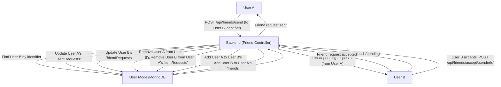
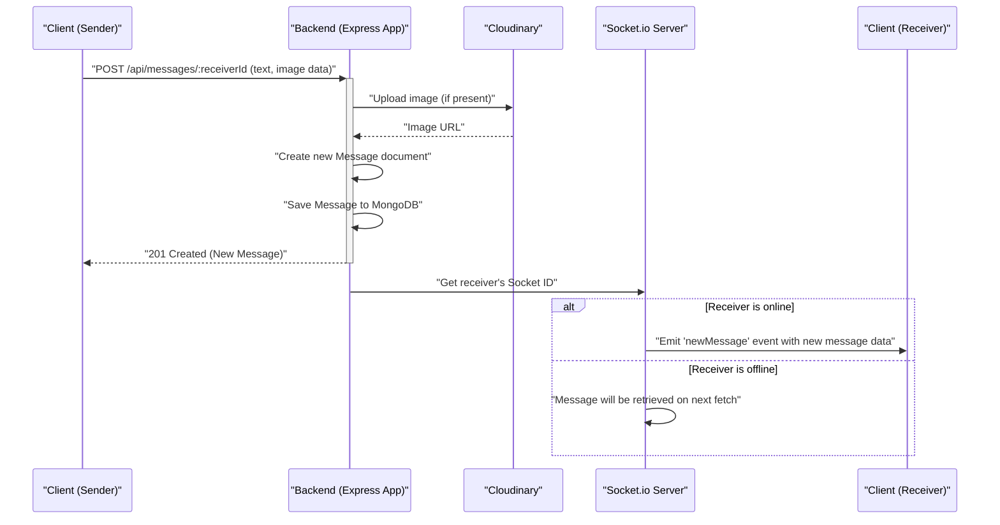

# User, Friend, and Message Management
<TOC />

This section details the core functionalities for managing user profiles, establishing friend relationships, and handling real-time messaging within the application. It covers the data models for `User` and `Message` along with the controllers responsible for friend requests, friend management, and message exchange, including real-time updates via WebSockets and media uploads through Cloudinary.

## User Profiles and Friend Relationships

The `User` model is central to managing user profiles and friend interactions. It extends a standard user schema with fields specifically designed for friend management: `friends`, `friendRequests` (incoming), and `sentRequests` (outgoing).

### User Model Structure

The `userSchema` defines the structure for storing user information, including authentication details and relationship status.

```javascript
// backend/src/models/user.model.js
import mongoose from "mongoose"

const  userSchema = new mongoose.Schema(
    {
        email: { 
            type: String,
            required: true,
            unique: true
        },
        username: {
            type: String,
            required: [true, "Username is required"],
            unique: true,
            trim: true,
            minlength: [3, "Username must be at least 3 characters long"],
            maxlength: [20, "Username cannot be more than 20 characters long"]
        },
        password: {
            type: String,
            minlength: 6,
        },
        profilePic: {
            type: String,
            default: "",
        },
        friends: [{
            type: mongoose.Schema.Types.ObjectId,
            ref: "User",
            default: [] 
        }],
        friendRequests: [{ // Incoming friend requests
            type: mongoose.Schema.Types.ObjectId,
            ref: "User",
            default: []
        }],
        sentRequests: [{ // Outgoing friend requests
            type: mongoose.Schema.Types.ObjectId,
            ref: "User",
            default: []
        }],
        authProvider: {
            type: String,
            enum: ['email', 'google'],
            default: 'email'
        },
        googleId: {
            type: String,
            unique: true,
            sparse: true
        },
    },
    { 
        timestamps: true
    } 
);

// ... (pre-save hook for password handling)

const User = mongoose.model("User", userSchema);

export default User;
```
[View on GitHub](https://github.com/shinymack/Chat-App-MERN/blob/main/backend/src/models/user.model.js)

### Friend Management Controller

The `friend.controller.js` handles all operations related to friend requests and friend list management.

#### Sending a Friend Request

Users can send friend requests using a username or email identifier. The system prevents sending requests to oneself, already-friends, or if a request is already pending.

```javascript
// backend/src/controllers/friend.controller.js
export const sendFriendRequest = async (req, res) => {
    try {
        const { identifier } = req.body;
        const senderId = req.user._id;

        // Find receiver by username OR email
        const receiver = await User.findOne({
            $or: [{ username: identifier }, { email: identifier }]
        });

        if (!receiver) {
            return res.status(404).json({ message: "User not found." });
        }
        
        const receiverId = receiver._id;

        // ... (validation checks for self, existing friends, pending requests)

        sender.sentRequests.push(receiverId);
        receiver.friendRequests.push(senderId);

        await sender.save();
        await receiver.save();

        res.status(200).json({ message: "Friend request sent successfully." });

    } catch (error) {
        console.error("Error in sendFriendRequest: ", error.message);
        res.status(500).json({ message: "Internal server error", error: error.message });
    }
};
```
[View on GitHub](https://github.com/shinymack/Chat-App-MERN/blob/main/backend/src/controllers/friend.controller.js#L11-L64)

#### Accepting, Rejecting, and Removing Friends

The controller also provides endpoints to `acceptFriendRequest`, `rejectFriendRequest`, and `removeFriend`, ensuring mutual updates to both users' records to maintain data consistency. The `getFriends`, `getPendingRequests`, and `getSentRequests` methods allow users to retrieve their friend lists and pending requests, populating user details for better display.

#### Friend Request Lifecycle

The diagram below illustrates the typical flow of a friend request.





## Real-time Message Handling

The application supports real-time messaging between users, including text and image content. This functionality relies on the `Message` model, `message.controller.js`, Cloudinary for image uploads, and Socket.io for real-time communication.

### Message Model Structure

The `messageSchema` captures the essential details of each message exchanged between users.

```javascript
// backend/src/models/message.model.js
import express from "express";
import mongoose from "mongoose";

const messageSchema = new mongoose.Schema(
    {
     senderId: {
        type: mongoose.Schema.Types.ObjectId,
        ref: "User",
        required: true,
     },
     receiverId: {
        type: mongoose.Schema.Types.ObjectId,
        ref: "User",
        required: true,
     },
     text: {
        type: String,
     },
     image: {
        type: String,
     },
    },
    {timestamps: true}
);

export default mongoose.model("Message", messageSchema);
```
[View on GitHub](https://github.com/shinymack/Chat-App-MERN/blob/main/backend/src/models/message.model.js)

### Message Controller

The `message.controller.js` manages message retrieval and sending.

#### Retrieving Messages

The `getMessages` function fetches all messages between two specific users, ensuring that messages sent by either user to the other are retrieved.

```javascript
// backend/src/controllers/message.controller.js
export const getMessages = async (req, res) => {
    try {
        const {id : userToChatId } = req.params;
        const myId = req.user._id;

        const messages = await Message.find({
            $or: [
                {senderId: myId, receiverId:userToChatId},
                {senderId: userToChatId, receiverId: myId}
            ]
        });
        res.status(200).json(messages);
    } catch (error) {
        console.log("Error in getMessages controller:  ", error);
        res.status(500).json({ error: "Internal Server Error" });
    }
};
```
[View on GitHub](https://github.com/shinymack/Chat-App-MERN/blob/main/backend/src/controllers/message.controller.js#L26-L40)

#### Sending Messages with Real-time Updates

The `sendMessage` function handles the creation of new messages. If an `image` is provided, it's uploaded to Cloudinary before saving the message. After saving, it leverages Socket.io to emit the new message in real-time to the receiver, if they are online.

```javascript
// backend/src/controllers/message.controller.js
import User from "../models/user.model.js";
import Message from "../models/message.model.js";
import cloudinary from "../lib/cloudinary.js";
import { getReceiverSocketId, io } from "../lib/socket.js";


export const sendMessage = async (req, res) => {
    try {
        const { text, image } = req.body;
        const { id: receiverId } = req.params;
        const senderId = req.user._id;

        let imageUrl;
        if (image) {
            const uploadResponse = await cloudinary.uploader.upload(image);
            imageUrl = uploadResponse.secure_url;
        }
        const newMessage = new Message({
            senderId,
            receiverId,
            text,
            image: imageUrl,
        });

        await newMessage.save();

        const receiverSocketId = getReceiverSocketId(receiverId);

        if(receiverSocketId) {
            io.to(receiverSocketId).emit("newMessage", newMessage);
        }

        res.status(201).json(newMessage);   
        
    } catch (error) {
        console.log("Error in sendMessage controller:  ", error);
        res.status(500).json({ error: "Internal Server Error" });
    }
};
```
[View on GitHub](https://github.com/shinymack/Chat-App-MERN/blob/main/backend/src/controllers/message.controller.js#L42-L78)

#### Getting Users for Sidebar

The `getUsersForSidebar` utility function retrieves a list of all users, excluding the currently logged-in user. This is typically used to populate a chat sidebar, allowing users to initiate new conversations.

```javascript
// backend/src/controllers/message.controller.js
export const getUsersForSidebar = async (req, res) => {
    try {
        const loggedInUserId = req.user._id;
        const filteredUsers = await User.find({
            _id: { $ne: loggedInUserId }}).select("-password");  
        res.status(200).json(filteredUsers);
    }
    catch (error) {
        console.log("Error in getUsersForSidebar: ", error);
        res.status(500).json({ error: "Internal Server Error" });
    }
};
```
[View on GitHub](https://github.com/shinymack/Chat-App-MERN/blob/main/backend/src/controllers/message.controller.js#L11-L23)

### Real-time Messaging Flow

The sequence diagram below illustrates how a message, potentially with an image, is sent and delivered in real-time.





## Key Integration Points

*   **User and Message Models:** These Mongoose models (`User` and `Message`) are fundamental for data persistence, defining the structure and relationships of entities within MongoDB. They include `ObjectId` references to link users to each other (friends, requests) and messages to their senders/receivers.
*   **Friend Controller Logic:** The `friend.controller.js` implements robust validation checks for friend requests, ensuring users cannot send requests to themselves, existing friends, or if a request is already pending. It ensures atomic updates for both sender and receiver documents upon request actions (send, accept, reject, remove).
*   **Real-time Messaging with Socket.io:** The `message.controller.js` integrates with a separate Socket.io server to provide instant message delivery. After a message is saved to the database, the backend checks if the receiver is online and, if so, emits the new message directly to their connected client. This reduces latency and enhances the user experience.
*   **Cloudinary for Media Handling:** Image attachments in messages are seamlessly handled by Cloudinary. The backend uploads the image data to Cloudinary, stores the resulting secure URL in the `Message` model, and serves it through the frontend. This offloads media storage and delivery, improving performance and scalability.
*   **Populating References:** Both friend and message controllers heavily utilize Mongoose's `populate` method to retrieve full user details (e.g., username, profile picture) when fetching lists of friends, pending requests, or users for the sidebar, avoiding manual lookups and simplifying data retrieval.

Next: [Cloud Services and Utilities](./2.3_cloud-services-and-utilities.mdx)