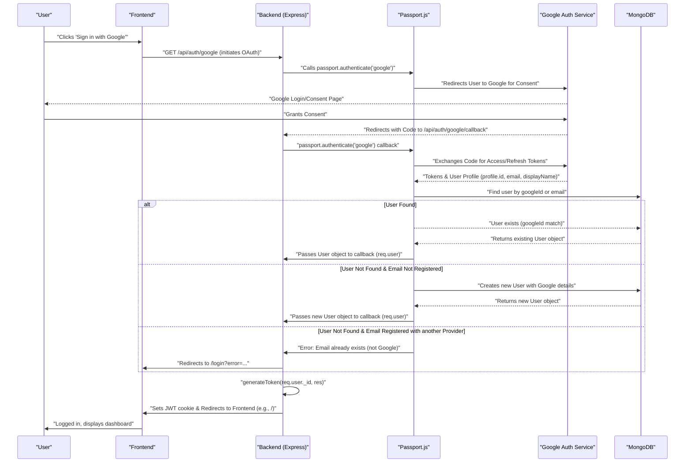

# Authentication and Security
<TOC />

Authentication and authorization are critical components of any secure web application. In the Chat-App-MERN project, a robust system handles user registration, login, session management, and access control. This section details the implementation of these features, leveraging JWTs for stateless authentication, Passport.js for Google OAuth, and Bcrypt.js for secure password handling.

## User Registration and Login

The primary authentication mechanism involves email and password for traditional user accounts. New users can sign up by providing a username, email, and password. Existing users can log in with their credentials.

### Signup Process

The `signup` controller in `backend/src/controllers/auth.controller.js` handles new user registration. It performs several validation checks before hashing the password and creating a new user record.

```javascript reference
// backend/src/controllers/auth.controller.js
import cloudinary from "../lib/cloudinary.js";
import { generateToken } from "../lib/utils.js";
import User from "../models/user.model.js";
import bcrypt from "bcryptjs";

export const signup = async (req, res) => {
    // console.log(req.body); //debugging
    const {username, email, password} = req.body;
    try {
        if(!username || !email || !password) {
            return res.status(400).json({message: "Please fill in all fields."});
        }
        if (username.length < 3) {
            return res.status(400).json({ message: "Username must be at least 3 characters." });
        }
        if (username.length > 20) {
            return res.status(400).json({ message: "Username cannot be more than 20 characters." });
        }
        if (password.length < 6) {
            return res.status(400).json({message: "Password must be at least 6 characters."});
        }
        const user = await User.findOne({email});
        if (user) return res.status(400).json({message: "Email already exists."});
        
        const existingUserByUsername = await User.findOne({ username });
        if (existingUserByUsername) {
            return res.status(400).json({ message: "Username already exists. Please choose another." });
        }

        const salt = await bcrypt.genSalt(10);
        const hashedPassword = await bcrypt.hash(password, salt);

        const newUser = new User({
            username,
            email,
            password: hashedPassword,
            authProvider: 'email'
        });
        if(newUser){
            //generate jwt token here
            generateToken(newUser._id, res);
            await newUser.save();

            res.status(201).json({
                _id: newUser._id,
                username: newUser.username,
                email: newUser.email,   
                profilePic: newUser.profilePic,
                authProvider: newUser.authProvider
            });
        } else {
            res.status(400).json({message: "Invalid user data."});
        }
    } catch (error) {
        console.log("Error in signup controller", error.message)
        res.status(500).json({message: "Something went wrong."});
    }
};
```
<details>
<summary>View on GitHub</summary>
<div className="language-mermaid">
<a href="https://github.com/shinymack/Chat-App-MERN/blob/main/backend/src/controllers/auth.controller.js#L7-L69" target="_blank">
backend/src/controllers/auth.controller.js#L7-L69
</a>
</div>
</details>

**Key aspects:**
- **Input Validation**: Checks for missing fields, username length (3-20 characters), and password strength (min 6 characters).
- **Uniqueness Checks**: Ensures both email and username are not already registered.
- **Password Hashing**: Uses `bcryptjs` to generate a salt and hash the user's password, storing only the hash.
- **JWT Generation**: Upon successful registration, a JSON Web Token (JWT) is generated using `generateToken` and stored as an `httpOnly` cookie.

### Login Process

The `login` controller verifies user credentials against stored records.

```javascript reference
// backend/src/controllers/auth.controller.js
export const login = async (req, res) => {
    const {email, password} = req.body;
    try {
        const user = await User.findOne({email});

        if(!user) {
            return res.status(400).json({message: "Invalid credentials."});
        }

        if(user.authProvider === 'google' && !user.password){
            return res.status(400).json({ message: "Please sign in with Google." });
        }

        const isPasswordCorrect = await bcrypt.compare(password, user.password);
        if(!isPasswordCorrect) {
            return res.status(400).json({message: "Invalid credentials."});
        }

        generateToken(user._id, res);
        res.status(200).json({
            _id: user._id,
            username: user.username,
            email: user.email,
            profilePic: user.profilePic,
            authProvider: user.authProvider,
        });
    } catch (error) {
        console.log("Error in login controller", error.message);
        res.status(500).json({message: "Something went wrong."});
    }
};
```
<details>
<summary>View on GitHub</summary>
<div className="language-mermaid">
<a href="https://github.com/shinymack/Chat-App-MERN/blob/main/backend/src/controllers/auth.controller.js#L71-L103" target="_blank">
backend/src/controllers/auth.controller.js#L71-L103
</a>
</div>
</details>

**Key aspects:**
- **User Lookup**: Finds the user by email.
- **Password Comparison**: Uses `bcrypt.compare` to safely compare the provided password with the stored hash.
- **JWT Generation**: If credentials are valid, a new JWT is issued and set as a cookie.
- **Google Auth Check**: Prevents email/password login for accounts primarily registered via Google, guiding the user to use Google SSO.

### JWT Generation and Handling

The `generateToken` utility function (`backend/src/lib/utils.js`) creates and sets the JWT.

```javascript reference
// backend/src/lib/utils.js
import jwt from 'jsonwebtoken';


export const generateToken = (userId, res) => {

    const token = jwt.sign({userId}, process.env.JWT_SECRET, 
        {expiresIn: "7d"});

    res.cookie("jwt", token, {
        maxAge: 7 * 24 * 60 * 60 * 1000, 
        httpOnly: true,
        sameSite: "strict",
        secure: process.env.NODE_ENV !== "development",
    });
    return token;
};
```
<details>
<summary>View on GitHub</summary>
<div className="language-mermaid">
<a href="https://github.com/shinymack/Chat-App-MERN/blob/main/backend/src/lib/utils.js#L4-L17" target="_blank">
backend/src/lib/utils.js#L4-L17
</a>
</div>
</details>

**Token details:**
- **Payload**: Contains the `userId`.
- **Secret**: Signed with `process.env.JWT_SECRET`.
- **Expiration**: Set to 7 days.
- **Cookie Flags**:
    - `maxAge`: Matches token expiration.
    - `httpOnly`: Prevents client-side JavaScript access, mitigating XSS attacks.
    - `sameSite: "strict"`: Prevents CSRF attacks by ensuring the cookie is only sent with requests originating from the same site.
    - `secure`: Ensures the cookie is only sent over HTTPS in production environments.

## Google OAuth Integration

The application integrates Google as an authentication provider using `passport-google-oauth20`. This allows users to sign up and log in using their Google accounts.

### Passport Configuration

The `configurePassport` function in `backend/src/lib/passport.config.js` sets up the Google Strategy and user serialization/deserialization.

```javascript reference
// backend/src/lib/passport.config.js
import passport from 'passport';
import { Strategy as GoogleStrategy } from 'passport-google-oauth20';
import User from '../models/user.model.js'; 
import dotenv from 'dotenv';

dotenv.config(); 

export const configurePassport = () => {
    passport.use(new GoogleStrategy({
        clientID: process.env.GOOGLE_CLIENT_ID,
        clientSecret: process.env.GOOGLE_CLIENT_SECRET,
        callbackURL: process.env.GOOGLE_CALLBACK_URL,
        scope: ['profile', 'email'] 
    },
    async (accessToken, refreshToken, profile, done) => {
        try {
            // console.log("Google Profile:", profile); // 

            let user = await User.findOne({ googleId: profile.id });

            if (user) {
                return done(null, user);
            } else {
                let username = profile.displayName.replace(/\s+/g, '').toLowerCase() || `user${Date.now()}`;

                const existingUserByUsername = await User.findOne({ username });
                if (existingUserByUsername) {
                    username = `${username}${Date.now().toString().slice(-4)}`; // Make it more unique
                }
                if (username.length > 20) username = username.substring(0,20);


                const newUser = new User({
                    googleId: profile.id,
                    email: profile.emails && profile.emails[0] ? profile.emails[0].value : null, // Take the first email
                    username: username,
                    // profilePic: profile.photos && profile.photos[0] ? profile.photos[0].value : '', // Optional: Use Google profile pic
                    authProvider: 'google',
                });

                if (!newUser.email) {
                    return done(new Error("Email not provided by Google. Cannot create account."), null);
                }

                const existingUserByEmail = await User.findOne({ email: newUser.email });
                if (existingUserByEmail && existingUserByEmail.authProvider !== 'google') {
                    return done(null, false, { message: `An account with email ${newUser.email} already exists. Please sign in using your original method.` });
                }


                await newUser.save();
                return done(null, newUser);
            }
        } catch (error) {
            return done(error, null);
        }
    }));

    // Serialize user to store in session (just the user ID)
    passport.serializeUser((user, done) => {
        done(null, user.id); // user.id is the _id from MongoDB
    });

    // Deserialize user from session (fetch user from DB using the ID)
    passport.deserializeUser(async (id, done) => {
        try {
            const user = await User.findById(id);
            done(null, user); // This user object is attached to req.user
        } catch (error) {
            done(error, null);
        }
    });
};
```
<details>
<summary>View on GitHub</summary>
<div className="language-mermaid">
<a href="https://github.com/shinymack/Chat-App-MERN/blob/main/backend/src/lib/passport.config.js#L6-L79" target="_blank">
backend/src/lib/passport.config.js#L6-L79
</a>
</div>
</details>

**Callback logic:**
- **Existing User**: If a user with the `googleId` already exists, they are logged in.
- **New User**: If not, a new user is created with details from the Google profile.
    - A unique username is generated if the display name is taken or exceeds length limits.
    - Crucially, it checks if an account with the *same email* already exists *but was not created via Google*. If so, it informs the user to use their original login method to prevent account hijacking.
- **Serialization/Deserialization**: Passport uses `serializeUser` and `deserializeUser` to store and retrieve user information from the session. This is important for the `req.user` object to be available in subsequent requests after Google OAuth completes.

### Google Auth Flow





## Security Middleware

The `protectRoute` middleware (`backend/src/middleware/auth.middleware.js`) is crucial for securing authenticated routes.

```javascript reference
// backend/src/middleware/auth.middleware.js
import jwt from "jsonwebtoken"
import User from "../models/user.model.js"

export const protectRoute = async (req, res, next) => {
    try {
        const token = req.cookies.jwt;
        if(!token){
            return res.status(401).json({message: "Unauthorized - No Token Provided"});
        }

        const decoded = jwt.verify(token, process.env.JWT_SECRET)

        if(!decoded) {
            return res.status(401).json({message: "Unauthorized - Invalid Token"});
        }
        const user = await User.findById(decoded.userId).select("-password");

        if(!user) {
            return res.status(404).json({message: "User not found"});
        }
        req.user = user;

        next();
    } catch (error) {
        console.log("Error in protectRoute middleware", error.message);
        res.status(500).json({message: "Internal Server Error"});

    }

};
```
<details>
<summary>View on GitHub</summary>
<div className="language-mermaid">
<a href="https://github.com/shinymack/Chat-App-MERN/blob/main/backend/src/middleware/auth.middleware.js#L4-L29" target="_blank">
backend/src/middleware/auth.middleware.js#L4-L29
</a>
</div>
</details>

**How it works:**
1. **Token Retrieval**: Extracts the JWT from the `jwt` cookie.
2. **Token Verification**: Uses `jwt.verify` to check the token's authenticity and expiration.
3. **User Lookup**: If the token is valid, it extracts the `userId` from the payload and fetches the corresponding user from the database.
4. **Attach User to Request**: The retrieved user object (excluding the password hash) is attached to `req.user`, making user data easily accessible in subsequent controller functions.
5. **Authorization**: If any step fails (no token, invalid token, user not found), it returns an appropriate 401/404 error, preventing unauthorized access.

## Profile Management

Users can update their profile information, such as their username and profile picture.

### Updating User Profile

The `updateProfile` controller handles modifications to user data.

```javascript reference
// backend/src/controllers/auth.controller.js
export const updateProfile = async (req, res) => {
    try {
        const { profilePic, username } = req.body; 
        const userId = req.user._id;
        let userToUpdate = await User.findById(userId);

        if (!userToUpdate) {
            return res.status(404).json({ message: "User not found." });
        }

        const fieldsToUpdate = {};
        let newUsername = username ? username.trim() : null;
        let usernameChanged = false;

        // Handle username update
        if (newUsername && newUsername !== userToUpdate.username) {
            if (newUsername.length < 3 || newUsername.length > 20) {
                return res.status(400).json({ message: "Username must be between 3 and 20 characters." });
            }

            const existingUserWithNewUsername = await User.findOne({ username: newUsername, _id: { $ne: userId } });
            if (existingUserWithNewUsername) {
                return res.status(400).json({ message: "This username is already taken by someone else." });
            }
            fieldsToUpdate.username = newUsername;
            usernameChanged = true;
        }

        // Handle profile picture update
        if (profilePic) {
            const uploadResponse = await cloudinary.uploader.upload(profilePic);
            fieldsToUpdate.profilePic = uploadResponse.secure_url;
        }

        if (Object.keys(fieldsToUpdate).length === 0) {
            return res.status(400).json({ message: "No changes provided to update." });
        }

        const updatedUser = await User.findByIdAndUpdate(userId, { $set: fieldsToUpdate }, { new: true });

        if (!updatedUser) {
            return res.status(404).json({ message: "Failed to update user."});
        }

        generateToken(updatedUser._id, res); 

        res.status(200).json(updatedUser);

    } catch (error) {
        console.error("Error in updateProfile controller", error.message);
        if (error.code === 11000 && error.keyValue && error.keyValue.username) { 
            return res.status(400).json({ message: "This username is already taken." });
        }
        res.status(500).json({ message: "Internal Server Error while updating profile." });
    }
};
```
<details>
<summary>View on GitHub</summary>
<div className="language-mermaid">
<a href="https://github.com/shinymack/Chat-App-MERN/blob/main/backend/src/controllers/auth.controller.js#L182-L248" target="_blank">
backend/src/controllers/auth.controller.js#L182-L248
</a>
</div>
</details>

**Key aspects:**
- **User Identification**: Uses `req.user._id` (set by `protectRoute`) to identify the current user.
- **Username Validation**: If a new username is provided, it performs validation checks (length, uniqueness) similar to the signup process.
- **Profile Picture Upload**: If `profilePic` is provided (assumed to be a base64 string or similar), it's uploaded to Cloudinary, and the `secure_url` is stored.
- **Database Update**: The user document is updated using `findByIdAndUpdate`.
- **Token Refresh**: A new JWT is generated and set, ensuring that if user-related data (like username or profile picture URL) is embedded in the token or needs to be refreshed in the client's cookie, it is updated.

### Username Availability Check

Before updating a username, the frontend can utilize the `checkUsernameAvailability` endpoint.

```javascript reference
// backend/src/controllers/auth.controller.js
export const checkUsernameAvailability = async (req, res) => {
    try {
        const { username } = req.params;
        const currentUserId = req.user._id; 

        if (!username || username.trim().length < 3) {
            return res.status(400).json({ available: false, message: "Username must be at least 3 characters." });
        }
        if (username.trim().length > 20) {
            return res.status(400).json({ available: false, message: "Username cannot be more than 20 characters." });
        }
    
        // Check if the username is the current user's existing username
        if (req.user.username === username) {
            return res.status(200).json({ available: true, message: "This is your current username." });
        }

        const existingUser = await User.findOne({ username: username });

        if (existingUser) {
            return res.status(200).json({ available: false, message: "Username is already taken." });
        }

        res.status(200).json({ available: true, message: "Username is available." });

    } catch (error) {
        console.error("Error in checkUsernameAvailability:", error.message);
        res.status(500).json({ available: false, message: "Error checking username availability." });
    }
};
```
<details>
<summary>View on GitHub</summary>
<div className="language-mermaid">
<a href="https://github.com/shinymack/Chat-App-MERN/blob/main/backend/src/controllers/auth.controller.js#L143-L179" target="_blank">
backend/src/controllers/auth.controller.js#L143-L179
</a>
</div>
</details>

**Logic:**
- Takes a username from `req.params`.
- Validates length constraints.
- Crucially, it first checks if the requested username is the *user's current username*. If so, it's considered available.
- Otherwise, it queries the database to see if any *other* user already has that username.

## Logout and Session Management

Logging out invalidates the user's session by clearing the JWT cookie.

```javascript reference
// backend/src/controllers/auth.controller.js
export const logout = (req, res) => {
    try {
        res.cookie("jwt", "", {maxAge: 0});
        res.status(200).json({message: "Logged out successfully."})
    } catch(error) {
        console.log("Error in logout controller", error.message);
        res.status(500).json({message:"Internal Server Error"}); 
    }
};
```
<details>
<summary>View on GitHub</summary>
<div className="language-mermaid">
<a href="https://github.com/shinymack/Chat-App-MERN/blob/main/backend/src/controllers/auth.controller.js#L105-L113" target="_blank">
backend/src/controllers/auth.controller.js#L105-L113
</a>
</div>
</details>

- **Cookie Clearing**: Sets the `jwt` cookie to an empty string with `maxAge: 0`, effectively deleting it from the client's browser.
- Since JWTs are stateless, there's no server-side session to destroy, only the client's token.

## Key Integration Points

- **Express Session & Passport.js**: The backend uses `express-session` to maintain session data necessary for Passport.js's OAuth flow. This session stores the `userId` after `serializeUser` is called.
- **Stateless JWTs**: While a session is used for the OAuth handshake, the primary authentication post-login relies on stateless JWTs stored in `httpOnly` cookies. This reduces server load and simplifies horizontal scaling.
- **Middleware Chain**: The `protectRoute` middleware is strategically placed before any route that requires authentication. For Google OAuth, the `passport.authenticate` middleware handles the redirects and user creation/lookup, ultimately passing the authenticated user to the request handler.
- **Error Handling**: Consistent error handling throughout the authentication process ensures that users receive informative messages for incorrect credentials, validation failures, or server issues.
- **Environment Variables**: Sensitive information like `JWT_SECRET`, `GOOGLE_CLIENT_ID`, and `GOOGLE_CLIENT_SECRET` are stored as environment variables, ensuring they are not hardcoded and can be easily managed across different deployment environments.

This comprehensive approach to authentication and security, combining traditional email/password with Google OAuth and robust JWT handling, provides a secure and user-friendly experience for the Chat-App.

Next: [Frontend Development](./3_frontend-development.mdx)