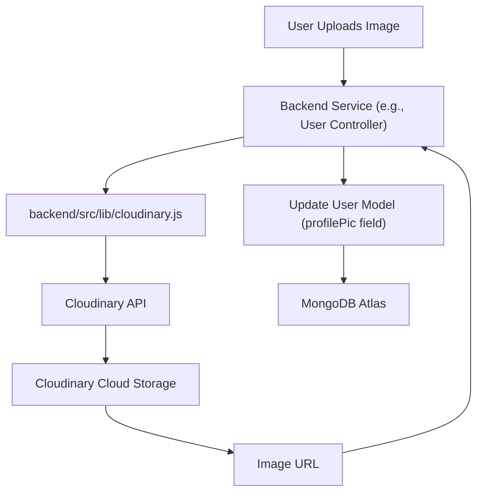

# Backend Utilities and Services

<TOC />

This section details the core utility functions, external service integrations, and real-time communication mechanisms that power the backend. These components are designed to be modular and reusable across different parts of the application, ensuring efficient operations and a robust feature set.

## Cloudinary Image Management

Cloudinary is integrated for efficient storage, manipulation, and delivery of user-uploaded images, primarily profile pictures. The setup involves configuring Cloudinary with API credentials sourced from environment variables, ensuring secure access and operation.

### Configuration and Setup

The `cloudinary.js` file initializes the Cloudinary SDK using credentials loaded from the application's environment. This setup allows other backend services to interact with Cloudinary's robust image management platform seamlessly.

```javascript
// backend/src/lib/cloudinary.js
import { v2 as cloudinary } from "cloudinary";
import { config } from 'dotenv';

config(); // Load environment variables

cloudinary.config({
    cloud_name: process.env.CLOUDINARY_CLOUD_NAME,
    api_key: process.env.CLOUDINARY_API_KEY,
    api_secret: process.env.CLOUDINARY_API_SECRET,
});

export default cloudinary;
```

This snippet demonstrates the initialization process. The `config()` call from `dotenv` ensures that `process.env` contains the necessary `CLOUDINARY_CLOUD_NAME`, `CLOUDINARY_API_KEY`, and `CLOUDINARY_API_SECRET` values.
[View on GitHub](https://github.com/shinymack/Chat-App-MERN/blob/main/backend/src/lib/cloudinary.js#L1-L12)

### Integration Flow

The Cloudinary service is typically utilized when a user updates their profile picture. The backend handles the upload request, sends the image to Cloudinary, and stores the returned URL in the user's database record.





## Socket.IO for Real-time Communication

Socket.IO is employed to enable real-time, bidirectional communication between clients and the server, crucial for features like instant messaging, online user presence, and real-time notifications. It builds upon the HTTP server, allowing for persistent connections.

### Server Setup and User Tracking

The `socket.js` file sets up the Socket.IO server, integrates it with the Express application, and manages the mapping of user IDs to their respective socket IDs. This mapping is vital for sending targeted messages to specific users.

```javascript
// backend/src/lib/socket.js
import { Server } from "socket.io";
import http from "http";
import express from "express";

const app = express();
const server = http.createServer(app);
const io = new Server(server, {
    cors: {
        origin: ["http://localhost:5173"] // Frontend origin
    }
});

// Used to store online users: {userId : socketId}
const userSocketMap = {};

export function getReceiverSocketId(userId) {
    return userSocketMap[userId];
}
// ... connection and disconnect handlers ...
export { io, app, server };
```

This snippet shows the initialization of the Express app, HTTP server, and Socket.IO server. The `userSocketMap` is a critical part of the real-time presence system.
[View on GitHub](https://github.com/shinymack/Chat-App-MERN/blob/main/backend/src/lib/socket.js#L1-L18)

### Connection and Disconnection Handling

The `io.on("connection", ...)` block handles new client connections, extracting the `userId` from the handshake query and adding the user to the `userSocketMap`. It also broadcasts updates about online users. The `socket.on("disconnect", ...)` handler removes disconnected users from the map and broadcasts updated online user lists.

```javascript
// backend/src/lib/socket.js (continued)
io.on("connection", (socket) => {
    console.log("A user connected", socket.id);
    const userId = socket.handshake.query.userId;
    if(userId) userSocketMap[userId] = socket.id;

    // Emit event to all connected clients about online users
    io.emit("getOnlineUsers", Object.keys(userSocketMap));

    socket.on("disconnect", ()=>{
        console.log("A user disconnected", socket.id);
        delete userSocketMap[userId];
        io.emit("getOnlineUsers", Object.keys(userSocketMap));
    });
});
```

This mechanism ensures the `userSocketMap` accurately reflects current online users, enabling precise real-time interactions.
[View on GitHub](https://github.com/shinymack/Chat-App-MERN/blob/main/backend/src/lib/socket.js#L21-L32)

## Utility Functions

The `utils.js` file houses general-purpose helper functions that support various backend operations, such as generating JSON Web Tokens (JWTs) for authentication.

### JWT Token Generation

The `generateToken` function creates a JWT for a given `userId` and sets it as an HTTP-only cookie in the response. This approach enhances security by making the token inaccessible to client-side JavaScript.

```javascript
// backend/src/lib/utils.js
import jwt from 'jsonwebtoken';

export const generateToken = (userId, res) => {
    const token = jwt.sign({userId}, process.env.JWT_SECRET,
        {expiresIn: "7d"});

    res.cookie("jwt", token, {
        maxAge: 7 * 24 * 60 * 60 * 1000, // 7 days in milliseconds
        httpOnly: true, // Prevent client-side JS access
        sameSite: "strict", // CSRF protection
        secure: process.env.NODE_ENV !== "development", // Use HTTPS in production
    });
    return token;
};
```

The `maxAge` is set for 7 days, and `secure` is conditionally applied based on the environment to ensure tokens are only sent over HTTPS in production.
[View on GitHub](https://github.com/shinymack/Chat-App-MERN/blob/main/backend/src/lib/utils.js#L1-L15)

## User Model Definition

The `user.model.js` file defines the Mongoose schema for the `User` document, which includes fields for authentication, profile information, and social connections (friends, friend requests).

### User Schema Structure

The `userSchema` includes fields like `email`, `username`, `password`, `profilePic`, and arrays for managing `friends`, `friendRequests`, and `sentRequests`. It also supports different authentication providers.

```javascript
// backend/src/models/user.model.js
import mongoose from "mongoose";

const userSchema = new mongoose.Schema(
    {
        email: { type: String, required: true, unique: true },
        username: { type: String, required: true, unique: true, trim: true, minlength: 3, maxlength: 20 },
        password: { type: String, minlength: 6 },
        profilePic: { type: String, default: "" },
        friends: [{ type: mongoose.Schema.Types.ObjectId, ref: "User", default: [] }],
        friendRequests: [{ type: mongoose.Schema.Types.ObjectId, ref: "User", default: [] }],
        sentRequests: [{ type: mongoose.Schema.Types.ObjectId, ref: "User", default: [] }],
        authProvider: { type: String, enum: ['email', 'google'], default: 'email' },
        googleId: { type: String, unique: true, sparse: true },
    },
    { timestamps: true }
);

// ... pre-save hook ...
const User = mongoose.model("User", userSchema);
export default User;
```

The `timestamps: true` option automatically adds `createdAt` and `updatedAt` fields to documents.
[View on GitHub](https://github.com/shinymack/Chat-App-MERN/blob/main/backend/src/models/user.model.js#L3-L37)

### Pre-save Hook for Authentication Logic

A `pre('save')` hook is implemented to handle specific logic before a user document is saved. This includes ensuring passwords are not set for Google-authenticated users if not explicitly modified, and enforcing password presence for email signups.

```javascript
// backend/src/models/user.model.js (continued)
userSchema.pre('save', async function(next) {
    if (this.authProvider === 'google' && !this.isModified('password')) {
        this.password = undefined; // Google auth users don't need a local password
    }
    if (this.authProvider === 'email' && !this.password && this.isNew) {
        return next(new Error('Password is required for email signup.'));
    }
    next();
});
```

This hook centralizes important validation and data manipulation logic related to user authentication methods.
[View on GitHub](https://github.com/shinymack/Chat-App-MERN/blob/main/backend/src/models/user.model.js#L40-L47)

## Key Integration Points

These backend utilities and services are interconnected to provide a cohesive user experience:

*   **Authentication Flow:** User registration/login (handled by other backend routes) often involves generating a JWT using `generateToken` from `backend/src/lib/utils.js` upon successful authentication.
*   **Profile Management:** When a user updates their profile picture, the `backend/src/lib/cloudinary.js` integration is used to upload and retrieve the image URL, which is then stored in the `profilePic` field of the `User` model (`backend/src/models/user.model.js`).
*   **Real-time Interactions:** The `backend/src/lib/socket.js` module is the backbone for live features. When a user logs in, their `userId` is typically passed to the Socket.IO client, allowing the server to map their `userId` to a `socket.id` in `userSocketMap`. This enables direct messaging and real-time online status updates.
*   **User Data Management:** The `User` model acts as the central repository for all user-related data, including authentication details, profile information, and social graph connections. Operations on friend requests or friend lists directly modify this model.

The modular design of these utilities ensures that each component serves a distinct purpose while being easily composable to form complex functionalities within the application.

Next: [Frontend Implementation and UI](./3_frontend-implementation-and-ui.mdx)