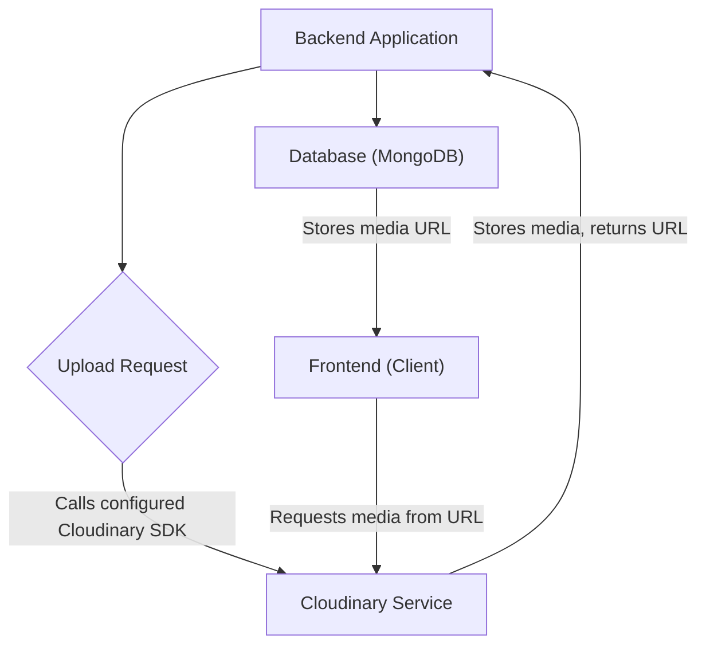
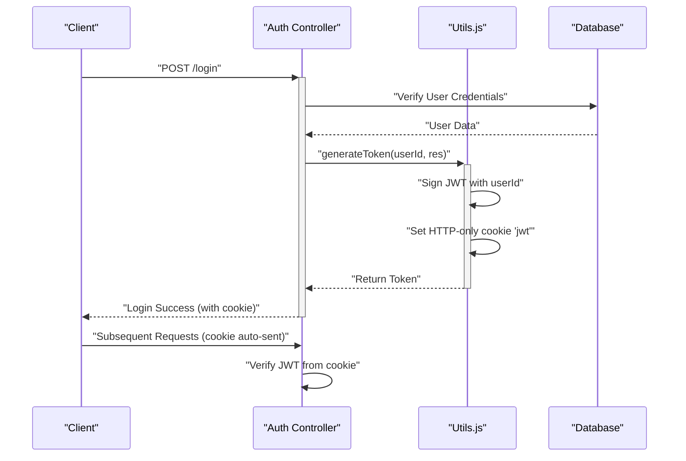

# Backend Utilities and Services
<TOC />

This section details the core utilities, helper functions, and third-party service integrations that empower the backend's functionality. These components provide essential services ranging from secure user authentication to external resource management, forming the backbone of the application's operations.

## Core Dependencies

The `backend/package.json` file outlines all direct dependencies and development tools required for the backend. This provides a clear overview of the external libraries and frameworks that the application relies on to function.

```json title="backend/package.json"
{
  "name": "backend",
  "version": "1.0.0",
  "main": "src/index.js",
  "scripts": {
    "dev": "nodemon src/index.js",
    "start": "node src/index.js"
  },
  "author": "",
  "type": "module",
  "license": "ISC",
  "description": "",
  "dependencies": {
    "bcryptjs": "^2.4.3",
    "cloudinary": "^2.5.1",
    "cookie-parser": "^1.4.7",
    "dotenv": "^16.4.7",
    "express": "^4.21.2",
    "express-session": "^1.18.1",
    "jsonwebtoken": "^9.0.2",
    "mongoose": "^8.9.5",
    "passport": "^0.7.0",
    "passport-google-oauth20": "^2.0.0",
    "socket.io": "^4.8.1"
  },
  "devDependencies": {
    "nodemon": "^3.1.9"
  }
}
```
<p align="right">
  <a href="https://github.com/shinymack/Chat-App-MERN/blob/main/backend/package.json" target="_blank" rel="noopener noreferrer">View on GitHub</a>
</p>

### Key Dependencies Explained

The `package.json` reveals several critical packages that define the backend's capabilities:

*   **`express`**: The foundational web framework for building RESTful APIs. It handles routing, middleware, and request/response cycles.
*   **`mongoose`**: An ODM (Object Data Modeling) library for MongoDB, providing a schema-based solution to model application data and interact with the database.
*   **`jsonwebtoken` (`jwt`)**: Used for implementing token-based authentication. It creates and verifies JSON Web Tokens to secure API endpoints.
*   **`bcryptjs`**: A library for hashing passwords, ensuring that user passwords are never stored in plain text and are protected against common attacks.
*   **`dotenv`**: Loads environment variables from a `.env` file into `process.env`, crucial for managing sensitive configurations like API keys and database connection strings without hardcoding them.
*   **`cloudinary`**: Integrates with the Cloudinary service for cloud-based image and video management. This includes uploading, storing, and delivering media files.
*   **`socket.io`**: Enables real-time, bidirectional, event-based communication between the client and server, essential for features like chat messaging or live notifications.
*   **`cookie-parser`**: A middleware to parse cookies attached to the client request object.
*   **`express-session`**: Middleware for managing user sessions, often used in conjunction with authentication strategies.
*   **`passport` & `passport-google-oauth20`**: Authentication middleware for Node.js, specifically configured for Google OAuth 2.0, allowing users to log in with their Google accounts.
*   **`nodemon` (devDependencies)**: A utility that monitors for any changes in your source and automatically restarts your server, greatly improving development workflow.

The `package-lock.json` provides a precise record of the dependency tree, ensuring that all team members and deployment environments use the exact same versions of all packages, preventing potential dependency conflicts. This file is automatically generated and updated by npm or yarn when dependencies are installed, added, or removed.

## Cloudinary Integration

The `backend/src/lib/cloudinary.js` file handles the configuration and export of the Cloudinary SDK, enabling image and video management functionalities within the backend. This utility allows for seamless interaction with Cloudinary's cloud services, typically for uploading user avatars, media in chat, or other static assets.

```javascript title="backend/src/lib/cloudinary.js"
import {v2 as cloudinary} from "cloudinary"

import { config } from 'dotenv'

config();

cloudinary.config(
    {cloud_name: process.env.CLOUDINARY_CLOUD_NAME,
    api_key: process.env.CLOUDINARY_API_KEY,
    api_secret: process.env.CLOUDINARY_API_SECRET,}
);

export default cloudinary;
```
<p align="right">
  <a href="https://github.com/shinymack/Chat-App-MERN/blob/main/backend/src/lib/cloudinary.js" target="_blank" rel="noopener noreferrer">View on GitHub</a>
</p>

The snippet demonstrates:
1.  **Importing `v2` as `cloudinary`**: Imports the Cloudinary SDK's v2 version.
2.  **`dotenv` configuration**: Ensures that environment variables (like Cloudinary credentials) are loaded before the Cloudinary configuration.
3.  **`cloudinary.config`**: Initializes the Cloudinary SDK with `CLOUD_NAME`, `API_KEY`, and `API_SECRET` retrieved from environment variables. This keeps sensitive credentials out of the codebase.
4.  **`export default cloudinary`**: Makes the configured Cloudinary client available for other modules in the backend to perform upload, deletion, or other media manipulation tasks.

### Cloudinary Integration Flow

The following diagram illustrates how the backend interacts with Cloudinary for media management.





This flow ensures that media files are offloaded to a dedicated service, reducing server load and providing optimized delivery to clients.

## Utility Functions

The `backend/src/lib/utils.js` file contains helper functions that abstract common operations, promoting code reusability and maintainability. Currently, it includes a function for generating and setting JWT tokens for authentication.

```javascript title="backend/src/lib/utils.js"
import jwt from 'jsonwebtoken';


export const generateToken = (userId, res) => {

    const token = jwt.sign({userId}, process.env.JWT_SECRET, 
        {expiresIn: "7d"});

    res.cookie("jwt", token, {
        maxAge: 7 * 24 * 60 * 60 * 1000, 
        httpOnly: true,
        sameSite: "strict",
        secure: process.env.NODE_ENV !== "development",
    });
    return token;
};
```
<p align="right">
  <a href="https://github.com/shinymack/Chat-App-MERN/blob/main/backend/src/lib/utils.js" target="_blank" rel="noopener noreferrer">View on GitHub</a>
</p>

### `generateToken` Function

The `generateToken` function is a crucial part of the authentication system:

*   **`jwt.sign({userId}, process.env.JWT_SECRET, {expiresIn: "7d"})`**: This line creates a JSON Web Token.
    *   `userId`: The payload of the token, identifying the authenticated user.
    *   `process.env.JWT_SECRET`: A secret key used to sign the token, ensuring its integrity and authenticity. This must be kept secret and is loaded from environment variables.
    *   `expiresIn: "7d"`: Sets the token's expiration time to 7 days, enhancing security by limiting the window of vulnerability if a token is compromised.
*   **`res.cookie("jwt", token, {...})`**: The generated JWT is then set as an HTTP-only cookie on the response object.
    *   `maxAge`: Sets the cookie's expiration to match the token's `expiresIn` duration.
    *   `httpOnly: true`: Prevents client-side JavaScript from accessing the cookie, mitigating XSS (Cross-Site Scripting) attacks.
    *   `sameSite: "strict"`: Provides protection against CSRF (Cross-Site Request Forgery) attacks by ensuring the cookie is only sent with requests originating from the same site.
    *   `secure: process.env.NODE_ENV !== "development"`: Ensures the cookie is only sent over HTTPS in production environments, protecting against eavesdropping.

### Authentication Flow with `generateToken`

This sequence diagram illustrates the use of the `generateToken` utility in a typical user login process.





## Key Integration Points

The backend utilities and services are deeply integrated into the overall application architecture.

1.  **Environment Variable Management**: The `.env` file, managed by `dotenv`, is the central source for all sensitive configurations. This includes database credentials, Cloudinary API keys, and JWT secrets. Proper `.env` file management is crucial for security and deployment across different environments.
2.  **Authentication and Authorization**: `bcryptjs` for password hashing and `jsonwebtoken` (via `utils.js`) for token generation form the core of secure user access. `passport` and `passport-google-oauth20` extend this for robust third-party authentication.
3.  **Media Handling**: `cloudinary.js` provides a centralized module for all media upload and storage operations. This decouples media management from business logic, making it easier to switch providers or implement additional features later.
4.  **Real-time Communication**: `socket.io` is fundamental for building interactive features like chat. Its integration ensures that events are handled efficiently and in real-time between connected clients and the server.
5.  **Database Interactions**: `mongoose` acts as the bridge to MongoDB, abstracting raw database operations into object-oriented models, which simplifies data manipulation and validation.

These integrated utilities ensure a robust, secure, and scalable backend that can handle various application requirements, from user authentication to real-time data exchange and media management.

Next: [Frontend Development and UI](./3_frontend-development-and-ui.mdx)