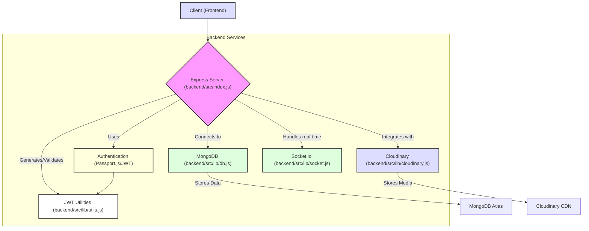
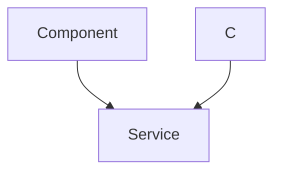

---
title: "Backend Utilities and Services"
description: "Documentation for shared backend utilities, helper functions, and external service integrations."
sidebar_position: 23
---

# Backend Utilities and Services

<TOC />

This section provides comprehensive documentation for the shared backend utilities, helper functions, and external service integrations that form the backbone of the application's server-side operations. It details core functionalities like database connectivity, authentication token management, and external media storage, highlighting their implementation and role within the overall system architecture.

## System Purpose and Architecture

The backend utilities and services are designed to centralize common operational tasks, ensure consistency, and abstract away complexities associated with external integrations. This modular approach enhances maintainability, testability, and scalability.

### Key Functionalities

*   **Database Management**: Establishes and manages the connection to the MongoDB database using Mongoose.
*   **Authentication Helpers**: Provides mechanisms for generating and managing JSON Web Tokens (JWT) for user authentication and session management.
*   **Media Storage Integration**: Facilitates secure and efficient uploading and management of media assets through Cloudinary.
*   **Core Server Setup**: Configures and initializes the Express server, middleware, route handling, and integrates real-time communication via Socket.io.
*   **Session Management**: Implements secure user session handling using `express-session` and integrates with Passport.js for advanced authentication strategies.

### Architectural Overview

The backend is structured to separate concerns, with core utilities residing in the `lib` directory. The main server entry point (`index.js`) orchestrates the integration of these utilities with various middleware and route handlers. This layered architecture promotes a clean separation between application logic and foundational services.





## Technology Stack

The backend services leverage a robust set of Node.js libraries and external platforms to provide efficient and secure operations.

| Layer/Category       | Technology      | Purpose                                                                                |
| :------------------- | :-------------- | :------------------------------------------------------------------------------------- |
| **Server Framework** | Express.js      | Fast, unopinionated, minimalist web framework for Node.js.                             |
| **Database**         | MongoDB         | NoSQL document database for scalable data storage.                                     |
| **ORM/ODM**          | Mongoose        | MongoDB object data modeling (ODM) for Node.js, simplifying data interactions.         |
| **Authentication**   | Passport.js     | Flexible authentication middleware for Node.js.                                        |
| **Token Management** | jsonwebtoken    | Implementation of JSON Web Tokens for secure information exchange.                     |
| **Media Storage**    | Cloudinary      | Cloud-based image and video management solution.                                       |
| **Environment Config**| dotenv          | Loads environment variables from a `.env` file.                                        |
| **Real-time Comms**  | Socket.io       | Enables real-time, bidirectional, event-based communication.                           |
| **Middleware**       | cors, cookie-parser, express-session | Handles Cross-Origin Resource Sharing, parses cookies, manages user sessions. |

## Core Utilities and Integrations

### 1. Server Initialization and Configuration

The `backend/src/index.js` file is the entry point for the backend application. It sets up the Express server, configures essential middleware, defines API routes, and initializes connections to various services including the database and Socket.io.

Key aspects include:

*   **Environment Configuration**: Uses `dotenv` to load environment variables.
*   **Middleware Setup**: Integrates `cookieParser`, `express.json`, `express.urlencoded`, `cors`, `express-session`, `passport.initialize`, and `passport.session`.
*   **Route Handling**: Mounts API routes for authentication, messages, and friends.
*   **Production Deployment**: Serves static frontend assets in production mode.
*   **Server Listener**: Starts the server and connects to the database.

**Snippet: Server Initialization in `index.js`**
The following code demonstrates the server setup, middleware application, and route integration within the main application file.

```javascript showLineNumbers
// backend/src/index.js
import express from "express";
import cors from "cors";
import authRoutes from "./routes/auth.route.js";
import messageRoutes from "./routes/message.route.js";
import friendRoutes from "./routes/friend.route.js";

import path from "path";

import dotenv from "dotenv";
import cookieParser from "cookie-parser";

import { connectDB } from "./lib/db.js";
import { app, server } from "./lib/socket.js";

import session from "express-session";
import passport from "passport";
import { configurePassport } from "./lib/passport.config.js";

const __dirname = path.resolve();
dotenv.config();

configurePassport();

app.use(cookieParser());
app.use(express.json({limit : '2mb'}));
app.use(express.urlencoded({ limit: '2mb', extended: true }));
app.use(cors({
    origin: "http://localhost:5173",
    credentials: true,
}));

app.use(session({
    secret: process.env.SESSION_SECRET, 
    resave: false,
    saveUninitialized: false, 
    cookie: {
        secure: process.env.NODE_ENV === "production", // true in production (HTTPS)
        httpOnly: true,
        maxAge: 7 * 24 * 60 * 60 * 1000 
    }
}));

app.use(passport.initialize());
app.use(passport.session());  

app.use("/api/auth", authRoutes );
app.use("/api/messages", messageRoutes );
app.use("/api/friends", friendRoutes);


const PORT = process.env.PORT;
if(process.env.NODE_ENV === "production"){
    app.use(express.static(path.join(__dirname, "../frontend/dist")));
    
    app.get("*" , (req, res) => {
        res.sendFile(path.join(__dirname,"../frontend", "dist","index.html"));
    })
}

server.listen(PORT, () => {
    console.log("server is running on PORT: " + String(PORT));
    connectDB();
});
```
[View on GitHub](https://github.com/shinymack/Chat-App-MERN/blob/main/backend/src/index.js)

### 2. Database Connectivity

The `backend/src/lib/db.js` module handles the connection to the MongoDB database. It uses Mongoose to establish and manage the connection, providing a single, reusable `connectDB` function.

**Functionality**:
*   Asynchronously connects to MongoDB using the URI specified in environment variables (`process.env.MONGODB_URI`).
*   Logs successful connections with the host information.
*   Catches and logs any connection errors, ensuring robust error handling.

**Best Practices**:
*   **Environment Variables**: The use of `dotenv` and `process.env.MONGODB_URI` ensures that sensitive database credentials are not hardcoded, enhancing security and allowing for easy configuration across different environments (development, production).
*   **Error Handling**: The `try-catch` block for the `mongoose.connect` call is crucial for gracefully handling connection failures, preventing application crashes, and providing meaningful debug information.
*   **Singleton Connection**: While not explicitly enforced as a singleton pattern here, `connectDB` is typically called once during application startup (in `index.js`), ensuring a single, managed database connection pool.

**Snippet: `connectDB` function**
```javascript showLineNumbers
// backend/src/lib/db.js
import mongoose from "mongoose"

export const connectDB = async () => {
  try {
    const conn = await mongoose.connect(process.env.MONGODB_URI);
    console.log(`MongoDB connected:  ${conn.connection.host}`);
  }
  catch(error){
    console.log("MongoDB connection error: ", error);
  }
}
```
[View on GitHub](https://github.com/shinymack/Chat-App-MERN/blob/main/backend/src/lib/db.js)

### 3. Cloudinary Integration

The `backend/src/lib/cloudinary.js` file manages the configuration and export of the Cloudinary SDK, enabling media storage capabilities. This centralizes Cloudinary settings and simplifies its use across different parts of the backend.

**Functionality**:
*   Imports the Cloudinary V2 SDK and `dotenv` for environment variable loading.
*   Configures Cloudinary with credentials (`CLOUDINARY_CLOUD_NAME`, `CLOUDINARY_API_KEY`, `CLOUDINARY_API_SECRET`) fetched from environment variables.
*   Exports the configured `cloudinary` object for use in other modules, such as controllers handling image uploads.

**Scalability and Performance**:
*   **Offloading Storage**: By using Cloudinary, the application offloads the storage and serving of media assets to a specialized CDN, reducing the load on the backend server and improving content delivery speed.
*   **Image Optimization**: Cloudinary automatically handles image transformations, optimizations, and responsive image delivery, which is crucial for frontend performance.
*   **Security**: Centralizing API keys ensures they are managed securely via environment variables.

**Snippet: Cloudinary Configuration**
```javascript showLineNumbers
// backend/src/lib/cloudinary.js
import {v2 as cloudinary} from "cloudinary"

import { config } from 'dotenv'

config();

cloudinary.config(
    {cloud_name: process.env.CLOUDINARY_CLOUD_NAME,
    api_key: process.env.CLOUDINARY_API_KEY,
    api_secret: process.env.CLOUDINARY_API_SECRET,}
);

export default cloudinary;
```
[View on GitHub](https://github.com/shinymack/Chat-App-MERN/blob/main/backend/src/lib/cloudinary.js)

### 4. Authentication Utilities (JWT)

The `backend/src/lib/utils.js` module provides helper functions, specifically for handling JSON Web Tokens (JWTs), which are essential for stateless authentication.

**`generateToken` Function**:
*   **Purpose**: Creates a JWT for a given `userId` and sets it as an `httpOnly` cookie in the response.
*   **Parameters**:
    *   `userId`: The ID of the user for whom the token is being generated.
    *   `res`: The Express response object, used to set the cookie.
*   **Token Payload**: The JWT payload contains the `userId`.
*   **Signing**: The token is signed using `process.env.JWT_SECRET`.
*   **Expiration**: The token is set to expire in "7d" (7 days).
*   **Cookie Attributes**:
    *   `maxAge`: Matches the token's expiration, ensuring the cookie expires with the token.
    *   `httpOnly`: Prevents client-side JavaScript from accessing the cookie, mitigating XSS attacks.
    *   `sameSite: "strict"`: Provides protection against CSRF attacks by preventing the browser from sending this cookie with cross-site requests.
    *   `secure`: Set to `true` in production environments (`process.env.NODE_ENV !== "development"`) to ensure the cookie is only sent over HTTPS, preventing man-in-the-middle attacks.

**Authentication Flow with JWT**:





**Snippet: `generateToken` function**
```javascript showLineNumbers
// backend/src/lib/utils.js
import jwt from 'jsonwebtoken';


export const generateToken = (userId, res) => {

    const token = jwt.sign({userId}, process.env.JWT_SECRET, 
        {expiresIn: "7d"});

    res.cookie("jwt", token, {
        maxAge: 7 * 24 * 60 * 60 * 1000, 
        httpOnly: true,
        sameSite: "strict",
        secure: process.env.NODE_ENV !== "development",
    });
    return token;
};
```
[View on GitHub](https://github.com/shinymack/Chat-App-MERN/blob/main/backend/src/lib/utils.js)

## Key Integration Points

The utilities and services documented here are fundamental to the operation of the entire backend.

*   **Authentication Flow**: The `generateToken` utility ([backend/src/lib/utils.js](https://github.com/shinymack/Chat-App-MERN/blob/main/backend/src/lib/utils.js)) is a critical component of the authentication system, working in conjunction with `passport.config.js` and `auth.route.js` to establish and maintain user sessions securely. The `httpOnly` cookie design ensures that client-side scripts cannot access the JWT, bolstering security against XSS attacks.
*   **Database Interactions**: The `connectDB` function ([backend/src/lib/db.js](https://github.com/shinymack/Chat-App-MERN/blob/main/backend/src/lib/db.js)) is called once at application startup in `index.js`, ensuring that all subsequent data operations via Mongoose are performed against a live and properly configured MongoDB connection.
*   **Media Management**: The Cloudinary configuration ([backend/src/lib/cloudinary.js](https://github.com/shinymack/Chat-App-MERN/blob/main/backend/src/lib/cloudinary.js)) provides a centralized and secure way for any part of the application (e.g., user profile updates, message attachments) to interact with external media storage, without requiring individual modules to handle API key management.
*   **Core Server Operations**: The `index.js` file orchestrates all these utilities, integrating them with the Express server, middleware, and route definitions. This central file is responsible for bringing together the various components into a cohesive application. The `session` and `passport` middleware handle complex session management and authentication strategies, building upon the simpler `cookieParser` and `express.json` for request parsing.
*   **Real-time Communication**: The `app` and `server` objects from `backend/src/lib/socket.js` are passed into `index.js`, demonstrating how the core server seamlessly integrates with real-time WebSocket communication, allowing for interactive features like instant messaging.

These integrations highlight the modular design of the backend, where each utility serves a specific, well-defined purpose, contributing to a robust, scalable, and maintainable application architecture. The careful use of environment variables for sensitive data (secrets, API keys, database URIs) is a best practice implemented across all integrations, significantly enhancing the application's security posture.

Next: [Frontend Implementation and UI](./3_frontend-implementation-and-ui.mdx)
```