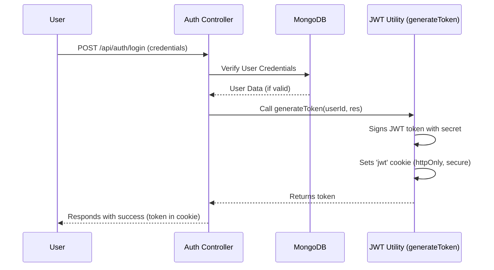

# Backend Utilities & Services
<TOC />

## Purpose and Core Functionalities

The `backend/src/lib` and `backend/src/models` directories house foundational components critical for the application's backend operations. These modules abstract common functionalities, ensure consistent data structuring, and integrate external services, promoting a clean, maintainable, and scalable codebase.

*   **Database Connection ([`db.js`](https://github.com/shinymack/Chat-App-MERN/blob/main/backend/src/lib/db.js))**: Establishes and manages the connection to the MongoDB database, centralizing database access logic and error handling.
*   **External Media Service ([`cloudinary.js`](https://github.com/shinymack/Chat-App-MERN/blob/main/backend/src/lib/cloudinary.js))**: Configures and exposes the Cloudinary API client for efficient cloud-based media storage and management, crucial for handling user profile pictures and other uploaded assets.
*   **Authentication Utilities ([`utils.js`](https://github.com/shinymack/Chat-App-MERN/blob/main/backend/src/lib/utils.js))**: Provides shared utility functions, notably for JSON Web Token (JWT) generation and secure cookie management, streamlining authentication processes across the application.
*   **User Data Model ([`user.model.js`](https://github.com/shinymack/Chat-App-MERN/blob/main/backend/src/models/user.model.js))**: Defines the schema for user data in MongoDB using Mongoose, including fields for authentication, social features, profile information, and custom validation logic.

This modular approach enhances the separation of concerns, making each component independently testable and easier to manage within a larger application.

## Backend Architecture Overview

These utility and model files are integral to the application's backend server, typically built with Node.js and Express. They form the "data" and "utility" layers that interact with controllers and routes to fulfill client requests. The backend server acts as an intermediary, processing requests, interacting with the database, and leveraging external services.


```mermaid
graph TD
    A[Client Application] -->|API Requests| B[Backend Server (Node.js/Express)]
    B -->|Connects via Mongoose| C[MongoDB Database]
    B -->|Uploads & Retrieves Media| D[Cloudinary Service]
    B -->|Generates Authentication Tokens| E[JWT Utilities]
    subgraph "Backend Core"
        B
        E
    end
    subgraph "External Data & Media"
        C
        D
    end
```


This diagram illustrates how the `Backend Server` orchestrates interactions with `MongoDB` for data persistence, `Cloudinary` for media assets, and `JWT Utilities` for secure authentication, all responding to requests from the `Client Application`.

## Technology Stack and Dependencies

The backend utilities rely on a focused set of technologies to perform their functions. Configuration and usage are consistently managed through environment variables to ensure security and flexibility across different deployment environments.

| Layer       | Technology        | Purpose                                                                               |
| :---------- | :---------------- | :------------------------------------------------------------------------------------ |
| Database ORM | Mongoose          | Object Data Modeling (ODM) for MongoDB, simplifying schema definition and interaction. |
| Auth Tokens | JSON Web Token (JWT) | Securely transmit information between parties as a compact, URL-safe JSON object.     |
| Media       | Cloudinary        | Cloud-based image and video management service for storage, manipulation, and delivery. |
| Environment | Dotenv            | Loads environment variables from a `.env` file into `process.env`.                    |

### Cloudinary Configuration

The Cloudinary service is initialized using credentials loaded from environment variables, ensuring that sensitive API keys are never hardcoded. This approach is a best practice for security and allows easy configuration changes without modifying source code.

```javascript
// backend/src/lib/cloudinary.js
import {v2 as cloudinary} from "cloudinary"
import { config } from 'dotenv'

config(); // Load environment variables

cloudinary.config(
    {cloud_name: process.env.CLOUDINARY_CLOUD_NAME,
    api_key: process.env.CLOUDINARY_API_KEY,
    api_secret: process.env.CLOUDINARY_API_SECRET,}
);

export default cloudinary;
```
[View on GitHub](https://github.com/shinymack/Chat-App-MERN/blob/main/backend/src/lib/cloudinary.js#L1-L12)
This snippet demonstrates the initialization of the Cloudinary SDK using `dotenv` to access `CLOUDINARY_CLOUD_NAME`, `CLOUDINARY_API_KEY`, and `CLOUDINARY_API_SECRET`.

## Database Connection and User Model

A robust database connection and a well-defined user model are fundamental to any application. This section details how the MongoDB connection is established and the `User` schema is structured, including its associated business logic.

### MongoDB Connection

The `connectDB` function centralizes the logic for connecting to MongoDB. It leverages Mongoose to create a connection, logging success or failure to the console. This ensures that the database connection is handled uniformly across the application.

```javascript
// backend/src/lib/db.js
import mongoose from "mongoose"

export const connectDB = async () => {
  try {
    const conn = await mongoose.connect(process.env.MONGODB_URI);
    console.log(`MongoDB connected:  ${conn.connection.host}`);
  }
  catch(error){
    console.log("MongoDB connection error: ", error);
  }
}
```
[View on GitHub](https://github.com/shinymack/Chat-App-MERN/blob/main/backend/src/lib/db.js#L1-L11)
The `connectDB` function uses `process.env.MONGODB_URI` to establish a connection, handling potential errors gracefully.

### User Data Model

The `User` model, defined using Mongoose, specifies the structure and validation rules for user data. It includes common fields like email, username, and password, alongside social features such as `friends`, `friendRequests`, and `sentRequests`. The schema also supports multiple authentication providers (`email` or `google`).

```javascript
// backend/src/models/user.model.js
import mongoose from "mongoose"

const  userSchema = new mongoose.Schema(
    {
        email: { 
            type: String,
            required: true,
            unique: true
        },
        username: {
            type: String,
            required: [true, "Username is required"],
            unique: true,
            trim: true,
            minlength: [3, "Username must be at least 3 characters long"],
            maxlength: [20, "Username cannot be more than 20 characters long"]
        }
        ,
        password: {
            type: String,
            minlength: 6,
        },
        profilePic: {
            type: String,
            default: "",
        },
        friends: [{
            type: mongoose.Schema.Types.ObjectId,
            ref: "User",
            default: [] 
        }],
        friendRequests: [{ // Incoming friend requests
            type: mongoose.Schema.Types.ObjectId,
            ref: "User",
            default: []
        }],
        sentRequests: [{ // Outgoing friend requests
            type: mongoose.Schema.Types.ObjectId,
            ref: "User",
            default: []
        }],
        authProvider: {
            type: String,
            enum: ['email', 'google'],
            default: 'email'
        },
        googleId: {
            type: String,
            unique: true,
            sparse: true
        },
    },
    { 
        timestamps: true
    } 
);
```
[View on GitHub](https://github.com/shinymack/Chat-App-MERN/blob/main/backend/src/models/user.model.js#L3-L58)
This excerpt defines the core fields of the `userSchema`, including unique constraints for `email` and `username`, password length requirements, and arrays for managing friend relationships. The `authProvider` field is crucial for distinguishing between different authentication methods.

The schema also includes a `pre-save` hook, which is a powerful Mongoose middleware feature. This particular hook handles password management based on the authentication provider. If a user signs up via Google, their password field is intentionally undefined, preventing unnecessary password hashing or validation for external authentication. Conversely, it enforces a password requirement for 'email' sign-ups.

```javascript
// backend/src/models/user.model.js
userSchema.pre('save', async function(next) {
    if (this.authProvider === 'google' && !this.isModified('password')) {
        this.password = undefined;
    }
    if (this.authProvider === 'email' && !this.password && this.isNew) {
        return next(new Error('Password is required for email signup.'));
    }
    next();
});

const User = mongoose.model("User", userSchema);

export default User;
```
[View on GitHub](https://github.com/shinymack/Chat-App-MERN/blob/main/backend/src/models/user.model.js#L60-L70)
This `pre('save')` hook ensures that password logic is conditional to the `authProvider`, providing flexibility for hybrid authentication strategies and enforcing data integrity.

## Authentication and Utility Services

Authentication is a critical aspect of the application, managed through JSON Web Tokens (JWTs) and securely transmitted via HTTP-only cookies. The `utils.js` file centralizes the logic for generating these tokens and setting the appropriate cookie parameters.

### JWT Token Generation

The `generateToken` function encapsulates the process of creating a JWT and attaching it to the HTTP response as a cookie. This utility promotes reusability and ensures consistent application of security best practices across all authentication endpoints.

```javascript
// backend/src/lib/utils.js
import jwt from 'jsonwebtoken';

export const generateToken = (userId, res) => {
    const token = jwt.sign({userId}, process.env.JWT_SECRET, 
        {expiresIn: "7d"});

    res.cookie("jwt", token, {
        maxAge: 7 * 24 * 60 * 60 * 1000, 
        httpOnly: true,
        sameSite: "strict",
        secure: process.env.NODE_ENV !== "development",
    });
    return token;
};
```
[View on GitHub](https://github.com/shinymack/Chat-App-MERN/blob/main/backend/src/lib/utils.js#L1-L15)
This function creates a JWT signed with `process.env.JWT_SECRET` and sets an `httpOnly`, `sameSite: "strict"`, and `secure` cookie. The `httpOnly` flag prevents client-side JavaScript access to the cookie, mitigating XSS attacks, while `sameSite: "strict"` offers protection against CSRF. The `secure` flag ensures the cookie is only sent over HTTPS in production environments.

### Authentication Flow with JWT Utility

The `generateToken` utility is a key component in the user authentication flow, specifically after successful user login or registration.





This sequence diagram illustrates how `generateToken` is invoked by an `Auth Controller` after user credentials are verified against the `MongoDB` database, resulting in a secure authentication token being set as an HTTP-only cookie for the `User`.

## Key Integration Points, Insights, and Best Practices

The utilities and models detailed here are foundational, integrating seamlessly into the broader backend architecture. Their design emphasizes maintainability, security, and scalability.

*   **Database Integration**: The `connectDB` function is typically called once at application startup to establish the global database connection. The `User` model is then extensively used by authentication and user-related controllers to perform CRUD operations.
*   **Authentication Flow**: The `generateToken` utility is central to authentication. After a user successfully logs in or registers, this function is invoked by the respective controller to issue a secure JWT, which is then managed via an HTTP-only cookie for subsequent authenticated requests.
*   **Media Handling**: Although the upload logic is not directly in `cloudinary.js`, this file provides the configured `cloudinary` instance. Any controller responsible for handling profile picture uploads or other media will utilize this instance to interact with the Cloudinary service, ensuring media files are stored externally and efficiently.

### Best Practices & Design Patterns

*   **Separation of Concerns**: Placing database connection, external service configuration, and general utilities in a `lib` directory, and data schemas in a `models` directory, clearly separates different aspects of the application. This enhances modularity, makes the codebase easier to navigate, and improves testability.
*   **Environment Variables**: The consistent use of `process.env` for sensitive information (database URI, API keys, JWT secret) and configuration (`NODE_ENV`) is a critical security and flexibility best practice. It prevents hardcoding credentials and allows easy configuration changes per environment.
*   **Secure Authentication**: The `generateToken` function demonstrates robust security practices for JWT-based authentication, including:
    *   **`httpOnly` cookies**: Prevents client-side script access, mitigating Cross-Site Scripting (XSS) attacks.
    *   **`sameSite: "strict"`**: Provides strong protection against Cross-Site Request Forgery (CSRF) attacks.
    *   **`secure` flag**: Ensures cookies are only sent over HTTPS, crucial for production deployments.
*   **Robust Data Modeling**: The `userSchema` with its detailed validations, `timestamps`, and `pre-save` hooks ensures data integrity and provides flexibility for different authentication mechanisms (email vs. Google), contributing to a more resilient application.
*   **Scalability**: Offloading media storage and serving to an external service like Cloudinary significantly reduces the load on the backend server, making the application more scalable for handling user-generated content.

These foundational components, designed with care and adherence to best practices, provide a stable and secure backbone for the entire backend system, facilitating further feature development and deployment.

Next: [Frontend Development](./3_frontend_development.mdx)