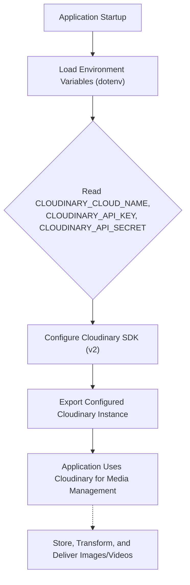
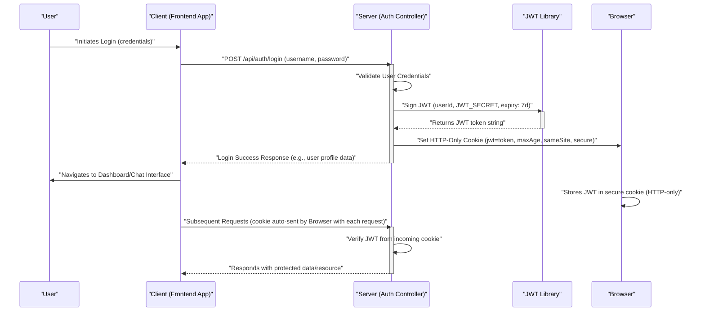

# Cloud Services and Utilities

<TOC />

This section delves into the integration of essential third-party cloud services and the implementation of crucial utility functions within the application's backend. Leveraging specialized services like Cloudinary for efficient media management, alongside robust internal utilities for security-critical operations such as JSON Web Token (JWT) generation, is fundamental for building a scalable, secure, and feature-rich application. These components are strategically designed to abstract complex functionalities, empowering developers to focus on core business logic while adhering to best practices in areas like file storage, image optimization, and user authentication.

---

## Cloudinary Integration for Media Management

Cloudinary is a comprehensive cloud-based platform for image and video management. It offers a powerful solution for uploading, storing, manipulating, optimizing, and delivering media content. In this application, Cloudinary is integrated to handle all aspects of user-uploaded content, primarily images (e.g., user avatars, shared media in chat). This strategic choice offloads the significant burden of media storage, processing, and delivery from the application's backend, leading to improved performance, enhanced scalability, and a simplified development workflow.

The integration is cleanly encapsulated within the `backend/src/lib/cloudinary.js` file, which is responsible for configuring the Cloudinary SDK using securely managed environment variables. This approach ensures flexible and secure access to the Cloudinary service without embedding sensitive credentials directly into the codebase.

### Configuration (`backend/src/lib/cloudinary.js`)

The `cloudinary.js` file's primary role is to initialize the Cloudinary SDK with the necessary authentication credentials. It achieves this by importing the `v2` version of the Cloudinary SDK and utilizing `dotenv` to load environment variables, which supply the `CLOUD_NAME`, `API_KEY`, and `API_SECRET`. This robust setup ensures that sensitive credentials are not hardcoded but are instead securely and dynamically managed through environment-specific configurations, critical for both development and production environments.

```javascript
// backend/src/lib/cloudinary.js
import {v2 as cloudinary} from "cloudinary"
import { config } from 'dotenv'

// Load environment variables from .env file
// This ensures that CLOUDINARY_* variables are available via process.env
config();

// Configure Cloudinary SDK with credentials obtained from environment variables
cloudinary.config(
    {
        cloud_name: process.env.CLOUDINARY_CLOUD_NAME, // Your Cloudinary cloud name
        api_key: process.env.CLOUDINARY_API_KEY,       // Your Cloudinary API key
        api_secret: process.env.CLOUDINARY_API_SECRET, // Your Cloudinary API secret
    }
);

export default cloudinary; // Export the configured Cloudinary instance for use throughout the application
```
[View on GitHub](https://github.com/shinymack/Chat-App-MERN/blob/main/backend/src/lib/cloudinary.js)

**Key aspects and best practices within this configuration:**
*   **`import {v2 as cloudinary} from "cloudinary"`**: This line imports the `v2` module of the Cloudinary SDK, aliasing it as `cloudinary` for conciseness and clarity in subsequent code. The `v2` API offers the latest features and improved functionality.
*   **`import { config } from 'dotenv'; config();`**: This snippet ensures that environment variables defined in a `.env` file (common in development setups) are loaded into `process.env`. This is crucial for accessing the Cloudinary credentials without hardcoding them.
*   **`cloudinary.config(...)`**: This is the core method call that initializes the Cloudinary service. It takes an object containing your Cloudinary account details:
    *   **`cloud_name`**: Identifies your specific Cloudinary account.
    *   **`api_key`**: Your unique API key for authentication.
    *   **`api_secret`**: A highly sensitive secret key used to sign requests, ensuring their authenticity.
    These values *must* be correctly set in your environment (e.g., in a `.env` file for local development or as actual environment variables on your production server) to establish a successful connection to Cloudinary.

### Cloudinary Configuration Flow

The following diagram visually represents the initialization process of Cloudinary within the backend, illustrating how the service is configured and made ready for media operations.





This comprehensive flow guarantees that the Cloudinary SDK is properly authenticated and fully prepared to interact with your cloud storage before any media-related operations are attempted. Once successfully configured and exported, the `cloudinary` instance becomes readily available for use in various parts of the application, enabling functionalities such as uploading new assets, retrieving existing media, or applying sophisticated transformations.

---

## Utility Functions for Security and Token Management

The `backend/src/lib/utils.js` file serves as a dedicated repository for general-purpose utility functions that significantly enhance the application's overall functionality and security posture. A prime example is the `generateToken` function, which plays a pivotal role in managing user sessions by securely creating and issuing JSON Web Tokens (JWTs). This centralization of common, reusable logic helps maintain code cleanliness and consistency across the backend.

### JSON Web Token (JWT) Generation (`backend/src/lib/utils.js`)

JSON Web Tokens (JWTs) are a compact, URL-safe means of representing claims that are transferred between two parties. In the context of this application, JWTs are fundamental for user authentication and authorization. They allow the server to efficiently verify the identity of a client making subsequent requests without requiring repeated submission of user credentials. The `generateToken` function encapsulates the entire logic for generating a JWT and then securely setting it as an HTTP-only cookie, which is a widely accepted and robust practice for session management in modern web applications.

```javascript
// backend/src/lib/utils.js
import jwt from 'jsonwebtoken'; // Import the jsonwebtoken library for JWT operations

export const generateToken = (userId, res) => {
    // Sign the JWT with the user's ID as the payload, a secret key, and an expiration time.
    // The userId is included to identify the user for whom the token is issued.
    const token = jwt.sign({userId}, process.env.JWT_SECRET, 
        {expiresIn: "7d"}); // Token expires in 7 days, enhancing security by limiting its lifespan

    // Set the generated JWT as an HTTP-only cookie in the user's browser.
    res.cookie("jwt", token, {
        maxAge: 7 * 24 * 60 * 60 * 1000, // Cookie expiration time (7 days in milliseconds), matching JWT expiration
        httpOnly: true, // Crucial for security: prevents client-side JavaScript from accessing the cookie
        sameSite: "strict", // Protects against CSRF attacks by controlling when the browser sends the cookie
        secure: process.env.NODE_ENV !== "development", // Ensures the cookie is only sent over HTTPS in production
    });
    return token; // Return the generated token string
};
```
[View on GitHub](https://github.com/shinymack/Chat-App-MERN/blob/main/backend/src/lib/utils.js#L4-L17)

**Detailed breakdown of the `generateToken` function's components:**

*   **`import jwt from 'jsonwebtoken';`**: This line imports the `jsonwebtoken` library, which provides the necessary methods for signing, verifying, and decoding JWTs, forming the backbone of the application's token-based authentication.
*   **`jwt.sign({userId}, process.env.JWT_SECRET, {expiresIn: "7d"});`**: This is the core call to create the JWT.
    *   **`{userId}`**: This object represents the **payload** of the JWT. It contains claims about the user, most importantly their unique identifier (`userId`), which the server can use to identify the user on subsequent authenticated requests.
    *   **`process.env.JWT_SECRET`**: This is a highly confidential secret key used to digitally sign the JWT. Its secrecy is paramount; it must be sufficiently complex and kept secure in environment variables to prevent unauthorized parties from forging or tampering with tokens.
    *   **`{expiresIn: "7d"}`**: This option specifies that the generated token will automatically expire after 7 days. Setting an expiration time is a vital security measure, limiting the window during which a compromised token could be used.
*   **`res.cookie("jwt", token, {...});`**: This line instructs the server to set an HTTP-only cookie in the client's browser, containing the generated JWT.
    *   **`"jwt"`**: This is the designated name of the cookie.
    *   **`token`**: This is the actual JWT string that will be stored in the cookie.
    *   **`maxAge: 7 * 24 * 60 * 60 * 1000`**: Sets the cookie's lifespan to 7 days in milliseconds, precisely mirroring the JWT's expiration for consistency.
    *   **`httpOnly: true`**: This is a critical security attribute. It prevents client-side JavaScript from accessing the cookie, effectively mitigating XSS (Cross-Site Scripting) attacks where malicious scripts might attempt to steal session tokens.
    *   **`sameSite: "strict"`**: This attribute offers robust protection against CSRF (Cross-Site Request Forgery) attacks. A "strict" setting ensures that the cookie is only sent with requests originating from the same site as the current URL, preventing external sites from making authenticated requests on the user's behalf.
    *   **`secure: process.env.NODE_ENV !== "development"`**: This conditional setting ensures that the cookie is *only* sent over secure HTTPS connections when the application is running in a production environment. In development, it allows for easier local testing without requiring HTTPS, but in production, it's essential to prevent man-in-the-middle attacks from intercepting cookies.

These meticulously configured settings collectively establish a robust and secure mechanism for maintaining user sessions, effectively balancing strong security practices with a seamless user experience.

### JWT Token Generation and Session Management Flow

The process of generating a JWT and subsequently setting it as a secure cookie is foundational to how user sessions are managed in the application. This sequence diagram vividly illustrates the step-by-step interaction from a user's initial login attempt through to the secure establishment of their authenticated session.





This diagram effectively highlights the secure, server-driven flow where the backend is solely responsible for token creation and cookie setting. Crucially, the browser passively stores and automatically sends the cookie with subsequent requests, while client-side JavaScript is explicitly prevented from accessing the sensitive token directly, reinforcing the application's security posture.

---

## Key Integration Points

The `cloudinary.js` and `utils.js` files, though seemingly distinct, represent critical and interconnected layers of the application's backend architecture. Their robust implementation is fundamental to the application's performance, scalability, and security.

*   **Efficient Media Management**: The Cloudinary integration provides a highly scalable and efficient solution for all media-related operations within the application. It intelligently abstracts away complex underlying infrastructure details such as file storage, sophisticated image resizing, format optimization, and seamless integration with a global Content Delivery Network (CDN). This allows the application to remain focused on its core messaging features, ensuring rapid loading times for user avatars and shared media, which directly contributes to a fluid and responsive user experience.
*   **Robust Secure Authentication**: The `generateToken` utility function is absolutely central to the application's comprehensive authentication strategy. By securely creating and issuing HTTP-only, secure, and same-site cookies containing JSON Web Tokens (JWTs), it establishes a highly robust and industry-standard mechanism for maintaining user sessions. This meticulously designed approach significantly enhances the application's security against common web vulnerabilities, including Cross-Site Scripting (XSS) and Cross-Site Request Forgery (CSRF) attacks, thereby safeguarding user data and ensuring the integrity of all interactions with the backend API.
*   **Strategic Environmental Configuration**: Both modules demonstrate a strong adherence to best practices by heavily relying on environment variables (`process.env`). This practice is paramount for maintaining security and achieving operational flexibility. It enables sensitive credentials (such as Cloudinary API keys and the JWT secret) to be managed entirely outside the codebase. Furthermore, it facilitates frictionless deployment across diverse environments (development, staging, production) without necessitating any code modifications, simply by updating the respective environment configurations.

Collectively, these meticulously implemented components underscore a profound commitment to both high performance and stringent security, thereby forming indispensable pillars of a reliable and modern web application.

---

Next: [Frontend Development and UI](./3_frontend-development-and-ui.mdx)