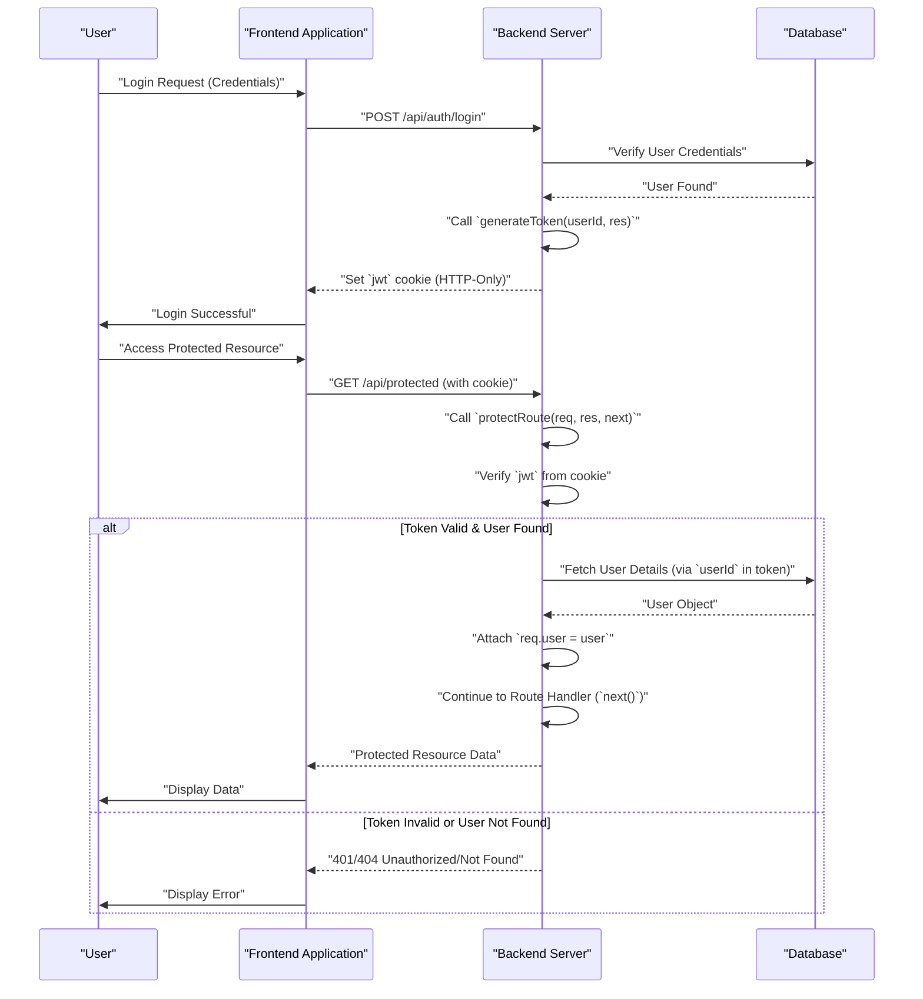

```md
---
title: "Cloudinary Integration and Utilities"
description: "Documentation for image and file handling using Cloudinary and other backend utility functions."
sidebar_position: 23
---

# Cloudinary Integration and Utilities
<TOC />

This document details the setup and usage of Cloudinary for image and file management, alongside essential backend utility functions for token generation and route protection. These components are crucial for handling user data, securing API endpoints, and optimizing media delivery within the application.

## Cloudinary Configuration

The `cloudinary.js` file is responsible for initializing the Cloudinary SDK with credentials loaded from environment variables. This setup allows the application to interact with Cloudinary's services for uploading, managing, and delivering media assets.

### Initialization
The Cloudinary SDK is configured globally using API credentials. This ensures that any subsequent calls to Cloudinary methods use the correct authentication.

```javascript
// backend/src/lib/cloudinary.js
import {v2 as cloudinary} from "cloudinary"
import { config } from 'dotenv'

config(); // Load environment variables

cloudinary.config(
    {cloud_name: process.env.CLOUDINARY_CLOUD_NAME,
    api_key: process.env.CLOUDINARY_API_KEY,
    api_secret: process.env.CLOUDINARY_API_SECRET,}
);

export default cloudinary;
```
**Explanation:**
This snippet demonstrates how Cloudinary is initialized. It imports the `cloudinary` SDK, loads environment variables using `dotenv`, and then configures Cloudinary with the `cloud_name`, `api_key`, and `api_secret` retrieved from `process.env`. The configured `cloudinary` instance is then exported for use across the application.

[View on GitHub](https://github.com/shinymack/Chat-App-MERN/blob/main/backend/src/lib/cloudinary.js)

### Cloudinary Flow
The following diagram illustrates the basic interaction between the application and Cloudinary for media operations.


```mermaid
graph TD
    A["Application Backend"] -->|`cloudinary.config()`| B["Cloudinary SDK"]
    B --> C["Cloudinary Service"]
    D["User Uploads File"] --> E["Application Endpoint"]
    E -->|`cloudinary.uploader.upload()`| C
    C -->|Stores & Processes Media| C
    C -->|`URL`| E
    E --> F["Frontend/Database"]
```


**Explanation:**
This diagram shows that the "Application Backend" configures the "Cloudinary SDK", which then communicates with the "Cloudinary Service". When a "User Uploads File", it goes through an "Application Endpoint", which uses the configured SDK to upload to "Cloudinary Service". Cloudinary processes and stores the media, returning a URL that the backend can then forward to the "Frontend/Database".

## Authentication and Token Utilities

The application uses JSON Web Tokens (JWT) for authentication. The `utils.js` file contains a utility function for generating these tokens, while `auth.middleware.js` provides a middleware to protect routes by verifying them.

### Token Generation
The `generateToken` function creates a JWT and sets it as an HTTP-only cookie in the user's browser. This approach enhances security by making the token inaccessible to client-side JavaScript.

```javascript
// backend/src/lib/utils.js
import jwt from 'jsonwebtoken';

export const generateToken = (userId, res) => {
    const token = jwt.sign({userId}, process.env.JWT_SECRET, 
        {expiresIn: "7d"});

    res.cookie("jwt", token, {
        maxAge: 7 * 24 * 60 * 60 * 1000, 
        httpOnly: true,
        sameSite: "strict",
        secure: process.env.NODE_ENV !== "development",
    });
    return token;
};
```
**Explanation:**
This function takes a `userId` and a `response` object. It signs a new JWT with the `userId` payload and a secret key (`process.env.JWT_SECRET`), setting an expiration of 7 days. The token is then attached to the `response` object as an HTTP-only cookie, configured for strict `sameSite` policy and `secure` flag in production environments.

[View on GitHub](https://github.com/shinymack/Chat-App-MERN/blob/main/backend/src/lib/utils.js#L4-L17)

### Route Protection Middleware
The `protectRoute` middleware ensures that only authenticated users can access specific routes. It verifies the presence and validity of the JWT.

```javascript
// backend/src/middleware/auth.middleware.js
import jwt from "jsonwebtoken"
import User from "../models/user.model.js"

export const protectRoute = async (req, res, next) => {
    try {
        const token = req.cookies.jwt;
        if(!token){
            return res.status(401).json({message: "Unauthorized - No Token Provided"});
        }

        const decoded = jwt.verify(token, process.env.JWT_SECRET)

        if(!decoded) {
            return res.status(401).json({message: "Unauthorized - Invalid Token"});
        }
        const user = await User.findById(decoded.userId).select("-password");

        if(!user) {
            return res.status(404).json({message: "User not found"});
        }
        req.user = user;

        next();
    } catch (error) {
        console.log("Error in protectRoute middleware", error.message);
        res.status(500).json({message: "Internal Server Error"});
    }
};
```
**Explanation:**
This middleware first checks for a JWT in the request cookies. If no token is found, it returns a 401 Unauthorized status. If a token exists, it's verified against the `JWT_SECRET`. Upon successful verification, the `userId` from the decoded token is used to fetch the corresponding user from the database (excluding their password). If the user is found, it's attached to the `req.user` object, and the request proceeds to the next middleware or route handler. Error handling is included for invalid tokens or server issues.

[View on GitHub](https://github.com/shinymack/Chat-App-MERN/blob/main/backend/src/middleware/auth.middleware.js#L5-L33)

### Authentication Flow
The following sequence diagram illustrates the user authentication process involving token generation and route protection.





**Explanation:**
This diagram shows a user initiating a login. The frontend sends credentials to the backend, which verifies them against the database. Upon success, the backend uses `generateToken` to create a JWT and sets it as an HTTP-only cookie in the response to the frontend.
Subsequently, when the user tries to access a protected resource, the frontend sends a request (with the automatically attached JWT cookie) to the backend. The `protectRoute` middleware intercepts this request, verifies the token, fetches user details from the database, attaches the user object to the request, and allows access to the route handler. If the token is invalid or the user not found, an appropriate error is returned.

## Key Integration Points

*   **Secure Authentication:** The combination of `generateToken` and `protectRoute` forms a robust authentication system. `generateToken` ensures JWTs are created securely and stored as HTTP-only cookies, preventing XSS attacks. `protectRoute` acts as a gatekeeper, verifying these tokens for every protected endpoint.
*   **Centralized Media Handling:** `cloudinary.js` provides a single point of configuration for Cloudinary, ensuring consistent access to media management functionalities across the backend. This setup streamlines image uploads, transformations, and delivery.
*   **Environment Variable Reliance:** All sensitive information (Cloudinary credentials, JWT secret) is loaded from environment variables (`.env` file), enhancing security and making the application easily configurable for different deployment environments (development, staging, production).
*   **Middleware Pattern:** The `protectRoute` function exemplifies the use of Express middleware for cross-cutting concerns like authentication. This modular approach keeps route handlers clean and focused on their specific business logic.
*   **User Model Integration:** `protectRoute` directly interacts with the `User` model (`User.findById`) to ensure that the `userId` embedded in the JWT corresponds to an active user in the database, adding an extra layer of validation beyond just token validity.

Next: [Frontend Application Structure](./3_frontend-application-structure.mdx)
```