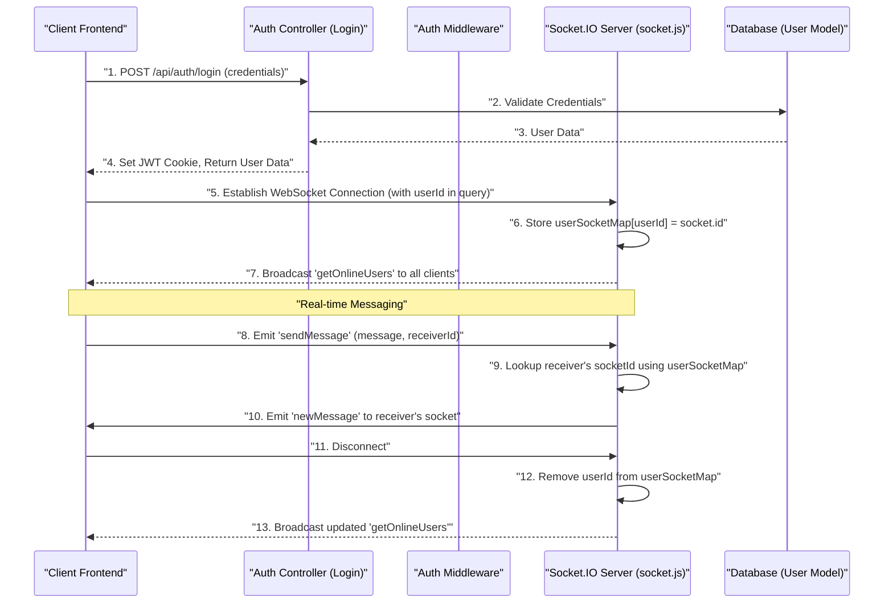

---
title: "Core Backend Services"
description: "Details the implementation of user authentication, authorization middleware, and real-time communication via WebSockets."
sidebar_position: 23
---

# Core Backend Services

<TOC />

This section delves into the foundational backend services that power the Chat-App-MERN application. We'll explore how user authentication and authorization are handled, including both traditional email/password methods and Google OAuth. Additionally, we'll examine the real-time communication infrastructure built using WebSockets, which is crucial for instant messaging capabilities.

## User Authentication and Authorization

The backend implements a robust authentication system using JSON Web Tokens (JWT) for session management and `bcrypt` for secure password hashing. Google OAuth is integrated via `Passport.js` to provide alternative login methods.

### Authentication Controller (`auth.controller.js`)

This file contains the primary logic for handling user registration, login, logout, and profile management.

#### User Registration and Login

The `signup` function handles new user registration, including input validation, password hashing, and initial token generation. The `login` function authenticates existing users against stored credentials.

```javascript showLineNumbers
// backend/src/controllers/auth.controller.js
export const signup = async (req, res) => {
    const {username, email, password} = req.body;
    try {
        if(!username || !email || !password) {
            return res.status(400).json({message: "Please fill in all fields."});
        }
        // ... validation logic ...
        const salt = await bcrypt.genGenSalt(10);
        const hashedPassword = await bcrypt.hash(password, salt);

        const newUser = new User({
            username,
            email,
            password: hashedPassword,
            authProvider: 'email'
        });
        if(newUser){
            generateToken(newUser._id, res); // Generates JWT and sets cookie
            await newUser.save();
            // ... response ...
        } // ... error handling ...
    } // ... catch block ...
};
```
This snippet showcases the `signup` process, including validation, password hashing, and token generation upon successful user creation. The `generateToken` utility creates a JWT and sets it as an HTTP-only cookie.
[View on GitHub](https://github.com/shinymack/Chat-App-MERN/blob/main/backend/src/controllers/auth.controller.js#L9-L49)

#### Profile Management

The `updateProfile` endpoint allows users to modify their profile picture and username. It includes validation for username uniqueness and integrates with Cloudinary for image storage.

```javascript showLineNumbers
// backend/src/controllers/auth.controller.js
export const updateProfile = async (req, res) => {
    try {
        const { profilePic, username } = req.body;
        const userId = req.user._id;
        let userToUpdate = await User.findById(userId);

        if (!userToUpdate) return res.status(404).json({ message: "User not found." });

        const fieldsToUpdate = {};
        let newUsername = username ? username.trim() : null;

        // Handle username update logic
        if (newUsername && newUsername !== userToUpdate.username) {
            // ... username validation and uniqueness check ...
            fieldsToUpdate.username = newUsername;
        }

        // Handle profile picture update logic with Cloudinary
        if (profilePic) {
            const uploadResponse = await cloudinary.uploader.upload(profilePic);
            fieldsToUpdate.profilePic = uploadResponse.secure_url;
        }

        if (Object.keys(fieldsToUpdate).length === 0) {
            return res.status(400).json({ message: "No changes provided to update." });
        }

        const updatedUser = await User.findByIdAndUpdate(userId, { $set: fieldsToUpdate }, { new: true });
        generateToken(updatedUser._id, res); // Refresh token if profile info changes
        res.status(200).json(updatedUser);

    } catch (error) {
        console.error("Error in updateProfile controller", error.message);
        res.status(500).json({ message: "Internal Server Error while updating profile." });
    }
};
```
This function highlights the ability for users to update their profile information, specifically their username and profile picture. It demonstrates conditional updates, Cloudinary integration for image uploads, and re-issuing a JWT to reflect potential changes in user data.
[View on GitHub](https://github.com/shinymack/Chat-App-MERN/blob/main/backend/src/controllers/auth.controller.js#L182-L232)

### Google OAuth with Passport.js (`passport.config.js`)

The application integrates Google as an OAuth provider using `Passport.js`. This allows users to sign up or log in using their Google accounts.

#### Passport Configuration

The `configurePassport` function sets up the Google OAuth 2.0 strategy. It defines how user profiles from Google are processed to either find an existing user or create a new one.

```javascript showLineNumbers
// backend/src/lib/passport.config.js
import passport from 'passport';
import { Strategy as GoogleStrategy } from 'passport-google-oauth20';
import User from '../models/user.model.js';

export const configurePassport = () => {
    passport.use(new GoogleStrategy({
        clientID: process.env.GOOGLE_CLIENT_ID,
        clientSecret: process.env.GOOGLE_CLIENT_SECRET,
        callbackURL: process.env.GOOGLE_CALLBACK_URL,
        scope: ['profile', 'email']
    },
    async (accessToken, refreshToken, profile, done) => {
        try {
            let user = await User.findOne({ googleId: profile.id });
            if (user) {
                return done(null, user);
            } else {
                // ... logic to create new user or handle existing email conflicts ...
                const newUser = new User({
                    googleId: profile.id,
                    email: profile.emails && profile.emails[0] ? profile.emails[0].value : null,
                    username: username, // Generated unique username
                    authProvider: 'google',
                });
                await newUser.save();
                return done(null, newUser);
            }
        } catch (error) {
            return done(error, null);
        }
    }));
    // ... serialization and deserialization ...
};
```
This snippet illustrates the `Passport.js` setup for Google authentication. It details how the `GoogleStrategy` is configured with environment variables and the logic to either find an existing user by `googleId` or create a new one, ensuring unique usernames and handling email conflicts.
[View on GitHub](https://github.com/shinymack/Chat-App-MERN/blob/main/backend/src/lib/passport.config.js#L8-L53)

### Authorization Middleware (`auth.middleware.js`)

The `protectRoute` middleware is essential for securing authenticated routes. It verifies the presence and validity of the JWT.

```javascript showLineNumbers
// backend/src/middleware/auth.middleware.js
import jwt from "jsonwebtoken"
import User from "../models/user.model.js"

export const protectRoute = async (req, res, next) => {
    try {
        const token = req.cookies.jwt;
        if(!token){
            return res.status(401).json({message: "Unauthorized - No Token Provided"});
        }

        const decoded = jwt.verify(token, process.env.JWT_SECRET)

        if(!decoded) {
            return res.status(401).json({message: "Unauthorized - Invalid Token"});
        }
        const user = await User.findById(decoded.userId).select("-password");

        if(!user) {
            return res.status(404).json({message: "User not found"});
        }
        req.user = user; // Attach user object to request

        next(); // Proceed to the next middleware/route handler
    } catch (error) {
        console.log("Error in protectRoute middleware", error.message);
        res.status(500).json({message: "Internal Server Error"});
    }
};
```
This middleware protects routes by verifying the JWT stored in HTTP-only cookies. If a valid token is present, it decodes the user ID, fetches the user from the database, and attaches the user object to the request (`req.user`), making user data accessible in subsequent handlers.
[View on GitHub](https://github.com/shinymack/Chat-App-MERN/blob/main/backend/src/middleware/auth.middleware.js#L5-L30)

#### Authentication Flow Diagram

The following diagram illustrates the typical authentication flow using email/password.


```mermaid
graph TD
    A["Frontend Client"] -->|1. POST /api/auth/signup or /login {email, password}| B["Auth Controller (auth.controller.js)"]
    B -->|2. Validate Input, Hash Password (signup only)| C["bcrypt"]
    B -->|3. Query User Data| D["User Model (MongoDB)"]
    D -->|4. User Found/Created| B
    B -->|5. Generate JWT| E["JWT Utility"]
    E -->|6. Set JWT as HTTP-only Cookie| F["Response Object"]
    F -->|7. Return User Data (excluding password)| A
    A --"Subsequent Protected Requests"-->|8. Include JWT Cookie| G["Auth Middleware (auth.middleware.js)"]
    G -->|9. Verify JWT, Decode User ID| E
    G -->|10. Fetch User from DB| D
    D -->|11. Attach User to req.user| G
    G -->|12. Call next() for Route Handler| H["Protected Route Handler"]
    H -->|13. Return Data| A
```


## Real-time Communication with WebSockets (`socket.js`)

The `socket.js` file establishes and manages the WebSocket server using `socket.io`. This enables real-time functionalities such as instant messaging and tracking online users.

### Socket.IO Server Setup

The server is initialized to listen for connections and manage user sockets. It also handles mapping user IDs to their respective socket IDs.

```javascript showLineNumbers
// backend/src/lib/socket.js
import { Server } from "socket.io";
import http from "http";
import express from "express";

const app = express();
const server = http.createServer(app);
const io = new Server(server, {
    cors: {
        origin: ["http://localhost:5173"] // Configure CORS for frontend
    }
})

export function getReceiverSocketId(userId) {
    return userSocketMap[userId];
}

const userSocketMap = {}; //{userId : socketId}

io.on("connection", (socket) => {
    console.log("A user connected", socket.id);

    const userId = socket.handshake.query.userId; // Get userId from handshake query
    if(userId) userSocketMap[userId] = socket.id;

    io.emit("getOnlineUsers", Object.keys(userSocketMap)); // Broadcast online users

    socket.on("disconnect", ()=>{
        console.log("A user disconnected", socket.id);
        delete userSocketMap[userId];
        io.emit("getOnlineUsers", Object.keys(userSocketMap)); // Update and broadcast
    })
})

export { io, app, server };
```
This code initializes the `socket.io` server, configures CORS, and manages the `userSocketMap` to keep track of online users. It demonstrates how to get the `userId` from the socket handshake and broadcast updates to online users upon connection and disconnection.
[View on GitHub](https://github.com/shinymack/Chat-App-MERN/blob/main/backend/src/lib/socket.js#L1-L36)

#### WebSocket Communication Flow





## Key Integration Points

*   **Authentication & WebSockets**: After a successful login via the `auth.controller.js`, the frontend typically obtains the `_id` of the authenticated user. This `_id` is then used to establish the WebSocket connection, allowing the `socket.js` server to map the user to their active socket, enabling personalized real-time communication.
*   **Middleware Protection**: The `auth.middleware.js` ensures that only authenticated users can access sensitive backend routes, which might include fetching chat history or user profiles. This layer of security is critical before any data manipulation or retrieval occurs.
*   **Google OAuth User Creation**: The `passport.config.js` not only authenticates users via Google but also handles the creation of new `User` records in the database if they don't exist, assigning a `googleId` and ensuring unique usernames for seamless integration.
*   **Profile Updates and Tokens**: When a user updates their profile (e.g., username, profile picture) through `updateProfile` in `auth.controller.js`, a new JWT is issued to reflect these changes. This ensures that any client-side cached user information or future authenticated requests carry the most current user data, without requiring a full re-login.

These backend services form the backbone of the application, ensuring secure user interactions and dynamic real-time features.

Next: [User Interface Components](./3.1_user-interface-components.mdx)
```