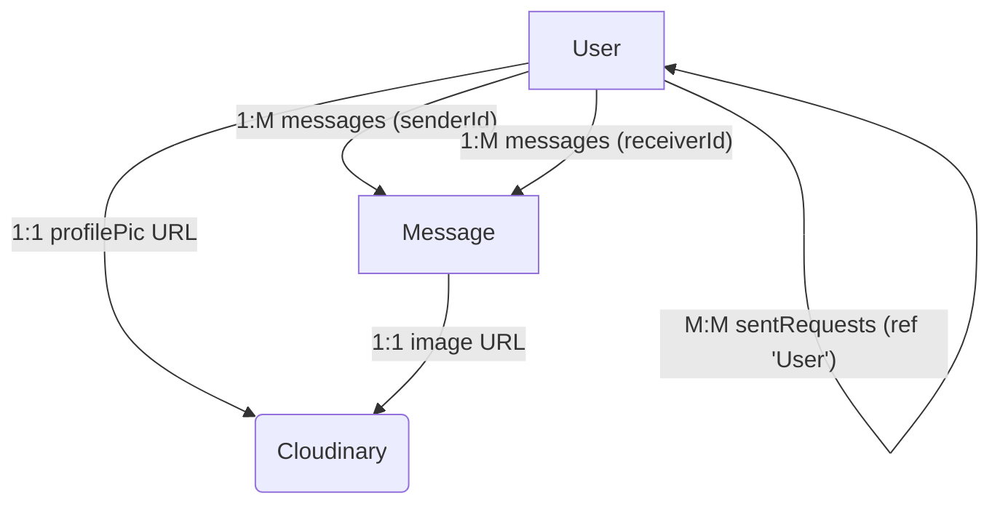

# Data Models and Storage
<TOC />

This section delves into the foundational data structures and storage mechanisms employed by the backend application. It covers the Mongoose schemas that define how user and message data are structured and stored in MongoDB, as well as the essential components for connecting to the database and integrating with a cloud-based media storage solution. Understanding these models is crucial for comprehending data integrity, relationships, and the overall flow of information within the chat application.

## Database Connection
The application utilizes Mongoose to establish and manage its connection to a MongoDB database. This connection is vital for all persistent data operations, including creating, reading, updating, and deleting user profiles, messages, and other application-specific data.

The `connectDB` function, defined in `backend/src/lib/db.js`, encapsulates the logic for initiating this connection. It leverages environment variables to secure sensitive connection details, promoting best practices for deployment and configuration management.

```javascript
// backend/src/lib/db.js
import mongoose from "mongoose"

export const connectDB = async () => {
  try {
    const conn = await mongoose.connect(process.env.MONGODB_URI);
    console.log(`MongoDB connected:  ${conn.connection.host}`);
  }
  catch(error){
    console.log("MongoDB connection error: ", error);
  }
}
```
[View on GitHub](https://github.com/shinymack/Chat-App-MERN/blob/main/backend/src/lib/db.js#L1-L10)

This setup ensures that the application attempts to connect to MongoDB upon startup, logging the connection host on success or providing an error message if the connection fails. This robust error handling is critical for debugging and maintaining application stability in production environments.

### Database Connection Flow


```mermaid
graph TD
    A[Application Startup] --> B{Call connectDB()};
    B --> C{Read MONGODB_URI};
    C --> D[mongoose.connect(URI)];
    D -- Success --> E[Log: "MongoDB connected"];
    D -- Failure --> F[Log: "MongoDB connection error"];
```


## User Data Model
The `User` data model is central to the application, representing individual users and their associated properties. Defined by `userSchema` in [backend/src/models/user.model.js](https://github.com/shinymack/Chat-App-MERN/blob/main/backend/src/models/user.model.js), it includes fields for authentication, profile information, and social networking functionalities such as managing friends and friend requests.

```javascript
// backend/src/models/user.model.js
import mongoose from "mongoose"

const  userSchema = new mongoose.Schema(
    {
        email: { 
            type: String,
            required: true,
            unique: true
        },
        username: {
            type: String,
            required: [true, "Username is required"],
            unique: true,
            trim: true,
            minlength: [3, "Username must be at least 3 characters long"],
            maxlength: [20, "Username cannot be more than 20 characters long"]
        }
        ,
        password: {
            type: String,
            minlength: 6,
        },
        profilePic: {
            type: String,
            default: "",
        },
        friends: [{
            type: mongoose.Schema.Types.ObjectId,
            ref: "User",
            default: [] 
        }],
        friendRequests: [{ // Incoming friend requests
            type: mongoose.Schema.Types.ObjectId,
            ref: "User",
            default: []
        }],
        sentRequests: [{ // Outgoing friend requests
            type: mongoose.Schema.Types.ObjectId,
            ref: "User",
            default: []
        }],
        authProvider: {
            type: String,
            enum: ['email', 'google'],
            default: 'email'
        },
        googleId: {
            type: String,
            unique: true,
            sparse: true
        },
    },
    { 
        timestamps: true
    } 
);
```
[View on GitHub](https://github.com/shinymack/Chat-App-MERN/blob/main/backend/src/models/user.model.js#L3-L58)

Key fields and their purposes include:

*   **`email`**: Unique identifier for the user, essential for authentication.
*   **`username`**: A user-friendly, unique identifier with specific length constraints.
*   **`password`**: Hashed password for email-based authentication. `minlength` ensures basic security.
*   **`profilePic`**: URL to the user's profile image, stored on Cloudinary.
*   **`friends`**: An array of `ObjectId` references to other `User` documents, representing established connections.
*   **`friendRequests`**: An array of `ObjectId` references for incoming friend requests, allowing users to accept or reject.
*   **`sentRequests`**: An array of `ObjectId` references for outgoing friend requests, enabling users to track and potentially cancel requests.
*   **`authProvider`**: Indicates the authentication method (`'email'` or `'google'`). This field is crucial for distinguishing between different login flows.
*   **`googleId`**: Stores the unique Google ID for users authenticating via Google, with `sparse: true` to optimize indexing for users not using Google auth.
*   **`timestamps`**: Automatically adds `createdAt` and `updatedAt` fields for tracking document creation and modification times.

### Pre-Save Hook for User Authentication
The `userSchema` includes a `pre('save')` middleware hook, which executes before a user document is saved to the database. This hook implements critical logic related to password management, particularly when integrating with different authentication providers.

```javascript
// backend/src/models/user.model.js
// ... (previous schema definition)

userSchema.pre('save', async function(next) {
    if (this.authProvider === 'google' && !this.isModified('password')) {
        this.password = undefined;
    }
    if (this.authProvider === 'email' && !this.password && this.isNew) {
        return next(new Error('Password is required for email signup.'));
    }
    next();
});

const User = mongoose.model("User", userSchema);

export default User;
```
[View on GitHub](https://github.com/shinymack/Chat-App-MERN/blob/main/backend/src/models/user.model.js#L60-L71)

This hook ensures:
*   If a user is authenticated via Google (`authProvider === 'google'`) and their password field hasn't been explicitly modified (e.g., during a profile update), the `password` field is set to `undefined`. This prevents unnecessary password hashing and storage for Google-authenticated users, as their authentication is handled externally.
*   For users signing up via email (`authProvider === 'email'`) and creating a new account (`this.isNew`), a password is explicitly required. If `password` is missing, an error is thrown, enforcing data integrity for email-based registrations.

## Message Data Model
The `Message` data model defines the structure for chat messages exchanged between users. It's designed to store essential message content and metadata, enabling real-time communication within the application. This model is critical for the core functionality of any chat application.

```javascript
// backend/src/models/message.model.js
import express from "express"; // Note: express is imported but not used here.
import mongoose from "mongoose";

const messageSchema = new mongoose.Schema(
    {
     senderId: {
        type: mongoose.Schema.Types.ObjectId,
        ref: "User",
        required: true,
     },
     receiverId: {
        type: mongoose.Schema.Types.ObjectId,
        ref: "User",
        required: true,
     },
     text: {
        type: String,
     },
     image: {
        type: String,
     },
    },
    {timestamps: true}
);

export default mongoose.model("Message", messageSchema);
```
[View on GitHub](https://github.com/shinymack/Chat-App-MERN/blob/main/backend/src/models/message.model.js#L1-L24)

Key fields include:

*   **`senderId`**: A required `ObjectId` reference to the `User` who sent the message. This creates a clear link between a message and its origin.
*   **`receiverId`**: A required `ObjectId` reference to the `User` who is the intended recipient of the message. This allows for direct, private conversations.
*   **`text`**: The textual content of the message. This field is optional, allowing messages to consist solely of an image.
*   **`image`**: A string containing the URL to an image associated with the message, typically stored in a cloud service like Cloudinary. This field is optional, allowing for text-only messages.
*   **`timestamps`**: Automatically includes `createdAt` and `updatedAt` fields, essential for ordering messages chronologically and tracking message history.

The `ref: "User"` property in `senderId` and `receiverId` fields is crucial for Mongoose's populate functionality, enabling the application to easily fetch full user details (like username or profile picture) associated with message senders and receivers without manual lookup.

## Cloud Storage Integration
For handling user profile pictures and message images, the application integrates with Cloudinary, a robust cloud-based media management platform. This offloads storage and image processing tasks, improving application performance and scalability.

The `backend/src/lib/cloudinary.js` file configures the Cloudinary SDK using environment variables, ensuring that API keys and cloud names are kept secure and are easily manageable across different deployment environments.

```javascript
// backend/src/lib/cloudinary.js
import {v2 as cloudinary} from "cloudinary"

import { config } from 'dotenv'

config();

cloudinary.config(
    {cloud_name: process.env.CLOUDINARY_CLOUD_NAME,
    api_key: process.env.CLOUDINARY_API_KEY,
    api_secret: process.env.CLOUDINARY_API_SECRET,}
);

export default cloudinary;
```
[View on GitHub](https://github.com/shinymack/Chat-App-MERN/blob/main/backend/src/lib/cloudinary.js#L1-L12)

By centralizing the configuration, any part of the backend requiring image upload or management can simply import and use the pre-configured `cloudinary` object. This approach enhances modularity and simplifies media handling throughout the application.

## Key Integration Points

The data models and storage mechanisms described here are fundamental to the entire application's functionality:

*   **Authentication**: The `User` model, with its `email`, `username`, `password`, `authProvider`, and `googleId` fields, directly supports user registration, login, and authentication strategies (email/password and Google OAuth). The `pre('save')` hook ensures proper password handling based on the authentication provider.
*   **User Management**: Beyond authentication, the `User` model facilitates profile updates, retrieval of user information, and the intricate logic for friend requests and established friendships. The `friends`, `friendRequests`, and `sentRequests` arrays are crucial for building the social graph within the chat application.
*   **Real-time Chat Functionality**: The `Message` model is the cornerstone of the chat feature. Its `senderId` and `receiverId` fields enable direct messaging, while the `text` and `image` fields support rich message content. Scalability considerations for chat involve optimizing database queries for message history and ensuring efficient storage for potentially large volumes of messages and images.
*   **Media Management**: Integration with Cloudinary via `profilePic` in the `User` model and `image` in the `Message` model allows for seamless handling of media files. This external service reduces the load on the primary database, provides specialized image processing capabilities, and ensures high availability of media assets.
*   **Data Integrity and Relationships**: Mongoose's `ref` property across `User` and `Message` models enforces data relationships, allowing for efficient data retrieval using population. For instance, fetching a conversation might populate the sender's and receiver's `User` details directly from the `Message` document. This design choice simplifies application logic and maintains consistency across related data.

These models are designed with scalability in mind, using MongoDB's flexible document structure and Mongoose's robust schema validation to manage diverse data types and relationships. Utilizing `ObjectId` references and Mongoose's population feature also helps maintain performance when dealing with inter-document relationships, preventing overly complex embedded documents that might hinder query efficiency for large datasets.

### Data Model Relationships





Next: [Frontend Implementation and UI](./3_frontend-implementation-and-ui.mdx)