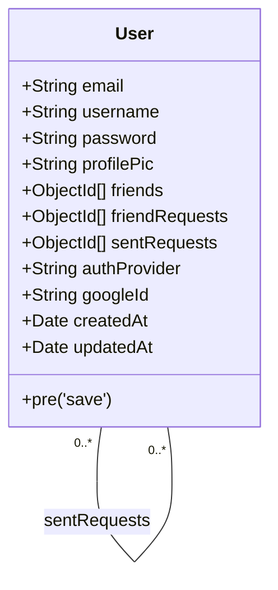
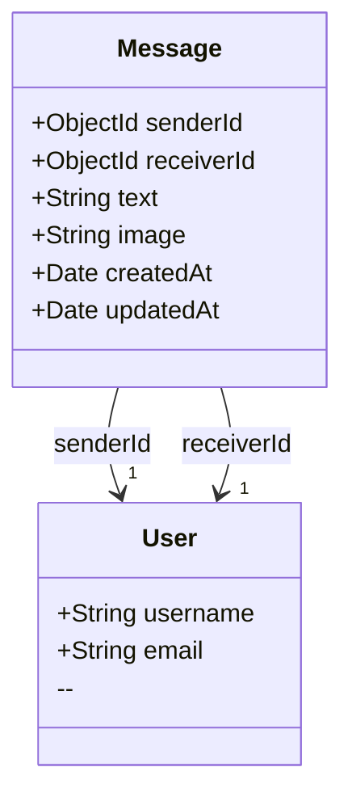
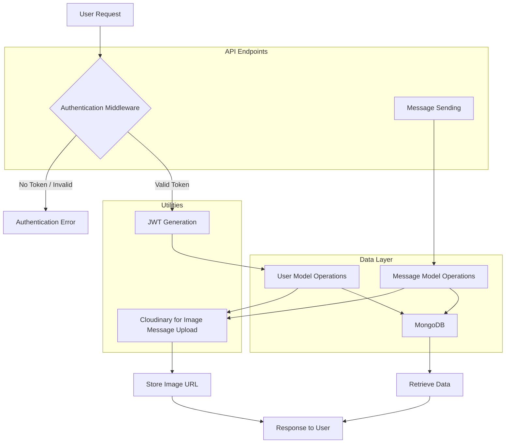

# Data Models & Utilities
<TOC />

This section details the foundational data models for the application's core entities—Users and Messages—defined using Mongoose schemas, alongside essential utility functions for security and external service integration. These components are critical for data persistence, user authentication, and media management, forming the backbone of the backend services.

## Mongoose Schemas: Defining Data Structure

The application leverages Mongoose to provide an object data modeling (ODM) layer for MongoDB, ensuring structured and validated data. Two primary schemas, `User` and `Message`, define the shape and relationships of the core entities.

### User Model

The `User` model encapsulates all user-related information, including authentication credentials, profile details, and social connections.

**File:** [`backend/src/models/user.model.js`](https://github.com/shinymack/Chat-App-MERN/blob/main/backend/src/models/user.model.js)

```javascript
import mongoose from "mongoose"

const  userSchema = new mongoose.Schema(
    {
        email: { 
            type: String,
            required: true,
            unique: true
        },
        username: {
            type: String,
            required: [true, "Username is required"],
            unique: true,
            trim: true,
            minlength: [3, "Username must be at least 3 characters long"],
            maxlength: [20, "Username cannot be more than 20 characters long"]
        }
        ,
        password: {
            type: String,
            minlength: 6,
        },
        profilePic: {
            type: String,
            default: "",
        },
        friends: [{
            type: mongoose.Schema.Types.ObjectId,
            ref: "User",
            default: [] 
        }],
        friendRequests: [{ // Incoming friend requests
            type: mongoose.Schema.Types.ObjectId,
            ref: "User",
            default: []
        }],
        sentRequests: [{ // Outgoing friend requests
            type: mongoose.Schema.Types.ObjectId,
            ref: "User",
            default: []
        }],
        authProvider: {
            type: String,
            enum: ['email', 'google'],
            default: 'email'
        },
        googleId: {
            type: String,
            unique: true,
            sparse: true
        },
    },
    { 
        timestamps: true
    } 
);

userSchema.pre('save', async function(next) {
    if (this.authProvider === 'google' && !this.isModified('password')) {
        this.password = undefined;
    }
    if (this.authProvider === 'email' && !this.password && this.isNew) {
        return next(new Error('Password is required for email signup.'));
    }
    next();
});

const User = mongoose.model("User", userSchema);

export default User;
```

#### Key Fields and Design Choices

*   **`email`**: Unique and required for primary identification.
*   **`username`**: Unique, required, trimmed, and has length constraints for user-friendly display and uniqueness.
*   **`password`**: Stores hashed passwords for security. Minimum length ensures basic complexity. This field is optional if `authProvider` is 'google', reflecting external authentication.
*   **`profilePic`**: Stores a URL to the user's profile image, likely hosted externally (e.g., Cloudinary).
*   **`friends`, `friendRequests`, `sentRequests`**: Arrays of `ObjectId` references to other `User` documents. This design facilitates social networking features, enabling friend lists and request management directly within the user document. Using references avoids duplicating user data and maintains data integrity.
*   **`authProvider`**: An enum (`'email'`, `'google'`) to distinguish between different authentication mechanisms. This is crucial for supporting both traditional email/password login and OAuth (Google).
*   **`googleId`**: Stores the unique Google ID for users authenticated via Google, with `sparse: true` allowing `null` values for users not using Google sign-in without violating the unique constraint.
*   **`timestamps`**: Automatically adds `createdAt` and `updatedAt` fields, essential for tracking user creation and modification times.

#### Pre-Save Hook

A `pre('save')` middleware hook is implemented to handle authentication provider-specific logic:
*   For Google-authenticated users, if the password field hasn't been modified, it's explicitly set to `undefined` to prevent unnecessary storage of `null` or empty strings and clarify that the password isn't used for internal authentication.
*   For email-authenticated users, if a new user is being created without a password, an error is thrown, enforcing password requirement for this authentication method.

#### User Schema Relationships





### Message Model

The `Message` model defines the structure for individual chat messages exchanged between users.

**File:** [`backend/src/models/message.model.js`](https://github.com/shinymack/Chat-App-MERN/blob/main/backend/src/models/message.model.js)

```javascript
import express from "express";
import mongoose from "mongoose";

const messageSchema = new mongoose.Schema(
    {
     senderId: {
        type: mongoose.Schema.Types.ObjectId,
        ref: "User",
        required: true,
     },
     receiverId: {
        type: mongoose.Schema.Types.ObjectId,
        ref: "User",
        required: true,
     },
     text: {
        type: String,
     },
     image: {
        type: String,
     },
    },
    {timestamps: true}
);

export default mongoose.model("Message", messageSchema);
```

#### Key Fields and Design Choices

*   **`senderId`**: A required `ObjectId` reference to the `User` who sent the message.
*   **`receiverId`**: A required `ObjectId` reference to the `User` who is the recipient of the message.
*   **`text`**: Stores the textual content of the message. This field is optional, allowing for image-only messages.
*   **`image`**: Stores a URL to an image file associated with the message, enabling rich media communication. This field is optional, allowing for text-only messages.
*   **`timestamps`**: Automatically adds `createdAt` and `updatedAt` fields, crucial for message ordering and display.

The design of the `Message` schema with `senderId` and `receiverId` as `ObjectId` references to the `User` model establishes a clear relational structure within the NoSQL database. This approach allows for efficient querying of messages between specific users and facilitates population of user details when retrieving message threads.

#### Message Schema Relationships





## Utility Functions

Shared utility functions are essential for encapsulating common logic, promoting code reusability, and maintaining a clean codebase. This section covers utilities for JWT token generation and Cloudinary integration.

### JWT Token Generation

Authentication often relies on JSON Web Tokens (JWTs) for secure, stateless user session management. The `generateToken` utility simplifies this process.

**File:** [`backend/src/lib/utils.js`](https://github.com/shinymack/Chat-App-MERN/blob/main/backend/src/lib/utils.js#L1-L17)

```javascript
import jwt from 'jsonwebtoken';


export const generateToken = (userId, res) => {

    const token = jwt.sign({userId}, process.env.JWT_SECRET, 
        {expiresIn: "7d"});

    res.cookie("jwt", token, {
        maxAge: 7 * 24 * 60 * 60 * 1000, 
        httpOnly: true,
        sameSite: "strict",
        secure: process.env.NODE_ENV !== "development",
    });
    return token;
};
```

#### Functionality and Security Considerations

The `generateToken` function performs two main actions:
1.  **Token Creation**: It signs a JWT containing the `userId` as its payload, using a secret key (`process.env.JWT_SECRET`) and setting an expiration of 7 days. This ensures that the token has a limited lifespan, reducing the risk of token misuse if intercepted.
2.  **Cookie Setting**: It attaches the generated JWT to the HTTP response as a cookie named `jwt`.
    *   **`maxAge`**: Sets the cookie expiration to match the token's expiration (7 days).
    *   **`httpOnly: true`**: Prevents client-side JavaScript from accessing the cookie, mitigating XSS (Cross-Site Scripting) attacks.
    *   **`sameSite: "strict"`**: Prevents the browser from sending the cookie with cross-site requests, protecting against CSRF (Cross-Site Request Forgery) attacks.
    *   **`secure: process.env.NODE_ENV !== "development"`**: Ensures the cookie is only sent over HTTPS in production environments, protecting against eavesdropping.

This robust cookie configuration is a best practice for securing session management in web applications.

### Cloudinary Integration

Cloudinary is a popular cloud-based image and video management service. The application integrates with Cloudinary for handling media uploads, particularly for user profile pictures and message images.

**File:** [`backend/src/lib/cloudinary.js`](https://github.com/shinymack/Chat-App-MERN/blob/main/backend/src/lib/cloudinary.js)

```javascript
import {v2 as cloudinary} from "cloudinary"

import { config } from 'dotenv'

config();

cloudinary.config(
    {cloud_name: process.env.CLOUDINARY_CLOUD_NAME,
    api_key: process.env.CLOUDINARY_API_KEY,
    api_secret: process.env.CLOUDINARY_API_SECRET,}
);

export default cloudinary;
```

#### Configuration and Usage

This file initializes the Cloudinary SDK with credentials loaded from environment variables (`.env`).
*   **`CLOUDINARY_CLOUD_NAME`**: Your unique Cloudinary cloud name.
*   **`CLOUDINARY_API_KEY`**: Your Cloudinary API key.
*   **`CLOUDINARY_API_SECRET`**: Your Cloudinary API secret.

By exporting the configured `cloudinary` object, any part of the backend can easily interact with the Cloudinary API to upload, manage, and retrieve media assets without needing to reconfigure credentials. This promotes a centralized and secure way to handle external service integrations.

## Component Interaction Diagram





## Key Insights and Best Practices

*   **Schema Design for Scalability**: The use of `ObjectId` references in `User` (for `friends`, `friendRequests`, `sentRequests`) and `Message` (for `senderId`, `receiverId`) creates a flexible structure suitable for MongoDB. This allows for efficient querying and population of related documents, avoiding deeply nested structures that can hinder performance with large datasets.
*   **Secure Authentication**: The `generateToken` utility exemplifies best practices for JWT-based authentication by:
    *   Using `httpOnly` cookies to prevent XSS.
    *   Employing `sameSite: "strict"` to mitigate CSRF.
    *   Enforcing `secure` cookies in production for HTTPS-only transmission.
    *   Setting an `expiresIn` for tokens to limit their validity.
*   **External Service Integration**: Centralizing Cloudinary configuration in `backend/src/lib/cloudinary.js` promotes a clean separation of concerns and simplifies management of external APIs. This approach makes it easy to swap out services or update configurations without affecting core application logic.
*   **Pre-Save Hooks for Data Integrity**: The `pre('save')` hook in the `User` model demonstrates how Mongoose middleware can be used to enforce business logic and data consistency before a document is saved, especially for complex scenarios like multi-provider authentication.
*   **Environment Variables**: All sensitive credentials (JWT secret, Cloudinary keys) are loaded from environment variables (`process.env`), adhering to the 12-factor app principles and ensuring that sensitive information is not hardcoded into the application.

Next: [Frontend Development](./3_frontend_development.mdx)