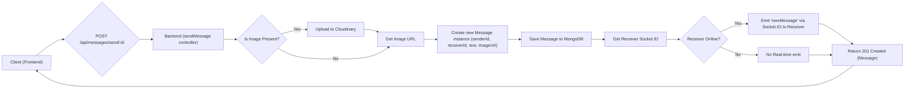

---
title: "Messaging System"
description: "Implementation details of real-time messaging, message storage, and delivery."
sidebar_position: 23
---

# Messaging System

The Messaging System is the core communication backbone of the application, facilitating real-time, bidirectional communication between users. This section details the implementation of message storage, delivery mechanisms, and the underlying real-time WebSocket infrastructure. It covers how users retrieve message history, send new messages (including media), and receive instant notifications for new communications.

<TOC />

## System Purpose

The primary purpose of the Messaging System is to enable seamless and secure communication between authenticated users. It is designed to offer:

*   **Real-time Communication**: Instant delivery of messages using WebSocket technology, ensuring low-latency interactions.
*   **Persistent Message Storage**: Securely stores message history in a database, allowing users to retrieve past conversations.
*   **Media Message Support**: Ability to send and receive image attachments with messages, managed via a third-party cloud storage service.
*   **User Presence Indication**: Real-time tracking of online users to enhance the user experience by showing who is currently available for chat.
*   **Scalability**: Designed with considerations for handling a growing number of concurrent users and messages.

## Architecture

The Messaging System follows a client-server architecture, with a significant emphasis on WebSocket-based communication for real-time features.

*   **Client (Frontend)**: Interacts with the backend API for traditional RESTful operations (e.g., fetching message history, user lists) and establishes a WebSocket connection for real-time message exchange and presence updates.
*   **Backend (API Server)**: A Node.js/Express server that handles HTTP requests for user authentication, message retrieval, and message sending. It integrates with MongoDB for data persistence and a WebSocket server (Socket.IO) for real-time events.
*   **Database (MongoDB)**: Stores user profiles and message records, including sender, receiver, text content, and image URLs.
*   **Cloudinary**: A third-party cloud service used for storing and serving image attachments, offloading media storage from the primary application server.

The interaction flow involves both traditional HTTP requests and persistent WebSocket connections. When a message is sent, an HTTP POST request is made to the backend. The backend saves the message to the database and then uses the WebSocket server to emit the new message to the recipient in real-time.


```mermaid
graph TD
    A["Client (Frontend)"] -->|1. HTTP GET /api/messages/:id| B("Backend (Express/Node.js)")
    B -->|2. Query MongoDB for messages| C["MongoDB (Message/User Models)"]
    C -->|3. Return messages| B
    B -->|4. HTTP 200 OK (messages)| A

    A_send["Client (Frontend)"] -->|5. HTTP POST /api/messages/send/:id (text, image)| B_send("Backend (Express/Node.js)")
    B_send -->|6. Upload image to Cloudinary (if present)| D["Cloudinary"]
    D -->|7. Image URL| B_send
    B_send -->|8. Save message to MongoDB| C_send["MongoDB (Message Model)"]
    C_send -->|9. Message saved| B_send
    B_send -->|10. Emit "newMessage" via Socket.IO| E["Socket.IO Server"]
    E -->|11. Real-time "newMessage"| A_send_receiver["Client (Frontend) - Receiver"]
    B_send -->|12. HTTP 201 Created (newMessage)| A_send
```


## Technology Stack

The Messaging System leverages a modern JavaScript-centric technology stack to deliver its functionalities.

| Layer               | Technology      | Purpose                                                                        |
| :------------------ | :-------------- | :----------------------------------------------------------------------------- |
| **Backend Framework** | Express.js      | Handles API routing, request parsing, and middleware integration.              |
| **Database**        | MongoDB         | NoSQL database for flexible and scalable storage of user and message data.     |
| **ORM/ODM**         | Mongoose        | Object Data Modeling library for MongoDB, simplifying data interaction.        |
| **Real-time Engine**| Socket.IO       | Enables bidirectional, event-based communication for real-time messaging.      |
| **Cloud Storage**   | Cloudinary      | Manages and serves image uploads, providing a robust media delivery solution.  |
| **Authentication**  | JSON Web Tokens | Secures API endpoints and protects routes, ensuring only authenticated users can access messaging features. |

### Core Dependencies

Key dependencies facilitating the messaging system operations:

*   **`express`**: Web framework for Node.js.
*   **`mongoose`**: MongoDB object modeling.
*   **`socket.io`**: Real-time engine.
*   **`cloudinary`**: Cloud-based image and video management.

## Features

The Messaging System encompasses several key features, ranging from user management for chat purposes to the actual message transmission and storage.

### User Sidebar Retrieval

The system allows authenticated users to retrieve a list of other registered users, excluding themselves, for display in a chat sidebar. This enables users to initiate new conversations or view existing ones.

The `getUsersForSidebar` controller function handles this:

```javascript
// backend/src/controllers/message.controller.js
import User from "../models/user.model.js";
// ... other imports

export const getUsersForSidebar = async (req, res) => {
    try {
        const loggedInUserId = req.user._id;
        // Find all users except the currently logged-in user
        // and exclude their password field for security
        const filteredUsers = await User.find({
            _id: { $ne: loggedInUserId }}).select("-password");  
        res.status(200).json(filteredUsers);
    }
    catch (error) {
        console.log("Error in getUsersForSidebar: ", error);
        res.status(500).json({ error: "Internal Server Error" });
    }
};
// [View on GitHub](https://github.com/shinymack/Chat-App-MERN/blob/main/backend/src/controllers/message.controller.js#L5-L17)
```

This function performs a MongoDB query using `$ne` (not equal) to filter out the `loggedInUserId`, ensuring a user doesn't chat with themselves. This list is crucial for populating the chat list on the client-side.

### Message Retrieval

Users can fetch their message history with a specific chat partner. This feature ensures that all past communications are accessible and displayed chronologically.

The `getMessages` controller orchestrates this:

```javascript
// backend/src/controllers/message.controller.js
// ... other imports

export const getMessages = async (req, res) => {
    try {
        const {id : userToChatId } = req.params; // ID of the other user
        const myId = req.user._id; // ID of the logged-in user

        // Find messages where senderId is me and receiverId is the other user,
        // OR senderId is the other user and receiverId is me.
        const messages = await Message.find({
            $or: [
                {senderId: myId, receiverId:userToChatId},
                {senderId: userToChatId, receiverId: myId}
            ]
        });
        res.status(200).json(messages);
    } catch (error) {
        console.log("Error in getMessages controller:  ", error);
        res.status(500).json({ error: "Internal Server Error" });
    }
};
// [View on GitHub](https://github.com/shinymack/Chat-App-MERN/blob/main/backend/src/controllers/message.controller.js#L20-L37)
```

The `$or` operator in the MongoDB query is vital for fetching all messages exchanged between two specific users, regardless of who sent them. This ensures a complete conversation thread is retrieved.

### Message Sending (Text & Media)

Sending messages is a dual-purpose functionality: it handles plain text and image attachments. The system integrates with Cloudinary for robust media handling and uses Socket.IO for real-time delivery.

```javascript
// backend/src/controllers/message.controller.js
// ... other imports
import cloudinary from "../lib/cloudinary.js";
import { getReceiverSocketId, io } from "../lib/socket.js";

export const sendMessage = async (req, res) => {
    try {
        const { text, image } = req.body;
        const { id: receiverId } = req.params;
        const senderId = req.user._id;

        let imageUrl;
        if (image) {
            const uploadResponse = await cloudinary.uploader.upload(image); // Upload image to Cloudinary
            imageUrl = uploadResponse.secure_url; // Get the secure URL
        }

        const newMessage = new Message({ // Create a new message instance
            senderId,
            receiverId,
            text,
            image: imageUrl, // Store image URL if available
        });

        await newMessage.save(); // Save the message to MongoDB

        const receiverSocketId = getReceiverSocketId(receiverId); // Get the recipient's socket ID

        if(receiverSocketId) {
            // If the receiver is online, emit the new message in real-time
            io.to(receiverSocketId).emit("newMessage", newMessage);
        }

        res.status(201).json(newMessage);   
        
    } catch (error) {
        console.log("Error in sendMessage controller:  ", error);
        res.status(500).json({ error: "Internal Server Error" });
    }
};
// [View on GitHub](https://github.com/shinymack/Chat-App-MERN/blob/main/backend/src/controllers/message.controller.js#L40-L74)
```

This `sendMessage` function demonstrates a critical interaction pattern: **store-then-notify**. The message is first persisted in the database to ensure durability and then dispatched via WebSockets for real-time delivery if the receiver is online. This hybrid approach ensures both data integrity and a responsive user experience.

### Real-time Communication with Socket.IO

Socket.IO is central to the real-time aspects of the messaging system, handling connection management, online user tracking, and immediate message delivery.

```javascript
// backend/src/lib/socket.js
import { Server } from "socket.io";
import http from "http";
import express from "express";

const app = express();
const server = http.createServer(app);

const io = new Server(server, { // Initialize Socket.IO server
    cors: {
        origin: ["http://localhost:5173"] // Configure CORS for frontend
    }
})

export function getReceiverSocketId(userId) {
    return userSocketMap[userId]; // Helper to get socket ID for a given user
}

// Map to store online users: {userId : socketId}
const userSocketMap = {};

io.on("connection", (socket) => { // Event listener for new connections
    console.log("A user connected", socket.id);

    const userId = socket.handshake.query.userId; // Get user ID from handshake
    if(userId) userSocketMap[userId] = socket.id; // Store user's socket ID

    // Emit updated list of online users to all connected clients
    io.emit("getOnlineUsers", Object.keys(userSocketMap));

    socket.on("disconnect", ()=>{ // Event listener for disconnections
        console.log("A user disconnected", socket.id);
        delete userSocketMap[userId]; // Remove user from map
        io.emit("getOnlineUsers", Object.keys(userSocketMap)); // Emit updated list
    })
})

export { io, app, server };
// [View on GitHub](https://github.com/shinymack/Chat-App-MERN/blob/main/backend/src/lib/socket.js#L1-L38)
```

The `userSocketMap` is a simple yet effective way to maintain a registry of currently online users and their corresponding `socket.id`. This map is crucial for targeted message delivery using `io.to(receiverSocketId).emit(...)`. The `io.emit("getOnlineUsers", ...)` broadcasts presence updates, allowing all clients to dynamically update their UI to show who is online.

### Message Data Model

The `Message` model defines the structure for storing individual messages in the MongoDB database.

```javascript
// backend/src/models/message.model.js
import mongoose from "mongoose";

const messageSchema = new mongoose.Schema(
    {
     senderId: { // Reference to the User who sent the message
        type: mongoose.Schema.Types.ObjectId,
        ref: "User",
        required: true,
     },
     receiverId: { // Reference to the User who is the recipient
        type: mongoose.Schema.Types.ObjectId,
        ref: "User",
        required: true,
     },
     text: { // The textual content of the message
        type: String,
     },
     image: { // URL to the uploaded image, if any
        type: String,
     },
    },
    {timestamps: true} // Automatically adds createdAt and updatedAt fields
);

export default mongoose.model("Message", messageSchema);
// [View on GitHub](https://github.com/shinymack/Chat-App-MERN/blob/main/backend/src/models/message.model.js#L1-L28)
```

This Mongoose schema includes `senderId` and `receiverId` fields, both referencing the `User` model, establishing a clear relationship between messages and users. The `timestamps: true` option is a best practice for tracking when messages were created and last updated.

### Routing

The `message.route.js` file defines the API endpoints for messaging-related operations, ensuring proper routing and middleware application.

```javascript
// backend/src/routes/message.route.js
import express from "express"
import { protectRoute } from "../middleware/auth.middleware.js"; // Authentication middleware
import { getUsersForSidebar, getMessages, sendMessage } from "../controllers/message.controller.js";
const router = express.Router();

// Route to get a list of users for the chat sidebar
router.get("/users", protectRoute, getUsersForSidebar);

// Route to get messages between the logged-in user and a specific user
router.get("/:id", protectRoute, getMessages);

// Route to send a message to a specific user
router.post("/send/:id", protectRoute, sendMessage);

export default router;
// [View on GitHub](https://github.com/shinymack/Chat-App-MERN/blob/main/backend/src/routes/message.route.js#L1-L15)
```

All routes are protected by the `protectRoute` middleware, ensuring that only authenticated users can access messaging functionalities. This is a critical security measure.

### Message Sending Flow

The process of sending a message, especially one with an image, involves multiple steps across different components:





## Key Integration Points

The Messaging System integrates deeply with several other parts of the application:

*   **Authentication Middleware**: The `protectRoute` middleware is paramount, ensuring that all messaging API endpoints are secure and accessible only to authenticated users. This prevents unauthorized access to message history or the ability to send messages under false pretenses. The `req.user._id` populated by this middleware is critical for identifying the `senderId`.
*   **User Management**: The system relies on the `User` model to fetch lists of chat-eligible users and to establish `senderId` and `receiverId` relationships in message documents. The ability to retrieve users for the sidebar directly leverages the user database.
*   **Cloudinary Integration**: For media messaging, Cloudinary serves as an external, scalable storage solution. The backend directly interacts with Cloudinary's API for image uploads, offloading storage and delivery concerns from the primary server.
*   **Socket.IO Server**: This dedicated real-time server runs alongside the Express HTTP server, managing persistent WebSocket connections. It acts as the dispatcher for real-time events, centralizing online user tracking and broadcasting new messages.

**Insights and Best Practices**:

*   **Scalability**: By separating concerns (REST API for history, Socket.IO for real-time, Cloudinary for media), the system improves scalability. Each component can be scaled independently. For high-traffic applications, the `userSocketMap` could be moved to a distributed store (e.g., Redis) to support multiple Socket.IO server instances.
*   **Data Integrity vs. Real-time**: The "store-then-notify" pattern used in `sendMessage` is a robust approach, ensuring messages are always persisted in the database before attempting real-time delivery. This guarantees that messages are not lost if the recipient is offline or if the real-time delivery mechanism temporarily fails.
*   **Security**: The `protectRoute` middleware is fundamental. Further enhancements could include input validation for message content to prevent XSS attacks and rate limiting on message sending endpoints.
*   **Error Handling**: Basic error handling is present in controllers. In a production environment, more sophisticated logging, error reporting, and user-friendly error messages would be beneficial.

Next: [Frontend Application](./3_frontend-application.mdx)
```