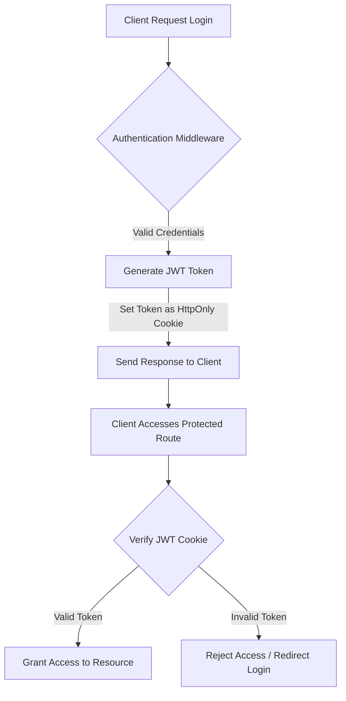
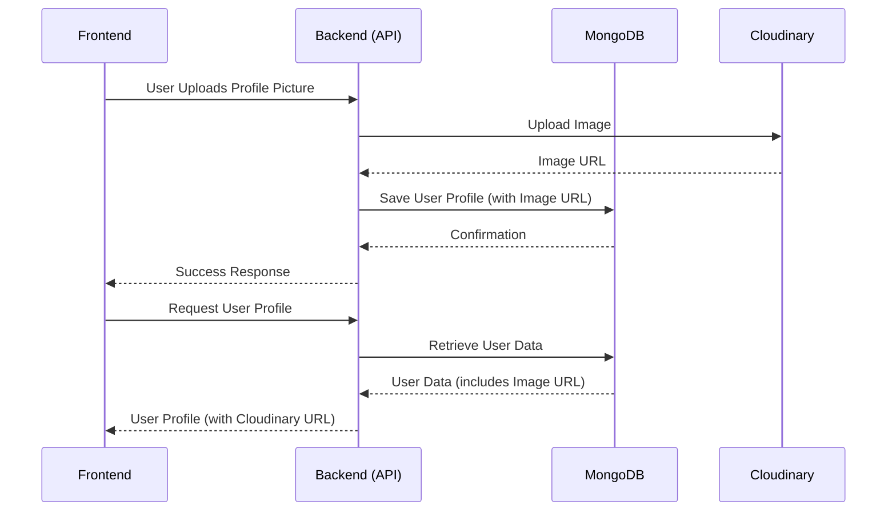

---
title: "Utility and External Integrations"
description: "Details on helper functions, database connection, and third-party integrations like Cloudinary."
sidebar_position: 23
---

# Utility and External Integrations
<TOC />

This section details the core utility functions, the robust database connection mechanism, and the seamless integration with third-party services like Cloudinary within the backend. These components are fundamental to the application's operation, handling essential tasks from data persistence to secure asset management and user authentication.

## Core Utilities

The `backend/src/lib/utils.js` file [View on GitHub](https://github.com/shinymack/Chat-App-MERN/blob/main/backend/src/lib/utils.js) centralizes common helper functions, primarily focusing on security-related tasks such as JSON Web Token (JWT) generation and management. These utilities ensure that critical operations like user session management are handled consistently and securely across the application.

### JWT Generation

The `generateToken` function is responsible for creating and setting a JWT for user authentication. This token is crucial for maintaining user sessions and securing API endpoints.

```javascript
export const generateToken = (userId, res) => {
    const token = jwt.sign({userId}, process.env.JWT_SECRET, 
        {expiresIn: "7d"});

    res.cookie("jwt", token, {
        maxAge: 7 * 24 * 60 * 60 * 1000, 
        httpOnly: true,
        sameSite: "strict",
        secure: process.env.NODE_ENV !== "development",
    });
    return token;
};
```
[backend/src/lib/utils.js#L4-L14](https://github.com/shinymack/Chat-App-MERN/blob/main/backend/src/lib/utils.js#L4-L14)

**Features:**
*   **Secure Token Generation**: Utilizes `jsonwebtoken` to create a signed JWT containing the `userId`. The `JWT_SECRET` is loaded from environment variables, ensuring it's kept confidential.
*   **Cookie-based Authentication**: The token is set as an `httpOnly` cookie, mitigating XSS attacks as client-side scripts cannot access it.
*   **Expiration Management**: The token is configured to expire in 7 days, balancing security with user convenience by reducing frequent re-authentication.
*   **Strict SameSite Policy**: `sameSite: "strict"` prevents the browser from sending the cookie with cross-site requests, protecting against CSRF attacks.
*   **Conditional Security**: The `secure` flag is set to `true` in production environments, ensuring the cookie is only sent over HTTPS.

**Insights and Best Practices:**
For enhanced security and scalability, consider token revocation mechanisms (e.g., blacklisting tokens or maintaining session states in a database) for scenarios like logout or password changes. This prevents valid, but compromised, tokens from being used. Additionally, for high-traffic applications, using a dedicated token service or a distributed cache like Redis for session management can improve performance.

## Database Connection

The `backend/src/lib/db.js` file [View on GitHub](https://github.com/shinymack/Chat-App-MERN/blob/main/backend/src/lib/db.js) handles the critical task of connecting the application to MongoDB using Mongoose. This module ensures robust and persistent data storage for the backend.

### MongoDB Connection Function

The `connectDB` function establishes a connection to the MongoDB database. This function is called during application startup to ensure database readiness.

```javascript
import mongoose from "mongoose"

export const connectDB = async () => {
  try {
    const conn = await mongoose.connect(process.env.MONGODB_URI);
    console.log(`MongoDB connected:  ${conn.connection.host}`);
  }
  catch(error){
    console.log("MongoDB connection error: ", error);
  }
}
```
[backend/src/lib/db.js#L1-L10](https://github.com/shinymack/Chat-App-MERN/blob/main/backend/src/lib/db.js#L1-L10)

**Features:**
*   **Asynchronous Connection**: Uses `async/await` for non-blocking database connection, crucial for application responsiveness.
*   **Environment Variable Configuration**: Retrieves the MongoDB URI from `process.env.MONGODB_URI`, promoting secure and flexible configuration across different environments.
*   **Connection Status Logging**: Provides clear console feedback on successful connection, including the connected host, or detailed error messages in case of failure.
*   **Error Handling**: Includes a `try-catch` block to gracefully handle connection errors, preventing application crashes and providing actionable insights for debugging.

**Insights and Best Practices:**
For production environments, implementing connection pooling and retry mechanisms with exponential backoff can improve resilience against transient database issues. Monitoring tools can track connection health and query performance. Consider using a dedicated database user with minimal necessary privileges for security.

## External Integrations

The backend leverages external services to offload resource-intensive tasks and enhance functionality. Cloudinary is integrated for efficient media asset management.

### Cloudinary Integration

The `backend/src/lib/cloudinary.js` file [View on GitHub](https://github.com/shinymack/Chat-App-MERN/blob/main/backend/src/lib/cloudinary.js) configures and exports the Cloudinary SDK, enabling seamless image and video upload, management, and delivery.

```javascript
import {v2 as cloudinary} from "cloudinary"

import { config } from 'dotenv'

config();

cloudinary.config(
    {cloud_name: process.env.CLOUDINARY_CLOUD_NAME,
    api_key: process.env.CLOUDINARY_API_KEY,
    api_secret: process.env.CLOUDINARY_API_SECRET,}
);

export default cloudinary;
```
[backend/src/lib/cloudinary.js#L1-L12](https://github.com/shinymack/Chat-App-MERN/blob/main/backend/src/lib/cloudinary.js#L1-L12)

**Features:**
*   **Environment-based Configuration**: Cloudinary credentials (cloud name, API key, API secret) are loaded from environment variables, ensuring secure and flexible deployment.
*   **Centralized Configuration**: The `cloudinary.config` call is made once at the module level, ensuring all subsequent uses of the `cloudinary` object are correctly authenticated.
*   **Exported Instance**: The configured `cloudinary` instance is exported as the default, making it easily importable and usable across other modules that need media upload capabilities.

**Insights and Best Practices:**
Leveraging a specialized service like Cloudinary for media handling significantly reduces the backend's load, improves scalability, and offers advanced features like image transformations, optimization, and content delivery network (CDN) integration out-of-the-box. For large-scale applications, consider implementing direct client-side uploads to Cloudinary to further reduce backend latency and resource consumption. Implement robust error handling for upload failures and ensure proper access control for uploaded assets.

## Technology Stack

The backend utilizes a MERN (MongoDB, Express, React, Node.js) stack with several key dependencies for various functionalities.

| Layer           | Technology     | Purpose                                                          | Dependencies (from `package.json`)                                                                                                                    |
| :-------------- | :------------- | :--------------------------------------------------------------- | :---------------------------------------------------------------------------------------------------------------------------------------------------- |
| **Database**    | MongoDB        | NoSQL database for flexible data storage.                        | `mongoose`                                                                                                                                            |
| **ORM/ODM**     | Mongoose       | Object Data Modeling for MongoDB, simplifying interactions.      | `mongoose`                                                                                                                                            |
| **Backend API** | Express.js     | Web application framework for building RESTful APIs.             | `express`                                                                                                                                             |
| **Runtime**     | Node.js        | JavaScript runtime environment.                                  | `express`, `socket.io`, `bcryptjs`, `jsonwebtoken`, `dotenv`, `cookie-parser`, `express-session`, `passport`, `passport-google-oauth20`              |
| **Authentication** | JWT, Passport.js | Secure token-based authentication and OAuth integration.       | `jsonwebtoken`, `bcryptjs`, `cookie-parser`, `passport`, `passport-google-oauth20`, `express-session`                                                   |
| **File Storage** | Cloudinary     | Cloud-based media management for images and videos.              | `cloudinary`                                                                                                                                          |
| **Realtime Comm.** | Socket.IO    | Enables real-time, bidirectional event-based communication.      | `socket.io`                                                                                                                                           |
| **Dev Tools**   | Nodemon        | Automatically restarts Node.js application on file changes.      | `nodemon`                                                                                                                                             |

### Backend Dependencies (`package.json`)

```json
  "dependencies": {
    "bcryptjs": "^2.4.3",
    "cloudinary": "^2.5.1",
    "cookie-parser": "^1.4.7",
    "dotenv": "^16.4.7",
    "express": "^4.21.2",
    "express-session": "^1.18.1",
    "jsonwebtoken": "^9.0.2",
    "mongoose": "^8.9.5",
    "passport": "^0.7.0",
    "passport-google-oauth20": "^2.0.0",
    "socket.io": "^4.8.1"
  },
  "devDependencies": {
    "nodemon": "^3.1.9"
  }
```
[backend/package.json#L15-L33](https://github.com/shinymack/Chat-App-MERN/blob/main/backend/package.json#L15-L33)

This configuration outlines the core libraries supporting the backend, from data handling with Mongoose to secure authentication with `bcryptjs` and `jsonwebtoken`, and real-time communication with `socket.io`.

## Key Integration Points

The utility functions and external integrations form critical pillars of the backend architecture.

### Authentication Flow Diagram

The following diagram illustrates the high-level authentication flow, integrating JWT generation and cookie management.





### Database and Cloudinary Interaction Flow

This diagram visualizes how data persistence and media management interact within the backend.





**Insights:**
*   **Authentication**: The `generateToken` utility is central to the application's stateless authentication strategy, ensuring that user sessions are managed securely through HTTP-only, strict-SameSite cookies.
*   **Data Persistence**: The `connectDB` function ensures a reliable connection to MongoDB, which is fundamental for all data storage and retrieval operations. This robust connection handling is critical for application uptime and data integrity.
*   **Media Management**: Cloudinary integration offloads significant resource overhead from the backend, allowing it to focus on business logic while Cloudinary handles the complexities of media storage, optimization, and delivery. This separation of concerns improves scalability and performance.
*   **Scalability**: By leveraging specialized services for authentication (via JWTs, allowing for horizontal scaling of backend instances without shared session state) and media management (Cloudinary), the backend remains lightweight and highly scalable. Database connection pooling can further enhance performance under heavy load.

Next: [Frontend Implementation and UI](./3_frontend-implementation-ui.mdx)
```