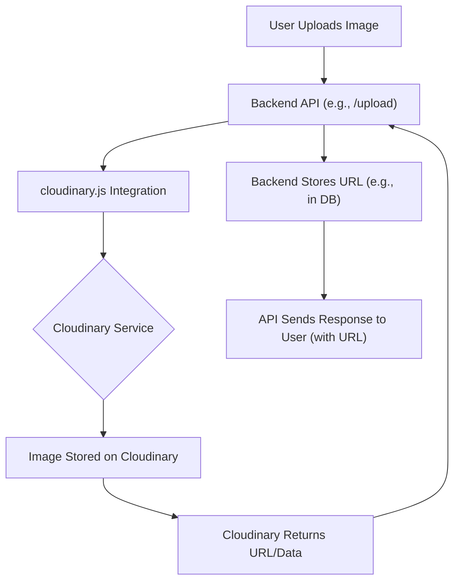
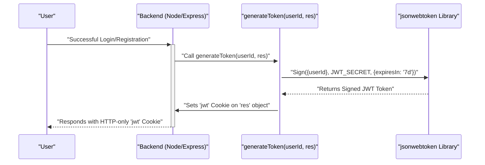

# Utility Services and Integrations

<TOC />

The `backend` service is equipped with a suite of utility functions and integrated with external services to handle common tasks such as secure authentication, media management, and environmental configuration. These services are encapsulated in dedicated modules, promoting reusability and maintainability across the application. This section delves into the core utility modules and their role in the backend architecture.

## Overview of Dependencies

The `backend/package.json` file lists all the third-party libraries and tools that the backend service relies on. This provides a clear picture of the technologies supporting the utility functions and external integrations.

```json title="backend/package.json (dependencies excerpt)"
{
  "name": "backend",
  "version": "1.0.0",
  "main": "src/index.js",
  "scripts": {
    "dev": "nodemon src/index.js",
    "start": "node src/index.js"
  },
  "author": "",
  "type": "module",
  "license": "ISC",
  "description": "",
  "dependencies": {
    "bcryptjs": "^2.4.3",
    "cloudinary": "^2.5.1",
    "cookie-parser": "^1.4.7",
    "dotenv": "^16.4.7",
    "express": "^4.21.2",
    "express-session": "^1.18.1",
    "jsonwebtoken": "^9.0.2",
    "mongoose": "^8.9.5",
    "passport": "^0.7.0",
    "passport-google-oauth20": "^2.0.0",
    "socket.io": "^4.8.1"
  },
  "devDependencies": {
    "nodemon": "^3.1.9"
  }
}
```
[View `package.json` on GitHub](https://github.com/shinymack/Chat-App-MERN/blob/main/backend/package.json)

Key dependencies related to utility services and integrations include:

*   `cloudinary`: Essential for cloud-based image and video management.
*   `dotenv`: For loading environment variables from a `.env` file, crucial for configuration.
*   `jsonwebtoken`: Used for generating and verifying JSON Web Tokens (JWTs) for authentication.
*   `cookie-parser`: Parses incoming request cookies into a JavaScript object.

## Cloudinary Integration for Media Management

The `backend/src/lib/cloudinary.js` file handles the configuration and export of the Cloudinary SDK. Cloudinary is a powerful cloud service that offers an end-to-end solution for all your image and video needs, including uploads, storage, transformations, and delivery. By integrating Cloudinary, the application can efficiently manage user-generated content without burdening the server's storage or processing capabilities.

The configuration relies on environment variables (`CLOUDINARY_CLOUD_NAME`, `CLOUDINARY_API_KEY`, `CLOUDINARY_API_SECRET`) to securely connect to the Cloudinary account. This ensures that sensitive credentials are not hardcoded in the codebase.

```javascript title="backend/src/lib/cloudinary.js"
import {v2 as cloudinary} from "cloudinary"

import { config } from 'dotenv'

config();

cloudinary.config(
    {cloud_name: process.env.CLOUDINARY_CLOUD_NAME,
    api_key: process.env.CLOUDINARY_API_KEY,
    api_secret: process.env.CLOUDINARY_API_SECRET,}
);

export default cloudinary;
```
[View `cloudinary.js` on GitHub](https://github.com/shinymack/Chat-App-MERN/blob/main/backend/src/lib/cloudinary.js)

The diagram below illustrates the typical flow for image uploads using Cloudinary:





## Authentication Utilities

The `backend/src/lib/utils.js` file contains helper functions primarily focused on authentication and token management. One critical utility is the `generateToken` function, which creates a JSON Web Token (JWT) for a given user ID and sets it as an HTTP-only cookie in the response. This approach enhances security by making the token inaccessible to client-side JavaScript, mitigating Cross-Site Scripting (XSS) attacks.

```javascript title="backend/src/lib/utils.js"
import jwt from 'jsonwebtoken';


export const generateToken = (userId, res) => {

    const token = jwt.sign({userId}, process.env.JWT_SECRET, 
        {expiresIn: "7d"});

    res.cookie("jwt", token, {
        maxAge: 7 * 24 * 60 * 60 * 1000, 
        httpOnly: true,
        sameSite: "strict",
        secure: process.env.NODE_ENV !== "development",
    });
    return token;
};
```
[View `utils.js` on GitHub](https://github.com/shinymack/Chat-App-MERN/blob/main/backend/src/lib/utils.js)

### JWT Token Generation Process

The `generateToken` function performs the following key steps:

1.  **Sign JWT**: It uses `jsonwebtoken.sign` to create a token. The payload includes `userId`, and it's signed with `process.env.JWT_SECRET`. The token is set to expire in 7 days.
2.  **Set Cookie**: The generated token is then set as a cookie named `"jwt"` in the HTTP response.
    *   `maxAge`: Sets the cookie's expiration to 7 days.
    *   `httpOnly`: Prevents client-side JavaScript from accessing the cookie.
    *   `sameSite`: Set to `"strict"` to prevent the browser from sending the cookie with cross-site requests, providing protection against Cross-Site Request Forgery (CSRF) attacks.
    *   `secure`: Ensures the cookie is only sent over HTTPS in production environments.

This sequence diagram illustrates the process of generating and setting a JWT token:





## Key Integration Points

*   **Environmental Configuration**: The use of `dotenv` for managing environment variables (e.g., `CLOUDINARY_CLOUD_NAME`, `JWT_SECRET`) is a best practice, ensuring sensitive information is kept out of the codebase and managed per deployment environment.
*   **Secure Authentication**: The combination of `jsonwebtoken` and `cookie-parser` with `httpOnly` and `sameSite=strict` cookies provides a robust and secure mechanism for user authentication, protecting against common web vulnerabilities.
*   **Scalable Media Handling**: Integrating Cloudinary offloads media storage and processing, allowing the backend to focus on core business logic while providing a highly scalable and reliable solution for media assets.
*   **Modular Design**: By separating utilities into `lib` modules (`cloudinary.js`, `utils.js`), the backend maintains a clean and organized structure, making it easier to understand, test, and extend.

These utility services and integrations are fundamental to the backend's functionality, security, and performance, enabling it to deliver a comprehensive and reliable application experience.

---

Next: [Frontend Development and UI](./3_frontend-development-ui.mdx)