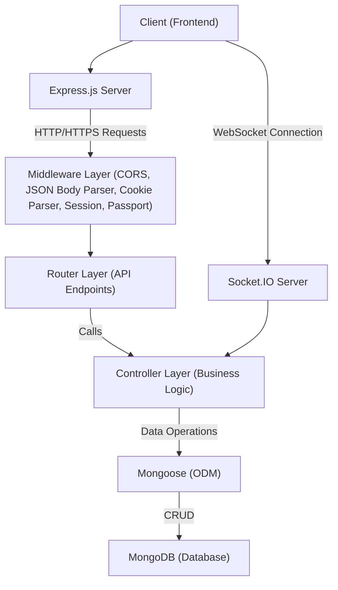
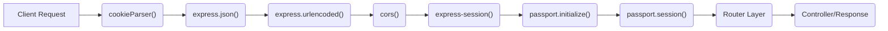
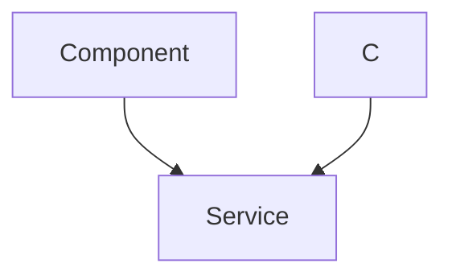

---
title: "Backend Architecture and API"
description: "Comprehensive documentation of the server-side architecture, data models, and API endpoints."
sidebar_position: 2
---

# Backend Architecture and API

<TOC />

This document provides a comprehensive overview of the backend architecture, core components, and API endpoints for the application. It details the server-side infrastructure, technology stack, and how different services interact to provide a robust and scalable foundation.

## System Purpose

The backend serves as the core computational and data management layer for the application, handling all business logic, data persistence, user authentication, and real-time communication. It is designed to be a scalable, secure, and efficient API provider for the frontend client.

Key functionalities provided by the backend include:

*   **User Management and Authentication:** Secure user registration, login, session management (via cookies and `express-session`), and Google OAuth 2.0 integration using Passport.js.
*   **Profile Management:** Functionality for users to update their profile information.
*   **Real-time Communication:** WebSocket integration via Socket.IO for real-time messaging and notifications (inferred from `socket.io` dependency and `socket.js` import).
*   **Data Persistence:** Connection to a MongoDB database for storing application data.
*   **API Exposure:** A well-defined RESTful API for interaction with frontend clients.
*   **Environment Configuration:** Utilizes `dotenv` for managing environment-specific variables, enhancing flexibility and security.

## Architecture Overview

The backend follows a layered architecture, common in modern web applications, primarily leveraging the MERN (MongoDB, Express.js, React, Node.js) stack. It operates as an API-driven service, providing data and functionality to the frontend client.

The core components and their interactions are:

*   **Client (Frontend):** Interacts with the backend via HTTP requests and WebSocket connections.
*   **Express.js Server:** The primary entry point, handling routing, middleware, and request/response cycles. It uses various middleware for parsing requests, handling sessions, and authentication.
*   **Controllers:** Implement the business logic for each route, interacting with services or data models.
*   **Routes:** Define the API endpoints and map them to specific controller functions.
*   **Database (MongoDB):** The data persistence layer, accessed via Mongoose.
*   **Authentication Layer (Passport.js):** Manages user authentication strategies, including local (username/password) and Google OAuth.
*   **Real-time Layer (Socket.IO):** Handles WebSocket connections for real-time features.

Here's a high-level architectural diagram:





## Technology Stack

The backend is built upon a robust and widely adopted set of technologies:

| Layer/Category       | Technology      | Purpose                                                                                                                                                                                                                                                                                                                                                                                                      |
| :------------------- | :-------------- | :--------------------------------------------------------------------------------------------------------------------------------------------------------------------------------------------------------------------------------------------------------------------------------------------------------------------------------------------------------------------------------------------------- |
| **Runtime**          | Node.js         | Server-side JavaScript runtime environment.                                                                                                                                                                                                                                                                                                                                                          |
| **Web Framework**    | Express.js      | Fast, unopinionated, minimalist web framework for Node.js, forming the backbone of the API.                                                                                                                                                                                                                                                                                                          |
| **Database**         | MongoDB         | NoSQL document database, offering flexibility and scalability for data storage.                                                                                                                                                                                                                                                                                                                      |
| **ODM**              | Mongoose        | Object Data Modeling (ODM) library for MongoDB and Node.js, providing a straightforward, schema-based solution to model application data.                                                                                                                                                                                                                                                            |
| **Authentication**   | Passport.js     | Flexible authentication middleware for Node.js, supporting various strategies including local authentication and Google OAuth 2.0.                                                                                                                                                                                                                                                                     |
| **Auth Utilities**   | `bcryptjs`      | Library for hashing passwords securely.                                                                                                                                                                                                                                                                                                                                                              |
|                      | `jsonwebtoken`  | Used for creating and verifying JSON Web Tokens (JWTs) for stateless authentication mechanisms (though `express-session` implies session-based auth is primary, JWT might be used for specific flows or client-side tokens).                                                                                                                                                                    |
| **Session Mgmt.**    | `express-session` | Middleware for managing user sessions, storing session data on the server and using cookies to link clients to their sessions.                                                                                                                                                                                                                                                                       |
|                      | `cookie-parser` | Middleware to parse `Cookie` header and populate `req.cookies` with an object keyed by cookie names.                                                                                                                                                                                                                                                                                                 |
| **Real-time Comm.**  | Socket.IO       | Bidirectional, low-latency, event-based communication library. Used for real-time features like chat messaging or notifications.                                                                                                                                                                                                                                                                     |
| **Environment Config** | `dotenv`        | Module that loads environment variables from a `.env` file into `process.env`.                                                                                                                                                                                                                                                                                                                     |
| **Cloud Storage**    | `cloudinary`    | Cloud-based image and video management service (presence indicates potential for media uploads, e.g., user profile pictures).                                                                                                                                                                                                                                                                            |
| **Utilities**        | `cors`          | Node.js package for providing a Connect/Express middleware that can be used to enable CORS with various options.                                                                                                                                                                                                                                                                                     |
| **Development**      | `nodemon`       | Utility that monitors for any changes in source and automatically restarts the server, aiding rapid development.                                                                                                                                                                                                                                                                                     |

## Backend Initialization and Configuration

The `backend/src/index.js` file is the entry point for the backend application, responsible for initializing the Express server, applying middleware, defining routes, connecting to the database, and starting the server.

It sets up essential middleware for parsing request bodies, handling cookies, enabling CORS, and configuring session management and Passport.js for authentication.

```javascript
// backend/src/index.js
import express from "express";
import cors from "cors";
import authRoutes from "./routes/auth.route.js";
import messageRoutes from "./routes/message.route.js";
import friendRoutes from "./routes/friend.route.js";

import path from "path";

import dotenv from "dotenv";
import cookieParser from "cookie-parser";

import { connectDB } from "./lib/db.js";
import { app, server } from "./lib/socket.js";

import session from "express-session";
import passport from "passport";
import { configurePassport } from "./lib/passport.config.js";

const __dirname = path.resolve();
dotenv.config(); // Load environment variables

configurePassport(); // Configure Passport.js strategies

app.use(cookieParser());
app.use(express.json({limit : '2mb'})); // Parse JSON request bodies
app.use(express.urlencoded({ limit: '2mb', extended: true })); // Parse URL-encoded request bodies
app.use(cors({
    origin: "http://localhost:5173", // Allow requests from frontend origin
    credentials: true, // Allow sending/receiving cookies
}));

app.use(session({
    secret: process.env.SESSION_SECRET, // Secret for signing session ID cookie
    resave: false, // Don't save session if unmodified
    saveUninitialized: false, // Don't create session until something stored
    cookie: {
        secure: process.env.NODE_ENV === "production", // true in production (HTTPS)
        httpOnly: true, // Prevents client-side JS from reading cookies
        maxAge: 7 * 24 * 60 * 60 * 1000 // 7 days expiration
    }
}));

app.use(passport.initialize()); // Initialize Passport.js
app.use(passport.session()); // Use Passport for session management

app.use("/api/auth", authRoutes ); // Mount authentication routes
app.use("/api/messages", messageRoutes ); // Mount message routes
app.use("/api/friends", friendRoutes); // Mount friend routes

const PORT = process.env.PORT;
if(process.env.NODE_ENV === "production"){
    app.use(express.static(path.join(__dirname, "../frontend/dist")));
    
    app.get("*" , (req, res) => {
        res.sendFile(path.join(__dirname,"../frontend", "dist","index.html"));
    })
}

server.listen(PORT, () => {
    console.log("server is running on PORT: " + String(PORT));
    connectDB(); // Connect to MongoDB
});
```
<p align="right">
  <a href="https://github.com/shinymack/Chat-App-MERN/blob/main/backend/src/index.js#L1-L76" target="_blank">
    View on GitHub: backend/src/index.js#L1-L76
  </a>
</p>

### Database Connection

The database connection is handled by the `connectDB` function in `backend/src/lib/db.js`. It utilizes Mongoose to establish a connection to MongoDB using the URI specified in the environment variables.

```javascript
// backend/src/lib/db.js
import mongoose from "mongoose"

export const connectDB = async () => {
  try {
    const conn = await mongoose.connect(process.env.MONGODB_URI);
    console.log(`MongoDB connected:  ${conn.connection.host}`);
  }
  catch(error){
    console.log("MongoDB connection error: ", error);
  }
}
```
<p align="right">
  <a href="https://github.com/shinymack/Chat-App-MERN/blob/main/backend/src/lib/db.js#L1-L10" target="_blank">
    View on GitHub: backend/src/lib/db.js#L1-L10
  </a>
</p>

### Middleware Chain

The `index.js` file configures a series of middleware to process incoming requests before they reach the route handlers. This chain ensures proper request parsing, security, and session management.





## API Endpoints: Authentication (`/api/auth`)

The `/api/auth` endpoint group manages all user authentication-related operations, including registration, login, logout, profile updates, and authentication checks. It leverages Passport.js for both local and Google OAuth strategies.

This section details the available endpoints and their functionalities.

<p align="right">
  <a href="https://github.com/shinymack/Chat-App-MERN/blob/main/backend/src/routes/auth.route.js" target="_blank">
    View on GitHub: backend/src/routes/auth.route.js
  </a>
</p>

### Endpoint Details

| HTTP Method | Path                                | Description                                                                                                                                                                                                                                                                                                                                                                                                                            | Authentication | Middleware            |
| :---------- | :---------------------------------- | :------------------------------------------------------------------------------------------------------------------------------------------------------------------------------------------------------------------------------------------------------------------------------------------------------------------------------------------------------------------------------------------------------------------------------------- | :------------- | :-------------------- |
| `POST`      | `/api/auth/signup`                  | Registers a new user with provided credentials.                                                                                                                                                                                                                                                                                                                                                                                        | None           |                       |
| `POST`      | `/api/auth/login`                   | Authenticates a user with provided credentials and establishes a session.                                                                                                                                                                                                                                                                                                                                                              | None           |                       |
| `POST`      | `/api/auth/logout`                  | Terminates the current user session.                                                                                                                                                                                                                                                                                                                                                                                                 | Protected      | `protectRoute`        |
| `PUT`       | `/api/auth/update-profile`          | Updates the authenticated user's profile information. Requires an active session.                                                                                                                                                                                                                                                                                                                                                      | Protected      | `protectRoute`        |
| `GET`       | `/api/auth/username/check/:username`| Checks if a given username is available. This endpoint is protected, implying it might be used by an already authenticated user to change their username or for admin purposes. If it were for new signups, it would typically not be protected.                                                                                                                                                                                       | Protected      | `protectRoute`        |
| `GET`       | `/api/auth/check`                   | Verifies if the user is currently authenticated and returns their session status.                                                                                                                                                                                                                                                                                                                                                     | Protected      | `protectRoute`        |
| `GET`       | `/api/auth/google`                  | Initiates the Google OAuth 2.0 authentication flow. Redirects the user to Google's authentication page.                                                                                                                                                                                                                                                                                                                              | None           | `passport.authenticate('google', { scope: ['profile', 'email'] })` |
| `GET`       | `/api/auth/google/callback`         | Callback URL for Google OAuth 2.0. Handles the response from Google, authenticates the user, and redirects based on success or failure.                                                                                                                                                                                                                                                                                                  | None           | `passport.authenticate('google', { failureRedirect: 'http://localhost:5173/login', failureMessage: true })`, `googleAuthCallback` |

### Authentication Flow (Local)

1.  **Signup:**
    *   Client sends `POST /api/auth/signup` with `username`, `email`, `password`.
    *   Server hashes password, creates new user, saves to DB.
    *   If successful, user might be automatically logged in or redirected to login.

2.  **Login:**
    *   Client sends `POST /api/auth/login` with `username`/`email` and `password`.
    *   Server authenticates using `passport-local` strategy (configured internally).
    *   If credentials are valid, a session is established, and a session ID cookie is sent to the client.

3.  **Protected Routes:**
    *   For subsequent requests to protected routes (e.g., `/api/auth/check`, `/api/auth/update-profile`), the client sends the session ID cookie.
    *   The `protectRoute` middleware verifies the session ID against the server-side session store.
    *   If the session is valid, `req.user` is populated, and the request proceeds to the controller. Otherwise, an unauthorized response is sent.

4.  **Logout:**
    *   Client sends `POST /api/auth/logout`.
    *   Server destroys the session, effectively logging out the user.

### Authentication Flow (Google OAuth 2.0)

The application also supports authentication via Google, providing a seamless login experience for users.





### `auth.route.js` Implementation Snippet

```javascript
// backend/src/routes/auth.route.js
import express from "express"
import passport from 'passport';
import { login, logout, signup, updateProfile, checkAuth, googleAuthCallback, checkUsernameAvailability} from  "../controllers/auth.controller.js"
import { protectRoute } from "../middleware/auth.middleware.js"
const router = express.Router();

router.post("/signup", signup);

router.post("/login", login);

router.post("/logout", protectRoute, logout); // Logout is protected to ensure a valid session is being terminated

router.put("/update-profile", protectRoute ,updateProfile) // Update profile requires authentication

router.get("/username/check/:username", protectRoute, checkUsernameAvailability); // Username check for authenticated users

router.get("/check", protectRoute, checkAuth) // Check auth status

router.get(
    '/google',
    passport.authenticate('google', { scope: ['profile', 'email'] }) // Initiates Google OAuth
);
router.get(
    '/google/callback',
    passport.authenticate('google', {
        // successRedirect: 'http://localhost:5173/', // This could be used for direct redirect
        failureRedirect: 'http://localhost:5173/login', // Redirect on failure
        failureMessage: true // Allows passing failure messages
    }),
    googleAuthCallback // Custom callback handler after successful Google auth
);
export default router;
```
<p align="right">
  <a href="https://github.com/shinymack/Chat-App-MERN/blob/main/backend/src/routes/auth.route.js#L1-L32" target="_blank">
    View on GitHub: backend/src/routes/auth.route.js#L1-L32
  </a>
</p>

This code snippet showcases how routes are defined, how middleware like `protectRoute` is applied to secure endpoints, and the integration of `passport.authenticate` for Google OAuth. The `googleAuthCallback` function provides an opportunity for custom logic after Passport has successfully authenticated a user via Google, such as linking accounts or additional user data processing.

## Key Integration Points

The backend integrates several crucial components to deliver its functionality:

*   **Session-based Authentication:** The combination of `express-session`, `cookie-parser`, and `passport.js` provides a robust, stateful authentication mechanism. `express-session` handles storing session data on the server and issuing session ID cookies, while Passport.js manages user serialization/deserialization and strategy-based authentication (local and Google OAuth). This approach ensures that users remain authenticated across requests without requiring explicit token management on the client side for every request to protected resources.
*   **Database Connectivity:** `mongoose` serves as the Object Data Modeling (ODM) layer for MongoDB. It simplifies interactions with the database by providing schema validation, type casting, query building, and middleware support. The `connectDB` function ensures a single, robust connection to the database at application startup.
*   **Real-time Communication:** The presence of `socket.io` indicates a strong capability for real-time interactions (e.g., chat messages, notifications). The `app` and `server` objects are exported from `backend/src/lib/socket.js`, suggesting that the main Express application is integrated with a Socket.IO server, allowing both HTTP and WebSocket traffic to be managed by the same Node.js instance.
*   **Scalability Considerations:** The use of environment variables for `SESSION_SECRET`, `MONGODB_URI`, and `PORT` is a best practice, enabling easy configuration for different deployment environments (development, staging, production). The `express-session` configuration for `secure: process.env.NODE_ENV === "production"` and `httpOnly: true` is vital for security, especially in production, by preventing client-side JavaScript access to the session cookie and ensuring it's only sent over HTTPS. The `limit: '2mb'` for body parsers is also a good practice to prevent large payload attacks.

Next: [Authentication and Authorization](./2.1_authentication-and-authorization.mdx)
```