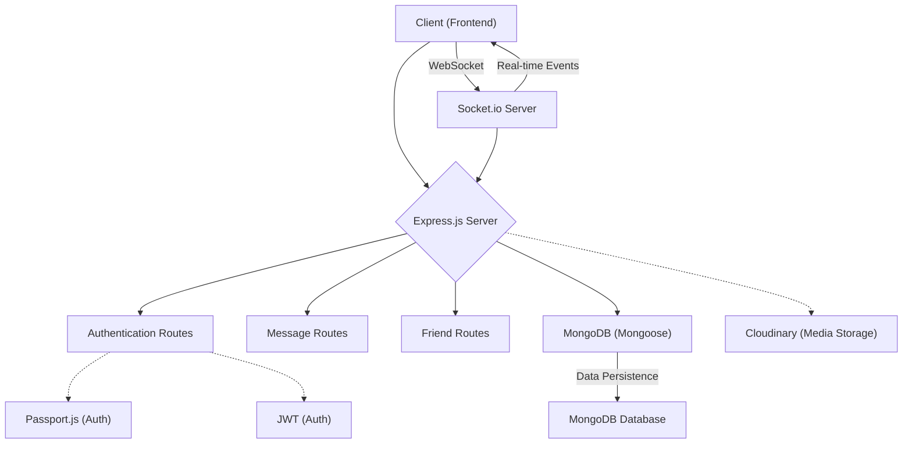
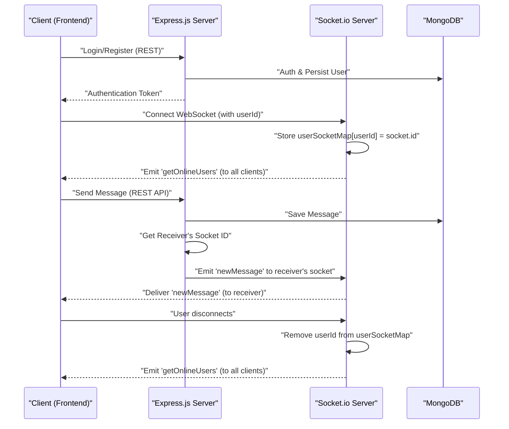

---
title: "Backend Architecture and API"
description: "Overview of the server-side structure, technology stack, and API endpoints."
sidebar_position: 2
---

# Backend Architecture and API

<TOC />

This document provides a comprehensive overview of the backend architecture, technology stack, and API endpoints for the chat application. It details the server-side components, their interactions, and the core functionalities they enable.

## System Purpose

The backend serves as the core computational and data management layer for the chat application. Its primary responsibilities include:

*   **User Management:** Handling user registration, authentication, and session management.
*   **Message Processing:** Storing, retrieving, and facilitating real-time delivery of messages between users.
*   **Friendship Management:** Enabling users to send and accept friend requests, and manage their contact lists.
*   **Real-time Communication:** Providing real-time updates for online users and message delivery using WebSockets.
*   **Data Persistence:** Managing the application's data using a MongoDB database.
*   **Static File Serving:** In production environments, serving the static assets of the frontend application.

## Architecture

The backend follows a layered architecture, primarily utilizing Express.js for RESTful API services and Socket.io for real-time, bidirectional communication. It integrates a MongoDB database for data persistence and a Cloudinary service for media storage (inferred from `cloudinary` dependency). The system is designed to handle user requests, process business logic, and manage data flow between the client and the database.

The core components and their interactions are illustrated below:





This diagram illustrates the separation of concerns: the Express.js server handles API requests and serves static content, while the Socket.io server manages real-time interactions. Both interact with the MongoDB database.

### Real-time Communication Flow

The application leverages WebSockets for real-time features such as displaying online users and instant message delivery.





This sequence diagram details how a client connects, how messages are sent via the API and then delivered in real-time via Socket.io, and how online status is maintained.

## Technology Stack

The backend is built upon a robust set of technologies, primarily within the Node.js ecosystem, providing a high-performance and scalable foundation.

| Layer / Component        | Technology           | Purpose                                                                                                 |
| :----------------------- | :------------------- | :------------------------------------------------------------------------------------------------------ |
| **Runtime Environment**  | Node.js              | JavaScript runtime for server-side execution.                                                           |
| **Web Framework**        | Express.js           | Fast, unopinionated, minimalist web framework for building RESTful APIs.                                |
| **Database**             | MongoDB              | NoSQL document database for storing application data (users, messages, etc.).                           |
| **ODM**                  | Mongoose             | Object Data Modeling (ODM) library for MongoDB, providing schema-based solutions to model application data. |
| **Real-time Engine**     | Socket.io            | Enables real-time, bidirectional, event-based communication between clients and the server.             |
| **Authentication**       | Passport.js, JWT, Bcrypt.js | Middleware for authentication strategies (e.g., Google OAuth20), JSON Web Tokens for session management, and bcrypt for password hashing. |
| **Environment Config**   | `dotenv`             | Loads environment variables from a `.env` file.                                                         |
| **CORS Management**      | `cors`               | Middleware to enable Cross-Origin Resource Sharing.                                                     |
| **Cookie Parsing**       | `cookie-parser`      | Parses `Cookie` header and populates `req.cookies`.                                                     |
| **Session Management**   | `express-session`    | Session middleware for Express.                                                                         |
| **Cloud Storage**        | `cloudinary`         | Cloud-based image and video management (inferred for user profiles, media messages).                    |
| **Development Utility**  | `nodemon`            | Automatically restarts the Node.js application when file changes are detected.                          |

The `package.json` file [View on GitHub](https://github.com/shinymack/Chat-App-MERN/blob/main/backend/package.json) details all dependencies:

```json
// backend/package.json
{
  "name": "backend",
  "version": "1.0.0",
  "main": "src/index.js",
  "scripts": {
    "dev": "nodemon src/index.js",
    "start": "node src/index.js"
  },
  "dependencies": {
    "bcryptjs": "^2.4.3",
    "cloudinary": "^2.5.1",
    "cookie-parser": "^1.4.7",
    "dotenv": "^16.4.7",
    "express": "^4.21.2",
    "express-session": "^1.18.1",
    "jsonwebtoken": "^9.0.2",
    "mongoose": "^8.9.5",
    "passport": "^0.7.0",
    "passport-google-oauth20": "^2.0.0",
    "socket.io": "^4.8.1"
  },
  "devDependencies": {
    "nodemon": "^3.1.9"
  }
}
```

This configuration highlights the MERN stack (MongoDB, Express, React, Node.js) orientation, with `mongoose` for database interaction, `express` for the API, `socket.io` for real-time, and `passport` for authentication.

## Features

The backend provides several key functionalities that underpin the chat application.

### Server Initialization and Configuration

The `index.js` file [View on GitHub](https://github.com/shinymack/Chat-App-MERN/blob/main/backend/src/index.js) is the entry point for the backend server. It sets up Express.js, configures middleware, defines API routes, and initializes the database and real-time WebSocket server.

```javascript
// backend/src/index.js#L1-L29
import express from "express";
import cors from "cors";
import authRoutes from "./routes/auth.route.js";
import messageRoutes from "./routes/message.route.js";
import friendRoutes from "./routes/friend.route.js";

import path from "path";

import dotenv from "dotenv";
import cookieParser from "cookie-parser";

import { connectDB } from "./lib/db.js";
import { app, server } from "./lib/socket.js";

import session from "express-session";
import passport from "passport";
import { configurePassport } from "./lib/passport.config.js";

const __dirname = path.resolve();
dotenv.config();

configurePassport();

app.use(cookieParser());
app.use(express.json({limit : '2mb'}));
app.use(express.urlencoded({ limit: '2mb', extended: true }));
app.use(cors({
    origin: "http://localhost:5173",
    credentials: true,
}));

app.use(session({
    secret: process.env.SESSION_SECRET,
    resave: false,
    saveUninitialized: false,
    cookie: {
        secure: process.env.NODE_ENV === "production", // true in production (HTTPS)
        httpOnly: true,
        maxAge: 7 * 24 * 60 * 60 * 1000
    }
}));
```

Key aspects of this initialization include:

*   **Middleware Setup:** `cookieParser`, `express.json`, `express.urlencoded`, and `cors` are configured to handle incoming requests, parse JSON/URL-encoded bodies, and manage cross-origin requests. The `limit` option for JSON/URL-encoded bodies prevents excessively large payloads.
*   **Session Management:** `express-session` is used to manage user sessions, particularly important for `passport.js` which relies on sessions for persistent logins after authentication. The `secure` cookie option ensures cookies are only sent over HTTPS in production, enhancing security.
*   **Passport Initialization:** `passport.initialize()` and `passport.session()` are crucial for integrating Passport.js, allowing it to manage user authentication states.
*   **Route Mounting:** Dedicated route modules (`authRoutes`, `messageRoutes`, `friendRoutes`) are mounted under `/api/auth`, `/api/messages`, and `/api/friends` respectively, organizing the API endpoints.

### Database Connection

The application connects to a MongoDB instance using Mongoose. The `connectDB` function in `db.js` [View on GitHub](https://github.com/shinymack/Chat-App-MERN/blob/main/backend/src/lib/db.js) ensures a robust connection to the database.

```javascript
// backend/src/lib/db.js#L1-L9
import mongoose from "mongoose"

export const connectDB = async () => {
  try {
    const conn = await mongoose.connect(process.env.MONGODB_URI);
    console.log(`MongoDB connected:  ${conn.connection.host}`);
  }
  catch(error){
    console.log("MongoDB connection error: ", error);
  }
}
```

This function asynchronously connects to MongoDB using the URI specified in `process.env.MONGODB_URI`. It includes basic error handling to log connection failures, which is vital for operational visibility.

### Real-time Communication with Socket.io

The `socket.js` file [View on GitHub](https://github.com/shinymack/Chat-App-MERN/blob/main/backend/src/lib/socket.js) sets up the WebSocket server using Socket.io, enabling real-time features like online user tracking and instant message delivery.

```javascript
// backend/src/lib/socket.js#L1-L29
import { Server } from "socket.io";
import http from "http";
import express from "express";

const app = express();

const server = http.createServer(app);

const io = new Server(server, {
    cors: {
        origin: ["http://localhost:5173"]
    }
})

export function getReceiverSocketId(userId) {
    return userSocketMap[userId];
}

// used to store online users
const userSocketMap = {}; //{userId : socketId}

io.on("connection", (socket) => {
    console.log("A user connected", socket.id);

    const userId = socket.handshake.query.userId;
    if(userId) userSocketMap[userId] = socket.id;

    io.emit("getOnlineUsers", Object.keys(userSocketMap));

    socket.on("disconnect", ()=>{
        console.log("A user disconnected", socket.id);
        delete userSocketMap[userId];
        io.emit("getOnlineUsers", Object.keys(userSocketMap));
    })
})

export { io, app, server };
```

This module does the following:

*   **HTTP Server Creation:** An `http` server is created using the Express `app` instance, allowing both RESTful API and WebSocket connections to run on the same port.
*   **Socket.io Server:** A `Socket.io` server is initialized, configured with CORS to allow connections from the frontend.
*   **Online User Tracking:** The `userSocketMap` object stores a mapping of `userId` to `socketId` for all currently online users. This map is crucial for targeting specific users for real-time events.
*   **Connection/Disconnection Handling:** When a user connects, their `userId` (passed via handshake query) is added to `userSocketMap`, and an updated list of online users is broadcast to all clients. Upon disconnection, the user is removed from the map, and the online list is updated again.
*   **`getReceiverSocketId`:** This utility function allows other parts of the backend (e.g., message routes) to retrieve the `socketId` of a specific user to emit real-time events directly to them.

### Static File Serving (Production)

In a production environment, the `index.js` file also handles serving the static assets of the frontend application.

```javascript
// backend/src/index.js#L54-L60
if(process.env.NODE_ENV === "production"){
    app.use(express.static(path.join(__dirname, "../frontend/dist")));

    app.get("*" , (req, res) => {
        res.sendFile(path.join(__dirname,"../frontend", "dist","index.html"));
    })
}
```

This block ensures that if `NODE_ENV` is set to "production", the server will:
*   Serve static files from the `../frontend/dist` directory.
*   For any other unspecified route (`*`), it will send the `index.html` file, allowing the frontend client-side router to handle the route. This is a common pattern for Single Page Applications (SPAs).

## Key Integration Points

The backend integrates various components to deliver a cohesive application experience.

*   **State Management:** The `userSocketMap` in `socket.js` is a critical piece of server-side state, tracking online users. This enables real-time features to efficiently target specific users or broadcast to all online clients.
*   **API Flows:** RESTful API endpoints (e.g., `/api/auth`, `/api/messages`, `/api/friends`) handle core data operations. These APIs often trigger real-time events through `socket.io`. For instance, sending a message via the `/api/messages` endpoint would involve saving the message to MongoDB and then using `getReceiverSocketId` to emit a `newMessage` event to the recipient via Socket.io.
*   **Authentication & Authorization:** Passport.js, integrated with `express-session` and likely JWT (for API token-based authentication), provides robust user authentication. It secures routes by ensuring only authenticated users can access certain resources. `bcryptjs` is used for securely hashing user passwords, a critical security best practice.
*   **Scalability Insights:** While the current `userSocketMap` stores online users in memory, for larger-scale applications with multiple backend instances, this map would need to be replaced with a distributed store (e.g., Redis) to ensure all instances have a consistent view of online users and can emit events across the cluster. The `limit` on `express.json` and `express.urlencoded` is a good practice to prevent large request payloads that could lead to denial-of-service.

Next: [Authentication and Authorization](./2.1_authentication-and-authorization.mdx)
```