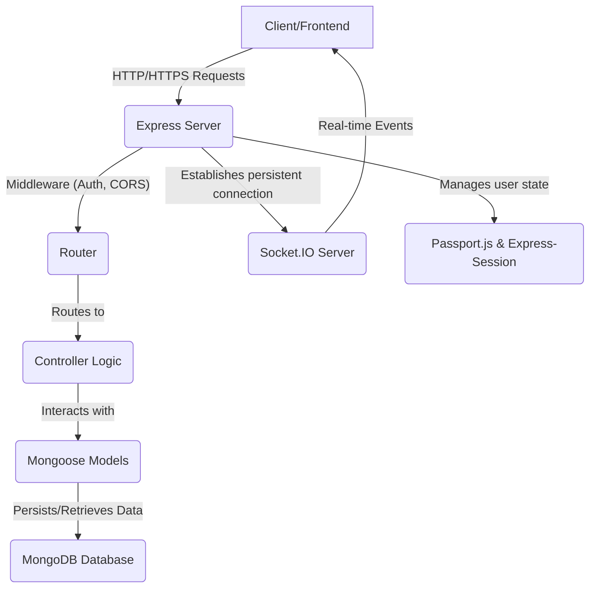
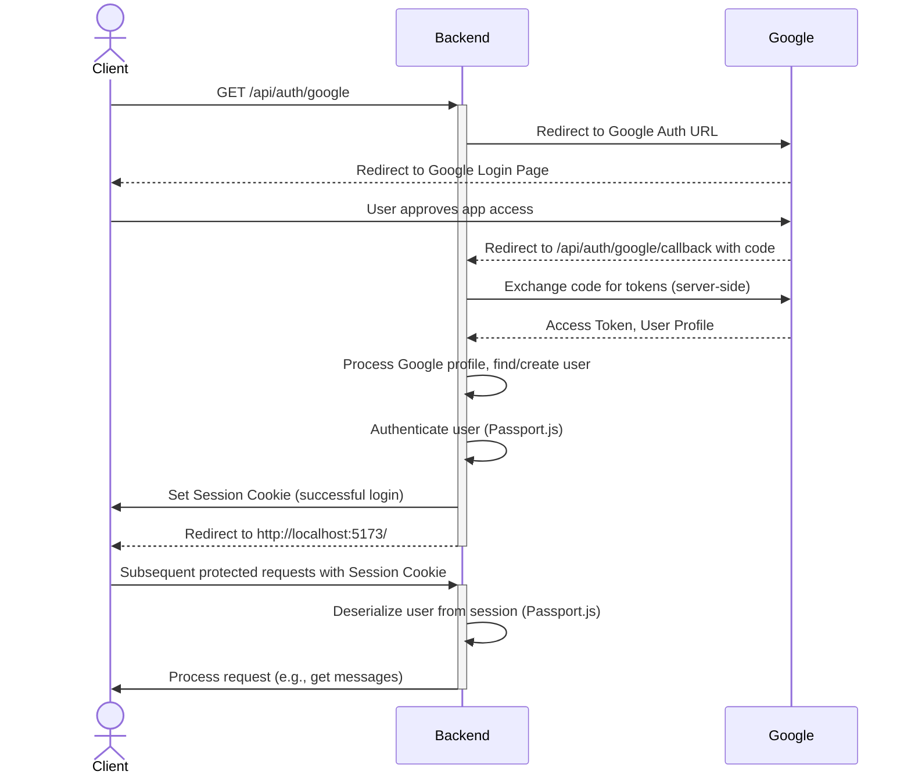

---
title: "Backend Architecture and APIs"
description: "Details the server-side structure, API endpoints, and data flow of the application."
sidebar_position: 2
---

# Backend Architecture and APIs
<TOC />

## System Purpose

The backend of this chat application is meticulously engineered to provide a robust, scalable, and secure foundation for real-time communication. Its primary responsibilities include:

*   **User Management**: Handling user registration, authentication (including Google OAuth), profile updates, and session management.
*   **Message Exchange**: Facilitating the sending, receiving, and retrieval of one-on-one messages between users.
*   **User Discovery**: Enabling users to view and interact with other available users for initiating conversations.
*   **Real-time Communication**: Utilizing WebSockets (via Socket.IO, as implied by the `socket.js` import) to provide instant message delivery and status updates.
*   **Data Persistence**: Storing user profiles, messages, and relationship data in a NoSQL database.
*   **API Provision**: Exposing a set of RESTful APIs for the frontend to interact with, ensuring a clear separation of concerns.

## Architecture

The backend adheres to a classical client-server architecture, built upon Node.js and Express.js, integrating MongoDB as its primary data store. This architecture is designed for modularity, maintainability, and scalability.

At its core, the system follows a layered approach:

1.  **Presentation Layer (Client/Frontend)**: This is handled by the React-based frontend, responsible for the user interface and interactions.
2.  **Application Layer (Backend/Server)**: The Node.js/Express server acts as the central hub, processing incoming API requests, managing authentication, orchestrating business logic, and handling real-time communication.
3.  **Data Layer (Database)**: MongoDB serves as the persistent storage for all application data, accessed through Mongoose ODM.

The interaction flow generally involves the client sending an HTTP request to the Express server, which then processes the request, interacts with the database if necessary, and sends back an appropriate response. For real-time features, the client establishes a WebSocket connection with the server, allowing for bi-directional, low-latency communication.





## Technology Stack

The backend leverages a robust set of technologies to deliver its functionalities:

| Layer/Category       | Technology      | Purpose                                                                                                                                                                                                      |
| :------------------- | :-------------- | :----------------------------------------------------------------------------------------------------------------------------------------------------------------------------------------------------------- |
| **Server Framework** | Node.js, Express.js | Provides the runtime environment for JavaScript and a fast, unopinionated web framework for building RESTful APIs.                                                                                              |
| **Database**         | MongoDB         | A NoSQL document database used for scalable data storage of users, messages, and other application data.                                                                                                       |
| **ODM**              | Mongoose        | An elegant MongoDB object modeling tool for Node.js, facilitating schema definition and interaction with the database.                                                                                        |
| **Authentication**   | Passport.js     | A flexible authentication middleware for Node.js, supporting local username/password strategies and third-party OAuth providers like Google.                                                                     |
| **Session Mgmt.**    | `express-session` | Manages user sessions, storing session data (e.g., authenticated user ID) on the server side and sending a session cookie to the client.                                                                    |
| **Real-time Comms**  | Socket.IO       | (Implied by `socket.js` import) Enables real-time, bi-directional, and event-based communication between the server and clients, crucial for chat applications.                                              |
| **Security**         | `cors`          | Middleware for enabling Cross-Origin Resource Sharing, allowing the frontend to make requests to the backend from a different domain. Configured for specific origins and credentials.                       |
| **Configuration**    | `dotenv`        | Loads environment variables from a `.env` file, keeping sensitive data and configurations separate from the codebase.                                                                                       |
| **Parsing**          | `cookie-parser`, `express.json`, `express.urlencoded` | Middleware for parsing cookies attached to client requests, and parsing JSON/URL-encoded data in request bodies, respectively.                                                  |

## Core Components

The backend is structured into several key components that work together to deliver the application's functionality.

### Server Initialization

The `index.js` file serves as the entry point for the backend application. It configures the Express server, applies essential middleware, sets up routes, connects to the database, and starts the server. It also integrates `socket.js` for potential real-time functionalities.

```javascript
// backend/src/index.js
import express from "express";
import cors from "cors";
import authRoutes from "./routes/auth.route.js";
import messageRoutes from "./routes/message.route.js";
import friendRoutes from "./routes/friend.route.js";

import path from "path";

import dotenv from "dotenv";
import cookieParser from "cookie-parser";

import { connectDB } from "./lib/db.js";
import { app, server } from "./lib/socket.js"; // Importing app and server from socket.js for Socket.IO integration

import session from "express-session";
import passport from "passport";
import { configurePassport } from "./lib/passport.config.js";

const __dirname = path.resolve();
dotenv.config();

configurePassport();

app.use(cookieParser());
app.use(express.json({limit : '2mb'})); // Parses JSON request bodies
app.use(express.urlencoded({ limit: '2mb', extended: true })); // Parses URL-encoded request bodies
app.use(cors({
    origin: "http://localhost:5173", // Restricts CORS to the frontend's origin
    credentials: true, // Allows cookies to be sent with cross-origin requests
}));

app.use(session({ // Configures session middleware
    secret: process.env.SESSION_SECRET,
    resave: false,
    saveUninitialized: false,
    cookie: {
        secure: process.env.NODE_ENV === "production",
        httpOnly: true,
        maxAge: 7 * 24 * 60 * 60 * 1000
    }
}));

app.use(passport.initialize()); // Initializes Passport.js
app.use(passport.session()); // Enables Passport.js to use Express sessions

// Define API routes
app.use("/api/auth", authRoutes );
app.use("/api/messages", messageRoutes );
app.use("/api/friends", friendRoutes);


const PORT = process.env.PORT;
if(process.env.NODE_ENV === "production"){
    app.use(express.static(path.join(__dirname, "../frontend/dist")));

    app.get("*" , (req, res) => {
        res.sendFile(path.join(__dirname,"../frontend", "dist","index.html"));
    })
}

server.listen(PORT, () => { // Starts the server (potentially the HTTP server wrapped by Socket.IO)
    console.log("server is running on PORT: " + String(PORT));
    connectDB(); // Connects to MongoDB
});
```
[View on GitHub](https://github.com/shinymack/Chat-App-MERN/blob/main/backend/src/index.js#L1-L61)

This snippet illustrates the comprehensive setup of the Express server. It demonstrates the use of various middleware for parsing request bodies, handling CORS, managing sessions, and integrating Passport.js for authentication. Notably, the application serves static frontend assets in production and catches all other routes to serve the `index.html` file, enabling client-side routing. The `connectDB()` call ensures that the database connection is established when the server starts.

### Database Management

The `db.js` file handles the connection to the MongoDB database using Mongoose. This module encapsulates the database connection logic, making it reusable and centralized.

```javascript
// backend/src/lib/db.js
import mongoose from "mongoose"

export const connectDB = async () => {
  try {
    const conn = await mongoose.connect(process.env.MONGODB_URI);
    console.log(`MongoDB connected:  ${conn.connection.host}`);
  }
  catch(error){
    console.log("MongoDB connection error: ", error);
  }
}
```
[View on GitHub](https://github.com/shinymack/Chat-App-MERN/blob/main/backend/src/lib/db.js#L1-L10)

The `connectDB` function attempts to establish a connection to MongoDB using the URI specified in `process.env.MONGODB_URI`. Upon successful connection, it logs the host; otherwise, it logs the error, which is critical for debugging connection issues.

### Authentication Routes

The `auth.route.js` file defines all API endpoints related to user authentication and profile management. It utilizes Passport.js for both local and Google OAuth strategies and includes a `protectRoute` middleware for securing sensitive endpoints.

```javascript
// backend/src/routes/auth.route.js
import express from "express"
import passport from 'passport';
import { login, logout, signup, updateProfile, checkAuth, googleAuthCallback, checkUsernameAvailability} from  "../controllers/auth.controller.js"
import { protectRoute } from "../middleware/auth.middleware.js"
const router = express.Router();

router.post("/signup", signup); // User registration

router.post("/login", login); // User login with username/password

router.post("/logout", logout); // User logout

router.put("/update-profile", protectRoute ,updateProfile) // Update user profile, requires authentication

router.get("/username/check/:username", protectRoute, checkUsernameAvailability); // Check username availability, requires authentication

router.get("/check", protectRoute, checkAuth) // Check if user is authenticated

router.get( // Initiates Google OAuth flow
    '/google',
    passport.authenticate('google', { scope: ['profile', 'email'] })
);
router.get( // Google OAuth callback
    '/google/callback',
    passport.authenticate('google', {
        // successRedirect: 'http://localhost:5173/',
        failureRedirect: 'http://localhost:5173/login',
        failureMessage: true
    }),
    googleAuthCallback
);
export default router;
```
[View on GitHub](https://github.com/shinymack/Chat-App-MERN/blob/main/backend/src/routes/auth.route.js#L1-L32)

This snippet showcases the robust authentication system. It includes routes for standard `signup`, `login`, and `logout` operations, along with secure routes for `updateProfile` and `checkAuth` that are protected by the `protectRoute` middleware. The integration of Google OAuth, managed by Passport.js, provides an alternative and convenient authentication method. The `googleAuthCallback` handles the final redirect after Google's authentication process.

### Message and User Routes

The `message.route.js` file defines API endpoints for message exchange and fetching user lists for the chat sidebar. All these routes are protected, ensuring that only authenticated users can access messaging functionalities.

```javascript
// backend/src/routes/message.route.js
import express from "express"
import { protectRoute } from "../middleware/auth.middleware.js";
import { getUsersForSidebar, getMessages, sendMessage } from "../controllers/message.controller.js";
const router = express.Router();

router.get("/users", protectRoute, getUsersForSidebar); // Get list of users for the chat sidebar

router.get("/:id", protectRoute, getMessages); // Get messages for a specific conversation ID

router.post("/send/:id", protectRoute, sendMessage); // Send a message to a specific user ID

export default router;
```
[View on GitHub](https://github.com/shinymack/Chat-App-MERN/blob/main/backend/src/routes/message.route.js#L1-L12)

This module defines the core chat functionalities. `getUsersForSidebar` provides the list of users available for chat, `getMessages` retrieves the conversation history with a specific user, and `sendMessage` handles the submission of new messages. The `protectRoute` middleware is applied to all these routes, enforcing authentication before allowing access.

## API Endpoints

The backend exposes a comprehensive set of RESTful API endpoints, categorized by their domain:

| Prefix          | Endpoint                                   | Method | Description                                                                                             | Required Auth |
| :-------------- | :----------------------------------------- | :----- | :------------------------------------------------------------------------------------------------------ | :------------ |
| `/api/auth`     | `/signup`                                  | `POST` | Registers a new user with provided credentials.                                                         | No            |
|                 | `/login`                                   | `POST` | Authenticates a user and establishes a session.                                                         | No            |
|                 | `/logout`                                  | `POST` | Terminates the current user session.                                                                    | Yes           |
|                 | `/update-profile`                          | `PUT`  | Updates the authenticated user's profile information.                                                   | Yes           |
|                 | `/username/check/:username`                | `GET`  | Checks the availability of a given username.                                                            | Yes           |
|                 | `/check`                                   | `GET`  | Verifies if the current user is authenticated.                                                          | Yes           |
|                 | `/google`                                  | `GET`  | Initiates the Google OAuth authentication flow.                                                         | No            |
|                 | `/google/callback`                         | `GET`  | Callback URL for Google OAuth, handling successful authentication or redirecting on failure.            | No            |
| `/api/messages` | `/users`                                   | `GET`  | Retrieves a list of users to display in the chat sidebar.                                               | Yes           |
|                 | `/:id`                                     | `GET`  | Fetches messages for a conversation with the user specified by `:id`.                                   | Yes           |
|                 | `/send/:id`                                | `POST` | Sends a new message to the user specified by `:id`.                                                     | Yes           |
| `/api/friends`  | *(Routes for friend management are implied but not detailed in provided files)* |        | Potentially includes endpoints for adding, removing, or managing friend relationships.                  | Yes           |

## Key Integration Points

The backend architecture features several critical integration points that ensure seamless operation and data flow:

*   **Authentication Flow**: The combination of `express-session` and `passport.js` (configured in `passport.config.js` and utilized in `auth.route.js`) is central to managing user identity. When a user logs in (either locally or via Google OAuth), Passport.js serializes the user into the session, which is then stored in a cookie. Subsequent requests from the authenticated client will include this cookie, allowing `passport.session()` to deserialize the user and make their information available via `req.user`. This integration underpins the security of all protected routes.





*   **Database Interaction**: Mongoose acts as the bridge between Express controllers and MongoDB. Controllers (e.g., in `auth.controller.js`, `message.controller.js`) interact with Mongoose models, abstracting away the complexities of direct database operations. The `connectDB` function ensures that this connection is ready before the server starts accepting requests.
*   **Real-time Communication**: While the `socket.js` file is not provided, its import into `index.js` and the use of `app, server` suggests a strong integration with Socket.IO. This would mean that the HTTP server instance (`server`) is also used by Socket.IO, allowing the application to seamlessly switch between HTTP requests and WebSocket connections. This is crucial for instantly broadcasting new messages or user status updates without constant polling.
*   **Middleware Chaining**: The sequential application of middleware in `index.js` (e.g., `cookieParser`, `express.json`, `cors`, `session`, `passport.initialize`, `passport.session`, `protectRoute` on routes) demonstrates how requests are processed through a pipeline. Each middleware performs a specific task, transforming the request or adding data to `req` and `res` objects before passing control to the next. This modular approach enhances code organization and reusability.

**Scalability Considerations:**
For a chat application, scalability is paramount. The current architecture provides a solid foundation:
*   **Stateless API (mostly)**: While sessions are used, the core API logic aims to be stateless between requests for easier horizontal scaling. Session data could eventually be moved to an external store (e.g., Redis) to support multiple backend instances.
*   **MongoDB**: Its flexible schema and distributed nature allow for scaling by sharding and replication.
*   **Socket.IO**: For larger deployments, Socket.IO can be configured with adapters (e.g., `socket.io-redis`) to allow multiple Socket.IO servers to communicate and share state, enabling real-time features to scale horizontally.

Next: [Authentication and Authorization](./2.1_authentication-and-authorization.mdx)
```