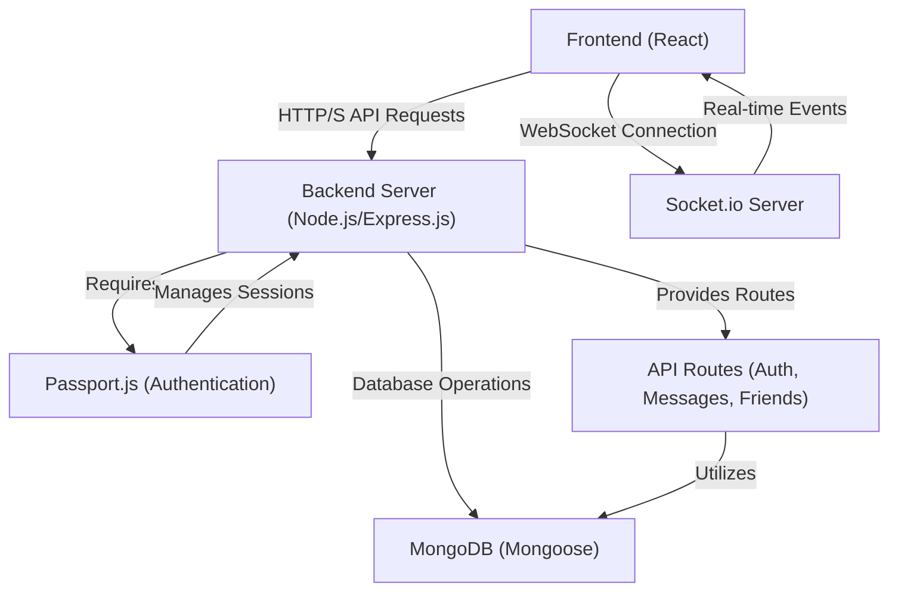

# Backend Architecture and APIs

<TOC />

This section provides an in-depth look at the backend architecture, outlining the core services, their interactions, and the exposed API endpoints. The backend is built on a robust Node.js and Express.js foundation, leveraging MongoDB for data persistence and Socket.io for real-time communication.

## Core Technologies and Structure

The backend is structured to provide a scalable and maintainable foundation for the chat application. It's built upon the following key technologies and architectural patterns:

*   **Node.js**: JavaScript runtime environment for server-side execution.
*   **Express.js**: A fast, unopinionated, minimalist web framework for Node.js, forming the backbone of our RESTful API.
*   **MongoDB**: A NoSQL document database used for storing application data such as users, messages, and friend relationships.
*   **Mongoose**: An object data modeling (ODM) library for MongoDB and Node.js, providing schema-based solutions to model application data.
*   **Passport.js**: Authentication middleware for Node.js, supporting various authentication strategies including local (username/password) and OAuth (Google).
*   **Socket.io**: A library that enables real-time, bidirectional, event-based communication between the server and clients, used for instant message delivery and online status updates.
*   **CORS**: Middleware to enable Cross-Origin Resource Sharing, allowing the frontend (on a different origin during development) to communicate with the backend.
*   **Cookie-Parser**: Middleware to parse cookies attached to the client request object.
*   **Express-Session**: Middleware for managing user sessions, essential for Passport.js authentication.

### High-Level Architecture

The following diagram illustrates the high-level architecture of the backend, showing how different components interact to serve the application's needs.





## Entry Point: `index.js`

The `backend/src/index.js` file serves as the main entry point for the backend server. It initializes the Express application, configures middleware, defines API routes, and starts the server. It also integrates Socket.io for real-time functionality and Passport.js for authentication management.

Key functionalities handled in `index.js` include:

*   **Middleware Setup**: Configuration of `express.json()`, `express.urlencoded()`, `cors`, `cookieParser`, `express-session`, and Passport.js.
*   **Route Handling**: Mounting of various API route modules (`authRoutes`, `messageRoutes`, `friendRoutes`).
*   **Database Connection**: Invoking `connectDB` to establish a connection to MongoDB.
*   **Server Initialization**: Starting the Express server and the Socket.io server on a specified port.
*   **Production Build Handling**: Serving the static frontend assets when the application is in production mode.

Below is a snippet showcasing the middleware configuration and route setup:

```javascript
// backend/src/index.js
import express from "express";
import cors from "cors";
import authRoutes from "./routes/auth.route.js";
import messageRoutes from "./routes/message.route.js";
import friendRoutes from "./routes/friend.route.js";
// ... other imports

const __dirname = path.resolve();
dotenv.config();

configurePassport();

app.use(cookieParser());
app.use(express.json({limit : '2mb'}));
app.use(express.urlencoded({ limit: '2mb', extended: true }));
app.use(cors({
    origin: "http://localhost:5173", // Frontend origin
    credentials: true,
}));

app.use(session({
    secret: process.env.SESSION_SECRET,
    resave: false,
    saveUninitialized: false,
    cookie: {
        secure: process.env.NODE_ENV === "production",
        httpOnly: true,
        maxAge: 7 * 24 * 60 * 60 * 1000
    }
}));

app.use(passport.initialize());
app.use(passport.session());

app.use("/api/auth", authRoutes );
app.use("/api/messages", messageRoutes );
app.use("/api/friends", friendRoutes);

// ... server listening logic
```
[View on GitHub](https://github.com/shinymack/Chat-App-MERN/blob/main/backend/src/index.js#L26-L65)

## Database Connection: `db.js`

The `backend/src/lib/db.js` file encapsulates the logic for connecting to the MongoDB database using Mongoose. It exports a single asynchronous function, `connectDB`, which attempts to establish a connection and logs its status.

```javascript
// backend/src/lib/db.js
import mongoose from "mongoose"

export const connectDB = async () => {
  try {
    const conn = await mongoose.connect(process.env.MONGODB_URI);
    console.log(`MongoDB connected:  ${conn.connection.host}`);
  }
  catch(error){
    console.log("MongoDB connection error: ", error);
  }
}
```
[View on GitHub](https://github.com/shinymack/Chat-App-MERN/blob/main/backend/src/lib/db.js)

This modular approach ensures that database connection logic is isolated and reusable. The `MONGODB_URI` is securely managed via environment variables.

## API Endpoints

The backend exposes several API endpoints categorized by their functionality. All API routes are prefixed with `/api`.

### Authentication Routes (`/api/auth`)

These routes handle user authentication, registration, session management, and profile updates. They leverage Passport.js for both local and Google OAuth strategies.

| Endpoint                                    | Method | Description                                                | Authentication | Middleware                                |
| :------------------------------------------ | :----- | :--------------------------------------------------------- | :------------- | :---------------------------------------- |
| `/api/auth/signup`                          | `POST` | Registers a new user.                                      | No             | None                                      |
| `/api/auth/login`                           | `POST` | Authenticates a user and establishes a session.            | No             | None                                      |
| `/api/auth/logout`                          | `POST` | Logs out the current user and destroys the session.        | Yes            | None (handled by Passport)                |
| `/api/auth/update-profile`                  | `PUT`  | Updates the authenticated user's profile.                  | Yes            | `protectRoute`                            |
| `/api/auth/username/check/:username`        | `GET`  | Checks if a username is available.                         | Yes            | `protectRoute`                            |
| `/api/auth/check`                           | `GET`  | Checks if a user is currently authenticated.               | Yes            | `protectRoute`                            |
| `/api/auth/google`                          | `GET`  | Initiates Google OAuth authentication flow.                | No             | `passport.authenticate('google', ...)`    |
| `/api/auth/google/callback`                 | `GET`  | Callback endpoint for Google OAuth, handles success/failure. | No             | `passport.authenticate('google', ...)`    |

```javascript
// backend/src/routes/auth.route.js
import express from "express"
import passport from 'passport';
import { login, logout, signup, updateProfile, checkAuth, googleAuthCallback, checkUsernameAvailability} from  "../controllers/auth.controller.js"
import { protectRoute } from "../middleware/auth.middleware.js"
const router = express.Router();

router.post("/signup", signup);
router.post("/login", login);
router.post("/logout", logout);
router.put("/update-profile", protectRoute ,updateProfile)
router.get("/username/check/:username", protectRoute, checkUsernameAvailability);
router.get("/check", protectRoute, checkAuth)
router.get(
    '/google',
    passport.authenticate('google', { scope: ['profile', 'email'] })
);
router.get(
    '/google/callback',
    passport.authenticate('google', {
        failureRedirect: 'http://localhost:5173/login',
        failureMessage: true
    }),
    googleAuthCallback
);
export default router;
```
[View on GitHub](https://github.com/shinymack/Chat-App-MERN/blob/main/backend/src/routes/auth.route.js)

### Messaging Routes (`/api/messages`)

These routes facilitate message exchange and retrieval between users. All message-related operations require user authentication.

| Endpoint                  | Method | Description                                                 | Authentication | Middleware     |
| :------------------------ | :----- | :---------------------------------------------------------- | :------------- | :------------- |
| `/api/messages/users`     | `GET`  | Retrieves a list of users suitable for a chat sidebar.      | Yes            | `protectRoute` |
| `/api/messages/:id`       | `GET`  | Retrieves messages exchanged with a specific user (`id`).   | Yes            | `protectRoute` |
| `/api/messages/send/:id`  | `POST` | Sends a new message to a specific user (`id`).              | Yes            | `protectRoute` |

```javascript
// backend/src/routes/message.route.js
import express from "express"
import { protectRoute } from "../middleware/auth.middleware.js";
import { getUsersForSidebar, getMessages, sendMessage } from "../controllers/message.controller.js";
const router = express.Router();

router.get("/users", protectRoute, getUsersForSidebar);
router.get("/:id", protectRoute, getMessages);
router.post("/send/:id", protectRoute, sendMessage);

export default router;
```
[View on GitHub](https://github.com/shinymack/Chat-App-MERN/blob/main/backend/src/routes/message.route.js)

### Friend Routes (`/api/friends`)

While not detailed in the provided content snippets, the presence of `friendRoutes` in `index.js` suggests an additional set of routes for managing friend relationships (e.g., adding, removing, listing friends). These routes would also typically be protected by authentication middleware.

## Key Integration Points

### Authentication Flow with Passport.js

The backend employs Passport.js for flexible and secure authentication.

1.  **Session Management**: `express-session` is used to create and manage user sessions.
2.  **Passport Initialization**: `passport.initialize()` and `passport.session()` middleware integrate Passport.js into the Express app.
3.  **Strategies**:
    *   **Local Strategy**: For username/password-based login.
    *   **Google OAuth Strategy**: For authentication via Google accounts.
4.  **Serialization/Deserialization**: Passport serializes the user object into the session (storing only the user ID) and deserializes it on subsequent requests to retrieve the full user object, attaching it to `req.user`.


```mermaid
sequenceDiagram
    participant C as "Client (Frontend)"
    participant ES as "Express Server"
    participant P as "Passport.js"
    participant DB as "MongoDB"

    C->>+ES: "POST /api/auth/login {username, password}"
    ES->>+P: "Authenticate Request (Local Strategy)"
    P->>DB: "Verify User Credentials"
    DB-->>P: "User Found/Not Found"
    alt Authentication Success
        P->>P: "Serialize User (Store user ID in session)"
        P-->>-ES: "Authentication Successful"
        ES->>C: "Set Session Cookie, 200 OK"
        C->>+ES: "Subsequent API Request (with Cookie)"
        ES->>+P: "Deserialize User (Read user ID from cookie)"
        P->>DB: "Retrieve User by ID"
        DB-->>P: "User Object"
        P-->>-ES: "User Object (attached to req.user)"
        ES->>C: "Process Request (req.user available)"
    else Authentication Failure
        P-->>-ES: "Authentication Failed"
        ES->>C: "401 Unauthorized"
    end
```


### Real-time Messaging with Socket.io

The integration of Socket.io enables real-time features like instant message delivery without requiring the client to constantly poll the server. When a message is sent via the `/api/messages/send/:id` endpoint, the server can immediately emit a Socket.io event to the recipient, ensuring a fluid chat experience. The `socket.js` file (not shown but referenced in `index.js`) would manage the Socket.io server instance and connections.

### `protectRoute` Middleware

The `protectRoute` middleware is crucial for securing API endpoints that require an authenticated user. It checks for the presence of a valid session and an authenticated user (`req.user`). If the user is not authenticated, it sends a `401 Unauthorized` response. This prevents unauthenticated access to sensitive resources and operations.

```javascript
// backend/src/middleware/auth.middleware.js (conceptual)
export const protectRoute = (req, res, next) => {
    if (!req.isAuthenticated()) { // Passport.js method to check auth status
        return res.status(401).json({ error: "Unauthorized - No User" });
    }
    next(); // User is authenticated, proceed to the next middleware/controller
};
```
[View on GitHub](https://github.com/shinymack/Chat-App-MERN/blob/main/backend/src/middleware/auth.middleware.js)

### Environment Variables

Sensitive information like database connection strings (`MONGODB_URI`), session secrets (`SESSION_SECRET`), and port numbers (`PORT`) are managed through environment variables using `dotenv`. This is a best practice for security and allows easy configuration changes across different deployment environments.

---

Next: [Authentication and User Management](./2.1_authentication-and-user-management.mdx)