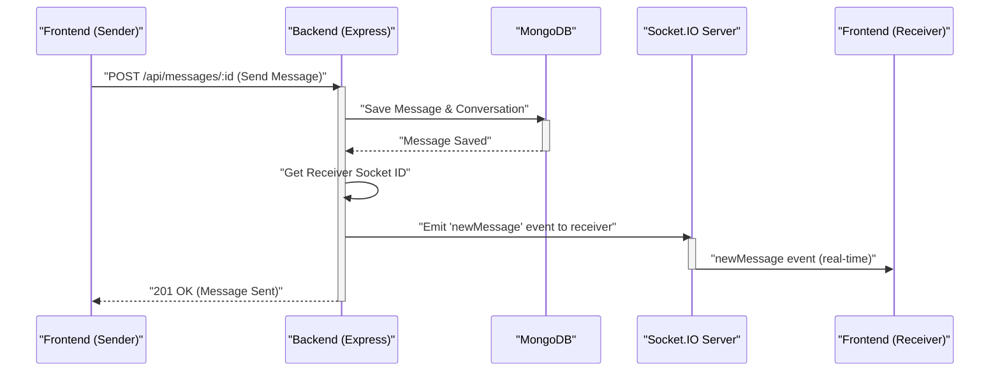

# Backend Architecture and APIs

<TOC />

This document provides a comprehensive overview of the backend architecture, encompassing its core structure, database integration, API endpoint design, and server-side logic. The backend acts as the central hub, processing requests from the frontend, interacting with the database, and managing real-time communication via WebSockets.

## Core Technologies and Dependencies

The backend is built primarily with Node.js and the Express.js framework, leveraging a robust set of libraries for various functionalities. The `backend/package.json` file details all the dependencies, giving insight into the technology stack.

```json
// backend/package.json
{
  "name": "backend",
  "version": "1.0.0",
  "main": "src/index.js",
  "scripts": {
    "dev": "nodemon src/index.js",
    "start": "node src/index.js"
  },
  "dependencies": {
    "bcryptjs": "^2.4.3",
    "cloudinary": "^2.5.1",
    "cookie-parser": "^1.4.7",
    "dotenv": "^16.4.7",
    "express": "^4.21.2",
    "express-session": "^1.18.1",
    "jsonwebtoken": "^9.0.2",
    "mongoose": "^8.9.5",
    "passport": "^0.7.0",
    "passport-google-oauth20": "^2.0.0",
    "socket.io": "^4.8.1"
  },
  "devDependencies": {
    "nodemon": "^3.1.9"
  }
}
```
[View on GitHub](https://github.com/shinymack/Chat-App-MERN/blob/main/backend/package.json)

Key dependencies include:
*   **Express.js**: The core web framework for handling HTTP requests and routing.
*   **Mongoose**: An ODM (Object Data Modeling) library for MongoDB, simplifying database interactions.
*   **Socket.IO**: Enables real-time, bidirectional, event-based communication between client and server, crucial for chat applications.
*   **bcryptjs**: For hashing passwords securely.
*   **jsonwebtoken**: For implementing JSON Web Token (JWT) based authentication.
*   **cookie-parser**: Parses cookies attached to the client request object.
*   **dotenv**: Loads environment variables from a `.env` file.
*   **express-session & passport**: Used together for session-based authentication, including Google OAuth 2.0 integration.
*   **cloudinary**: For cloud-based image and video management (though not explicitly shown in the provided code, its presence suggests media handling capabilities).

## Server Entry Point and Middleware

The `backend/src/index.js` file serves as the main entry point for the backend application. It initializes the Express app, configures middleware, defines API routes, and starts the server.

### Application Initialization and Middleware Configuration

The server sets up various middleware to handle different aspects of incoming requests. This includes CORS for cross-origin resource sharing, JSON and URL-encoded body parsing, cookie parsing, and robust session management coupled with Passport.js for authentication.

```javascript
// backend/src/index.js (snippet)
app.use(cookieParser());
app.use(express.json({limit : '2mb'}));
app.use(express.urlencoded({ limit: '2mb', extended: true }));
app.use(cors({
    origin: "http://localhost:5173",
    credentials: true,
}));

app.use(session({
    secret: process.env.SESSION_SECRET, 
    resave: false,
    saveUninitialized: false, 
    cookie: {
        secure: process.env.NODE_ENV === "production", // true in production (HTTPS)
        httpOnly: true,
        maxAge: 7 * 24 * 60 * 60 * 1000 
    }
}));

app.use(passport.initialize());
app.use(passport.session());  
```
[View on GitHub](https://github.com/shinymack/Chat-App-MERN/blob/main/backend/src/index.js#L23-L41)

*   **`cookieParser()`**: Parses incoming request cookies, making them available via `req.cookies`.
*   **`express.json()` and `express.urlencoded()`**: Parse incoming JSON and URL-encoded data, respectively, making them available on `req.body`. A limit of '2mb' is set for handling potentially larger payloads, such as image uploads.
*   **`cors()`**: Configures Cross-Origin Resource Sharing. In development, it allows requests from `http://localhost:5173` (the frontend). `credentials: true` is crucial for sending cookies across origins.
*   **`express-session`**: Manages user sessions. It creates a session for each user and stores session data on the server, associating it with a session ID stored in a cookie on the client. The `secret` is used to sign the session ID cookie.
*   **`passport.initialize()` and `passport.session()`**: Initialize Passport.js for authentication. `passport.session()` is essential when using session-based authentication, as it restores the user's login state from the session.

### API Route Definitions

The application organizes its API endpoints into distinct route modules for better maintainability and modularity. These routes handle various functionalities such as user authentication, message exchange, and friend management.

```javascript
// backend/src/index.js (snippet)
app.use("/api/auth", authRoutes );
app.use("/api/messages", messageRoutes );
app.use("/api/friends", friendRoutes);
```
[View on GitHub](https://github.com/shinymack/Chat-App-MERN/blob/main/backend/src/index.js#L43-L45)

*   **`/api/auth`**: Handles all authentication-related endpoints (e.g., `/login`, `/signup`, `/logout`, `/google`).
*   **`/api/messages`**: Manages message-related operations (e.g., sending, retrieving messages).
*   **`/api/friends`**: Deals with friend requests and contact management.

### Server Startup and Database Connection

The server listens for incoming connections on a specified port and initiates the database connection once it's ready. In a production environment, it also serves the static frontend assets.

```javascript
// backend/src/index.js (snippet)
server.listen(PORT, () => {
    console.log("server is running on PORT: " + String(PORT));
    connectDB();
});
```
[View on GitHub](https://github.com/shinymack/Chat-App-MERN/blob/main/backend/src/index.js#L54-L57)

This snippet demonstrates the server starting up and calling `connectDB()` to establish a connection to MongoDB, ensuring the application has database access.

## Database Integration (MongoDB)

The backend utilizes MongoDB as its primary data store, managed through Mongoose. The `backend/src/lib/db.js` file contains the logic for establishing and managing the database connection.

```javascript
// backend/src/lib/db.js
import mongoose from "mongoose"

export const connectDB = async () => {
  try {
    const conn = await mongoose.connect(process.env.MONGODB_URI);
    console.log(`MongoDB connected:  ${conn.connection.host}`);
  }
  catch(error){
    console.log("MongoDB connection error: ", error);
  }
}
```
[View on GitHub](https://github.com/shinymack/Chat-App-MERN/blob/main/backend/src/lib/db.js)

The `connectDB` function uses `mongoose.connect()` to connect to the MongoDB instance specified by `process.env.MONGODB_URI`. This ensures a robust and asynchronous connection to the database. Error handling is included to gracefully manage connection failures.

## Real-time Communication with Socket.IO

Real-time chat functionality is powered by Socket.IO, configured in `backend/src/lib/socket.js`. This module integrates Socket.IO with the existing Express server, allowing for real-time event exchange between connected clients and the server.

```javascript
// backend/src/lib/socket.js (snippet)
import { Server } from "socket.io";
import http from "http";
import express from "express";

const app = express();
const server = http.createServer(app);
const io = new Server(server, {
    cors: {
        origin: ["http://localhost:5173"]
    }
})

// used to store online users
const userSocketMap = {}; //{userId : socketId}

io.on("connection", (socket) => {
    console.log("A user connected", socket.id);

    const userId = socket.handshake.query.userId;
    if(userId) userSocketMap[userId] = socket.id;

    io.emit("getOnlineUsers", Object.keys(userSocketMap));

    socket.on("disconnect", ()=>{
        console.log("A user disconnected", socket.id);
        delete userSocketMap[userId]; 
        io.emit("getOnlineUsers", Object.keys(userSocketMap));
    })
})

export { io, app, server };
```
[View on GitHub](https://github.com/shinymack/Chat-App-MERN/blob/main/backend/src/lib/socket.js)

*   A new `http` server is created using the Express `app`, and `Socket.IO` is initialized on this server.
*   CORS is configured specifically for Socket.IO to allow connections from the frontend.
*   `userSocketMap` keeps track of online users by mapping `userId` to `socketId`.
*   On `connection`, a user's `userId` (passed via handshake query) is mapped to their `socket.id`. The server then emits a `getOnlineUsers` event to all connected clients, updating the list of online users.
*   On `disconnect`, the user is removed from `userSocketMap`, and the `getOnlineUsers` event is re-emitted to reflect the change.
*   The `io`, `app`, and `server` instances are exported, allowing `index.js` to start the combined HTTP/Socket.IO server.
*   The `getReceiverSocketId` function allows other parts of the backend (e.g., message routes) to retrieve a specific user's socket ID to send targeted messages.

## Backend Architecture Overview

The backend architecture facilitates a clear separation of concerns, managing API endpoints, database interactions, and real-time communication.


```mermaid
graph TD
    A["Frontend (React)"] -->|HTTP API Calls| B["Backend (Node.js/Express)"]
    A -->|WebSocket Connection (Socket.IO)| D["Socket.IO Server"]
    B -->|Mongoose ODM Queries| C["MongoDB Database"]
    D -- "Real-time Events" --> A
    B -- "Authentication & Authorization" --> A
    B -- "Session & Passport.js" --> B
```


## Real-time Messaging Flow

When a user sends a message, the backend handles both the persistent storage of the message in the database and the real-time delivery to the recipient(s) via Socket.IO.





## Key Integration Points

The backend integrates several core components to deliver its functionality:

*   **Express.js and Socket.IO Coexistence**: The `http` server created in `backend/src/lib/socket.js` wraps the Express `app`, allowing both traditional HTTP requests and WebSocket connections to be served from the same port. This unified server architecture simplifies deployment and network configuration.
*   **Authentication and Session Management**: `express-session` and `passport.js` work in tandem to provide robust authentication. User authentication state is maintained across requests via server-side sessions, with a session ID cookie sent to the client. This allows secure access to protected routes.
*   **Database Abstraction**: Mongoose provides an elegant ODM layer over MongoDB, allowing developers to interact with the database using JavaScript objects and schema definitions, abstracting away raw MongoDB commands.
*   **Real-time Event Broadcasting**: The `socket.io` instance, `io`, is used to broadcast events (like `getOnlineUsers` or `newMessage`) to specific users or all connected clients. The `userSocketMap` is critical for targeted communication, allowing the server to directly send messages to an intended recipient without needing to poll.
*   **Environment Configuration**: The use of `dotenv` ensures that sensitive information like `MONGODB_URI`, `SESSION_SECRET`, and API keys are loaded from environment variables, enhancing security and allowing for easy configuration across different deployment environments.
*   **Production Deployment Strategy**: The `index.js` includes logic to serve static files from the `frontend/dist` directory in a production environment. This allows the single backend server to also host the compiled frontend application, simplifying deployment.

The architecture is designed to be scalable and maintainable, with a clear division of responsibilities among different modules and technologies. This setup forms a solid foundation for a real-time chat application, capable of handling diverse user interactions and data flows.

Next: [Authentication and Authorization](./2.1_authentication-and-authorization.mdx)