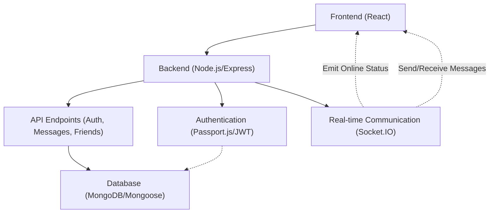
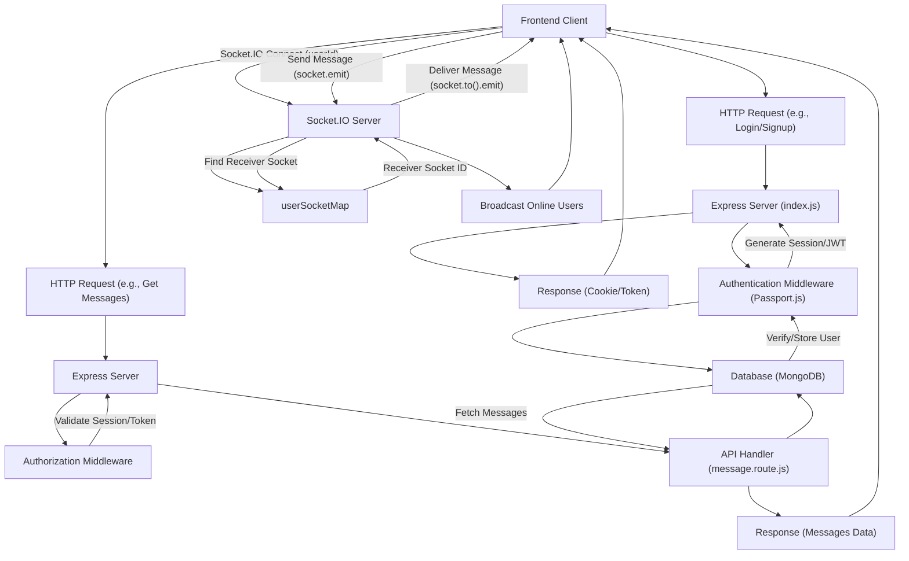

---
title: "Backend Architecture and APIs"
description: "Details the server-side structure, database interaction, authentication, and API endpoints."
sidebar_position: 2
---

# Backend Architecture and APIs

<TOC />

This section provides an in-depth look into the backend architecture of the chat application, covering its core components, API structure, database interactions, and real-time communication mechanisms. The backend is built using Node.js with the Express framework, leveraging MongoDB for data storage and Socket.IO for real-time messaging.

## Core Technologies and Dependencies

The backend is engineered to provide a robust and scalable foundation for the chat application. Key technologies and dependencies are managed via `package.json`, outlining the project's technical stack.

### Key Dependencies

The `package.json` file reveals the core libraries used to build the backend. These include:

*   **Express:** The web application framework for handling routes and middleware.
*   **Mongoose:** An ODM (Object Data Modeling) library for MongoDB, simplifying database interactions.
*   **Socket.IO:** Enables real-time, bidirectional, event-based communication between client and server.
*   **bcryptjs:** Used for hashing passwords to ensure secure authentication.
*   **jsonwebtoken:** For implementing JWT-based authentication for secure API access.
*   **cookie-parser:** Parses cookies attached to the client request object.
*   **dotenv:** Loads environment variables from a `.env` file.
*   **express-session & passport-google-oauth20:** Essential for managing user sessions and integrating Google OAuth2.0.
*   **cloudinary:** For cloud-based image and video management, likely used for user avatars or media sharing.

Here’s a snippet from `backend/package.json` showcasing the primary dependencies:

```json
{
  "name": "backend",
  "version": "1.0.0",
  "main": "src/index.js",
  "scripts": {
    "dev": "nodemon src/index.js",
    "start": "node src/index.js"
  },
  "author": "",
  "type": "module",
  "license": "ISC",
  "description": "",
  "dependencies": {
    "bcryptjs": "^2.4.3",
    "cloudinary": "^2.5.1",
    "cookie-parser": "^1.4.7",
    "dotenv": "^16.4.7",
    "express": "^4.21.2",
    "express-session": "^1.18.1",
    "jsonwebtoken": "^9.0.2",
    "mongoose": "^8.9.5",
    "passport": "^0.7.0",
    "passport-google-oauth20": "^2.0.0",
    "socket.io": "^4.8.1"
  },
  "devDependencies": {
    "nodemon": "^3.1.9"
  }
}
```
[View on GitHub](https://github.com/shinymack/Chat-App-MERN/blob/main/backend/package.json)

## Server Initialization and Configuration

The `backend/src/index.js` file is the entry point for the backend application, responsible for setting up the Express server, middleware, routes, and initiating database and Socket.IO connections.

### Main Server Setup

The server uses `express` to handle HTTP requests, `cors` for cross-origin resource sharing, `cookie-parser` for handling cookies, and `express-session` with `passport` for authentication. It also connects to a MongoDB database via `mongoose` and integrates `socket.io` for real-time features.

```javascript
// backend/src/index.js
import express from "express";
import cors from "cors";
import authRoutes from "./routes/auth.route.js";
import messageRoutes from "./routes/message.route.js";
import friendRoutes from "./routes/friend.route.js";
import path from "path";
import dotenv from "dotenv";
import cookieParser from "cookie-parser";
import { connectDB } from "./lib/db.js";
import { app, server } from "./lib/socket.js"; // Using 'app' and 'server' from socket.js
import session from "express-session";
import passport from "passport";
import { configurePassport } from "./lib/passport.config.js";

const __dirname = path.resolve();
dotenv.config();

configurePassport(); // Configure Passport.js strategies

app.use(cookieParser());
app.use(express.json({limit : '2mb'})); // Parse JSON request bodies
app.use(express.urlencoded({ limit: '2mb', extended: true })); // Parse URL-encoded request bodies
app.use(cors({
    origin: "http://localhost:5173", // Frontend origin
    credentials: true,
}));

app.use(session({ // Configure express-session
    secret: process.env.SESSION_SECRET, 
    resave: false,
    saveUninitialized: false, 
    cookie: {
        secure: process.env.NODE_ENV === "production", // true in production (HTTPS)
        httpOnly: true,
        maxAge: 7 * 24 * 60 * 60 * 1000 
    }
}));

app.use(passport.initialize()); // Initialize Passport
app.use(passport.session()); // Enable Passport session support

// API routes
app.use("/api/auth", authRoutes );
app.use("/api/messages", messageRoutes );
app.use("/api/friends", friendRoutes);

// Serve frontend in production
const PORT = process.env.PORT || 5000;
if(process.env.NODE_ENV === "production"){
    app.use(express.static(path.join(__dirname, "../frontend/dist")));
    app.get("*" , (req, res) => {
        res.sendFile(path.join(__dirname,"../frontend", "dist","index.html"));
    })
}

server.listen(PORT, () => {
    console.log("server is running on PORT: " + String(PORT));
    connectDB(); // Connect to MongoDB
});
```
[View on GitHub](https://github.com/shinymack/Chat-App-MERN/blob/main/backend/src/index.js)

### Express Middleware Configuration

The server configures several crucial middleware components:

*   **`cookieParser()`**: Used to parse cookies sent by the client.
*   **`express.json()` and `express.urlencoded()`**: Parse incoming request bodies in JSON and URL-encoded formats, respectively. The `limit: '2mb'` setting prevents large payloads.
*   **`cors()`**: Configured to allow requests from `http://localhost:5173` (the frontend's development URL) and enables credentials (cookies, HTTP authentication).
*   **`express-session`**: Manages user sessions, crucial for `passport.js` authentication. It uses `process.env.SESSION_SECRET` for signing the session ID cookie.
*   **`passport.initialize()` and `passport.session()`**: Integrate Passport.js into the Express application for authentication workflows.

### API Endpoints

The backend exposes several API routes for different functionalities:

| Prefix          | Description                                | Associated Routes (Examples) |
| :-------------- | :----------------------------------------- | :--------------------------- |
| `/api/auth`     | Handles user authentication and authorization | `/signup`, `/login`, `/logout`, `/google`, `/me` |
| `/api/messages` | Manages message sending and retrieval       | `/:id`, `/send/:id`          |
| `/api/friends`  | Manages friend-related operations (listing, adding, etc.) | `/`, `/add/:id`              |

These routes are defined in separate files (`auth.route.js`, `message.route.js`, `friend.route.js`) and imported into `index.js` for modularity.

## Database Management

The `backend/src/lib/db.js` file handles the connection to the MongoDB database using Mongoose.

```javascript
// backend/src/lib/db.js
import mongoose from "mongoose"

export const connectDB = async () => {
  try {
    const conn = await mongoose.connect(process.env.MONGODB_URI);
    console.log(`MongoDB connected:  ${conn.connection.host}`);
  }
  catch(error){
    console.log("MongoDB connection error: ", error);
  }
}
```
[View on GitHub](https://github.com/shinymack/Chat-App-MERN/blob/main/backend/src/lib/db.js)

The `connectDB` function asynchronously establishes a connection to MongoDB using the URI provided in `process.env.MONGODB_URI`. It logs a success message including the connected host or an error if the connection fails, ensuring robust error handling for database operations.

## Real-time Communication with Socket.IO

Real-time messaging is a core feature, powered by Socket.IO. The `backend/src/lib/socket.js` file initializes the Socket.IO server and manages user connections.

```javascript
// backend/src/lib/socket.js
import { Server } from "socket.io";
import http from "http";
import express from "express";

const app = express(); // Create an Express app instance

const server = http.createServer(app); // Create an HTTP server using the Express app

const io = new Server(server, { // Initialize Socket.IO server
    cors: {
        origin: ["http://localhost:5173"] // Allow connections from frontend
    }
})

// Map to store online users: {userId : socketId}
const userSocketMap = {}; 

export function getReceiverSocketId(userId) {
    return userSocketMap[userId];
}

io.on("connection", (socket) => {
    console.log("A user connected", socket.id);

    // Get userId from handshake query upon connection
    const userId = socket.handshake.query.userId;
    if(userId) userSocketMap[userId] = socket.id;

    // Emit updated list of online users to all clients
    io.emit("getOnlineUsers", Object.keys(userSocketMap));

    socket.on("disconnect", ()=>{
        console.log("A user disconnected", socket.id);
        // Remove user from map on disconnect
        delete userSocketMap[userId]; 
        // Emit updated list of online users
        io.emit("getOnlineUsers", Object.keys(userSocketMap));
    })
})

export { io, app, server }; // Export for use in index.js
```
[View on GitHub](https://github.com/shinymack/Chat-App-MERN/blob/main/backend/src/lib/socket.js)

This module sets up a Socket.IO server attached to the HTTP server, allowing real-time communication. It maintains a `userSocketMap` to track online users by their `userId` and `socketId`. It also emits `getOnlineUsers` events to all connected clients whenever a user connects or disconnects, allowing the frontend to display online statuses. The `getReceiverSocketId` function allows the backend to find a specific user's socket ID to send private messages.

## Backend Architecture Overview

The backend is designed as a monolithic service that encapsulates API handling, database interactions, and real-time communication.





## Request Flow and Authentication

This diagram illustrates a typical request flow through the backend, highlighting the role of authentication and real-time messaging.





## Key Integration Points

*   **Unified Server**: The `index.js` file orchestrates the Express HTTP server and the Socket.IO server by importing `app` and `server` from `socket.js`. This ensures that both HTTP requests and real-time websocket connections operate on the same port and share the same underlying HTTP server instance.
    ```javascript
    // In backend/src/index.js
    import { app, server } from "./lib/socket.js"; 
    // ...
    server.listen(PORT, () => {
        console.log("server is running on PORT: " + String(PORT));
        connectDB();
    });
    ```
    This approach simplifies deployment and resource management.

*   **Session and Passport Integration**: `express-session` is configured *before* `passport.initialize()` and `passport.session()`. This order is crucial as Passport relies on `express-session` to store user session data.
    ```javascript
    // In backend/src/index.js
    app.use(session({ /* ... */ }));
    app.use(passport.initialize());
    app.use(passport.session());  
    ```
    The `configurePassport()` function (from `passport.config.js`) defines the strategies (e.g., Google OAuth) that Passport will use.

*   **Environment Variables**: `dotenv` is initialized early in `index.js` to ensure that all sensitive configurations (like database URIs, API keys, session secrets) are loaded from `.env` files and not hardcoded. This improves security and maintainability across different environments.

*   **CORS Configuration**: The `cors` middleware explicitly sets the `origin` to the frontend's URL (`http://localhost:5173`) and `credentials: true`. This is vital for allowing the frontend to send and receive cookies (which often contain session IDs or JWTs) from the backend, particularly important for session-based authentication.

*   **Real-time User Tracking**: The `userSocketMap` in `socket.js` is central to the real-time features. It dynamically tracks online users by mapping `userId` to `socketId`. This map is used to broadcast online statuses and to target specific users for private message delivery, ensuring that messages are only sent to active sessions.

Next: [Authentication and Authorization](./2.1_authentication-and-authorization.mdx)
```