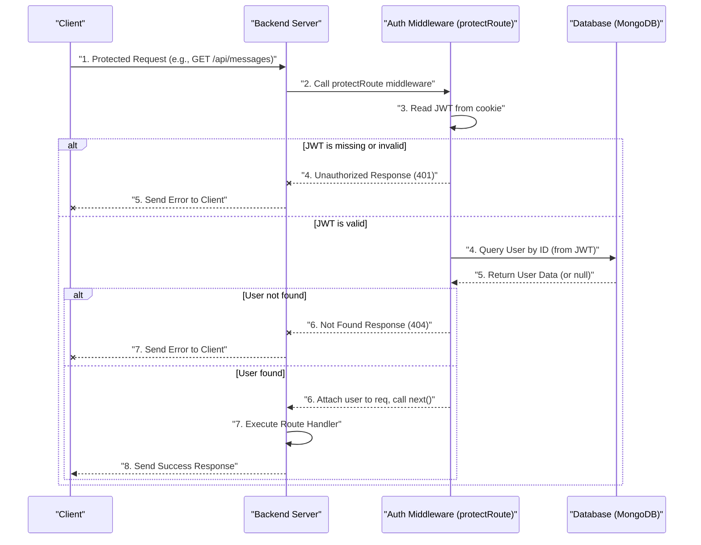

# Backend Architecture and Services

<TOC />

The backend of this chat application forms the robust foundation, handling everything from user authentication and message exchange to real-time communication. Built on Node.js with the Express framework, it interacts with a MongoDB database for persistence and leverages Socket.io for instant messaging capabilities.

This section delves into the server-side structure, exploring the main entry point, database connection, real-time service, and essential middleware that secures and manages user interactions.

## Core Technologies and Setup

The heart of the backend resides in `backend/src/index.js`, which serves as the application's entry point. Here, Express.js is initialized, middleware is configured, API routes are defined, and the server is started.

### Express Application Setup (`index.js`)

The `index.js` file orchestrates the entire server, integrating various modules and middleware to handle incoming HTTP requests. It sets up CORS for cross-origin resource sharing, parses request bodies, manages user sessions with `express-session` and `passport.js`, and configures global middleware.

```javascript
// backend/src/index.js - Snippet: Core Express Setup
import express from "express";
import cors from "cors";
import dotenv from "dotenv";
import cookieParser from "cookie-parser";
import session from "express-session";
import passport from "passport";
import path from "path";

// Environment variables configuration
dotenv.config();
// Configure Passport.js for authentication strategies
configurePassport(); 

const app = express();
const __dirname = path.resolve(); // For static file serving

// Global Middleware
app.use(cookieParser()); // Parse cookies
app.use(express.json({limit : '2mb'})); // Parse JSON request bodies
app.use(express.urlencoded({ limit: '2mb', extended: true })); // Parse URL-encoded request bodies
app.use(cors({
    origin: "http://localhost:5173", // Allow requests from frontend
    credentials: true, // Allow cookies to be sent
}));

// Session management middleware
app.use(session({
    secret: process.env.SESSION_SECRET, 
    resave: false,
    saveUninitialized: false, 
    cookie: {
        secure: process.env.NODE_ENV === "production", 
        httpOnly: true,
        maxAge: 7 * 24 * 60 * 60 * 1000 
    }
}));

// Passport.js initialization for authentication
app.use(passport.initialize());
app.use(passport.session());  

// ... route definitions and server start ...
```
[View on GitHub](https://github.com/shinymack/Chat-App-MERN/blob/main/backend/src/index.js)

This snippet highlights the initial setup, including essential middleware like `cookie-parser` for handling JWTs stored in cookies, `express.json` and `express.urlencoded` for request body parsing, `cors` to enable frontend-backend communication, and `express-session` along with `passport.initialize()` and `passport.session()` for stateful authentication.

### API Endpoint Registration

After the global middleware, `index.js` defines the primary API routes, directing requests to specific router modules for authentication, message handling, and friend management.

```javascript
// backend/src/index.js - Snippet: API Route Definitions
// ... (previous setup) ...

import authRoutes from "./routes/auth.route.js";
import messageRoutes from "./routes/message.route.js";
import friendRoutes from "./routes/friend.route.js";

app.use("/api/auth", authRoutes );       // Handles user authentication (login, signup, logout)
app.use("/api/messages", messageRoutes ); // Manages message sending and retrieval
app.use("/api/friends", friendRoutes);   // Handles friend-related operations

// ... (production static file serving and server start) ...
```
[View on GitHub](https://github.com/shinymack/Chat-App-MERN/blob/main/backend/src/index.js)

These `app.use()` calls map specific URL paths to their corresponding Express router modules, making the API accessible. For instance, `POST /api/auth/login` would be handled by a route defined within `authRoutes`.

### Backend Architecture Overview

The following diagram illustrates the high-level architecture of the backend, showing how different components interact.


```mermaid
graph TD
    C["Client (Frontend)"] -->|HTTP/S (REST API)| N["Backend (Node.js/Express)"]
    N -->|Mongoose ODM Queries| M["Database (MongoDB)"]
    N -- API Routes (Auth, Messages, Friends) --> R["Express Routers"]
    C <-->|WebSocket Connection| S["Real-time (Socket.io Server)"]
    N -. Server-side Events / Broadcast .-> S
    R --> M
    S -->|Real-time Data Update| C
```


This diagram shows the core flow: the frontend client communicates with the Node.js/Express backend via HTTP for standard API calls. The backend, in turn, interacts with MongoDB for data persistence. For real-time features, the client establishes a WebSocket connection directly with the Socket.io server, which can also receive signals from the Express application for server-initiated events (e.g., when a new message is saved to the DB).

## Database Integration (`lib/db.js`)

The `backend/src/lib/db.js` file is solely responsible for establishing a connection to the MongoDB database using Mongoose, an object data modeling (ODM) library for Node.js.

```javascript
// backend/src/lib/db.js - Snippet: MongoDB Connection
import mongoose from "mongoose"

export const connectDB = async () => {
  try {
    // Attempt to connect to MongoDB using the URI from environment variables
    const conn = await mongoose.connect(process.env.MONGODB_URI);
    console.log(`MongoDB connected:  ${conn.connection.host}`);
  }
  catch(error){
    console.log("MongoDB connection error: ", error);
    // Exit the process if the database connection fails
    process.exit(1); 
  }
}
```
[View on GitHub](https://github.com/shinymack/Chat-App-MERN/blob/main/backend/src/lib/db.js)

The `connectDB` function is an asynchronous operation that attempts to connect to the MongoDB instance specified by the `MONGODB_URI` environment variable. It includes basic error handling to log connection issues. This function is called once when the server starts up (from `index.js`) to ensure database connectivity.

## Real-time Communication (`lib/socket.js`)

Real-time capabilities are crucial for a chat application. The `backend/src/lib/socket.js` file sets up and manages the Socket.io server, enabling instant messaging and online user presence.

```javascript
// backend/src/lib/socket.js - Snippet: Socket.io Setup and Connection Handling
import { Server } from "socket.io";
import http from "http";
import express from "express";

const app = express(); // A new Express app instance for the HTTP server
const server = http.createServer(app); // Create an HTTP server instance

// Initialize Socket.io server, configured for CORS
const io = new Server(server, {
    cors: {
        origin: ["http://localhost:5173"] // Allow connections from frontend
    }
})

// Map to store online users: {userId : socketId}
const userSocketMap = {}; 

/**
 * Returns the socket ID for a given user ID, if the user is online.
 * @param {string} userId - The ID of the user.
 * @returns {string|undefined} The socket ID or undefined if the user is offline.
 */
export function getReceiverSocketId(userId) {
    return userSocketMap[userId];
}

// Event listener for new socket connections
io.on("connection", (socket) => {
    console.log("A user connected", socket.id);

    // Get userId from handshake query (sent by client on connection)
    const userId = socket.handshake.query.userId;
    if(userId) userSocketMap[userId] = socket.id;

    // Emit updated list of online users to all connected clients
    io.emit("getOnlineUsers", Object.keys(userSocketMap));

    // Event listener for socket disconnections
    socket.on("disconnect", ()=>{
        console.log("A user disconnected", socket.id);
        // Remove disconnected user from map and update online users
        delete userSocketMap[userId]; 
        io.emit("getOnlineUsers", Object.keys(userSocketMap));
    })
})

export { io, app, server }; // Export for use in index.js
```
[View on GitHub](https://github.com/shinymack/Chat-App-MERN/blob/main/backend/src/lib/socket.js)

This module initializes a new HTTP server that Socket.io then "attaches" to. It maintains a `userSocketMap` to track which users are currently online and their corresponding socket IDs. On connection, a user's ID is extracted, mapped to their socket, and an updated list of online users is broadcast. On disconnection, the user is removed, and the list is updated again. The `getReceiverSocketId` function allows the Express application to retrieve a specific user's socket ID to send targeted messages.

## Authentication Middleware (`middleware/auth.middleware.js`)

Security is paramount. The `backend/src/middleware/auth.middleware.js` file defines the `protectRoute` middleware, which is used to secure API endpoints by verifying the presence and validity of a JSON Web Token (JWT) in incoming requests.

```javascript
// backend/src/middleware/auth.middleware.js - Snippet: JWT Authentication Middleware
import jwt from "jsonwebtoken"
import User from "../models/user.model.js" // User model for database lookup

export const protectRoute = async (req, res, next) => {
    try {
        // 1. Extract JWT from cookies
        const token = req.cookies.jwt;
        if(!token){
            return res.status(401).json({message: "Unauthorized - No Token Provided"});
        }

        // 2. Verify the JWT
        const decoded = jwt.verify(token, process.env.JWT_SECRET)

        if(!decoded) {
            return res.status(401).json({message: "Unauthorized - Invalid Token"});
        }

        // 3. Find the user associated with the token
        const user = await User.findById(decoded.userId).select("-password");

        if(!user) {
            return res.status(404).json({message: "User not found"});
        }

        // 4. Attach the user object to the request for subsequent handlers
        req.user = user;

        // 5. Proceed to the next middleware/route handler
        next();
    } catch (error) {
        console.log("Error in protectRoute middleware", error.message);
        res.status(500).json({message: "Internal Server Error"});
    }
};
```
[View on GitHub](https://github.com/shinymack/Chat-App-MERN/blob/main/backend/src/middleware/auth.middleware.js)

When `protectRoute` is applied to an endpoint, it first checks for a JWT in the request's cookies. If found, it attempts to verify the token's authenticity and then uses the decoded `userId` to fetch the corresponding user from the database. If all checks pass, the user object is attached to `req.user`, allowing subsequent route handlers to access authenticated user data. Otherwise, appropriate unauthorized or error responses are sent.

### Authentication Flow

The sequence diagram below illustrates how the `protectRoute` middleware functions within a typical authenticated API request.





This sequence details the steps taken when a client makes a request to a protected endpoint, demonstrating the JWT verification, database lookup, and error handling within the middleware.

## Key Integration Points

The core components of the backend – `index.js`, `lib/db.js`, `lib/socket.js`, and `middleware/auth.middleware.js` – are tightly integrated to provide a seamless user experience.

*   **`index.js` as the Orchestrator**: It's responsible for bringing all services online. It imports `connectDB` to ensure the database is ready, imports `app` and `server` from `lib/socket.js` to run both the HTTP and WebSocket servers on the same port, and registers all API routes which may leverage the `protectRoute` middleware for security.
*   **Authentication and Authorization**: `auth.middleware.js` ensures that only authenticated users can access protected resources, enhancing the security of the application. It relies on JWTs issued upon successful login (handled by `auth.route.js`, not detailed here but implied). `passport.js` in `index.js` handles session management, which further supports the authentication flow.
*   **Data Persistence**: `lib/db.js` ensures that all user data, messages, and friend relationships are securely stored and retrieved from MongoDB, providing a persistent state for the application.
*   **Real-time Interaction**: `lib/socket.js` operates alongside the Express application, providing the real-time layer. While Express handles traditional request-response cycles for data manipulation, Socket.io manages instantaneous updates and notifications, creating an engaging and responsive chat experience. The ability to retrieve `receiverSocketId` from `socket.js` within an Express route allows the backend to send real-time notifications (e.g., "new message") after an API call (e.g., `POST /api/messages`) successfully saves data to the database.

This architecture ensures a clear separation of concerns, making the backend scalable, maintainable, and robust for handling a multi-user chat application.

---
Next: [Authentication and Authorization](./2.1_authentication-and-authorization.mdx)