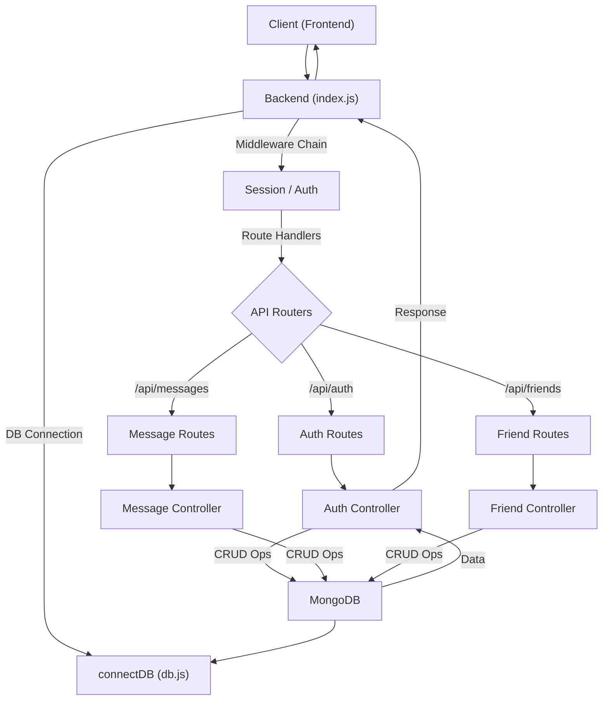
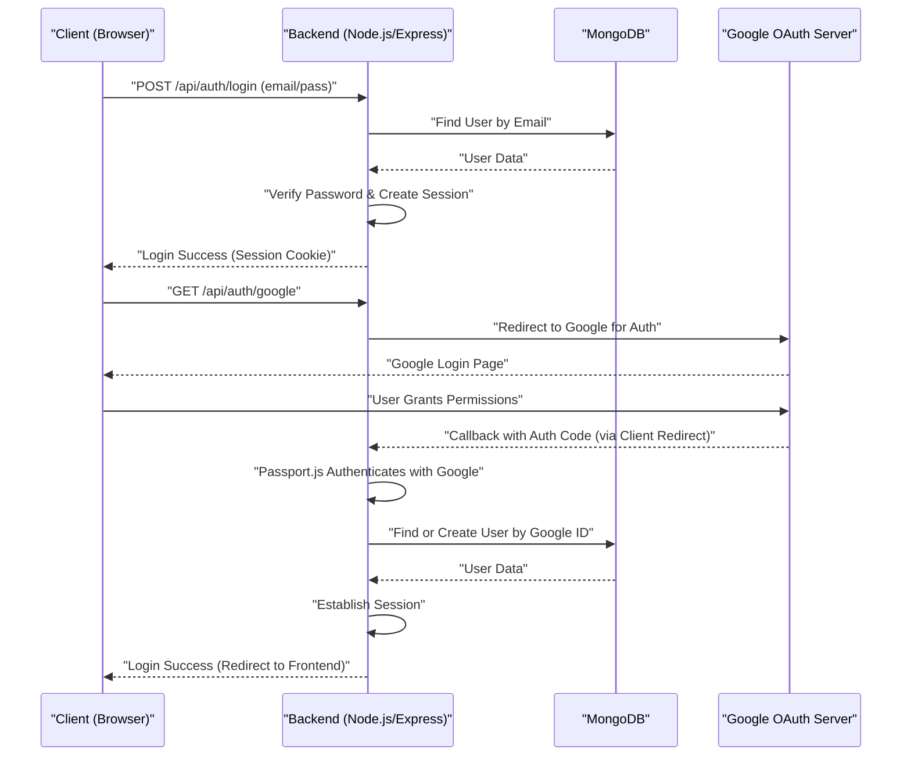

# Backend Architecture and APIs

<TOC />

This section provides a deep dive into the backend architecture of the application, covering its core setup, database integration, user data model, and authentication-related API endpoints. The backend is built using Node.js with Express, leveraging MongoDB as its primary data store.

## Core Application Setup and Entry Point

The `backend/src/index.js` file serves as the main entry point for the backend application. It initializes the Express server, configures essential middleware, connects to the database, sets up real-time communication via WebSockets, and defines the API routes.

### Key Components

*   **Express.js:** The web application framework for handling HTTP requests and responses.
*   **CORS:** Configured to allow requests from the frontend origin (`http://localhost:5173`) and support credentials.
*   **Body Parsers:** `express.json()` and `express.urlencoded()` handle incoming request bodies.
*   **Cookie Parser:** Parses cookies attached to the client request object.
*   **Express Session:** Manages user sessions, essential for authentication.
*   **Passport.js:** An authentication middleware for Node.js, integrated for local (email/password) and Google OAuth strategies.
*   **Socket.IO:** Integrated for real-time features, although the specific `message.route.js` and `friend.route.js` details are not provided in the snippets here, the setup indicates its presence via `app, server` export from `./lib/socket.js`.
*   **Database Connection:** Initiates the connection to MongoDB using Mongoose.
*   **Route Mounting:** API endpoints for authentication, messages, and friends are mounted under `/api/auth`, `/api/messages`, and `/api/friends` respectively.
*   **Production Setup:** Serves static files from the `frontend/dist` directory when in a production environment, ensuring the single-page application (SPA) can be served directly by the backend.

The application leverages environment variables for sensitive information and configuration, loaded via `dotenv`.

Here's a look at the core setup in `index.js`:

```javascript copy
// backend/src/index.js
import express from "express";
import cors from "cors";
import authRoutes from "./routes/auth.route.js";
// ... other imports ...
import dotenv from "dotenv";
import cookieParser from "cookie-parser";
import { connectDB } from "./lib/db.js";
import { app, server } from "./lib/socket.js"; // Socket.IO integration

// ... passport and session setup ...

dotenv.config(); // Load environment variables

app.use(cookieParser());
app.use(express.json({limit : '2mb'}));
app.use(express.urlencoded({ limit: '2mb', extended: true }));
app.use(cors({
    origin: "http://localhost:5173", // Frontend origin
    credentials: true,
}));

// Session and Passport middleware
app.use(session({
    secret: process.env.SESSION_SECRET, 
    resave: false,
    saveUninitialized: false, 
    cookie: {
        secure: process.env.NODE_ENV === "production",
        httpOnly: true,
        maxAge: 7 * 24 * 60 * 60 * 1000 
    }
}));
app.use(passport.initialize());
app.use(passport.session());  

// API Routes
app.use("/api/auth", authRoutes );
app.use("/api/messages", messageRoutes );
app.use("/api/friends", friendRoutes);

// Production static file serving
if(process.env.NODE_ENV === "production"){
    // ... static file setup ...
}

// Start server and connect to DB
server.listen(PORT, () => {
    console.log("server is running on PORT: " + String(PORT));
    connectDB();
});
```

This snippet from `index.js` (View on GitHub: [backend/src/index.js](https://github.com/shinymack/Chat-App-MERN/blob/main/backend/src/index.js)) illustrates the integration of various middleware and the definition of API route prefixes.

### Application Flow Overview

The diagram below visualizes the high-level request flow through the backend.





## Database Connection

The `backend/src/lib/db.js` file is responsible for establishing and managing the connection to the MongoDB database. It utilizes Mongoose, an ODM (Object Data Modeling) library for MongoDB and Node.js.

The `connectDB` asynchronous function attempts to connect to the MongoDB URI specified in the `MONGODB_URI` environment variable. It logs a success message including the host if the connection is established, or an error message if it fails. This centralized approach ensures that all parts of the application needing database access can rely on a single, robust connection mechanism.

```javascript copy
// backend/src/lib/db.js
import mongoose from "mongoose"

export const connectDB = async () => {
  try {
    const conn = await mongoose.connect(process.env.MONGODB_URI);
    console.log(`MongoDB connected:  ${conn.connection.host}`);
  }
  catch(error){
    console.log("MongoDB connection error: ", error);
  }
}
```

This snippet shows the straightforward database connection logic. (View on GitHub: [backend/src/lib/db.js](https://github.com/shinymack/Chat-App-MERN/blob/main/backend/src/lib/db.js))

## User Data Model

The `backend/src/models/user.model.js` defines the Mongoose schema for the `User` document, representing user accounts in the database. This model is crucial for storing user information, managing relationships (friends, friend requests), and integrating with different authentication providers.

### User Schema Fields

*   **`email`**: String, required, unique. The user's email address.
*   **`username`**: String, required, unique, trimmed, with min/max length constraints.
*   **`password`**: String, minimum length 6. Stored as a hashed value for security (hashing typically happens in auth controller or a pre-save hook, not shown in this snippet but implied by `minlength`).
*   **`profilePic`**: String, URL to the user's profile picture, with a default empty string.
*   **`friends`**: Array of `ObjectId`s referencing other `User` documents. Represents confirmed friendships.
*   **`friendRequests`**: Array of `ObjectId`s referencing `User` documents. Represents incoming friend requests.
*   **`sentRequests`**: Array of `ObjectId`s referencing `User` documents. Represents outgoing friend requests.
*   **`authProvider`**: String, enum `['email', 'google']`, default `'email'`. Indicates the authentication method used.
*   **`googleId`**: String, unique and sparse. Stores the Google ID for users authenticated via Google OAuth. `sparse` index allows null values, ensuring uniqueness only for non-null `googleId`s.
*   **`timestamps`**: `true` enables `createdAt` and `updatedAt` fields automatically.

### Pre-Save Hook Logic

A `pre('save')` middleware is implemented to handle specific logic before a `User` document is saved:
*   If `authProvider` is `google` and the `password` field hasn't been modified, `password` is set to `undefined`. This prevents Google-authenticated users from needing a password and from accidentally setting one.
*   If `authProvider` is `email` and no `password` is provided on a new user creation, it throws an error. This enforces password requirement for email sign-ups.

```javascript copy
// backend/src/models/user.model.js
import mongoose from "mongoose"

const  userSchema = new mongoose.Schema(
    {
        email: { 
            type: String, required: true, unique: true
        },
        username: {
            type: String,
            required: [true, "Username is required"],
            unique: true, trim: true,
            minlength: [3, "Username must be at least 3 characters long"],
            maxlength: [20, "Username cannot be more than 20 characters long"]
        },
        password: { type: String, minlength: 6 },
        profilePic: { type: String, default: "" },
        friends: [{ type: mongoose.Schema.Types.ObjectId, ref: "User", default: [] }],
        friendRequests: [{ type: mongoose.Schema.Types.ObjectId, ref: "User", default: [] }],
        sentRequests: [{ type: mongoose.Schema.Types.ObjectId, ref: "User", default: [] }],
        authProvider: { type: String, enum: ['email', 'google'], default: 'email' },
        googleId: { type: String, unique: true, sparse: true },
    },
    { timestamps: true } 
);

userSchema.pre('save', async function(next) {
    if (this.authProvider === 'google' && !this.isModified('password')) {
        this.password = undefined;
    }
    if (this.authProvider === 'email' && !this.password && this.isNew) {
        return next(new Error('Password is required for email signup.'));
    }
    next();
});

const User = mongoose.model("User", userSchema);

export default User;
```

This `userSchema` (View on GitHub: [backend/src/models/user.model.js](https://github.com/shinymack/Chat-App-MERN/blob/main/backend/src/models/user.model.js)) provides a robust structure for managing user data and authentication preferences.

## Authentication API Endpoints

The `backend/src/routes/auth.route.js` file defines all API endpoints related to user authentication, registration, profile management, and session handling. It leverages Express's Router, Passport.js for OAuth, and custom middleware for route protection.

### Key Endpoints

*   **`POST /api/auth/signup`**: Registers a new user with email and password.
*   **`POST /api/auth/login`**: Authenticates a user with email and password, establishing a session.
*   **`POST /api/auth/logout`**: Terminates the user's session.
*   **`PUT /api/auth/update-profile`**: Updates the authenticated user's profile information. This route is protected by `protectRoute` middleware.
*   **`GET /api/auth/username/check/:username`**: Checks the availability of a given username. Also protected.
*   **`GET /api/auth/check`**: Verifies if a user is currently authenticated. Protected.
*   **`GET /api/auth/google`**: Initiates the Google OAuth flow, redirecting the user to Google for authentication.
*   **`GET /api/auth/google/callback`**: Handles the callback from Google OAuth after successful authentication. It uses Passport.js to process the user data and `googleAuthCallback` to finalize the login.

### Middleware

*   **`protectRoute`**: A custom middleware (`auth.middleware.js`) designed to ensure that only authenticated users can access certain routes. This typically checks for a valid session or authentication token.
*   **`passport.authenticate('google', ...)`**: Passport.js middleware to handle the Google OAuth strategy.

```javascript copy
// backend/src/routes/auth.route.js
import express from "express"
import passport from 'passport';
import { login, logout, signup, updateProfile, checkAuth, googleAuthCallback, checkUsernameAvailability} from  "../controllers/auth.controller.js"
import { protectRoute } from "../middleware/auth.middleware.js"
const router = express.Router();

router.post("/signup", signup);
router.post("/login", login);
router.post("/logout", logout);

router.put("/update-profile", protectRoute ,updateProfile)
router.get("/username/check/:username", protectRoute, checkUsernameAvailability);
router.get("/check", protectRoute, checkAuth)

// Google OAuth routes
router.get(
    '/google',
    passport.authenticate('google', { scope: ['profile', 'email'] })
);
router.get(
    '/google/callback',
    passport.authenticate('google', {
        failureRedirect: 'http://localhost:5173/login', 
        failureMessage: true
    }),
    googleAuthCallback 
);

export default router;
```

This `auth.route.js` file (View on GitHub: [backend/src/routes/auth.route.js](https://github.com/shinymack/Chat-App-MERN/blob/main/backend/src/routes/auth.route.js)) centralizes all authentication-related API logic.

### Authentication Flow

The following sequence diagram illustrates a typical user login process, encompassing both traditional email/password and Google OAuth authentication.





## Key Integration Points

The backend architecture emphasizes modularity and clear separation of concerns.

*   **Middleware Stack:** `index.js` orchestrates a comprehensive middleware stack that handles request parsing, CORS, session management, and authentication before requests reach specific route handlers. This ensures a consistent processing pipeline for all incoming requests.
*   **Database Abstraction:** The `db.js` file centralizes the database connection logic, allowing other parts of the application to simply import and call `connectDB()` without worrying about connection details.
*   **Schema-Driven Data:** `user.model.js` (and implied other models like messages/friends) defines robust data schemas with validation, ensuring data integrity and consistency. The pre-save hook in `user.model.js` is an excellent example of enforcing business rules at the data layer.
*   **API Route Structure:** Routes are grouped logically (e.g., `auth.route.js`, `message.route.js`) and mounted under descriptive prefixes (`/api/auth`), making the API discoverable and maintainable. The use of controllers (e.g., `auth.controller.js`) separates business logic from route definitions.
*   **Authentication Flexibility:** The backend supports both traditional email/password and Google OAuth, providing users with multiple authentication options. Passport.js greatly simplifies the integration of these strategies.
*   **Security Best Practices:** The use of `secure` and `httpOnly` flags for session cookies, along with `protectRoute` middleware, demonstrates a commitment to securing user sessions and API endpoints.

This structured approach makes the backend robust, scalable, and easier to debug and extend with new features.

Next: [Authentication and Authorization](./2.1_authentication-authorization.mdx)