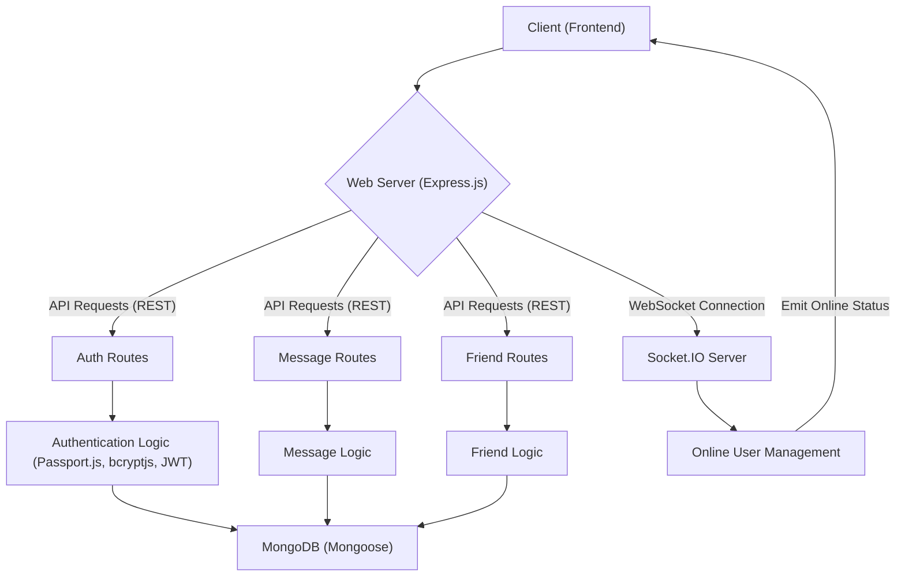
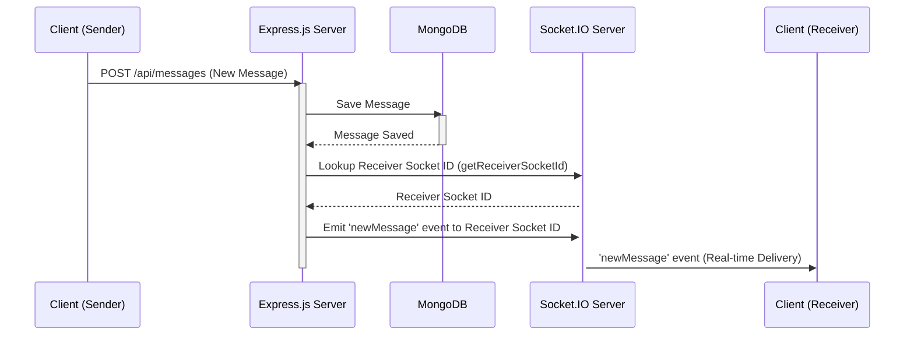

---
title: "Backend Architecture"
description: "Details the server-side structure, technology stack, and how different components interact."
sidebar_position: 2
---

# Backend Architecture
<TOC />

This document outlines the backend architecture, detailing its server-side structure, core technology stack, and how various components interact to provide a robust and scalable application. The backend is built on a Node.js ecosystem, leveraging Express.js for RESTful APIs and Socket.IO for real-time communication.

## System Purpose

The backend serves as the application's central nervous system, responsible for:

*   **User Authentication and Authorization:** Securely managing user registration, login, session management, and protecting routes.
*   **Message Handling:** Processing, storing, and delivering messages between users, including real-time updates.
*   **Friend Management:** Managing friend requests, connections, and user relationships.
*   **Data Persistence:** Interacting with the MongoDB database for storing application data.
*   **Real-time Communication:** Facilitating instant messaging and broadcasting online user status using WebSockets.
*   **Static File Serving (Production):** Serving the frontend build files when deployed in a production environment.

## Architecture

The backend follows a typical multi-tier architecture, separating concerns into presentation, business logic, and data access layers.





*   **Client (Frontend):** Interacts with the backend via RESTful API calls and establishes WebSocket connections for real-time features.
*   **Web Server (Express.js):** The primary entry point for all client requests, handling routing, middleware, and request/response cycles.
*   **API Routes (Auth, Message, Friend):** Define the different API endpoints, delegating requests to specific controllers for business logic.
*   **Authentication Logic:** Handles user authentication using Passport.js for strategies like local and Google OAuth20, along with JWT for session management and bcryptjs for password hashing.
*   **Socket.IO Server:** Manages WebSocket connections, enabling real-time functionalities like instant message delivery and online user status updates. It maintains a mapping of `userId` to `socketId` to facilitate targeted message delivery.
*   **MongoDB (Mongoose):** The NoSQL database used for data persistence, accessed through Mongoose ODM (Object Data Modeling).

## Technology Stack

The backend is built upon a robust set of technologies designed for performance, scalability, and ease of development.

| Layer / Component | Technology | Purpose |
| :---------------- | :--------- | :------ |
| **Runtime Environment** | Node.js | Server-side JavaScript runtime. |
| **Web Framework** | Express.js | Fast, unopinionated, minimalist web framework for Node.js, used for building RESTful APIs. |
| **Database** | MongoDB | NoSQL document database for storing application data. |
| **ORM/ODM** | Mongoose | Object Data Modeling (ODM) library for MongoDB and Node.js, simplifying data interactions. |
| **Real-time Communication** | Socket.IO | Library for real-time, bidirectional, event-based communication, enabling instant messaging. |
| **Authentication** | Passport.js | Authentication middleware for Node.js, supporting various strategies (local, Google OAuth20). |
| | `bcryptjs` | Library for hashing passwords securely. |
| | `jsonwebtoken` | Implements JSON Web Tokens (JWT) for secure session management and authentication. |
| **Middleware** | `cors` | Express middleware to enable Cross-Origin Resource Sharing (CORS). |
| | `cookie-parser` | Parses cookies attached to the client request object. |
| | `express-session` | HTTP session middleware, used with Passport.js for session management. |
| **Environment Variables** | `dotenv` | Loads environment variables from a `.env` file. |
| **Cloud Storage** | `cloudinary` | Cloud-based image and video management service, potentially used for storing user profile pictures or media attachments. |
| **Development Tools** | `nodemon` | Automatically restarts the Node.js application when file changes are detected. |

#### Core Dependencies

The `package.json` file outlines all dependencies crucial for the backend's operation.

```json
{
  "name": "backend",
  "version": "1.0.0",
  "main": "src/index.js",
  "scripts": {
    "dev": "nodemon src/index.js",
    "start": "node src/index.js"
  },
  "author": "",
  "type": "module",
  "license": "ISC",
  "description": "",
  "dependencies": {
    "bcryptjs": "^2.4.3",
    "cloudinary": "^2.5.1",
    "cookie-parser": "^1.4.7",
    "dotenv": "^16.4.7",
    "express": "^4.21.2",
    "express-session": "^1.18.1",
    "jsonwebtoken": "^9.0.2",
    "mongoose": "^8.9.5",
    "passport": "^0.7.0",
    "passport-google-oauth20": "^2.0.0",
    "socket.io": "^4.8.1"
  },
  "devDependencies": {
    "nodemon": "^3.1.9"
  }
}
```
[View on GitHub](https://github.com/shinymack/Chat-App-MERN/blob/main/backend/package.json)

## Features

### API Initialization and Middleware Configuration

The main `index.js` file initializes the Express application, configures middleware, defines API routes, and starts the server. This setup ensures all incoming requests are properly parsed, authenticated, and routed.

```javascript
// backend/src/index.js
import express from "express";
import cors from "cors";
import authRoutes from "./routes/auth.route.js";
import messageRoutes from "./routes/message.route.js";
import friendRoutes from "./routes/friend.route.js";

import path from "path";

import dotenv from "dotenv";
import cookieParser from "cookie-parser";

import { connectDB } from "./lib/db.js";
import { app, server } from "./lib/socket.js";

import session from "express-session";
import passport from "passport";
import { configurePassport } from "./lib/passport.config.js";

const __dirname = path.resolve();
dotenv.config();

configurePassport();

app.use(cookieParser());
app.use(express.json({limit : '2mb'}));
app.use(express.urlencoded({ limit: '2mb', extended: true }));
app.use(cors({
    origin: "http://localhost:5173",
    credentials: true,
}));

app.use(session({
    secret: process.env.SESSION_SECRET, 
    resave: false,
    saveUninitialized: false, 
    cookie: {
        secure: process.env.NODE_ENV === "production", // true in production (HTTPS)
        httpOnly: true,
        maxAge: 7 * 24 * 60 * 60 * 1000 
        // sameSite: 'lax' // or 'none' if backend and frontend are on different domains in prod
    }
}));

app.use(passport.initialize());
app.use(passport.session());  

app.use("/api/auth", authRoutes );
app.use("/api/messages", messageRoutes );
app.use("/api/friends", friendRoutes);
```
[View on GitHub](https://github.com/shinymack/Chat-App-MERN/blob/main/backend/src/index.js#L1-L57)

*   **`express.json()` and `express.urlencoded()`:** Parse incoming request bodies, with a limit of 2MB to prevent excessively large payloads.
*   **`cors()`:** Configured to allow requests from `http://localhost:5173` during development, ensuring proper communication with the frontend. `credentials: true` is vital for sending cookies with requests.
*   **`cookie-parser()`:** Parses cookies from the request header.
*   **`express-session`:** Manages user sessions, with `secure: true` in production for HTTPS-only cookies and `httpOnly: true` to prevent client-side JavaScript access.
*   **`passport.initialize()` and `passport.session()`:** Initializes Passport.js for authentication and enables session support.
*   **Route Handling:** API routes are logically separated (e.g., `/api/auth`, `/api/messages`, `/api/friends`) to promote modularity and maintainability.

### Database Connection

The `db.js` module handles the connection to MongoDB using Mongoose, ensuring a robust and fault-tolerant database connection.

```javascript
// backend/src/lib/db.js
import mongoose from "mongoose"

export const connectDB = async () => {
  try {
    const conn = await mongoose.connect(process.env.MONGODB_URI);
    console.log(`MongoDB connected:  ${conn.connection.host}`);
  }
  catch(error){
    console.log("MongoDB connection error: ", error);
  }
}
```
[View on GitHub](https://github.com/shinymack/Chat-App-MERN/blob/main/backend/src/lib/db.js#L1-L10)

*   **Asynchronous Connection:** `mongoose.connect()` is an asynchronous operation, ensuring the application waits for a successful database connection before proceeding.
*   **Error Handling:** Includes a `try-catch` block for robust error handling during database connection, logging any issues for debugging.
*   **Environment Variables:** Utilizes `process.env.MONGODB_URI` for secure and flexible database connection string management.

### Real-time Communication with Socket.IO

The `socket.js` module sets up the Socket.IO server for real-time messaging and managing online users. This is critical for an interactive chat application.

```javascript
// backend/src/lib/socket.js
import { Server } from "socket.io";
import http from "http";
import express from "express";

const app = express();

const server = http.createServer(app);

const io = new Server(server, {
    cors: {
        origin: ["http://localhost:5173"]
    }
})

export function getReceiverSocketId(userId) {
    return userSocketMap[userId];
}

// used to store online users
const userSocketMap = {}; //{userId : socketId}

io.on("connection", (socket) => {
    console.log("A user connected", socket.id);

    const userId = socket.handshake.query.userId;
    if(userId) userSocketMap[userId] = socket.id;

    io.emit("getOnlineUsers", Object.keys(userSocketMap));

    socket.on("disconnect", ()=>{
        console.log("A user disconnected", socket.id);
        delete userSocketMap[userId]; 
        io.emit("getOnlineUsers", Object.keys(userSocketMap));
    })
})

export { io, app, server };
```
[View on GitHub](https://github.com/shinymack/Chat-App-MERN/blob/main/backend/src/lib/socket.js#L1-L38)

*   **`http.createServer(app)`:** Integrates Socket.IO with the existing Express application instance.
*   **CORS Configuration:** Specifies `origin: ["http://localhost:5173"]` to allow WebSocket connections from the frontend.
*   **`userSocketMap`:** A key component for tracking online users, mapping `userId` to their respective `socket.id`. This enables targeted message delivery.
*   **`io.on("connection")`:** Event listener for new WebSocket connections.
    *   On connection, `userId` is extracted from the handshake query, and the user is added to `userSocketMap`.
    *   `io.emit("getOnlineUsers", ...)` broadcasts the updated list of online users to all connected clients.
*   **`socket.on("disconnect")`:** Event listener for disconnections.
    *   Removes the disconnected user from `userSocketMap`.
    *   Again, broadcasts the updated online user list.
*   **`getReceiverSocketId(userId)`:** A utility function to retrieve the socket ID of a specific user, crucial for sending private messages.

#### Real-time Message Flow





### Static File Serving for Production

In a production environment, the backend also serves the static files of the frontend application. This simplifies deployment by allowing a single server to host both the API and the UI.

```javascript
// backend/src/index.js
// ... (imports and initial setup) ...

const PORT = process.env.PORT;
if(process.env.NODE_ENV === "production"){
    app.use(express.static(path.join(__dirname, "../frontend/dist")));
    
    app.get("*" , (req, res) => {
        res.sendFile(path.join(__dirname,"../frontend", "dist","index.html"));
    })
}

server.listen(PORT, () => {
    console.log("server is running on PORT: " + String(PORT));
    connectDB();
});
```
[View on GitHub](https://github.com/shinymack/Chat-App-MERN/blob/main/backend/src/index.js#L59-L72)

*   **`express.static()`:** Serves static files from the `../frontend/dist` directory. This directory is typically where the frontend build output resides.
*   **`app.get("*")`:** A catch-all route that sends the `index.html` file for any request not matching an API route. This is essential for single-page applications (SPAs) to handle client-side routing.
*   **`process.env.NODE_ENV`:** The conditional check ensures that static file serving is only active in a `production` environment.

## Key Integration Points

*   **Authentication Flow:** Passport.js is deeply integrated with `express-session` and `cookie-parser` to manage user sessions. After a successful login, a session is established, and the user's information is serialized into the session, often stored in a cookie. Subsequent requests use this session cookie for authentication.
*   **API and Real-time Coordination:** RESTful API endpoints handle initial data fetching (e.g., retrieving message history), while Socket.IO takes over for real-time updates (e.g., new message notifications, online status changes). The `getReceiverSocketId` function in `socket.js` bridges the gap, allowing API logic to leverage the real-time capabilities.
*   **Database Interactions:** All data-related operations, whether initiated by API calls or real-time events, are routed through Mongoose to interact with MongoDB. This ensures data consistency and integrity.
*   **Scalability Insights:** For a larger scale, the current `userSocketMap` in memory might become a bottleneck. A more scalable solution would involve using a distributed store like Redis to manage online users across multiple backend instances. Similarly, session storage with `express-session` could be externalized to a database or Redis for horizontal scaling of Express servers.

Next: [API Endpoints and Controllers](./2.1_api-endpoints-and-controllers.mdx)
```